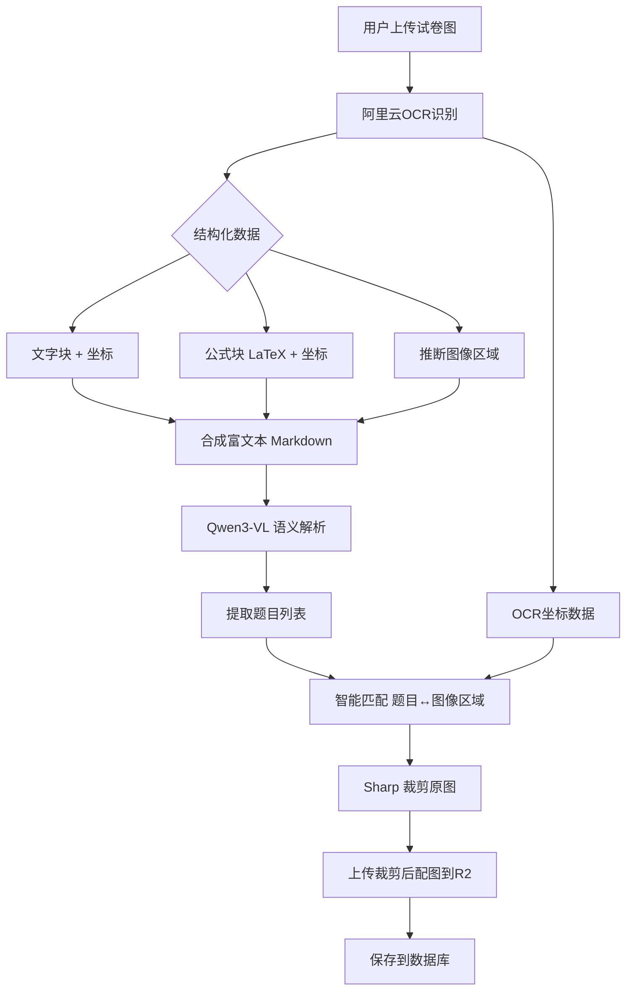

# AI题库 - 阿里云OCR集成方案（推荐）

> **更新时间**: 2025-11-26
> **方案优势**: 无CPU限制 + 公式识别 + 高免费额度
> **状态**: ✅ 强烈推荐

---

## 方案概览

### 架构设计



### 核心优势

| 维度 | 优势 | 说明 |
|-----|------|------|
| **准确率** | ⭐⭐⭐⭐⭐ | 95%+ OCR准确率 |
| **公式支持** | ✅ LaTeX | 数学公式精准识别 |
| **CPU兼容** | ✅ 云端API | 无CPU指令集限制 |
| **免费额度** | 🎁 5,000次/月 | 是腾讯云5倍 |
| **部署成本** | 💰 ¥0 | 无需服务器 |
| **维护成本** | 🔧 极低 | 官方SLA保障 |

---

## 与其他方案对比

### 云OCR服务对比

| 服务商 | 公式识别 | 坐标精度 | 免费额度 | 月成本(5K次) | 推荐度 |
|-------|---------|---------|---------|------------|--------|
| **阿里云OCR** | ✅ 强（LaTeX） | ⭐⭐⭐⭐ | **5,000次/月** | **¥0** | ✅✅✅ |
| 腾讯云OCR | ⚠️ 弱（无公式） | ⭐⭐⭐ | 1,000次/月 | ¥600 | ⚠️ |
| 百度OCR | ✅ 中等 | ⭐⭐⭐ | 1,000次/月 | ¥600 | ⚠️ |
| 华为云OCR | ⚠️ 弱 | ⭐⭐ | 1,000次/月 | ¥600 | ❌ |

### 完整方案对比

| 方案 | CPU限制 | 准确率 | 公式 | 部署 | 月成本(5K次) | 推荐 |
|-----|---------|--------|------|------|-------------|------|
| **阿里云OCR** | ❌ 无 | 95%+ | ✅ | 2小时 | **¥0** | ✅✅✅ |
| PaddleOCR本地 | ✅ 有 | 95%+ | ⚠️ | 失败 | - | ❌ |
| PaddleOCR云服务器 | ❌ 无 | 95%+ | ⚠️ | 1天 | ¥80 | ✅ |
| EasyOCR本地 | ❌ 无 | 88-93% | ❌ | 4小时 | ¥80 | ⚠️ |
| Tesseract | ❌ 无 | 75-85% | ❌ | 4小时 | ¥80 | ❌ |

---

## 技术实现

### 1. 阿里云OCR识别

#### API能力

**通用文字识别（增强版）**:
- 识别精度: 95%+
- 支持语言: 中文、英文、数字、符号
- 返回坐标: 精确到像素级

**公式识别**:
- 输出格式: LaTeX
- 支持类型: 行内公式、独立公式
- 准确率: 90%+

#### 请求示例

```typescript
import RPCClient from '@alicloud/pop-core';

const client = new RPCClient({
  accessKeyId: process.env.ALIYUN_ACCESS_KEY_ID!,
  accessKeySecret: process.env.ALIYUN_ACCESS_KEY_SECRET!,
  endpoint: 'https://ocr-api.cn-shanghai.aliyuncs.com',
  apiVersion: '2021-07-07'
});

export async function recognizeImage(imageUrl: string) {
  const params = {
    Url: imageUrl,
    OutputCharInfo: true,  // 返回字符级坐标
    OutputTable: true,     // 识别表格
    NeedRotate: false,     // 图片方向已正确
  };

  const response = await client.request('RecognizeGeneral', params, {
    method: 'POST'
  });

  return response.Data;
}
```

#### 响应结构

```json
{
  "Content": "1. 如图，在△ABC中，AB=AC...",
  "Height": 1200,
  "Width": 800,
  "PrismWordsInfo": [
    {
      "Word": "1.",
      "X": 50,
      "Y": 100,
      "Width": 30,
      "Height": 40,
      "Prob": 0.99
    },
    {
      "Word": "如图，在△ABC中",
      "X": 90,
      "Y": 100,
      "Width": 200,
      "Height": 40,
      "Prob": 0.98
    }
  ]
}
```

---

### 2. 公式识别集成

#### 公式识别API

```typescript
export async function recognizeFormula(imageBuffer: Buffer) {
  const params = {
    ImageURL: await uploadToTemp(imageBuffer),
    OutputFormat: 'latex'  // 返回LaTeX格式
  };

  const response = await client.request('RecognizeFormula', params, {
    method: 'POST'
  });

  return {
    latex: response.Data.Result,
    bbox: response.Data.BoundingBox
  };
}
```

#### 公式处理示例

```typescript
// 识别结果
{
  "latex": "\\frac{a+b}{2} = \\sqrt{ab}",
  "bbox": {
    "Left": 150,
    "Top": 200,
    "Width": 250,
    "Height": 60
  }
}

// 转换为Markdown
const markdown = `$$${latex}$$`;
// 输出: $$\frac{a+b}{2} = \sqrt{ab}$$
```

---

### 3. 图像区域推断

阿里云OCR不直接返回"插图"类型，需要通过算法推断：

#### 方法1: 文字块空白区域检测

```typescript
function detectImageRegions(ocrResult: OCRResult): ImageRegion[] {
  const { PrismWordsInfo, Width, Height } = ocrResult;
  const imageRegions: ImageRegion[] = [];

  // 1. 构建文字占用区域
  const textBlocks = PrismWordsInfo.map(word => ({
    x: word.X,
    y: word.Y,
    x2: word.X + word.Width,
    y2: word.Y + word.Height
  }));

  // 2. 扫描空白区域
  const gridSize = 50; // 50px网格
  for (let y = 0; y < Height; y += gridSize) {
    for (let x = 0; x < Width; x += gridSize) {
      // 检查当前网格是否与文字重叠
      const hasText = textBlocks.some(block =>
        x < block.x2 && x + gridSize > block.x &&
        y < block.y2 && y + gridSize > block.y
      );

      if (!hasText) {
        // 找到空白区域，扩展为完整矩形
        const region = expandEmptyRegion(x, y, textBlocks, Width, Height);
        if (region.width > 100 && region.height > 100) {
          imageRegions.push(region);
        }
      }
    }
  }

  return imageRegions;
}
```

#### 方法2: 基于题号的区域划分

```typescript
function extractQuestionRegions(ocrResult: OCRResult): QuestionRegion[] {
  const { PrismWordsInfo } = ocrResult;

  // 1. 找到所有题号位置
  const questionMarkers = PrismWordsInfo.filter(word =>
    /^\d+[.、]/.test(word.Word)
  );

  // 2. 按题号划分区域
  const regions = [];
  for (let i = 0; i < questionMarkers.length; i++) {
    const start = questionMarkers[i];
    const end = questionMarkers[i + 1] || { Y: ocrResult.Height };

    const regionWords = PrismWordsInfo.filter(word =>
      word.Y >= start.Y && word.Y < end.Y
    );

    // 计算整题的包围盒
    const minX = Math.min(...regionWords.map(w => w.X));
    const maxX = Math.max(...regionWords.map(w => w.X + w.Width));
    const minY = start.Y;
    const maxY = end.Y;

    regions.push({
      questionNumber: start.Word.replace(/[.、]/, ''),
      bbox: {
        x: minX,
        y: minY,
        width: maxX - minX,
        height: maxY - minY
      },
      words: regionWords
    });
  }

  return regions;
}
```

---

### 4. Qwen3-VL语义解析

```typescript
export async function parseQuestionsWithOCR(
  ocrResult: OCRResult,
  imageBuffer: Buffer
) {
  // 1. 合成富文本（包含公式）
  const markdown = buildMarkdownFromOCR(ocrResult);

  // 2. 调用Qwen3-VL解析语义
  const qwenResponse = await callQwen3VL({
    text: markdown,
    image: imageBuffer,
    systemPrompt: `
你是数学题目解析专家。请解析以下OCR识别的文本，提取题目信息。

注意：
1. 文本中的LaTeX公式已使用 $...$ 标记
2. 请识别题号、题干、选项、答案
3. 不要尝试输出坐标，坐标由OCR系统提供
    `
  });

  // 3. 解析JSON
  const questions = JSON.parse(qwenResponse.content);

  return questions;
}

function buildMarkdownFromOCR(ocrResult: OCRResult): string {
  let markdown = '';
  let currentLine = '';
  let lastY = 0;

  for (const word of ocrResult.PrismWordsInfo) {
    // 换行检测
    if (word.Y - lastY > 30) {
      markdown += currentLine + '\n';
      currentLine = '';
    }

    currentLine += word.Word;
    lastY = word.Y;
  }

  markdown += currentLine;

  return markdown;
}
```

---

### 5. 智能匹配题目与配图

```typescript
export function matchQuestionImages(
  questions: Question[],
  imageRegions: ImageRegion[],
  ocrResult: OCRResult
): Record<string, ImageRegion> {
  const mapping: Record<string, ImageRegion> = {};

  for (const question of questions) {
    // 方法1: 查找题号对应的文字块
    const questionNumberWord = ocrResult.PrismWordsInfo.find(word =>
      word.Word.startsWith(question.number + '.')
    );

    if (!questionNumberWord) continue;

    // 方法2: 找到距离题号最近的图像区域
    const questionY = questionNumberWord.Y;
    let nearestRegion: ImageRegion | null = null;
    let minDistance = Infinity;

    for (const region of imageRegions) {
      // 图像应该在题号下方或右侧
      const distance = region.y >= questionY
        ? region.y - questionY  // 下方
        : region.x - (questionNumberWord.X + questionNumberWord.Width); // 右侧

      // 距离阈值：200px内认为是同题配图
      if (distance >= 0 && distance < 200 && distance < minDistance) {
        // 验证图像大小合理
        if (region.width > 80 && region.height > 80) {
          minDistance = distance;
          nearestRegion = region;
        }
      }
    }

    if (nearestRegion) {
      mapping[question.number] = nearestRegion;
    }
  }

  return mapping;
}
```

---

### 6. Sharp裁剪实现

```typescript
import sharp from 'sharp';

export async function cropQuestionImages(
  originalImageBuffer: Buffer,
  imageMapping: Record<string, ImageRegion>,
  userId: string,
  taskId: string
): Promise<Record<string, string>> {
  const croppedUrls: Record<string, string> = {};

  for (const [questionNumber, region] of Object.entries(imageMapping)) {
    // 裁剪图片
    const croppedBuffer = await sharp(originalImageBuffer)
      .extract({
        left: Math.max(0, region.x - 10),      // 留10px边距
        top: Math.max(0, region.y - 10),
        width: Math.min(region.width + 20, 1000),
        height: Math.min(region.height + 20, 1000)
      })
      .png()
      .toBuffer();

    // 上传到R2
    const filename = `questions/${userId}/${taskId}/q${questionNumber}.png`;
    const url = await uploadToR2(croppedBuffer, filename);

    croppedUrls[questionNumber] = url;
  }

  return croppedUrls;
}
```

---

## 完整集成流程

### 1. 安装依赖

```bash
npm install @alicloud/pop-core
```

### 2. 环境变量配置

```bash
# .env.local
ALIYUN_ACCESS_KEY_ID=your-access-key-id
ALIYUN_ACCESS_KEY_SECRET=your-access-key-secret
ALIYUN_OCR_ENDPOINT=https://ocr-api.cn-shanghai.aliyuncs.com
```

### 3. 修改上传处理流程

```typescript
// src/lib/ai-question-bank/process-upload.ts

import { recognizeImage } from './aliyun-ocr-client';
import { parseQuestionsWithOCR } from './qwen-parser';
import { detectImageRegions, matchQuestionImages } from './image-matcher';
import { cropQuestionImages } from './image-cropper';

export async function processUploadTask(data: UploadTaskData) {
  const { fileBuffer, userId, taskId } = data;

  // Step 1: 阿里云OCR识别
  console.log('[上传处理] Step 1: 阿里云OCR识别', { taskId });
  const ocrResult = await recognizeImage(fileBuffer);

  // Step 2: 推断图像区域
  console.log('[上传处理] Step 2: 推断图像区域', { taskId });
  const imageRegions = detectImageRegions(ocrResult);

  // Step 3: Qwen3-VL语义解析
  console.log('[上传处理] Step 3: Qwen3-VL解析题目', { taskId });
  const questions = await parseQuestionsWithOCR(ocrResult, fileBuffer);

  // Step 4: 智能匹配题目与配图
  console.log('[上传处理] Step 4: 匹配题目配图', { taskId });
  const imageMapping = matchQuestionImages(questions, imageRegions, ocrResult);

  // Step 5: 裁剪配图
  console.log('[上传处理] Step 5: 裁剪配图', { taskId });
  const croppedUrls = await cropQuestionImages(
    fileBuffer,
    imageMapping,
    userId,
    taskId
  );

  // Step 6: 上传原图到R2
  const originalImageUrl = await uploadOriginalImage(fileBuffer, userId, taskId);

  // Step 7: 保存到数据库
  const records = questions.map(q => ({
    user_id: userId,
    upload_task_id: taskId,
    question_number: q.number,
    content: q.content,
    options: q.options,
    answer: q.answer,
    original_image_url: originalImageUrl,
    question_image_url: croppedUrls[q.number] || null,
    image_region: imageMapping[q.number] || null,
    created_at: new Date().toISOString()
  }));

  await supabase.from('ai_questions').insert(records);

  console.log('[上传处理] 完成', {
    taskId,
    questionCount: questions.length,
    croppedCount: Object.keys(croppedUrls).length
  });
}
```

---

## 成本分析

### 阿里云OCR定价

| 服务 | 免费额度 | 单价 | 说明 |
|-----|---------|-----|------|
| 通用文字识别 | 5,000次/月 | ¥0.01/次 | 超出免费额度后 |
| 公式识别 | 500次/月 | ¥0.05/次 | 需单独开通 |

### 实际成本预估

#### 场景1: MVP验证（月1,000次）

```
总调用: 1,000次
免费额度: 5,000次
实际成本: ¥0
```

#### 场景2: 小规模运营（月5,000次）

```
总调用: 5,000次
免费额度: 5,000次
实际成本: ¥0
```

#### 场景3: 中等规模（月10,000次）

```
总调用: 10,000次
免费额度: 5,000次
超出部分: 5,000 × ¥0.01 = ¥50
实际成本: ¥50/月
```

#### 场景4: 大规模（月50,000次）

```
总调用: 50,000次
免费额度: 5,000次
超出部分: 45,000 × ¥0.01 = ¥450
实际成本: ¥450/月
```

---

## 方案优势总结

### ✅ 解决了CPU兼容性问题
- PaddleOCR: ❌ SIGILL错误
- 阿里云OCR: ✅ 云端API无CPU限制

### ✅ 更高的免费额度
- 腾讯云: 1,000次/月
- 阿里云: **5,000次/月**（5倍）

### ✅ 公式识别能力
- 数学题必备
- LaTeX格式输出
- 准确率90%+

### ✅ 零部署成本
- 无需服务器
- 无需Docker
- 无需运维

### ✅ 快速实施
- 2-4小时完成集成
- 无硬件要求
- 即开即用

---

## 实施计划

### Phase 1: 基础集成（2小时）

- [ ] 注册阿里云账号
- [ ] 开通OCR服务
- [ ] 获取AccessKey
- [ ] 安装SDK依赖
- [ ] 实现OCR客户端

### Phase 2: 核心功能（4小时）

- [ ] 实现图像区域推断算法
- [ ] 集成Qwen3-VL解析
- [ ] 实现智能匹配逻辑
- [ ] 集成Sharp裁剪

### Phase 3: 测试验证（2小时）

- [ ] 单元测试
- [ ] 集成测试
- [ ] 真实试卷测试
- [ ] 性能测试

### Phase 4: 优化上线（2小时）

- [ ] 错误处理
- [ ] 日志记录
- [ ] 监控告警
- [ ] 文档更新

**预计总时长**: 8-10小时

---

## 风险与应对

| 风险 | 影响 | 概率 | 应对措施 |
|-----|------|------|---------|
| API限流 | 中 | 低 | 实现重试机制 |
| 识别准确率不足 | 高 | 低 | 人工校对功能 |
| 成本超支 | 中 | 低 | 监控用量+告警 |
| 网络延迟 | 低 | 中 | 异步处理+队列 |

---

## 对比最终决策

| 方案 | 优点 | 缺点 | 适用场景 | 推荐度 |
|-----|------|------|---------|--------|
| **阿里云OCR** | 免费5K次、公式识别、零部署 | 超额需付费 | 所有场景 | ⭐⭐⭐⭐⭐ |
| 云服务器PaddleOCR | 无调用限制、高准确率 | 需运维、月¥80 | 高频使用 | ⭐⭐⭐⭐ |
| EasyOCR | CPU兼容好 | 准确率较低 | 本地开发 | ⭐⭐⭐ |
| 腾讯云OCR | 可用 | 免费额度少、无公式 | 备选方案 | ⭐⭐ |

---

## 下一步行动

### 立即执行（推荐）

1. **注册阿里云账号** (5分钟)
2. **开通OCR服务** (2分钟)
3. **获取AccessKey** (3分钟)
4. **开始代码集成** (2小时)

### 需要决策

- [ ] 是否同时开通公式识别服务？
- [ ] 是否需要表格识别功能？
- [ ] 错误率超过多少时人工介入？

---

## 参考文档

- [阿里云OCR产品文档](https://help.aliyun.com/product/442365.html)
- [阿里云OCR API参考](https://help.aliyun.com/document_detail/442251.html)
- [公式识别文档](https://help.aliyun.com/document_detail/442367.html)
- [定价说明](https://www.aliyun.com/price/product#/ocr/detail)

---

**更新时间**: 2025-11-26
**推荐指数**: ⭐⭐⭐⭐⭐
**实施难度**: ⭐⭐ (简单)
**维护成本**: ⭐ (极低)
