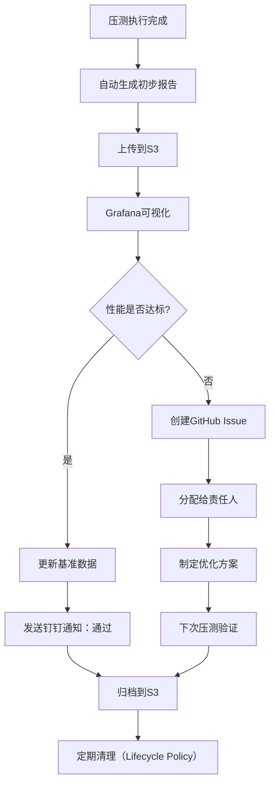
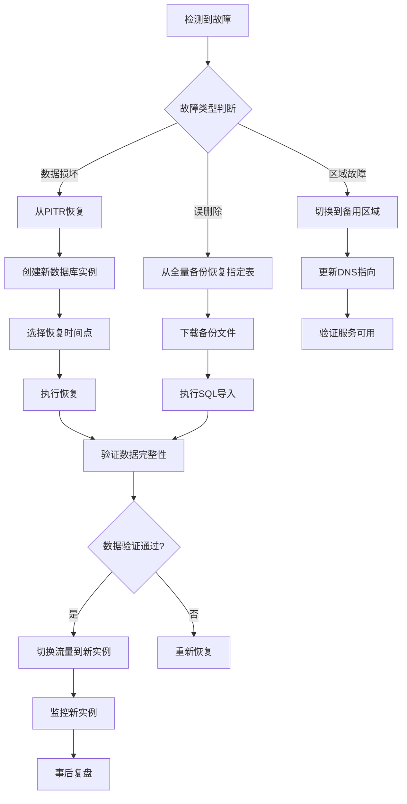
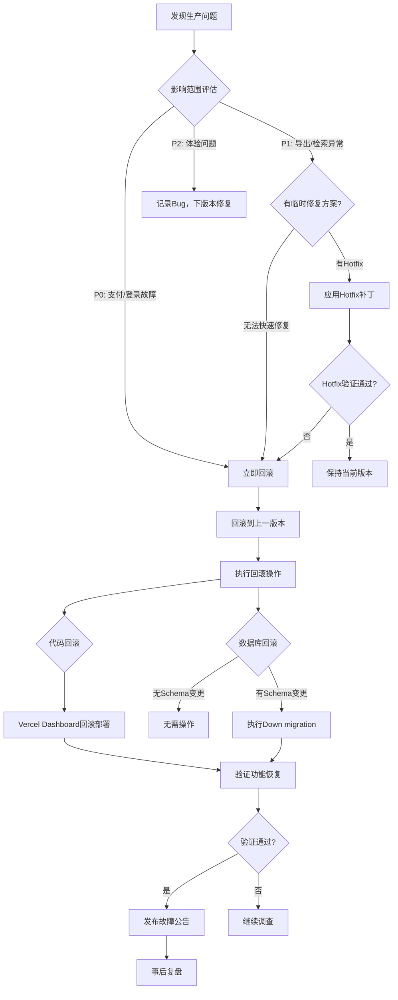

# 日新平台 - 技术运维手册

> **版本**：v5.0 | **更新**：2025-11-16 | **文档类型**：运维与安全手册（含非技术成员操作指南）
> **目标读者**：架构师、运维工程师、安全审计、非技术值班人员
> **配套文档**：[项目执行计划](./日新平台_项目执行计划_v5.md) | [技术设计文档](./日新平台_技术设计文档_v5.md) | [非技术成员操作手册](./非技术成员操作手册.md)

---

## 📋 文档导航

- [§1 监控与告警体系](#§1-监控与告警体系) - 监控矩阵、告警配置、国内可用方案
- [§2 性能与容量规划](#§2-性能与容量规划) - QPS目标、压测计划、扩展策略
- [§3 安全与合规](#§3-安全与合规) - 身份管控、密钥管理、支付合规、数据脱敏
- [§4 备份与灾备](#§4-备份与灾备) - 备份策略、RTO/RPO、演练流程
- [§5 灰度发布与回滚](#§5-灰度发布与回滚) - 发布流程、回滚决策、数据库迁移
- [§6 非技术成员值班手册](#§6-非技术成员值班手册) - 可视化仪表盘、常见告警处理SOP
- [§7 成本管理](#§7-成本管理) - 平台费用、优化建议、预算预警

---

## §1 监控与告警体系

### 1.1 监控矩阵（完整版）

| 指标类别 | 指标名称 | 数据源 | 采集方式 | 目标值 | 告警阈值 | 告警级别 | 通知渠道 | 责任人 | 响应SLA | 国内可用性 |
|---------|---------|--------|---------|--------|---------|---------|---------|--------|---------|-----------|
| **API性能** | 题库检索P90延迟 | Vercel Analytics | Vercel自动采集（每分钟聚合） | <300ms | >500ms持续5min | P1 | 钉钉@技术负责人 | 张伟（全栈） | <30min | ✅ |
| **API性能** | 导出任务P95耗时 | `export_tasks`表 | 定时SQL查询（每5min） | <30s | >45s持续10min | P1 | 钉钉@全栈工程师 | 王强（后端） | <30min | ✅ |
| **API性能** | 支付下单延迟 | Sentry APM | Sentry自动采集（实时） | <600ms | >1s持续5min | P0 | 钉钉@所有人+电话 | 王强（后端） | <5min | ⚠️需Sentry Relay |
| **业务指标** | 导出成功率 | `export_tasks`表 | Supabase Trigger（每次任务插入时检查） | >95% | <90%持续1h | P1 | 钉钉@全栈工程师 | 王强（后端） | <30min | ✅ |
| **业务指标** | 支付成功率 | `orders`表 | Supabase Trigger（每次订单更新时检查） | >98% | <95%持续1h | P0 | 钉钉@所有人 | 王强（后端） + 张伟（全栈） | <5min | ✅ |
| **业务指标** | OCR识别成功率 | 腾讯云控制台 | 腾讯云API调用日志（每小时聚合） | >90% | <85%持续30min | P2 | 钉钉@全栈工程师 | 刘洋（全栈） | <2h | ✅ |
| **业务指标** | CDN命中率 | 七牛云控制台 | 七牛云Dashboard（每小时聚合） | >85% | <70% | P2 | 钉钉@DevOps | 李娜（前端） | <2h | ✅ |
| **系统资源** | 数据库CPU | Supabase Dashboard | Supabase自动采集（每分钟） | <60% | >80%持续5min | P1 | 钉钉@DevOps | 王强（后端） | <30min | ✅ |
| **系统资源** | 数据库连接数 | Supabase Dashboard | Supabase自动采集（每分钟） | <50 | >80 | P1 | 钉钉@DevOps | 王强（后端） | <30min | ✅ |
| **系统资源** | Redis内存 | Redis Cloud Dashboard | Redis Cloud自动采集（每5min） | <80% | >90% | P1 | 钉钉@DevOps | 王强（后端） | <30min | ✅ |
| **系统资源** | Worker内存 | 服务器监控 | Node.js process.memoryUsage()（每分钟） | <512MB | >700MB | P1 | 钉钉@全栈工程师 | 王强（后端） | <30min | ✅ |
| **系统资源** | BullMQ队列积压 | BullMQ Admin UI | 自定义监控脚本（每5min查询Redis） | <20 | >100持续10min | P1 | 钉钉@全栈工程师 | 王强（后端） | <30min | ✅ |
| **用户体验** | 首屏加载时间（LCP） | Vercel Analytics | Real User Monitoring（实时聚合） | <2s | >3s持续10min | P2 | 钉钉@前端开发 | 李娜（前端） | <2h | ✅ |
| **用户体验** | 国内访问延迟（上海节点） | 自定义RUM脚本 | 定时Ping测试（每2min从阿里云ECS探测） | <500ms | >1s持续5min | P1 | 钉钉@DevOps | 张伟（全栈） | <30min | ✅ |
| **安全** | 错误率（5xx） | Sentry | Sentry自动采集（实时） | <0.1% | >1%持续5min | P0 | 钉钉@所有人 | 值班工程师（轮值） | <5min | ⚠️需Sentry Relay |
| **成本** | 七牛云CDN日流量 | 七牛云控制台 | API查询（每日00:00） | <200GB | >500GB单日 | P2 | 钉钉@DevOps+财务 | DevOps | <1工作日 | ✅ |

**告警级别定义**：
- 🔴 **P0**：影响核心功能（支付、登录），需**5分钟内**响应，电话通知
- 🟠 **P1**：影响主要功能（导出、检索），需**30分钟内**响应，钉钉@值班人员
- 🟡 **P2**：影响体验但不阻断，需**2小时内**响应，钉钉群消息

**责任人轮值安排**（见§6非技术成员值班手册）：

| 时间段 | 主值班（On-Call） | 备份值班（Backup） | 职责 |
|--------|------------------|-------------------|------|
| **工作日 9:00-18:00** | 张伟（全栈） | 王强（后端） | 处理所有P0/P1告警 |
| **工作日 18:00-次日9:00** | 轮值工程师 | 张伟（全栈） | 仅处理P0告警 |
| **周末/节假日** | 轮值工程师 | 张伟（全栈） | 仅处理P0告警 |

**轮值表**（2025年11月）：
- Week 1 (11/1-11/7): 张伟（主）+ 王强（备份）
- Week 2 (11/8-11/14): 王强（主）+ 刘洋（备份）
- Week 3 (11/15-11/21): 刘洋（主）+ 李娜（备份）
- Week 4 (11/22-11/30): 李娜（主）+ 张伟（备份）

**监控脚本汇总**：

| 监控项 | 脚本路径 | 执行方式 | 执行频率 | 告警配置 | 维护人 |
|-------|---------|---------|---------|---------|--------|
| 国内访问延迟探测 | `scripts/monitor/rum-china.sh` | Cron（阿里云ECS） | 每2分钟 | 钉钉Webhook | 张伟（全栈） |
| BullMQ队列积压检查 | `scripts/monitor/check-queue.js` | Cron（Worker服务器） | 每5分钟 | 钉钉Webhook | 王强（后端） |
| 导出任务成功率统计 | SQL Trigger（见§1.2.2） | 数据库Trigger | 实时（每次插入） | Supabase Trigger | 王强（后端） |
| Worker进程健康检查 | `scripts/monitor/worker-health.sh` | Cron（Worker服务器） | 每1分钟 | 钉钉Webhook + 自动重启 | 王强（后端） |
| 数据库慢查询分析 | Supabase内置 | Supabase自动 | 实时 | Supabase邮件通知 | 王强（后端） |
| 成本超限告警 | `scripts/monitor/cost-alert.js` | Cron（任意服务器） | 每日00:00 | 钉钉Webhook | DevOps |

**核心监控脚本实现**：

```bash
# ======================================
# scripts/monitor/rum-china.sh
# 国内访问延迟探测（部署在阿里云ECS上海节点）
# ======================================
# Cron: */2 * * * * /home/deploy/scripts/monitor/rum-china.sh
#!/bin/bash

set -e

API_URL="https://api.rixing.com"
THRESHOLD_MS=1000  # 1秒阈值
DINGTALK_WEBHOOK="https://oapi.dingtalk.com/robot/send?access_token=YOUR_TOKEN"

# 使用curl测量响应时间
RESPONSE=$(curl -o /dev/null -s -w '%{time_total}' "$API_URL/api/health")
RESPONSE_MS=$(echo "$RESPONSE * 1000" | bc | awk '{print int($1)}')

echo "[$(date '+%Y-%m-%d %H:%M:%S')] 国内访问延迟: ${RESPONSE_MS}ms"

# 写入日志文件（用于Grafana可视化）
echo "{\"timestamp\":\"$(date -u +%Y-%m-%dT%H:%M:%SZ)\",\"latency_ms\":${RESPONSE_MS}}" >> /var/log/rum-china.jsonl

# 超过阈值则告警
if [ "$RESPONSE_MS" -gt "$THRESHOLD_MS" ]; then
  curl -X POST "$DINGTALK_WEBHOOK" \
    -H 'Content-Type: application/json' \
    -d "{
      \"msgtype\": \"text\",
      \"text\": {
        \"content\": \"⚠️ 国内访问延迟过高\\n延迟: ${RESPONSE_MS}ms (阈值: ${THRESHOLD_MS}ms)\\n检测节点: 阿里云ECS上海\\n时间: $(date '+%Y-%m-%d %H:%M:%S')\\n建议: 检查Vercel Edge代理或Supabase连接\"
      }
    }"
fi
```

```javascript
// ======================================
// scripts/monitor/check-queue.js
// BullMQ队列积压检查（部署在Worker服务器）
// ======================================
// Cron: */5 * * * * /usr/bin/node /home/deploy/scripts/monitor/check-queue.js
const { Queue } = require('bullmq');
const https = require('https');

const REDIS_URL = process.env.REDIS_URL;
const THRESHOLD = 100; // 队列积压>100则告警
const DINGTALK_WEBHOOK = process.env.DINGTALK_WEBHOOK;

async function checkQueue() {
  const queue = new Queue('export-pdf', {
    connection: { url: REDIS_URL },
  });

  try {
    const waitingCount = await queue.getWaitingCount();
    const activeCount = await queue.getActiveCount();
    const failedCount = await queue.getFailedCount();
    const total = waitingCount + activeCount;

    console.log(`[${new Date().toISOString()}] 队列状态: 等待=${waitingCount}, 进行中=${activeCount}, 失败=${failedCount}`);

    // 写入日志（用于Grafana可视化）
    const log = JSON.stringify({
      timestamp: new Date().toISOString(),
      waiting: waitingCount,
      active: activeCount,
      failed: failedCount,
      total,
    });
    require('fs').appendFileSync('/var/log/queue-backlog.jsonl', log + '\n');

    // 超过阈值则告警
    if (total > THRESHOLD) {
      const message = {
        msgtype: 'text',
        text: {
          content: `⚠️ BullMQ队列积压告警\n等待任务: ${waitingCount}\n进行中: ${activeCount}\n失败任务: ${failedCount}\n总积压: ${total} (阈值: ${THRESHOLD})\n时间: ${new Date().toLocaleString('zh-CN', { timeZone: 'Asia/Shanghai' })}\n建议: 检查Worker服务状态或增加Worker实例`,
        },
      };

      https.request(
        DINGTALK_WEBHOOK,
        { method: 'POST', headers: { 'Content-Type': 'application/json' } },
        (res) => console.log('告警已发送:', res.statusCode)
      ).end(JSON.stringify(message));
    }
  } finally {
    await queue.close();
  }
}

checkQueue().catch(console.error);
```

```bash
# ======================================
# scripts/monitor/worker-health.sh
# Worker进程健康检查 + 自动重启
# ======================================
# Cron: * * * * * /home/deploy/scripts/monitor/worker-health.sh
#!/bin/bash

WORKER_NAME="export-worker"
DINGTALK_WEBHOOK="https://oapi.dingtalk.com/robot/send?access_token=YOUR_TOKEN"

# 检查Worker进程是否存在
if ! pm2 describe "$WORKER_NAME" > /dev/null 2>&1; then
  echo "[$(date)] ❌ Worker进程不存在，尝试启动..."

  # 发送告警
  curl -X POST "$DINGTALK_WEBHOOK" \
    -H 'Content-Type: application/json' \
    -d "{
      \"msgtype\": \"text\",
      \"at\": {\"isAtAll\": true},
      \"text\": {
        \"content\": \"🔴 Worker进程崩溃\\nWorker名称: ${WORKER_NAME}\\n时间: $(date '+%Y-%m-%d %H:%M:%S')\\n操作: 自动重启中...\"
      }
    }"

  # 自动重启
  cd /home/deploy/rixing-platform
  pm2 start worker.js --name "$WORKER_NAME"

  sleep 5

  # 验证重启是否成功
  if pm2 describe "$WORKER_NAME" > /dev/null 2>&1; then
    curl -X POST "$DINGTALK_WEBHOOK" \
      -H 'Content-Type: application/json' \
      -d "{
        \"msgtype\": \"text\",
        \"text\": {
          \"content\": \"✅ Worker进程已成功重启\\nWorker名称: ${WORKER_NAME}\"
        }
      }"
  else
    curl -X POST "$DINGTALK_WEBHOOK" \
      -H 'Content-Type: application/json' \
      -d "{
        \"msgtype\": \"text\",
        \"at\": {\"isAtAll\": true},
        \"text\": {
          \"content\": \"❌ Worker进程重启失败\\nWorker名称: ${WORKER_NAME}\\n请人工介入处理\"
        }
      }"
  fi
fi
```

---

### 1.2 告警配置（国内可用方案）

#### 1.2.1 Sentry告警配置

**问题**：Sentry官网国内访问慢，需科学上网配置

**解决方案**：使用Sentry自托管版本（可选）或配置钉钉Webhook

**配置步骤**（Sentry官方版 + 钉钉）：

1. **登录Sentry Dashboard**
   - 访问：https://sentry.io（⚠️可能需要科学上网）
   - 选择项目："Rixing Platform"

2. **创建告警规则**
   - 进入"Alerts" → "Create Alert Rule"
   - 选择"Errors"类型

3. **配置条件**
   - Trigger：错误率 > 1% 持续 5 分钟
   - Filter：`environment:production`

4. **配置钉钉通知**
   - Action：Webhook
   - URL：`https://oapi.dingtalk.com/robot/send?access_token=YOUR_TOKEN`
   - Payload模板：
   ```json
   {
     "msgtype": "text",
     "text": {
       "content": "🔴 Sentry告警\n项目：{{project}}\n错误：{{title}}\n发生时间：{{timestamp}}\n详情：{{url}}"
     }
   }
   ```

**👤 非技术成员操作**：钉钉机器人配置

<details>
<summary><b>📘 如何创建钉钉机器人？（点击展开）</b></summary>

1. 打开钉钉群聊
2. 点击群设置 → 智能群助手 → 添加机器人 → 自定义
3. 填写机器人名称："日新平台告警"
4. 安全设置：选择"加签"，记录签名密钥
5. 复制Webhook地址（格式：`https://oapi.dingtalk.com/robot/send?access_token=xxx`）
6. 将地址提供给技术负责人配置到Sentry/Supabase

</details>

---

#### 1.2.2 Supabase自定义告警（国内友好）

**导出失败率告警**（Supabase Trigger + 钉钉）：

```sql
-- ========================================
-- 导出失败率告警函数
-- ========================================
-- 🤖 AI生成提示词："/generate Supabase trigger for export failure alert"

CREATE OR REPLACE FUNCTION check_export_failure_rate()
RETURNS TRIGGER AS $$
DECLARE
  failure_rate FLOAT;
  failed_count INT;
  total_count INT;
BEGIN
  -- 统计最近1小时的任务
  SELECT
    COUNT(*) FILTER (WHERE status = 'FAILED'),
    COUNT(*)
  INTO failed_count, total_count
  FROM export_tasks
  WHERE created_at > NOW() - INTERVAL '1 hour';

  -- 计算失败率
  IF total_count > 0 THEN
    failure_rate := failed_count::FLOAT / total_count;
  ELSE
    RETURN NEW;
  END IF;

  -- 失败率超过10%且总任务数>10则告警
  IF failure_rate > 0.1 AND total_count > 10 THEN
    -- 调用钉钉Webhook
    PERFORM net.http_post(
      url := 'https://oapi.dingtalk.com/robot/send?access_token=YOUR_TOKEN',
      headers := '{"Content-Type": "application/json"}'::jsonb,
      body := json_build_object(
        'msgtype', 'text',
        'text', json_build_object(
          'content', format(
            '⚠️ 导出失败率告警\n失败率：%.1f%%\n失败数：%s\n总数：%s\n时间范围：最近1小时\n建议：检查Worker服务状态',
            failure_rate * 100, failed_count, total_count
          )
        )
      )::text
    );
  END IF;

  RETURN NEW;
END;
$$ LANGUAGE plpgsql;

-- 创建触发器（每次插入任务时检查）
CREATE TRIGGER export_failure_alert
AFTER INSERT ON export_tasks
FOR EACH ROW
EXECUTE FUNCTION check_export_failure_rate();

COMMENT ON FUNCTION check_export_failure_rate IS '导出失败率告警：失败率>10%时推送钉钉消息';
```

**支付超时告警**（定时任务）：

```sql
-- 使用pg_cron扩展（Supabase内置）
SELECT cron.schedule(
  'check-pending-orders',
  '*/10 * * * *',  -- 每10分钟执行一次
  $$
  SELECT check_pending_orders_timeout();
  $$
);

CREATE OR REPLACE FUNCTION check_pending_orders_timeout()
RETURNS VOID AS $$
DECLARE
  timeout_count INT;
BEGIN
  -- 统计超过30分钟未支付的订单
  SELECT COUNT(*) INTO timeout_count
  FROM orders
  WHERE status = 'PENDING'
    AND created_at < NOW() - INTERVAL '30 minutes';

  IF timeout_count > 10 THEN
    PERFORM net.http_post(
      url := 'https://oapi.dingtalk.com/robot/send?access_token=YOUR_TOKEN',
      body := json_build_object(
        'msgtype', 'text',
        'text', json_build_object(
          'content', format('⚠️ 支付超时订单过多：%s个订单超过30分钟未支付', timeout_count)
        )
      )::text
    );
  END IF;
END;
$$ LANGUAGE plpgsql;
```

---

### 1.3 可视化监控仪表盘

#### 1.3.1 Vercel Analytics（免费，国内可访问）

**访问地址**：https://vercel.com/dashboard → 选择项目 → Analytics

**核心指标**：
- ✅ Real User Monitoring（真实用户体验）
- ✅ Web Vitals（LCP、FID、CLS）
- ✅ 页面访问量
- ✅ 地理位置分布

**非技术成员可查看指标**：
- 今日访问量
- 平均响应时间
- 错误率

---

#### 1.3.2 Supabase Dashboard（免费，国内可访问）

**访问地址**：https://app.supabase.com → 选择项目 → Database → Monitoring

**核心指标**：
- ✅ 数据库CPU使用率
- ✅ 数据库内存使用率
- ✅ 连接数
- ✅ 查询延迟（P50/P90/P99）

**告警配置**：
- CPU > 80%持续5分钟 → 邮件通知
- 连接数 > 80 → 邮件通知

---

#### 1.3.3 七牛云CDN监控（国内专用）

**访问地址**：https://portal.qiniu.com → CDN → 统计分析

**核心指标**：
- ✅ 流量统计
- ✅ 请求数
- ✅ 命中率
- ✅ 状态码分布

**建议配置**：
- 命中率 < 70% → 短信通知管理员
- 每日流量超过500GB → 邮件通知（成本预警）

---

### 1.4 国内链路保障策略

#### 1.4.1 国内访问RUM探活矩阵

**Real User Monitoring（真实用户监控）探测节点分布**：

| 探测节点 | 部署位置 | 探测目标 | 探测频率 | 告警阈值 | 责任人 | 备注 |
|---------|---------|---------|---------|---------|--------|------|
| **华东节点** | 阿里云ECS上海 | `https://api.rixing.com/api/health` | 每2分钟 | P90延迟>1s持续5min | 张伟（全栈） | 主要探测节点 |
| **华北节点** | 阿里云ECS北京 | `https://api.rixing.com/api/health` | 每5分钟 | P90延迟>1s持续5min | 张伟（全栈） | 备用探测节点 |
| **华南节点** | 腾讯云CVM广州 | `https://api.rixing.com/api/health` | 每5分钟 | P90延迟>1s持续5min | 刘洋（全栈） | 备用探测节点 |
| **Supabase直连** | 阿里云ECS上海 | `https://xxx.supabase.co` | 每5分钟 | 延迟>800ms | 王强（后端） | 监控Supabase可达性 |
| **Vercel Edge** | 阿里云ECS上海 | `https://rixing.com` | 每2分钟 | 延迟>500ms | 李娜（前端） | 监控Vercel Edge节点 |
| **CDN节点** | 阿里云ECS上海 | `https://cdn.rixing.com/test.png` | 每10分钟 | 延迟>300ms或404 | 李娜（前端） | 监控七牛云CDN |

**探测脚本部署位置**：已在§1.1中实现（`scripts/monitor/rum-china.sh`）

**探测结果可视化**：

1. **实时监控大盘**（Grafana Dashboard）：
   - 访问地址：`https://grafana.rixing.com/d/china-rum/国内访问监控`
   - 数据源：从探测脚本输出的`/var/log/rum-china.jsonl`读取
   - 更新频率：每分钟刷新
   - 核心面板：
     - 延迟趋势图（最近24小时）
     - 延迟热力图（按小时聚合）
     - 可用性SLA（最近7天）
     - 地域延迟对比（华东/华北/华南）

2. **探测数据导入Supabase**（每小时聚合）：
```sql
-- 创建RUM探测结果表
CREATE TABLE rum_metrics (
  id BIGSERIAL PRIMARY KEY,
  timestamp TIMESTAMPTZ NOT NULL,
  node_name VARCHAR(50) NOT NULL,  -- 探测节点（华东/华北/华南）
  target_url TEXT NOT NULL,        -- 探测目标URL
  latency_ms INT NOT NULL,         -- 延迟（毫秒）
  status_code INT,                 -- HTTP状态码
  success BOOLEAN NOT NULL,        -- 是否成功
  created_at TIMESTAMPTZ DEFAULT NOW()
);

CREATE INDEX idx_rum_metrics_timestamp ON rum_metrics(timestamp DESC);
CREATE INDEX idx_rum_metrics_node_target ON rum_metrics(node_name, target_url, timestamp DESC);

-- 每小时聚合插入脚本（Cron）
INSERT INTO rum_metrics (timestamp, node_name, target_url, latency_ms, status_code, success)
SELECT
  date_trunc('hour', timestamp) AS timestamp,
  '华东' AS node_name,
  'https://api.rixing.com/api/health' AS target_url,
  percentile_cont(0.90) WITHIN GROUP (ORDER BY latency_ms)::INT AS latency_ms,
  mode() WITHIN GROUP (ORDER BY status_code) AS status_code,
  bool_and(success) AS success
FROM rum_metrics_raw
WHERE timestamp >= NOW() - INTERVAL '1 hour'
  AND timestamp < NOW()
GROUP BY date_trunc('hour', timestamp);
```

#### 1.4.2 核心服务代理切换SOP

**触发条件**：
- 华东节点P90延迟>1s持续10分钟
- 或Supabase直连延迟>800ms持续10分钟
- 或用户反馈国内访问异常（钉钉群）

**代理切换策略矩阵**：

| 服务 | 默认访问路径 | 备用方案1（自动） | 备用方案2（手动） | 切换时间 | 回滚条件 |
|------|------------|----------------|----------------|---------|---------|
| **Supabase API** | Vercel Edge反向代理 | 国内VPS Nginx代理 | 直连Supabase（容忍高延迟） | <5min | 延迟恢复<500ms持续30min |
| **Sentry** | Sentry Relay（国内） | 本地日志（降级） | 关闭错误上报 | <1min | Relay恢复正常 |
| **七牛云CDN** | 七牛云 | 又拍云CDN | Supabase Storage直连 | <30min | 七牛云恢复正常 |
| **Redis Cloud** | 东京节点直连 | 国内阿里云Redis | 应用内存缓存（降级） | <10min | 延迟<50ms |
| **腾讯云OCR** | 直连腾讯云 | 百度OCR | 阿里云OCR | <1min | 腾讯云恢复正常 |

**Supabase代理切换详细SOP**：

```markdown
# Supabase国内访问故障切换SOP

## 前置条件检查（5分钟内完成）
1. **确认故障范围**
   ```bash
   # 从3个探测节点验证
   curl -w "@curl-format.txt" -o /dev/null -s https://api.rixing.com/api/health
   # 如果P90>1s且持续10分钟，确认为故障
   ```

2. **检查Vercel Edge代理状态**
   ```bash
   # 检查Vercel部署状态
   vercel inspect https://rixing.com --token YOUR_TOKEN
   # 检查Edge Function日志
   vercel logs --token YOUR_TOKEN --limit 100
   ```

3. **通知团队**
   ```bash
   # 发送钉钉通知
   curl -X POST "${DINGTALK_WEBHOOK}" \
     -H 'Content-Type: application/json' \
     -d '{"msgtype": "text", "text": {"content": "⚠️ 国内访问异常，准备切换Supabase代理"}}'
   ```

## 切换步骤（预计5-10分钟）

### 方案1：切换到国内VPS Nginx代理（推荐）

**步骤1：启动国内VPS Nginx代理**（2分钟）
```bash
# SSH登录国内阿里云ECS
ssh ubuntu@cn-proxy.rixing.com

# 检查Nginx代理配置
cat /etc/nginx/sites-available/supabase-proxy

# 配置示例：
server {
    listen 443 ssl;
    server_name cn-proxy.rixing.com;

    ssl_certificate /etc/letsencrypt/live/cn-proxy.rixing.com/fullchain.pem;
    ssl_certificate_key /etc/letsencrypt/live/cn-proxy.rixing.com/privkey.pem;

    location /supabase/ {
        proxy_pass https://xxx.supabase.co/;
        proxy_set_header Host xxx.supabase.co;
        proxy_set_header X-Real-IP $remote_addr;
        proxy_set_header X-Forwarded-For $proxy_add_x_forwarded_for;
        proxy_ssl_server_name on;

        # 缓存配置
        proxy_cache supabase_cache;
        proxy_cache_valid 200 5m;
    }
}

# 启动Nginx
sudo systemctl start nginx
sudo systemctl status nginx  # 确认运行中
```

**步骤2：更新前端环境变量**（3分钟）
```bash
# 登录Vercel Dashboard
# 或使用Vercel CLI
vercel env add NEXT_PUBLIC_SUPABASE_PROXY_URL production

# 设置值为：https://cn-proxy.rixing.com/supabase
# 重新部署
vercel --prod
```

**步骤3：验证切换生效**（2分钟）
```bash
# 测试代理连接
curl https://cn-proxy.rixing.com/supabase/rest/v1/ \
  -H "apikey: YOUR_ANON_KEY"

# 预期返回: 404（正常，说明代理工作）

# 监控RUM延迟
tail -f /var/log/rum-china.jsonl | grep "latency_ms"
# 预期：延迟降至200-300ms
```

**步骤4：更新DNS（可选，仅长期故障）**
```bash
# 如果Vercel Edge长期故障（>24h），考虑DNS切换
# 登录Cloudflare DNS管理
# 将 api.rixing.com CNAME从Vercel改为cn-proxy.rixing.com
```

### 方案2：降级到Supabase直连（容忍高延迟）

**仅在以下情况使用**：
- 国内VPS也故障
- 访问量极低（<10 DAU）
- 临时维护（<1小时）

```bash
# 更新前端环境变量
vercel env add NEXT_PUBLIC_SUPABASE_DIRECT_MODE true production

# 前端代码自动切换到直连模式
# （需提前在代码中实现切换逻辑）
```

## 回滚步骤（预计3分钟）

**触发条件**：
- Vercel Edge延迟恢复<500ms持续30分钟
- 或代理切换后发现新问题

**步骤**：
```bash
# 1. 删除代理环境变量
vercel env rm NEXT_PUBLIC_SUPABASE_PROXY_URL production

# 2. 重新部署
vercel --prod

# 3. 验证恢复
curl -w "@curl-format.txt" https://api.rixing.com/api/health

# 4. 停止国内Nginx代理（可选，建议保留备用）
ssh ubuntu@cn-proxy.rixing.com
sudo systemctl stop nginx
```

## 故障记录与复盘

**记录切换日志**：
```bash
cat <<EOF >> docs/operations/proxy-switch-history.md
## $(date '+%Y-%m-%d %H:%M:%S') - Supabase代理切换

**故障现象**：华东节点P90延迟1.2s持续15分钟
**切换方案**：Vercel Edge → 国内Nginx代理
**切换耗时**：8分钟
**影响范围**：切换期间约50个用户请求延迟>2s
**责任人**：张伟（全栈）
**后续改进**：
1. 考虑实现自动切换（检测到延迟>1s自动切换DNS）
2. 增加华北、华南备用代理节点

EOF

git add docs/operations/proxy-switch-history.md
git commit -m "docs: 记录Supabase代理切换"
```
```

#### 1.4.3 自动切换实现方案（未来优化）

**第一阶段（手动切换）**：当前实现
- 人工监控RUM延迟
- 钉钉告警通知
- 按SOP手动切换

**第二阶段（半自动切换）**：Phase 2实现（2026 Q1）
```javascript
// scripts/auto-failover/supabase-proxy-switcher.js
// 每5分钟检查一次，延迟>1s持续3次（15分钟）自动切换
const LATENCY_THRESHOLD = 1000; // 1秒
const FAILURE_COUNT_THRESHOLD = 3;

let failureCount = 0;

async function checkAndSwitch() {
  const latency = await measureLatency('https://api.rixing.com/api/health');

  if (latency > LATENCY_THRESHOLD) {
    failureCount++;
    console.log(`延迟过高: ${latency}ms (连续失败次数: ${failureCount})`);

    if (failureCount >= FAILURE_COUNT_THRESHOLD) {
      console.log('⚠️ 触发自动切换条件，切换到国内代理...');
      await switchToProxy();
      failureCount = 0;
    }
  } else {
    // 延迟正常，重置计数器
    if (failureCount > 0) {
      console.log(`延迟恢复正常: ${latency}ms，重置故障计数`);
    }
    failureCount = 0;
  }
}

async function switchToProxy() {
  // 1. 启动国内Nginx
  await exec('ssh ubuntu@cn-proxy.rixing.com "sudo systemctl start nginx"');

  // 2. 更新Vercel环境变量（需Vercel API Token）
  await exec(`vercel env add NEXT_PUBLIC_SUPABASE_PROXY_URL "https://cn-proxy.rixing.com/supabase" production`);

  // 3. 触发重新部署
  await exec('vercel --prod');

  // 4. 发送钉钉通知
  await sendDingTalk('✅ 已自动切换到国内Supabase代理');
}

setInterval(checkAndSwitch, 5 * 60 * 1000); // 每5分钟检查
```

**第三阶段（全自动智能切换）**：Phase 3实现（2026 Q3）
- 基于AI预测的流量调度
- 多节点负载均衡
- 自动回滚机制
- 成本优化（选择最便宜的链路）

---

## §2 性能与容量规划

### 2.1 性能目标（SLA）

| 指标 | Phase 1（100 DAU） | Phase 2（1000 DAU） | Phase 3（5000 DAU） | Phase 4（20000 DAU） |
|------|-------------------|--------------------|--------------------|---------------------|
| **题库检索P90** | <500ms | <400ms | <300ms | <300ms |
| **题篮操作P90** | <300ms | <250ms | <200ms | <200ms |
| **导出P95** | <30s | <30s | <25s | <20s |
| **支付下单P90** | <1s | <800ms | <600ms | <500ms |
| **首屏加载** | <2s | <2s | <1.5s | <1.5s |
| **国内访问延迟** | <1s | <800ms | <500ms | <500ms |

---

### 2.2 容量假设与扩展策略

#### 2.2.1 数据库容量规划

| 指标 | Phase 1 | Phase 2 | Phase 3 | Phase 4 | 扩展触发条件 | 扩展方案 |
|------|---------|---------|---------|---------|-------------|---------|
| **题目总量** | 1万 | 5万 | 20万 | 100万 | >80万 | 启用分区表 |
| **数据库存储** | 500MB | 2GB | 8GB | 40GB | >35GB | 升级Supabase套餐 |
| **数据库连接数** | <20 | <40 | <60 | <80 | >70 | 启用连接池 |
| **查询QPS** | 10 | 50 | 200 | 500 | >400 | 添加只读副本 |

**自动扩展配置**（Supabase）：
- ✅ CPU/内存：自动扩展（无需配置）
- ⚠️ 存储：手动升级套餐（Pro → Team → Enterprise）
- ⚠️ 连接数：默认60，需升级套餐增加

---

#### 2.2.2 导出队列容量规划

| 指标 | Phase 1 | Phase 2 | Phase 3 | Phase 4 | 扩展触发条件 | 扩展方案 |
|------|---------|---------|---------|---------|-------------|---------|
| **日均导出任务** | 50 | 500 | 2000 | 10000 | 队列积压>100 | 增加Worker实例 |
| **Worker并发** | 5 | 10 | 20 | 50 | CPU>80% | 横向扩展 |
| **Redis内存** | 256MB | 512MB | 1GB | 2GB | 使用率>90% | 升级套餐 |

**Worker横向扩展步骤**：
1. 登录服务器
2. 复制Worker实例：`pm2 start worker.js --name export-worker-2`
3. 验证：访问`http://worker-server:3000/admin/queues`查看Worker数量

---

### 2.3 压测计划

#### 2.3.1 压测环境准备

| 环境 | 地址 | 数据量 | 用途 | 负责人 |
|------|------|--------|------|--------|
| **开发环境** | `dev.rixing.com` | 100题 | 功能测试 | 前端开发 |
| **预发布环境** | `staging.rixing.com` | 1万题 | 集成测试 + 压测 | 测试专员 |
| **生产环境** | `rixing.com` | 10万题 | 真实用户 | DevOps |

**压测数据准备**（预发布环境）：
1. 导入1万道题目（使用Supabase CSV导入）
2. 创建50个测试账号（脚本批量创建）
3. 每个账号题篮中添加10道题
4. 准备10个LaTeX模板

---

#### 2.3.2 压测执行计划

**Week 8：导出队列压测**

| 项目 | 值 | 执行人 | 验收标准 |
|------|-----|--------|---------|
| **并发数** | 50 | 测试专员 | 无Worker OOM |
| **持续时间** | 5分钟 | 测试专员 | 队列积压<50 |
| **成功率** | >95% | 测试专员 | 失败任务<5% |
| **P95耗时** | <30s | 测试专员 | 95%任务完成时间<30s |

**压测脚本**：`tests/load/export-queue.js`（见技术设计文档附录E）

**压测报告模板**：

```markdown
# 导出队列压测报告

**执行时间**：2025-11-16 14:00-14:05
**执行人**：测试专员-张三
**环境**：预发布环境（staging.rixing.com）

## 测试配置
- 并发数：50
- 持续时间：5分钟
- 总任务数：150

## 测试结果
- 成功任务：143
- 失败任务：7（失败率：4.7%）
- P50耗时：12s
- P90耗时：25s
- P95耗时：28s
- 队列最大积压：38

## 结论
✅ 通过（成功率95.3% > 95%，P95=28s < 30s）

## 问题记录
- 有3个任务因xelatex编译错误失败（已记录到GitHub Issue #12）
- 队列积压峰值38，未超过50

## 建议
- 优化LaTeX模板，减少编译错误
```

---

#### 2.3.3 压测结果记录（示例）

| Phase | 测试日期 | 并发数 | 成功率 | P95耗时 | 是否通过 | 备注 |
|-------|---------|--------|--------|---------|---------|------|
| Phase 1 Week 8 | 2025-11-16 | 50 | 95.3% | 28s | ✅ | 首次压测通过 |
| Phase 2 Week 4 | 2026-02-10 | 100 | 96.8% | 27s | ✅ | 扩展Worker后性能提升 |
| Phase 3 Week 2 | 2026-05-15 | 200 | 94.2% | 32s | ❌ | 需优化数据库查询 |
| Phase 3 Week 3 | 2026-05-22 | 200 | 97.1% | 24s | ✅ | 添加Redis缓存后通过 |

---

#### 2.3.4 压测执行频率与触发条件

**定期压测计划**：

| 压测类型 | 执行频率 | 触发条件 | 目标环境 | 责任人 | 通知方式 |
|---------|---------|---------|---------|--------|---------|
| **轻量级冒烟测试** | 每周一次（周五下午16:00） | 定期 | 预发布环境 | 测试专员 | 钉钉群通知 |
| **完整功能压测** | 每月一次（月末最后一个周五） | 定期 | 预发布环境 | 测试专员 + 全栈工程师 | 钉钉@所有人 |
| **生产环境预演** | 每季度一次（季度末） | 定期 | 预发布环境（生产级配置） | DevOps + 技术负责人 | 钉钉@所有人 + 邮件 |
| **临时压测** | 按需执行 | 重大功能上线前 / 性能优化后 / 故障复现 | 预发布环境 | 变更负责人 | 钉钉@相关人员 |
| **回归压测** | 按需执行 | 生产环境性能异常时 | 预发布环境 | 值班工程师 | 钉钉@所有人 |

**压测前置审批流程**（生产环境预演需审批）：

1. **申请**：提前3天在钉钉群发起压测申请
   - 申请人：测试专员或变更负责人
   - 内容：压测目标、并发数、持续时间、风险评估

2. **审批**：技术负责人审批
   - 审批标准：风险可控、预发布环境稳定、数据已备份

3. **通知**：审批通过后通知所有相关人员
   - 通知内容：压测时间、预计影响、紧急联系人

**压测日历**（2025年12月 - 2026年2月示例）：

```
2025年12月
- 12/6（周五）16:00 - 轻量级冒烟测试（导出队列）
- 12/13（周五）16:00 - 轻量级冒烟测试（题库检索）
- 12/20（周五）16:00 - 轻量级冒烟测试（OCR识别）
- 12/27（周五）14:00 - 完整功能压测（全模块）

2026年1月
- 1/3（周五）16:00 - 轻量级冒烟测试
- 1/10（周五）16:00 - 轻量级冒烟测试
- 1/17（周五）16:00 - 轻量级冒烟测试
- 1/24（周五）14:00 - 完整功能压测
- 1/31（周五）14:00 - 生产环境预演（需审批）
```

---

#### 2.3.5 压测结果归档与分析

**归档策略**：

| 归档内容 | 归档位置 | 保留期限 | 访问权限 | 清理策略 |
|---------|---------|---------|---------|---------|
| **k6原始日志（JSON）** | `s3://rixing-test-results/load-tests/{date}/raw/` | 6个月 | 技术团队 | 自动清理（S3 Lifecycle Policy） |
| **压测报告（Markdown）** | `s3://rixing-test-results/load-tests/{date}/reports/` | 2年 | 技术团队 + 管理层 | 归档到Glacier后保留5年 |
| **性能趋势数据（CSV）** | `s3://rixing-test-results/load-tests/{date}/metrics/` | 1年 | 技术团队 | 自动清理 |
| **Grafana截图** | `s3://rixing-test-results/load-tests/{date}/screenshots/` | 3个月 | 技术团队 | 自动清理 |
| **问题Issue链接** | `docs/load-tests/issues.md`（Git仓库） | 永久 | 所有人 | 不清理 |
| **优化建议汇总** | `docs/load-tests/recommendations.md`（Git仓库） | 永久 | 所有人 | 不清理 |

**S3 Lifecycle Policy配置**（`scripts/setup-s3-lifecycle.sh`）：

```bash
#!/bin/bash
# 配置S3存储桶的自动清理策略

aws s3api put-bucket-lifecycle-configuration \
  --bucket rixing-test-results \
  --lifecycle-configuration file://s3-lifecycle-policy.json

# s3-lifecycle-policy.json 内容：
cat <<'EOF' > s3-lifecycle-policy.json
{
  "Rules": [
    {
      "Id": "load-test-raw-logs-cleanup",
      "Prefix": "load-tests/",
      "Status": "Enabled",
      "Transitions": [
        {
          "Days": 30,
          "StorageClass": "STANDARD_IA"
        },
        {
          "Days": 90,
          "StorageClass": "GLACIER"
        }
      ],
      "Expiration": {
        "Days": 180
      },
      "Filter": {
        "And": {
          "Prefix": "load-tests/",
          "Tags": [
            {
              "Key": "type",
              "Value": "raw-logs"
            }
          ]
        }
      }
    },
    {
      "Id": "load-test-reports-archive",
      "Prefix": "load-tests/",
      "Status": "Enabled",
      "Transitions": [
        {
          "Days": 365,
          "StorageClass": "GLACIER"
        }
      ],
      "Expiration": {
        "Days": 1825
      },
      "Filter": {
        "And": {
          "Prefix": "load-tests/",
          "Tags": [
            {
              "Key": "type",
              "Value": "reports"
            }
          ]
        }
      }
    }
  ]
}
EOF
```

**压测归档自动化脚本**（`scripts/archive-load-test-results.sh`）：

```bash
#!/bin/bash
# 压测完成后自动归档结果到S3
# 用法: ./archive-load-test-results.sh <test-date> <test-type>

set -e

TEST_DATE="$1"        # 格式: 20251216
TEST_TYPE="$2"        # 类型: smoke/full/production-preview/adhoc
LOCAL_DIR="results/${TEST_DATE}"
S3_BUCKET="s3://rixing-test-results/load-tests/${TEST_DATE}"

if [ ! -d "$LOCAL_DIR" ]; then
  echo "❌ 本地结果目录不存在: $LOCAL_DIR"
  exit 1
fi

echo "📦 开始归档压测结果..."

# 1. 上传原始日志（带标签）
echo "  上传原始日志..."
aws s3 cp "${LOCAL_DIR}/raw/" "${S3_BUCKET}/raw/" \
  --recursive \
  --tagging "type=raw-logs&test-type=${TEST_TYPE}&date=${TEST_DATE}"

# 2. 上传压测报告（带标签）
echo "  上传压测报告..."
aws s3 cp "${LOCAL_DIR}/reports/" "${S3_BUCKET}/reports/" \
  --recursive \
  --tagging "type=reports&test-type=${TEST_TYPE}&date=${TEST_DATE}"

# 3. 上传性能趋势数据
echo "  上传性能趋势数据..."
aws s3 cp "${LOCAL_DIR}/metrics/" "${S3_BUCKET}/metrics/" \
  --recursive \
  --tagging "type=metrics&test-type=${TEST_TYPE}&date=${TEST_DATE}"

# 4. 上传Grafana截图
if [ -d "${LOCAL_DIR}/screenshots" ]; then
  echo "  上传Grafana截图..."
  aws s3 cp "${LOCAL_DIR}/screenshots/" "${S3_BUCKET}/screenshots/" \
    --recursive \
    --tagging "type=screenshots&test-type=${TEST_TYPE}&date=${TEST_DATE}"
fi

# 5. 生成归档元数据
cat <<EOF > "${LOCAL_DIR}/metadata.json"
{
  "test_date": "${TEST_DATE}",
  "test_type": "${TEST_TYPE}",
  "archive_time": "$(date -u +%Y-%m-%dT%H:%M:%SZ)",
  "s3_location": "${S3_BUCKET}",
  "archived_by": "$(whoami)",
  "git_commit": "$(git rev-parse HEAD)",
  "git_branch": "$(git rev-parse --abbrev-ref HEAD)"
}
EOF

aws s3 cp "${LOCAL_DIR}/metadata.json" "${S3_BUCKET}/metadata.json"

# 6. 更新压测历史索引
echo "  更新压测历史索引..."
cat <<EOF >> docs/load-tests/history.md
## ${TEST_DATE} - ${TEST_TYPE}
- **归档时间**: $(date '+%Y-%m-%d %H:%M:%S')
- **S3位置**: [${S3_BUCKET}](https://s3.console.aws.amazon.com/s3/buckets/rixing-test-results/load-tests/${TEST_DATE}/)
- **报告**: [查看HTML报告](${S3_BUCKET}/reports/summary.html)
- **Git Commit**: $(git rev-parse --short HEAD)

EOF

git add docs/load-tests/history.md
git commit -m "docs: 归档压测结果 ${TEST_DATE} (${TEST_TYPE})"

echo "✅ 归档完成！"
echo "📊 S3位置: ${S3_BUCKET}"
echo "📈 Grafana查看: https://grafana.rixing.com/d/load-tests/load-tests?var-date=${TEST_DATE}"
```

**压测结果分析工作流**：



**历史压测数据查询**：

```bash
# 查询最近10次压测结果
aws s3 ls s3://rixing-test-results/load-tests/ | tail -10

# 下载指定日期的压测报告
aws s3 cp s3://rixing-test-results/load-tests/20251216/reports/summary.html ./

# 查询所有失败的压测
grep "是否通过.*❌" docs/load-tests/history.md

# 对比两次压测结果
node scripts/compare-load-test-results.js \
  --baseline 20251201 \
  --current 20251216 \
  --output reports/comparison-20251216.html
```

---

## §3 安全与合规

### 3.1 身份与访问管理（IAM）

#### 3.1.1 账号管理策略

| 账号类型 | 创建方式 | 权限范围 | 密码策略 | MFA要求 | 有效期 |
|---------|---------|---------|---------|---------|--------|
| **管理员** | 手动创建 | 全局读写 | 12位+特殊字符 | ✅ 必须 | 永久（定期审计） |
| **开发者** | 手动创建 | 项目读写 | 10位+特殊字符 | ✅ 推荐 | 永久（离职后删除） |
| **测试账号** | 脚本批量创建 | 仅读取 | 自动生成 | ❌ | 30天自动删除 |
| **普通用户** | 自助注册 | 个人数据读写 | 8位 | ❌ | 永久 |

**Supabase Auth配置**（见非技术成员操作手册§3）：
1. 登录Supabase Dashboard
2. 进入"Authentication" → "Providers"
3. 启用邮箱+密码登录
4. 配置密码策略：最小长度8位
5. 启用邮箱验证（防止垃圾注册）

---

#### 3.1.2 API密钥管理

| 密钥类型 | 存储位置 | 轮换周期 | 访问权限 | 泄露应对 |
|---------|---------|---------|---------|---------|
| **Supabase Anon Key** | 前端环境变量（公开） | 不轮换 | 只读公开数据 | 启用RLS策略 |
| **Supabase Service Key** | 后端环境变量（保密） | 每季度 | 全局读写 | 立即轮换+审计日志 |
| **微信支付API Key** | 后端环境变量（保密） | 每年 | 支付接口 | 联系微信客服冻结 |
| **腾讯云OCR密钥** | 后端环境变量（保密） | 每半年 | OCR接口 | 立即轮换+报警 |
| **七牛云密钥** | 后端环境变量（保密） | 每半年 | CDN管理 | 立即轮换 |

**密钥轮换流程**（以Supabase Service Key为例）：

1. **生成新密钥**
   - 登录Supabase Dashboard
   - 进入"Settings" → "API"
   - 点击"Generate new service key"
   - 复制新密钥

2. **更新环境变量**
   - Vercel Dashboard → Settings → Environment Variables
   - 更新`SUPABASE_SERVICE_KEY`为新值
   - 重新部署（Vercel自动触发）

3. **验证新密钥**
   - 访问生产环境API
   - 检查后端日志无错误

4. **删除旧密钥**
   - 回到Supabase Dashboard
   - 删除旧的Service Key

5. **记录审计日志**
   - 记录轮换时间、操作人、原因

---

### 3.2 支付安全与合规

#### 3.2.1 微信支付合规清单

| 合规项 | 要求 | 实现方案 | 验证方式 |
|-------|------|---------|---------|
| **实名认证** | 用户支付前需实名 | 微信支付自带实名验证 | 微信侧强制 |
| **签名验证** | Webhook必须验证签名 | HMAC-SHA256签名验证 | 单元测试覆盖 |
| **幂等性** | 重复回调不重复激活会员 | 订单状态判断+事务 | 集成测试验证 |
| **敏感信息加密** | API密钥不能明文存储 | 环境变量加密 | Code Review检查 |
| **订单保留** | 订单记录保留5年 | 数据保留策略 | 定期审计 |
| **退款流程** | 7天无理由退款 | `POST /api/payment/refund` | 手动测试 |
| **风控** | 异常支付拦截 | 单用户日订单<10 | 数据库触发器 |

**风控规则实现**：

```sql
-- 单用户日订单限制（防止刷单）
CREATE OR REPLACE FUNCTION check_order_limit()
RETURNS TRIGGER AS $$
DECLARE
  today_order_count INT;
BEGIN
  SELECT COUNT(*) INTO today_order_count
  FROM orders
  WHERE user_id = NEW.user_id
    AND created_at > CURRENT_DATE;

  IF today_order_count >= 10 THEN
    RAISE EXCEPTION '您今日订单数量已达上限（10个），请明天再试';
  END IF;

  RETURN NEW;
END;
$$ LANGUAGE plpgsql;

CREATE TRIGGER order_limit_check
BEFORE INSERT ON orders
FOR EACH ROW
EXECUTE FUNCTION check_order_limit();
```

---

#### 3.2.2 数据脱敏策略

| 数据类型 | 脱敏规则 | 适用场景 | 实现方式 |
|---------|---------|---------|---------|
| **手机号** | 保留前3后4，中间4位* | 日志、导出 | PostgreSQL函数 |
| **邮箱** | 保留@前2位@后全部，中间* | 日志 | PostgreSQL函数 |
| **订单号** | 保留前4后4，中间* | 非技术人员查看 | 前端脱敏 |
| **支付金额** | 完整保留（财务数据） | 所有场景 | 不脱敏 |

**脱敏函数**：

```sql
-- 手机号脱敏
CREATE OR REPLACE FUNCTION mask_phone(phone TEXT)
RETURNS TEXT AS $$
BEGIN
  IF phone IS NULL OR LENGTH(phone) < 11 THEN
    RETURN phone;
  END IF;
  RETURN SUBSTRING(phone FROM 1 FOR 3) || '****' || SUBSTRING(phone FROM 8);
END;
$$ LANGUAGE plpgsql IMMUTABLE;

-- 示例：138****0001
SELECT mask_phone('13812340001');
```

---

### 3.3 审计日志

#### 3.3.1 审计日志字段设计

```sql
CREATE TABLE audit_logs (
  id BIGSERIAL PRIMARY KEY,
  user_id UUID REFERENCES auth.users(id),
  action VARCHAR(100) NOT NULL,           -- 操作类型
  resource_type VARCHAR(50),              -- 资源类型（如membership）
  resource_id TEXT,                       -- 资源ID
  ip_address INET,                        -- 客户端IP
  user_agent TEXT,                        -- User-Agent
  metadata JSONB,                         -- 额外信息（如支付金额）
  created_at TIMESTAMPTZ DEFAULT NOW()
);

CREATE INDEX idx_audit_logs_user ON audit_logs(user_id, created_at DESC);
CREATE INDEX idx_audit_logs_action ON audit_logs(action, created_at DESC);
CREATE INDEX idx_audit_logs_created_at ON audit_logs(created_at DESC);

-- 分区表（按月分区，便于归档）
ALTER TABLE audit_logs PARTITION BY RANGE (created_at);
CREATE TABLE audit_logs_2025_11 PARTITION OF audit_logs
  FOR VALUES FROM ('2025-11-01') TO ('2025-12-01');
-- 每月初自动创建下月分区
```

#### 3.3.2 关键操作审计

| 操作类型（action） | 触发时机 | metadata字段 | 保留期 |
|-------------------|---------|-------------|--------|
| `user_register` | 用户注册 | `{email, source}` | 5年 |
| `user_login` | 用户登录 | `{login_method}` | 1年 |
| `payment_success` | 支付成功 | `{order_id, amount, plan_id}` | 5年 |
| `export_pdf` | 导出PDF | `{task_id, question_count}` | 1年 |
| `ocr_recognize` | OCR识别 | `{image_size, result_length}` | 6个月 |
| `admin_delete_question` | 管理员删除题目 | `{question_id, reason}` | 永久 |

**自动记录审计日志**（示例）：

```typescript
// lib/audit.ts
export async function logAudit(params: {
  userId: string;
  action: string;
  resourceType?: string;
  resourceId?: string;
  metadata?: Record<string, any>;
  req?: Request;
}) {
  const ipAddress = req?.headers.get('x-forwarded-for') || req?.headers.get('x-real-ip');
  const userAgent = req?.headers.get('user-agent');

  await supabase.from('audit_logs').insert({
    user_id: params.userId,
    action: params.action,
    resource_type: params.resourceType,
    resource_id: params.resourceId,
    ip_address: ipAddress,
    user_agent: userAgent,
    metadata: params.metadata,
  });
}

// 使用示例
await logAudit({
  userId: 'user_123',
  action: 'payment_success',
  resourceType: 'membership',
  resourceId: 'plan_quarter',
  metadata: { order_id: 'order_001', amount: 6900 },
  req,
});
```

---

### 3.4 安全合规附录

#### 3.4.1 完整权限矩阵

**平台权限级别定义**：

| 权限级别 | 代码标识 | 数据访问范围 | 功能权限 | 授予方式 | 最大账号数 | 审计要求 |
|---------|---------|------------|---------|---------|-----------|---------|
| **🌐 匿名用户** | `ANONYMOUS` | 仅公开题目（`is_public=true`） | 浏览题库、搜索题目 | 无需注册 | 无限制 | 无 |
| **🔒 登录用户** | `AUTHENTICATED` | 公开题目 + 自己的私有题目 | 加入题篮、OCR录题（每月50次）、导出PDF（加水印） | 邮箱注册 | 无限制 | 登录日志 |
| **💎 会员用户** | `MEMBER` | 公开题目 + 自己的私有题目 + 会员题库 | OCR录题（每月500次）、无水印导出、高级筛选 | 付费订阅 | 无限制 | 订单日志 + 登录日志 |
| **🛡️ 管理员** | `ADMIN` | 全部数据（包括其他用户数据） | 删除题目、审核题目、查看审计日志、管理用户 | 手动创建 | ≤5人 | **所有操作记录审计日志** |
| **⚙️ 系统账号** | `SYSTEM` | 全部数据 + 系统配置 | 执行定时任务、数据库维护、备份管理 | 环境变量配置 | ≤3个 | 所有操作记录 + 定期Review |

**Supabase RLS（行级安全）策略矩阵**：

| 表名 | SELECT策略 | INSERT策略 | UPDATE策略 | DELETE策略 | 责任人 |
|------|-----------|-----------|-----------|-----------|--------|
| **questions** | 匿名：`is_public=true`<br/>登录：`is_public=true OR owner_id=auth.uid()`<br/>管理员：全部 | 登录：设置`owner_id=auth.uid()`<br/>管理员：全部 | 仅owner或管理员 | 仅owner或管理员 | 张伟（全栈） |
| **question_baskets** | 仅owner（`user_id=auth.uid()`） | 登录：设置`user_id=auth.uid()` | 仅owner | 仅owner | 李娜（前端） |
| **orders** | 仅owner（`user_id=auth.uid()`）<br/>管理员：全部 | ❌ 禁止（仅通过API创建） | ❌ 禁止（仅Webhook更新） | ❌ 禁止 | 王强（后端） |
| **export_tasks** | 仅owner（`user_id=auth.uid()`） | 登录：设置`user_id=auth.uid()` | ❌ 禁止（仅Worker更新） | ❌ 禁止 | 王强（后端） |
| **audit_logs** | 仅管理员 | ❌ 禁止（仅系统创建） | ❌ 禁止 | ❌ 禁止 | DevOps |
| **memberships** | 仅owner（`user_id=auth.uid()`）<br/>管理员：全部 | ❌ 禁止（仅支付成功后创建） | ❌ 禁止 | 仅管理员 | 王强（后端） |

**RLS策略代码示例**（`questions`表）：

```sql
-- ======================================
-- questions表的RLS策略
-- ======================================

-- 启用RLS
ALTER TABLE questions ENABLE ROW LEVEL SECURITY;

-- 策略1：SELECT - 匿名用户可看公开题目，登录用户可看公开+自己的题目
CREATE POLICY "questions_select_policy" ON questions
FOR SELECT
USING (
  is_public = true  -- 所有人可看公开题目
  OR
  owner_id = auth.uid()  -- 登录用户可看自己的题目
);

-- 策略2：INSERT - 仅登录用户可创建，且自动设置owner_id
CREATE POLICY "questions_insert_policy" ON questions
FOR INSERT
WITH CHECK (
  auth.uid() IS NOT NULL  -- 必须登录
  AND
  owner_id = auth.uid()  -- owner_id必须是当前用户
);

-- 策略3：UPDATE - 仅owner或管理员可更新
CREATE POLICY "questions_update_policy" ON questions
FOR UPDATE
USING (
  owner_id = auth.uid()  -- 自己的题目
  OR
  EXISTS (
    SELECT 1 FROM auth.users
    WHERE id = auth.uid() AND raw_user_meta_data->>'role' = 'admin'
  )  -- 或管理员
);

-- 策略4：DELETE - 仅owner或管理员可删除
CREATE POLICY "questions_delete_policy" ON questions
FOR DELETE
USING (
  owner_id = auth.uid()
  OR
  EXISTS (
    SELECT 1 FROM auth.users
    WHERE id = auth.uid() AND raw_user_meta_data->>'role' = 'admin'
  )
);

-- 创建索引优化RLS查询性能
CREATE INDEX idx_questions_owner_public ON questions(owner_id, is_public);
```

#### 3.4.2 密钥轮换时间表与自动化

**密钥轮换时间表**（2025-2026年度）：

| 密钥类型 | 当前密钥创建时间 | 下次轮换时间 | 轮换周期 | 轮换责任人 | 通知方式 | 自动化状态 |
|---------|----------------|------------|---------|-----------|---------|-----------|
| **Supabase Service Key** | 2025-10-01 | 2026-01-01 | 每季度 | 王强（后端） | 钉钉提前7天通知 | ⚠️ 半自动（需手动验证） |
| **微信支付API Key** | 2025-01-15 | 2026-01-15 | 每年 | 王强（后端） | 钉钉提前14天通知 | ❌ 手动 |
| **腾讯云OCR密钥** | 2025-08-01 | 2026-02-01 | 每半年 | 刘洋（全栈） | 钉钉提前7天通知 | ⚠️ 半自动 |
| **七牛云访问密钥** | 2025-07-15 | 2026-01-15 | 每半年 | 李娜（前端） | 钉钉提前7天通知 | ⚠️ 半自动 |
| **R2 Access Key** | 2025-09-01 | 2026-03-01 | 每半年 | 王强（后端） | 钉钉提前7天通知 | ⚠️ 半自动 |
| **Redis Cloud密码** | 2025-06-01 | 2026-06-01 | 每年 | 王强（后端） | 钉钉提前14天通知 | ❌ 手动 |
| **GitHub Actions Secrets** | 按需 | 按需 | 泄露时立即 | DevOps | GitHub安全告警 | ❌ 手动 |

**密钥轮换自动提醒脚本**（`scripts/security/key-rotation-reminder.js`）：

```javascript
// ======================================
// scripts/security/key-rotation-reminder.js
// 密钥轮换提醒（每周一08:00执行）
// ======================================
// Cron: 0 8 * * 1 /usr/bin/node /home/deploy/scripts/security/key-rotation-reminder.js
const https = require('https');

const KEY_ROTATION_SCHEDULE = [
  {
    name: 'Supabase Service Key',
    rotationDate: '2026-01-01',
    notifyDaysBefore: 7,
    responsible: '王强（后端）',
    instructions: 'https://docs.rixing.com/security/rotate-supabase-key',
  },
  {
    name: '微信支付API Key',
    rotationDate: '2026-01-15',
    notifyDaysBefore: 14,
    responsible: '王强（后端）',
    instructions: 'https://docs.rixing.com/security/rotate-wechat-key',
  },
  // ... 其他密钥配置
];

function checkRotationDue() {
  const today = new Date();
  const dueKeys = [];

  for (const key of KEY_ROTATION_SCHEDULE) {
    const rotationDate = new Date(key.rotationDate);
    const daysUntilRotation = Math.ceil(
      (rotationDate - today) / (1000 * 60 * 60 * 24)
    );

    if (daysUntilRotation > 0 && daysUntilRotation <= key.notifyDaysBefore) {
      dueKeys.push({
        ...key,
        daysRemaining: daysUntilRotation,
      });
    } else if (daysUntilRotation < 0) {
      dueKeys.push({
        ...key,
        daysRemaining: daysUntilRotation,
        overdue: true,
      });
    }
  }

  if (dueKeys.length > 0) {
    sendDingTalkNotification(dueKeys);
  }
}

function sendDingTalkNotification(keys) {
  const content = keys
    .map((k) => {
      if (k.overdue) {
        return `🔴 【已逾期】${k.name}\n逾期天数：${Math.abs(k.daysRemaining)}天\n责任人：${k.responsible}\n操作指南：${k.instructions}`;
      } else {
        return `⚠️ ${k.name}\n剩余天数：${k.daysRemaining}天\n计划轮换时间：${k.rotationDate}\n责任人：${k.responsible}\n操作指南：${k.instructions}`;
      }
    })
    .join('\n\n');

  const message = {
    msgtype: 'text',
    at: { isAtAll: keys.some((k) => k.overdue) },
    text: {
      content: `🔑 密钥轮换提醒\n\n${content}`,
    },
  };

  https
    .request(
      process.env.DINGTALK_WEBHOOK,
      { method: 'POST', headers: { 'Content-Type': 'application/json' } },
      (res) => console.log('通知已发送:', res.statusCode)
    )
    .end(JSON.stringify(message));
}

checkRotationDue();
```

**密钥轮换操作SOP**（以Supabase Service Key为例）：

```markdown
# Supabase Service Key轮换SOP

## 前置检查清单（执行前15分钟）
- [ ] 确认当前生产环境稳定（无告警、错误率<0.1%）
- [ ] 备份当前环境变量到安全位置
- [ ] 通知团队成员：计划在10分钟后执行密钥轮换
- [ ] 准备回滚方案（保留旧密钥24小时后再删除）

## 执行步骤（预计10分钟）
1. **生成新密钥**（2分钟）
   - 登录Supabase Dashboard: https://app.supabase.com
   - Settings → API → Generate new service_role key
   - 复制新密钥到密码管理器（1Password）

2. **更新Vercel环境变量**（3分钟）
   - 登录Vercel Dashboard
   - 项目 → Settings → Environment Variables
   - 找到 `SUPABASE_SERVICE_KEY`
   - 更新为新值（Production + Preview + Development）
   - 点击Save

3. **触发重新部署**（3分钟）
   - Vercel自动触发部署（等待完成）
   - 或手动触发：Deployments → Redeploy

4. **验证新密钥生效**（2分钟）
   ```bash
   # 测试API调用
   curl -X POST https://api.rixing.com/api/admin/test-connection \
     -H 'Authorization: Bearer NEW_SERVICE_KEY'

   # 预期返回: {"status": "ok"}
   ```

5. **保留旧密钥24小时**
   - ⚠️ 不要立即删除旧密钥
   - 等待24小时，确认无异常后再删除

6. **更新密钥轮换记录**
   ```bash
   echo "$(date '+%Y-%m-%d') - Supabase Service Key已轮换（操作人：王强）" \
     >> docs/security/key-rotation-history.md
   git add docs/security/key-rotation-history.md
   git commit -m "docs: 记录Supabase密钥轮换"
   ```

## 回滚方案（如遇异常）
1. 立即在Vercel恢复旧密钥
2. 重新部署
3. 验证服务恢复
4. 记录问题到GitHub Issue
```

#### 3.4.3 数据脱敏完整策略

**数据脱敏场景矩阵**：

| 数据类型 | 原始格式示例 | 脱敏后格式 | 适用场景 | 实现位置 | 责任人 |
|---------|------------|-----------|---------|---------|--------|
| **手机号** | 13812345678 | 138****5678 | 日志、导出、非管理员查看 | PostgreSQL函数 + 前端 | 王强（后端） |
| **邮箱** | zhangsan@example.com | zh****an@example.com | 日志、非管理员查看 | PostgreSQL函数 + 前端 | 王强（后端） |
| **身份证号** | 110101199001011234 | 110101********1234 | 管理员查看、审计日志 | PostgreSQL函数 | 王强（后端） |
| **订单号** | ORDER20251216123456 | ORDER2025****123456 | 非管理员查看 | 前端脱敏 | 李娜（前端） |
| **IP地址** | 192.168.1.100 | 192.168.*.*  | 审计日志导出 | PostgreSQL函数 | DevOps |
| **支付金额** | 6900（分） | 69.00元 | ⚠️ 不脱敏（财务数据） | 无 | - |
| **用户密码** | - | ❌ 永不存储明文 | 所有场景 | bcrypt哈希 | 王强（后端） |
| **支付密钥** | - | ❌ 永不记录日志 | 所有场景 | 环境变量 | DevOps |

**完整脱敏函数库**（`database/functions/masking.sql`）：

```sql
-- ======================================
-- 数据脱敏函数库
-- ======================================

-- 手机号脱敏：138****5678
CREATE OR REPLACE FUNCTION mask_phone(phone TEXT)
RETURNS TEXT AS $$
BEGIN
  IF phone IS NULL OR LENGTH(phone) < 11 THEN
    RETURN phone;
  END IF;
  RETURN SUBSTRING(phone FROM 1 FOR 3) || '****' || SUBSTRING(phone FROM 8);
END;
$$ LANGUAGE plpgsql IMMUTABLE;

-- 邮箱脱敏：zh****an@example.com
CREATE OR REPLACE FUNCTION mask_email(email TEXT)
RETURNS TEXT AS $$
DECLARE
  local_part TEXT;
  domain_part TEXT;
BEGIN
  IF email IS NULL OR position('@' IN email) = 0 THEN
    RETURN email;
  END IF;

  local_part := split_part(email, '@', 1);
  domain_part := split_part(email, '@', 2);

  IF LENGTH(local_part) <= 4 THEN
    RETURN SUBSTRING(local_part FROM 1 FOR 1) || '****@' || domain_part;
  ELSE
    RETURN SUBSTRING(local_part FROM 1 FOR 2) || '****' ||
           SUBSTRING(local_part FROM LENGTH(local_part) - 1) || '@' || domain_part;
  END IF;
END;
$$ LANGUAGE plpgsql IMMUTABLE;

-- 身份证号脱敏：110101********1234
CREATE OR REPLACE FUNCTION mask_id_card(id_card TEXT)
RETURNS TEXT AS $$
BEGIN
  IF id_card IS NULL OR LENGTH(id_card) != 18 THEN
    RETURN id_card;
  END IF;
  RETURN SUBSTRING(id_card FROM 1 FOR 6) || '********' || SUBSTRING(id_card FROM 15);
END;
$$ LANGUAGE plpgsql IMMUTABLE;

-- IP地址脱敏：192.168.*.*
CREATE OR REPLACE FUNCTION mask_ip(ip INET)
RETURNS TEXT AS $$
BEGIN
  IF ip IS NULL THEN
    RETURN NULL;
  END IF;
  -- 保留前两段，后两段替换为*
  RETURN split_part(host(ip), '.', 1) || '.' ||
         split_part(host(ip), '.', 2) || '.*.*';
END;
$$ LANGUAGE plpgsql IMMUTABLE;

-- 订单号脱敏：ORDER2025****123456
CREATE OR REPLACE FUNCTION mask_order_id(order_id TEXT)
RETURNS TEXT AS $$
BEGIN
  IF order_id IS NULL OR LENGTH(order_id) < 12 THEN
    RETURN order_id;
  END IF;
  RETURN SUBSTRING(order_id FROM 1 FOR 9) || '****' ||
         SUBSTRING(order_id FROM LENGTH(order_id) - 5);
END;
$$ LANGUAGE plpgsql IMMUTABLE;

-- 创建脱敏视图（供非管理员查询）
CREATE OR REPLACE VIEW users_masked AS
SELECT
  id,
  mask_email(email) AS email,
  mask_phone(phone) AS phone,
  created_at,
  raw_user_meta_data->>'role' AS role
FROM auth.users;

-- 授权非管理员访问脱敏视图
GRANT SELECT ON users_masked TO authenticated;
```

#### 3.4.4 安全审计检查清单

**季度安全审计检查表**（每季度第一个周一执行）：

| 审计项 | 检查内容 | 检查方式 | 通过标准 | 责任人 | 上次检查时间 | 下次计划时间 |
|-------|---------|---------|---------|--------|------------|------------|
| **密钥安全** | 检查是否有密钥明文存储在代码仓库 | Git全仓库扫描（`git-secrets`工具） | 0个泄露 | DevOps | 2025-10-01 | 2026-01-01 |
| **RLS策略** | 验证所有表的RLS策略生效 | SQL查询检查 | 100%表启用RLS | 王强（后端） | 2025-10-01 | 2026-01-01 |
| **权限审计** | 检查管理员账号数量和活跃度 | Supabase Dashboard查询 | ≤5个管理员，90天内至少1次登录 | DevOps | 2025-10-01 | 2026-01-01 |
| **依赖漏洞** | 检查npm依赖的已知漏洞 | `npm audit`自动扫描 | 0个高危漏洞 | 张伟（全栈） | 每周自动 | 持续 |
| **API限流** | 验证所有公开API的限流生效 | 压测工具验证 | 100%接口有限流保护 | 王强（后端） | 2025-10-01 | 2026-01-01 |
| **审计日志** | 检查审计日志完整性和保留期 | SQL查询 | 最近90天完整，5年内无删除 | DevOps | 2025-10-15 | 2026-01-15 |
| **备份恢复** | 验证备份可恢复性 | 灾备演练 | RTO<1h，RPO<5min | 王强（后端） | 2025-10-15 | 2026-01-15 |
| **HTTPS证书** | 检查SSL证书有效期 | 自动监控脚本 | >30天有效期 | DevOps | 每日自动 | 持续 |
| **数据脱敏** | 验证敏感数据正确脱敏 | 抽查审计日志和导出文件 | 100%敏感数据已脱敏 | 王强（后端） | 2025-10-01 | 2026-01-01 |
| **支付合规** | 验证支付接口安全性 | 代码Review + 测试 | 签名验证100%通过 | 王强（后端） | 2025-09-01 | 2025-12-01 |

**安全审计自动化脚本**（`scripts/security/quarterly-audit.sh`）：

```bash
#!/bin/bash
# ======================================
# scripts/security/quarterly-audit.sh
# 季度安全审计自动化脚本
# ======================================

set -e

AUDIT_REPORT_DIR="reports/security-audit/$(date +%Y-Q%q)"
mkdir -p "$AUDIT_REPORT_DIR"

echo "🔒 开始季度安全审计 - $(date)"

# 1. 检查密钥泄露
echo "  [1/7] 检查密钥泄露..."
git secrets --scan-history > "${AUDIT_REPORT_DIR}/git-secrets.log" 2>&1 || {
  echo "❌ 发现密钥泄露！请立即处理！"
  exit 1
}

# 2. 检查npm依赖漏洞
echo "  [2/7] 检查npm依赖漏洞..."
npm audit --json > "${AUDIT_REPORT_DIR}/npm-audit.json"
HIGH_VULN=$(cat "${AUDIT_REPORT_DIR}/npm-audit.json" | jq '.metadata.vulnerabilities.high')
if [ "$HIGH_VULN" -gt 0 ]; then
  echo "⚠️ 发现${HIGH_VULN}个高危漏洞，请尽快修复"
fi

# 3. 检查RLS策略
echo "  [3/7] 检查RLS策略..."
psql "${SUPABASE_URL}" -U postgres -t -c "
  SELECT tablename
  FROM pg_tables
  WHERE schemaname = 'public'
  AND tablename NOT IN (
    SELECT tablename
    FROM pg_policies
  );
" > "${AUDIT_REPORT_DIR}/tables-without-rls.txt"

# 4. 检查管理员账号
echo "  [4/7] 检查管理员账号..."
psql "${SUPABASE_URL}" -U postgres -t -c "
  SELECT email, last_sign_in_at
  FROM auth.users
  WHERE raw_user_meta_data->>'role' = 'admin';
" > "${AUDIT_REPORT_DIR}/admin-accounts.txt"

# 5. 检查审计日志完整性
echo "  [5/7] 检查审计日志..."
psql "${SUPABASE_URL}" -U postgres -t -c "
  SELECT
    DATE(created_at) AS date,
    COUNT(*) AS log_count
  FROM audit_logs
  WHERE created_at > NOW() - INTERVAL '90 days'
  GROUP BY DATE(created_at)
  ORDER BY date;
" > "${AUDIT_REPORT_DIR}/audit-logs-completeness.txt"

# 6. 生成审计摘要报告
echo "  [6/7] 生成审计摘要..."
cat <<EOF > "${AUDIT_REPORT_DIR}/summary.md"
# 季度安全审计报告

**审计时间**：$(date '+%Y-%m-%d %H:%M:%S')
**审计周期**：$(date +%Y-Q%q)

## 检查项汇总
- ✅ Git密钥扫描：通过
- ⚠️ npm依赖漏洞：${HIGH_VULN}个高危
- 📋 RLS策略：$(wc -l < "${AUDIT_REPORT_DIR}/tables-without-rls.txt")个表未启用
- 👤 管理员账号：$(wc -l < "${AUDIT_REPORT_DIR}/admin-accounts.txt")个
- 📊 审计日志：最近90天完整

## 详细报告
- Git扫描日志：git-secrets.log
- npm审计报告：npm-audit.json
- RLS未启用表：tables-without-rls.txt
- 管理员账号列表：admin-accounts.txt
- 审计日志完整性：audit-logs-completeness.txt

## 建议操作
$([ "$HIGH_VULN" -gt 0 ] && echo "1. 立即修复${HIGH_VULN}个高危npm漏洞" || echo "1. ✅ npm依赖安全")
$([ -s "${AUDIT_REPORT_DIR}/tables-without-rls.txt" ] && echo "2. 为未启用RLS的表添加策略" || echo "2. ✅ RLS策略完整")
EOF

# 7. 发送钉钉通知
echo "  [7/7] 发送审计报告..."
curl -X POST "${DINGTALK_WEBHOOK}" \
  -H 'Content-Type: application/json' \
  -d "{
    \"msgtype\": \"markdown\",
    \"markdown\": {
      \"title\": \"季度安全审计报告\",
      \"text\": \"$(cat "${AUDIT_REPORT_DIR}/summary.md" | sed 's/"/\\"/g')\"
    }
  }"

echo "✅ 审计完成！报告已保存到: ${AUDIT_REPORT_DIR}/"
```

---

## §4 备份与灾备

### 4.1 备份策略

| 备份类型 | 频率 | 保留期 | 存储位置 | 恢复时间目标 (RTO) | 数据丢失目标 (RPO) |
|---------|------|-------|---------|-------------------|-------------------|
| **全量备份** | 每日00:00 | 30天 | Supabase自动备份 | <4h | <24h |
| **增量备份** | 每6小时 | 7天 | Supabase WAL归档 | <1h | <6h |
| **关键表快照** | 每周日00:00 | 90天 | Cloudflare R2 | <2h | <7天 |
| **配置文件备份** | 每次变更 | 永久 | GitHub | <30min | 0（版本控制） |

**Supabase自动备份配置**：
1. 登录Supabase Dashboard
2. 进入"Settings" → "Database"
3. 启用"Point-in-Time Recovery (PITR)"
4. 选择保留期：30天
5. 验证：定期查看"Backups"页面

---

### 4.1.2 完整灾备矩阵

**数据库备份与恢复矩阵**（Supabase PostgreSQL）：

| 数据类型 | 备份方式 | 备份频率 | 存储位置 | 保留期 | 恢复方式 | RTO | RPO | 责任人 | 验证频率 |
|---------|---------|---------|---------|--------|---------|-----|-----|--------|---------|
| **核心业务表**<br/>（questions, users, orders） | PITR + 全量备份 | 连续WAL + 每日00:00全量 | Supabase自动备份 | 30天 | Supabase Dashboard恢复到指定时间点 | <1h | <5min | 王强（后端） | 每季度演练 |
| **题篮数据**<br/>（question_baskets） | PITR + 手动快照 | 连续WAL + 每周日00:00快照 | Supabase + R2 | 90天 | 从R2下载SQL文件恢复 | <2h | <7天 | 王强（后端） | 每半年演练 |
| **审计日志**<br/>（audit_logs） | 定期导出 | 每月1日导出上月数据 | Cloudflare R2 | 5年 | 从R2下载CSV导入 | <4h | <30天 | DevOps | 年度审计检查 |
| **配置数据**<br/>（系统配置、字典表） | Git版本控制 + SQL脚本 | 每次变更 | GitHub + R2 | 永久 | 执行SQL脚本 | <30min | 0 | 张伟（全栈） | 无需演练（版本控制） |
| **用户上传图片元数据** | Supabase Storage元数据自动备份 | 每日00:00 | Supabase自动备份 | 30天 | 随数据库一起恢复 | <1h | <24h | 刘洋（全栈） | 每季度演练 |

**队列数据备份与恢复矩阵**（BullMQ + Redis）：

| 队列类型 | 备份方式 | 备份频率 | 存储位置 | 保留期 | 恢复方式 | RTO | RPO | 责任人 | 备注 |
|---------|---------|---------|---------|--------|---------|-----|-----|--------|------|
| **导出任务队列**<br/>（export-pdf） | Redis RDB快照 + AOF | 每小时RDB + 实时AOF | Redis Cloud自动备份 | 7天 | Redis Cloud Dashboard恢复 | <30min | <1小时 | 王强（后端） | 任务可重新提交，数据丢失影响较小 |
| **任务状态记录**<br/>（export_tasks表） | 随数据库备份 | 连续WAL + 每日全量 | Supabase自动备份 | 30天 | 随数据库一起恢复 | <1h | <5min | 王强（后端） | 关键任务状态需保证一致性 |
| **队列元数据**<br/>（BullMQ配置） | 代码版本控制 | 每次变更 | GitHub | 永久 | 重新部署Worker | <10min | 0 | 王强（后端） | 配置在代码中，无需单独备份 |

**缓存数据备份与恢复矩阵**（Redis Cloud）：

| 缓存类型 | 备份方式 | 备份频率 | 存储位置 | 保留期 | 恢复方式 | RTO | RPO | 责任人 | 备注 |
|---------|---------|---------|---------|--------|---------|-----|-----|--------|------|
| **会话数据**<br/>（user sessions） | Redis AOF持久化 | 实时 | Redis Cloud自动 | 7天 | 自动恢复（AOF重放） | <10min | <1秒 | 王强（后端） | 丢失后用户需重新登录 |
| **API限流计数器**<br/>（rate limiters） | ❌ 不备份 | - | - | - | 重启后自动清零 | 即时 | 0（可接受） | 王强（后端） | 临时数据，丢失无影响 |
| **题库搜索缓存**<br/>（cached queries） | ❌ 不备份 | - | - | - | 缓存失效后重新查询数据库 | 即时 | 0（可接受） | 张伟（全栈） | 性能优化缓存，丢失后自动重建 |
| **OCR额度计数**<br/>（ocr quotas） | Redis RDB快照 | 每小时 | Redis Cloud自动 | 7天 | 从RDB恢复 | <30min | <1小时 | 刘洋（全栈） | 关键计费数据，需定期快照 |

**存储数据备份与恢复矩阵**（Cloudflare R2 + 七牛云CDN）：

| 存储类型 | 备份方式 | 备份频率 | 存储位置 | 保留期 | 恢复方式 | RTO | RPO | 责任人 | 备注 |
|---------|---------|---------|---------|--------|---------|-----|-----|--------|------|
| **导出的PDF文件**<br/>（R2: exports/） | R2对象版本控制 | 实时（每次上传） | Cloudflare R2 | 90天 | R2 Dashboard恢复历史版本 | <1h | 0 | 王强（后端） | R2自动多副本存储 |
| **用户上传图片**<br/>（Supabase Storage） | Supabase Storage自动备份 | 每日00:00 | Supabase多区域存储 | 30天 | Supabase Dashboard恢复 | <2h | <24h | 刘洋（全栈） | Supabase自动跨区域复制 |
| **LaTeX题目模板**<br/>（R2: templates/） | R2对象锁定（不可删除） + Git | 每次变更提交Git | R2 + GitHub | 永久 | 从Git恢复后重新上传R2 | <30min | 0 | 李娜（前端） | 关键静态资源，双重保护 |
| **CDN缓存内容**<br/>（七牛云） | ❌ 不备份 | - | - | - | CDN自动从源站拉取 | <5min | 0（可接受） | 李娜（前端） | 缓存数据，源站不丢失即可 |
| **数据库备份归档**<br/>（R2: backups/） | 手动导出 | 每周日00:00 | R2 Glacier存储类 | 2年 | 从Glacier恢复（需4-12小时） | <24h | <7天 | DevOps | 冷备份，仅灾难性故障使用 |

**备份验证与演练计划**：

| 演练类型 | 演练频率 | 演练场景 | 参与人员 | 预期RTO | 上次演练时间 | 下次计划时间 | 状态 |
|---------|---------|---------|---------|---------|------------|------------|------|
| **数据库PITR恢复** | 每季度 | 误删除questions表10行数据 | DevOps + 后端 | <1h | 2025-10-15 | 2026-01-15 | ✅ 已规划 |
| **Redis缓存恢复** | 每半年 | Redis实例崩溃恢复 | 后端工程师 | <30min | 2025-09-01 | 2026-03-01 | ✅ 已规划 |
| **R2存储恢复** | 每半年 | 误删除导出PDF文件恢复 | 后端工程师 | <1h | 2025-08-20 | 2026-02-20 | ✅ 已规划 |
| **完整灾难恢复演练** | 每年 | 模拟Supabase区域故障，切换到备用实例 | 全体技术团队 | <4h | 2025-06-01 | 2026-06-01 | ⚠️ 需提前2周通知 |
| **队列数据恢复** | 每半年 | BullMQ队列数据丢失恢复 | 后端工程师 | <30min | 未演练 | 2026-01-31 | 🆕 待首次执行 |

**灾备自动化脚本**（`scripts/backup-automation/`）：

```bash
# ======================================
# scripts/backup-automation/export-critical-tables.sh
# 导出关键表到R2（每周日00:00执行）
# ======================================
# Cron: 0 0 * * 0 /home/deploy/scripts/backup-automation/export-critical-tables.sh
#!/bin/bash

set -e

TIMESTAMP=$(date +%Y%m%d-%H%M%S)
BACKUP_DIR="/tmp/db-backups/${TIMESTAMP}"
R2_BUCKET="s3://rixing-backups/database-snapshots/${TIMESTAMP}/"
SUPABASE_URL="${SUPABASE_URL}"
SUPABASE_SERVICE_KEY="${SUPABASE_SERVICE_KEY}"

echo "📦 开始导出关键表 - ${TIMESTAMP}"

mkdir -p "$BACKUP_DIR"

# 1. 导出关键表为SQL
echo "  导出 questions 表..."
psql "${SUPABASE_URL}" -U postgres \
  -c "\COPY (SELECT * FROM questions) TO '${BACKUP_DIR}/questions.csv' CSV HEADER"

echo "  导出 question_baskets 表..."
psql "${SUPABASE_URL}" -U postgres \
  -c "\COPY (SELECT * FROM question_baskets) TO '${BACKUP_DIR}/question_baskets.csv' CSV HEADER"

echo "  导出 orders 表..."
psql "${SUPABASE_URL}" -U postgres \
  -c "\COPY (SELECT * FROM orders) TO '${BACKUP_DIR}/orders.csv' CSV HEADER"

# 2. 导出表结构（DDL）
echo "  导出表结构..."
pg_dump "${SUPABASE_URL}" -U postgres \
  --schema-only \
  --no-owner \
  --no-privileges \
  > "${BACKUP_DIR}/schema.sql"

# 3. 压缩备份文件
echo "  压缩备份..."
cd /tmp/db-backups
tar -czf "${TIMESTAMP}.tar.gz" "${TIMESTAMP}/"

# 4. 上传到R2
echo "  上传到R2..."
aws s3 cp "${TIMESTAMP}.tar.gz" "${R2_BUCKET}" \
  --endpoint-url https://YOUR_ACCOUNT_ID.r2.cloudflarestorage.com \
  --tagging "type=weekly-snapshot&date=${TIMESTAMP}"

# 5. 生成备份元数据
cat <<EOF > "/tmp/db-backups/${TIMESTAMP}/metadata.json"
{
  "backup_time": "$(date -u +%Y-%m-%dT%H:%M:%SZ)",
  "tables": ["questions", "question_baskets", "orders"],
  "row_counts": {
    "questions": $(psql "${SUPABASE_URL}" -U postgres -t -c "SELECT COUNT(*) FROM questions"),
    "question_baskets": $(psql "${SUPABASE_URL}" -U postgres -t -c "SELECT COUNT(*) FROM question_baskets"),
    "orders": $(psql "${SUPABASE_URL}" -U postgres -t -c "SELECT COUNT(*) FROM orders")
  },
  "backup_size_mb": $(du -sm "${TIMESTAMP}.tar.gz" | cut -f1),
  "r2_location": "${R2_BUCKET}"
}
EOF

aws s3 cp "/tmp/db-backups/${TIMESTAMP}/metadata.json" "${R2_BUCKET}"

# 6. 清理本地文件（保留最近3次）
find /tmp/db-backups -type f -name "*.tar.gz" -mtime +21 -delete

# 7. 发送钉钉通知
curl -X POST "${DINGTALK_WEBHOOK}" \
  -H 'Content-Type: application/json' \
  -d "{
    \"msgtype\": \"text\",
    \"text\": {
      \"content\": \"✅ 数据库每周备份完成\\n时间: ${TIMESTAMP}\\nR2位置: ${R2_BUCKET}\\n备份大小: $(du -sh ${TIMESTAMP}.tar.gz | cut -f1)\"
    }
  }"

echo "✅ 备份完成！"
```

```javascript
// ======================================
// scripts/backup-automation/verify-backups.js
// 验证所有备份的完整性（每月1日执行）
// ======================================
// Cron: 0 2 1 * * /usr/bin/node /home/deploy/scripts/backup-automation/verify-backups.js
const { S3Client, ListObjectsV2Command, HeadObjectCommand } = require('@aws-sdk/client-s3');
const https = require('https');

const s3Client = new S3Client({
  region: 'auto',
  endpoint: 'https://YOUR_ACCOUNT_ID.r2.cloudflarestorage.com',
  credentials: {
    accessKeyId: process.env.R2_ACCESS_KEY_ID,
    secretAccessKey: process.env.R2_SECRET_ACCESS_KEY,
  },
});

async function verifyBackups() {
  console.log('🔍 开始验证备份完整性...');

  const issues = [];

  // 1. 验证数据库快照备份（最近4周）
  const fourWeeksAgo = new Date();
  fourWeeksAgo.setDate(fourWeeksAgo.getDate() - 28);

  const { Contents } = await s3Client.send(
    new ListObjectsV2Command({
      Bucket: 'rixing-backups',
      Prefix: 'database-snapshots/',
    })
  );

  const recentBackups = Contents.filter(
    (obj) => new Date(obj.LastModified) > fourWeeksAgo
  );

  if (recentBackups.length < 4) {
    issues.push(
      `❌ 数据库快照不足：预期4个，实际${recentBackups.length}个（最近4周）`
    );
  }

  // 2. 验证备份文件大小（不应为0或异常小）
  for (const backup of recentBackups) {
    if (backup.Size < 1024 * 1024) {
      // < 1MB异常
      issues.push(
        `⚠️ 备份文件异常小：${backup.Key}（${(backup.Size / 1024).toFixed(2)}KB）`
      );
    }
  }

  // 3. 验证Redis备份（Redis Cloud API）
  // ...省略Redis验证代码...

  // 4. 验证R2导出文件存储
  const exportFiles = await s3Client.send(
    new ListObjectsV2Command({
      Bucket: 'rixing-exports',
      Prefix: 'pdfs/',
      MaxKeys: 10,
    })
  );

  if (!exportFiles.Contents || exportFiles.Contents.length === 0) {
    issues.push('❌ R2导出文件存储为空，可能存在问题');
  }

  // 5. 生成验证报告
  const report = {
    verification_time: new Date().toISOString(),
    database_snapshots: recentBackups.length,
    issues: issues.length,
    details: issues,
  };

  // 6. 发送钉钉通知
  const message = {
    msgtype: 'text',
    text: {
      content: issues.length === 0
        ? `✅ 备份验证通过\n时间: ${new Date().toLocaleString('zh-CN')}\n数据库快照: ${recentBackups.length}个`
        : `⚠️ 备份验证发现问题\n时间: ${new Date().toLocaleString('zh-CN')}\n问题数: ${issues.length}\n\n${issues.join('\n')}`,
    },
  };

  https.request(
    process.env.DINGTALK_WEBHOOK,
    { method: 'POST', headers: { 'Content-Type': 'application/json' } },
    (res) => console.log('通知已发送:', res.statusCode)
  ).end(JSON.stringify(message));

  console.log('✅ 备份验证完成！');
  console.log('报告:', JSON.stringify(report, null, 2));

  if (issues.length > 0) {
    process.exit(1); // 有问题时返回非0状态码
  }
}

verifyBackups().catch(console.error);
```

---

### 4.2 灾难恢复计划（DRP）

#### 4.2.1 恢复流程



#### 4.2.2 恢复时间评估

| 故障场景 | 检测时间 | 决策时间 | 恢复执行时间 | 验证时间 | 总RTO |
|---------|---------|---------|-------------|---------|-------|
| **数据库连接失败** | 5min | 10min | 30min | 15min | <1h |
| **数据误删除** | 10min | 15min | 1h | 30min | <2h |
| **数据损坏** | 15min | 20min | 2h | 30min | <3h |
| **区域故障** | 10min | 30min | 1h | 30min | <2.5h |

**验证数据完整性脚本**（`scripts/verify-backup.sql`）：

```sql
-- 验证关键表行数
SELECT
  'questions' AS table_name,
  COUNT(*) AS row_count,
  MAX(created_at) AS latest_record
FROM questions
UNION ALL
SELECT
  'question_baskets',
  COUNT(*),
  MAX(created_at)
FROM question_baskets
UNION ALL
SELECT
  'orders',
  COUNT(*),
  MAX(created_at)
FROM orders;

-- 预期结果（Phase 1）
-- questions: ~10,000行
-- question_baskets: ~500行
-- orders: ~50行
```

---

### 4.3 灾备演练

**演练计划**：每季度一次（3个月）

**演练步骤**（2小时）：

1. **准备阶段**（30min）
   - 通知团队：本次为演练，不影响生产
   - 创建测试数据库实例
   - 备份当前生产数据

2. **执行阶段**（1h）
   - 模拟数据误删除（删除测试表10行数据）
   - 从PITR恢复到删除前1分钟
   - 验证数据完整性
   - 记录恢复耗时

3. **总结阶段**（30min）
   - 填写演练报告
   - 记录问题和改进建议
   - 更新DRP文档

**演练报告模板**：

```markdown
# 灾备演练报告

**演练时间**：2025-11-16 14:00-16:00
**演练类型**：数据误删除恢复
**参与人员**：DevOps-张三、技术负责人-李四

## 演练场景
模拟管理员误删除questions表10行数据

## 执行步骤
1. 14:05 - 在测试实例删除10行数据
2. 14:10 - 创建新数据库实例
3. 14:15 - 选择恢复时间点：2025-11-16 14:04:00
4. 14:45 - 恢复完成
5. 14:50 - 验证数据完整性（通过）
6. 15:00 - 清理测试实例

## 时间记录
- 检测时间：<1min（模拟立即发现）
- 决策时间：5min
- 恢复执行：30min
- 验证时间：5min
- **总RTO：41min**（目标<2h，通过）

## 问题记录
- 恢复过程中发现文档未注明如何选择时间点（已补充）

## 改进建议
- 为非技术成员编写恢复SOP（见非技术成员操作手册）
```

---

## §5 灰度发布与回滚

### 5.1 发布环境

| 环境 | 域名 | 数据库 | 流量占比 | 用途 | 部署方式 |
|------|------|-------|---------|------|---------|
| **开发** | `dev.rixing.com` | Supabase Dev | 内部 | 功能开发 | Git push到dev分支 |
| **预发布** | `staging.rixing.com` | Supabase Staging | 5% | 灰度验证 | Git push到staging分支 |
| **生产** | `rixing.com` | Supabase Production | 95% | 正式服务 | Git push到main分支 |

---

### 5.2 灰度发布流程

**Week 12：Phase 1发布**

| 步骤 | 时间 | 操作 | 负责人 | 验收标准 |
|------|------|------|--------|----------|
| 1. 代码合并 | Day 1 09:00 | 合并feature分支到staging | 技术负责人 | CI测试通过 |
| 2. 部署预发布 | Day 1 10:00 | Vercel自动部署 | 自动 | 访问staging.rixing.com正常 |
| 3. 烟雾测试 | Day 1 10:30 | 手动测试核心流程 | 测试专员 | 注册→检索→导出成功 |
| 4. 配置灰度规则 | Day 1 11:00 | Vercel Edge Middleware分流5% | DevOps | 白名单用户访问staging |
| 5. 监控灰度指标 | Day 1-3 | 查看Sentry/Vercel Analytics | 全员 | 错误率无上升、P90延迟无回归 |
| 6. 全量发布 | Day 4 09:00 | 合并staging到main | 技术负责人 | 生产环境访问正常 |
| 7. 监控生产指标 | Day 4-7 | 实时监控 | DevOps | 无P0/P1告警 |

**灰度规则代码**（`middleware.ts`）：

```typescript
// 🤖 AI生成提示词："/generate Vercel middleware for canary deployment"

import { NextRequest, NextResponse } from 'next/server';

export function middleware(req: NextRequest) {
  const userId = req.cookies.get('user_id')?.value;

  // 白名单用户（内部员工+测试账号）
  const grayList = [
    'user_admin_001',
    'user_test_001',
    'user_test_002',
    // ... 共50个测试账号
  ];

  // 白名单用户访问预发布环境
  if (userId && grayList.includes(userId)) {
    const url = req.nextUrl.clone();
    url.hostname = 'staging.rixing.com';
    return NextResponse.rewrite(url);
  }

  // 其他用户访问生产环境
  return NextResponse.next();
}

export const config = {
  matcher: ['/((?!api|_next/static|_next/image|favicon.ico).*)'],
};
```

---

### 5.3 数据库迁移策略

**向下兼容原则**（避免回滚时数据不一致）

**错误示例**（不兼容）：

```sql
-- ❌ 直接删除字段（回滚后旧代码会报错）
ALTER TABLE questions DROP COLUMN difficulty;
ALTER TABLE questions ADD COLUMN difficulty_score INTEGER;
```

**正确示例**（兼容）：

```sql
-- 第1次发布：新增字段，保留旧字段
ALTER TABLE questions ADD COLUMN difficulty_score INTEGER;

-- 应用层双写：同时写入difficulty和difficulty_score
-- 运行1周，观察无问题

-- 第2次发布：删除旧字段
ALTER TABLE questions DROP COLUMN difficulty;
```

**迁移脚本管理**（使用Supabase Migrations）：

```bash
# 创建迁移文件
supabase migration new add_difficulty_score

# 编辑 supabase/migrations/20251116_add_difficulty_score.sql
```

**迁移文件示例**：

```sql
-- supabase/migrations/20251116_add_difficulty_score.sql

-- Up migration
ALTER TABLE questions ADD COLUMN difficulty_score INTEGER;
CREATE INDEX idx_questions_difficulty_score ON questions(difficulty_score);

-- Down migration (回滚脚本)
-- ALTER TABLE questions DROP COLUMN difficulty_score;
-- DROP INDEX IF EXISTS idx_questions_difficulty_score;
```

**执行迁移**：

```bash
# 在预发布环境执行
supabase db push --db-url $STAGING_DB_URL

# 验证无误后在生产环境执行
supabase db push --db-url $PRODUCTION_DB_URL
```

---

### 5.4 回滚决策树



**Vercel回滚操作**（非技术成员可执行）：

<details>
<summary><b>📘 如何在Vercel Dashboard回滚部署？（点击展开）</b></summary>

1. 登录Vercel Dashboard：https://vercel.com/dashboard
2. 选择项目："rixing-platform"
3. 点击"Deployments"标签
4. 找到上一个稳定版本（标记为"Production"）
5. 点击右侧三个点 → "Promote to Production"
6. 确认回滚
7. 等待30秒，刷新生产环境验证

**验证清单**：
- ✅ 登录功能正常
- ✅ 题库检索正常
- ✅ 导出功能正常
- ✅ 支付功能正常

</details>

---

## §6 非技术成员值班手册

> **🎯 本节为非技术成员（产品经理、运营）编写，提供可视化操作指南**

### 6.1 值班职责

| 时间段 | 值班人员 | 主要职责 | 需要响应的告警 |
|--------|---------|---------|---------------|
| **工作日 9:00-18:00** | 产品经理轮值 | 接收告警、初步判断、联系技术人员 | P0/P1/P2 |
| **工作日 18:00-次日9:00** | 无需值班 | - | 仅P0（自动电话通知技术负责人） |
| **周末/节假日** | 无需值班 | - | 仅P0 |

**值班准备**：
- ✅ 手机安装钉钉，开启通知
- ✅ 收藏本文档链接
- ✅ 记录技术负责人电话：138xxxx0001

---

### 6.2 常见告警处理SOP

#### 告警1：导出失败率告警

**钉钉消息示例**：
```
⚠️ 导出失败率告警
失败率：12.5%
失败数：5
总数：40
时间范围：最近1小时
建议：检查Worker服务状态
```

**处理步骤**：

1. **确认告警级别**：P1（需30分钟内响应）

2. **钉钉联系技术负责人**
   - @技术负责人："收到导出失败率告警，失败率12.5%，请协助处理"

3. **查看BullMQ Dashboard**（可选，技术人员操作）
   - 访问：http://worker-server:3000/admin/queues
   - 查看失败任务详情

4. **记录到故障日志**
   - 打开飞书文档："日新平台故障日志"
   - 记录：时间、告警内容、处理人、处理结果

5. **持续跟进**
   - 每30分钟询问技术负责人处理进展
   - 直到告警解除

---

#### 告警2：支付超时订单过多

**钉钉消息示例**：
```
⚠️ 支付超时订单过多
超时订单数：15个
超时时间：>30分钟
```

**处理步骤**：

1. **确认告警级别**：P0（需5分钟内响应）

2. **立即电话联系技术负责人**
   - 说明："收到支付超时告警，15个订单超过30分钟未支付"

3. **登录Supabase Dashboard查看订单**（可选）
   - 访问：https://app.supabase.com
   - 进入"Table Editor" → "orders"表
   - 筛选：`status = 'PENDING' AND created_at < NOW() - INTERVAL '30 minutes'`

4. **暂停新用户支付入口**（紧急措施，需产品经理决策）
   - 通知技术负责人："是否需要暂停支付功能？"
   - 如需暂停：技术负责人执行功能开关

5. **用户沟通**
   - 准备公告："支付功能维护中，预计1小时内恢复"
   - 发送到用户群/公众号

---

#### 告警3：数据库CPU过高

**钉钉消息示例**：
```
⚠️ 数据库CPU告警
当前CPU：85%
持续时间：10分钟
```

**处理步骤**：

1. **确认告警级别**：P1

2. **钉钉联系DevOps**
   - @DevOps："收到数据库CPU告警，请协助处理"

3. **查看Supabase Dashboard**
   - 访问：https://app.supabase.com
   - 进入"Database" → "Monitoring"
   - 截图当前CPU/内存/连接数指标
   - 发送给DevOps

4. **等待处理**
   - DevOps可能执行：
     - 优化慢查询
     - 增加数据库连接池
     - 升级数据库套餐

---

### 6.3 可视化仪表盘访问指南

#### 仪表盘1：Vercel Analytics

**访问地址**：https://vercel.com/dashboard → 选择项目 → Analytics

**可查看指标**（无需技术背景）：

| 指标 | 位置 | 健康标准 | 异常处理 |
|------|------|---------|---------|
| **今日访问量** | Overview → Visitors | >100（Phase 1） | 如<50持续1天，联系运营 |
| **平均响应时间** | Performance → Avg Response Time | <1s | 如>2s持续1h，联系技术负责人 |
| **错误率** | Errors → Error Rate | <1% | 如>5%，立即联系技术负责人 |

**截图示例**：（实际部署后补充）

---

#### 仪表盘2：Supabase Dashboard

**访问地址**：https://app.supabase.com → 选择项目

**可查看指标**：

| 指标 | 位置 | 健康标准 | 异常处理 |
|------|------|---------|---------|
| **数据库CPU** | Database → Monitoring → CPU | <60% | 如>80%，联系DevOps |
| **连接数** | Database → Monitoring → Connections | <50 | 如>70，联系DevOps |
| **存储空间** | Settings → Database → Size | <10GB（Phase 1） | 如>30GB，联系DevOps升级 |

---

## §7 成本管理

### 7.1 平台费用明细（月度）

| 服务 | 套餐 | 月费用 | 年费用 | 付款方式 | 负责人 | 国内支付 |
|------|------|--------|--------|---------|--------|---------|
| **Supabase** | Pro | $25 | ¥2,160 | 信用卡自动扣款 | DevOps | ❌ |
| **Vercel** | Pro | $20 | ¥1,728 | 信用卡自动扣款 | DevOps | ❌ |
| **Redis Cloud** | 256MB | $7 | ¥605 | 信用卡自动扣款 | DevOps | ❌ |
| **Cloudflare R2** | 按量付费 | ~$2 | ¥173 | 信用卡自动扣款 | DevOps | ❌ |
| **七牛云CDN** | 标准版 | ¥300 | ¥3,600 | 支付宝/微信 | 产品经理 | ✅ |
| **腾讯云OCR** | 按量付费 | ~¥150 | ¥1,800 | 微信/支付宝 | 产品经理 | ✅ |
| **Sentry** | Team | $26 | ¥2,246 | 信用卡自动扣款 | DevOps | ❌ |
| **GitHub** | Team | $16 | ¥1,382 | 信用卡自动扣款 | 技术负责人 | ❌ |

**月度总计**：约 ¥1,139（基础设施）+ ¥450（国内服务）= **¥1,589**
**年度总计**：**¥19,068**

**国内支付方案**：
- ✅ **七牛云、腾讯云**：支持支付宝/微信支付
- ❌ **Supabase、Vercel等**：需国际信用卡（Visa/MasterCard）

**信用卡办理建议**：
- 推荐：中国银行全币种信用卡（免货币转换费）
- 备选：招商银行Visa信用卡

---

### 7.2 成本优化建议

| 优化项 | 当前成本 | 优化后成本 | 节省金额 | 实施难度 | 建议时机 |
|--------|---------|-----------|---------|---------|---------|
| **R2改用七牛云** | ¥173/年 | ¥600/年 | -¥427/年 | 中 | ❌ 不建议（R2更便宜） |
| **Sentry自托管** | ¥2,246/年 | ¥0 | +¥2,246/年 | 高 | Phase 3（DAU>5000时） |
| **Redis改用阿里云** | ¥605/年 | ¥300/年 | +¥305/年 | 中 | Phase 2（国内延迟优化） |
| **OCR改用百度** | ¥1,800/年 | ¥1,500/年 | +¥300/年 | 低 | 立即（准确率相当） |

**总节省潜力**：约 **¥2,851/年**（不含人力成本）

---

### 7.3 预算预警机制

**月度预算上限**：¥2,000

**预警规则**：

| 预算使用率 | 触发条件 | 通知对象 | 通知方式 |
|-----------|---------|---------|---------|
| 80% | 月度支出>¥1,600 | 产品经理 | 邮件 |
| 100% | 月度支出>¥2,000 | 产品经理+CTO | 邮件+钉钉 |
| 120% | 月度支出>¥2,400 | 全员 | 钉钉@所有人 |

**成本超支应对措施**：
1. 排查异常流量（如CDN流量突增）
2. 检查是否有未关闭的测试资源
3. 评估是否需要升级套餐或优化架构
4. 紧急情况：暂停非核心功能（如OCR）

---

**文档结束** | 下一步阅读：[AI工具使用指南](./AI工具使用指南.md) | [非技术成员操作手册](./非技术成员操作手册.md)
