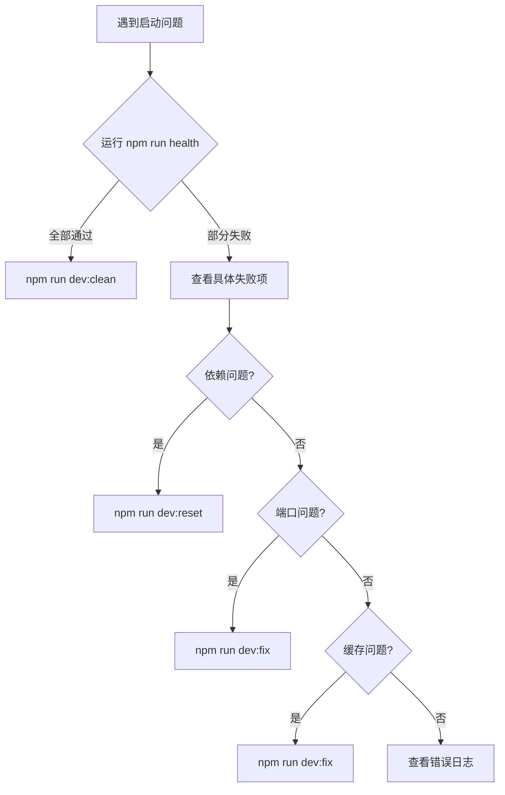

# 开发环境快速启动指南 🚀

> **解决问题**: 端口占用、缓存冲突、启动失败等开发环境问题
> **创建时间**: 2025-11-26
> **适用场景**: 依赖更新后、端口冲突、缓存问题、首次启动

---

## 📋 快速命令索引

### 🎯 推荐使用（按使用频率排序）

```bash
# 1. 最常用：清理缓存并启动（推荐）⭐⭐⭐⭐⭐
npm run dev:clean

# 2. 快速启动：仅检查端口后启动 ⭐⭐⭐⭐
npm run dev:quick

# 3. 健康检查：诊断环境问题 ⭐⭐⭐
npm run health

# 4. 快速修复：清理缓存和端口 ⭐⭐⭐
npm run dev:fix

# 5. 完全重置：遇到严重问题时使用 ⭐⭐
npm run dev:reset
```

---

## 🔧 命令详解

### 1. `npm run dev:clean` - 清理缓存并启动（推荐）

**适用场景**:
- ✅ 每次更新依赖后
- ✅ 端口被占用时
- ✅ 出现奇怪的缓存问题
- ✅ 日常开发启动

**执行内容**:
1. 自动检查并清理端口 3002
2. 清理 `.next` 缓存
3. 清理 `node_modules/.cache`
4. 启动开发服务器
5. 自动打开浏览器

**使用示例**:
```bash
npm run dev:clean
```

**预期输出**:
```
🚀 开发服务器启动工具
============================================================
✅ 端口 3002 可用
🗑️  快速清理缓存...
✅ 缓存清理完成
🚀 启动开发服务器...
📡 服务器将在 http://localhost:3002 启动
✅ 开发服务器已启动！
🌐 访问: http://localhost:3002
```

---

### 2. `npm run dev:quick` - 快速启动

**适用场景**:
- ✅ 缓存正常，只需检查端口
- ✅ 需要快速启动测试

**执行内容**:
1. 检查并清理端口 3002
2. 启动开发服务器（不清理缓存）

**使用示例**:
```bash
npm run dev:quick
```

---

### 3. `npm run health` - 环境健康检查

**适用场景**:
- ✅ 诊断启动问题
- ✅ 检查配置是否正确
- ✅ 验证依赖是否完整

**检查内容**:
- ✓ Node.js 版本
- ✓ pnpm 版本
- ✓ 关键依赖安装情况
- ✓ 环境变量配置
- ✓ 端口状态
- ✓ Next.js 缓存
- ✓ Supabase 服务

**使用示例**:
```bash
npm run health
```

**示例输出**:
```
🏥 开发环境健康检查
============================================================

📦 检查运行环境...
✅ Node.js: v24.11.0
✅ pnpm: v10.14.0

📚 检查项目依赖...
✅ 依赖已安装（4 个关键依赖检查通过）

🔐 检查环境配置...
✅ .env.local 文件存在
  ✓ Supabase 配置存在
  ✓ 阿里云OCR 配置存在

🌐 检查开发服务器端口...
ℹ️  端口 3002 可用（服务器未运行）

✅ 健康检查通过 (6/6)
🚀 可以启动开发服务器: npm run dev
```

---

### 4. `npm run dev:fix` - 快速修复

**适用场景**:
- ✅ 端口被占用
- ✅ 缓存导致的编译错误
- ✅ 奇怪的运行时错误

**执行内容**:
1. 检查并杀死占用端口的进程
2. 清理 `.next` 缓存
3. 清理 `node_modules/.cache`
4. 清理 Turbopack 缓存

**使用示例**:
```bash
npm run dev:fix
```

**完成后手动启动**:
```bash
npm run dev
```

---

### 5. `npm run dev:reset` - 完全重置（慎用）

**适用场景**:
- ⚠️  遇到严重的依赖问题
- ⚠️  怀疑依赖损坏
- ⚠️  所有其他方法都失败时

**执行内容**:
1. 检查并杀死占用端口的进程
2. 清理所有缓存
3. **重新安装所有依赖** (使用 `pnpm install --force`)

**⏱️ 预计耗时**: 2-5分钟（取决于网络速度）

**使用示例**:
```bash
npm run dev:reset
```

**⚠️ 注意**: 此命令会重新安装所有依赖，时间较长，请确保必要时才使用。

---

## 🎯 常见问题解决方案

### 问题1: 端口3002被占用

**错误信息**:
```
Error: listen EADDRINUSE: address already in use :::3002
```

**解决方案**:
```bash
# 方案1: 使用自动清理启动（推荐）
npm run dev:clean

# 方案2: 仅清理端口
npm run dev:fix
npm run dev
```

**手动解决**（Windows）:
```bash
# 查找占用端口的进程
netstat -ano | findstr :3002

# 杀死进程（替换为实际PID）
taskkill /F /PID <PID>
```

---

### 问题2: 更新依赖后启动失败

**症状**:
- 编译错误
- 模块找不到
- 类型错误

**解决方案**:
```bash
# 推荐：清理缓存并启动
npm run dev:clean

# 如仍有问题：完全重置
npm run dev:reset
```

---

### 问题3: 奇怪的缓存问题

**症状**:
- 代码修改不生效
- 看到旧的编译结果
- 莫名其妙的错误

**解决方案**:
```bash
# 清理所有缓存
npm run dev:fix

# 然后重新启动
npm run dev
```

---

### 问题4: 首次启动项目

**步骤**:
```bash
# 1. 安装依赖
pnpm install

# 2. 配置环境变量
cp .env.local.example .env.local
# 编辑 .env.local 填入实际配置

# 3. 启动Supabase（可选）
npm run db:start

# 4. 健康检查
npm run health

# 5. 启动开发服务器
npm run dev:clean
```

---

## 📊 性能对比

| 命令 | 清理缓存 | 检查端口 | 重装依赖 | 启动时间 | 推荐度 |
|------|---------|---------|---------|---------|--------|
| `dev:quick` | ❌ | ✅ | ❌ | ~5秒 | ⭐⭐⭐⭐ |
| `dev:clean` | ✅ | ✅ | ❌ | ~10秒 | ⭐⭐⭐⭐⭐ |
| `dev:fix` | ✅ | ✅ | ❌ | ~3秒 | ⭐⭐⭐ |
| `dev:reset` | ✅ | ✅ | ✅ | 2-5分钟 | ⭐⭐ |

---

## 🔍 高级用法

### 直接使用脚本（带参数）

```bash
# 快速清理（仅清理.next，跳过端口检查）
node scripts/dev-reset.mjs --quick

# 完全重置
node scripts/dev-reset.mjs --reinstall

# 启动时清理缓存
node scripts/dev-start.mjs --clean

# 不使用Turbo模式
node scripts/dev-start.mjs --no-turbo
```

---

## 💡 最佳实践

### 日常开发流程

```bash
# 1. 早上开始工作
npm run health              # 检查环境
npm run dev:clean          # 启动开发服务器

# 2. 更新依赖后
npm run dev:fix            # 清理缓存
npm run dev                # 重新启动

# 3. 遇到问题时
npm run health             # 诊断问题
npm run dev:clean          # 清理启动

# 4. 实在不行时
npm run dev:reset          # 完全重置
```

### 团队协作建议

1. **拉取代码后**: 先运行 `npm run health` 检查环境
2. **依赖更新后**: 使用 `npm run dev:clean` 而不是 `npm run dev`
3. **遇到问题时**: 先尝试 `npm run dev:fix`，再考虑 `dev:reset`
4. **分享环境**: 确保 `.env.local.example` 保持更新

---

## 🛠️ 故障排查流程



---

## 📝 脚本文件说明

### 核心脚本文件

| 文件 | 功能 | 位置 |
|------|------|------|
| `dev-reset.mjs` | 环境重置和缓存清理 | `scripts/dev-reset.mjs` |
| `dev-start.mjs` | 智能启动开发服务器 | `scripts/dev-start.mjs` |
| `health-check.mjs` | 环境健康检查 | `scripts/health-check.mjs` |

### 脚本特性

- ✅ **跨平台**: 自动检测操作系统（Windows优化）
- ✅ **智能检测**: 自动识别端口占用情况
- ✅ **彩色输出**: 清晰的状态提示
- ✅ **错误处理**: 完善的错误捕获和提示
- ✅ **性能优化**: 最小化不必要的操作

---

## 🎉 总结

### 记住这三个命令

```bash
npm run dev:clean   # 日常启动（推荐）
npm run health      # 问题诊断
npm run dev:fix     # 快速修复
```

### 90%的问题都能用这个解决

```bash
npm run dev:clean
```

### 剩下10%的问题用这个

```bash
npm run dev:reset
```

---

**最后更新**: 2025-11-26
**维护者**: 开发团队
**反馈**: 如有问题请创建 Issue

---

## ⚠️ 已知问题

### Turbo 模式不可用

**问题**: 使用 `--turbo` 标志启动会报错 "Next.js package not found"

**解决方案**: 已将默认模式改为稳定模式（不使用 Turbo）

**详细说明**: 查看 [Turbo模式问题解决方案](./Turbo模式问题解决方案.md)

**影响**: 无，稳定模式性能已经足够好，热更新速度 1-2秒

---

## 📚 相关文档

- [Turbo模式问题解决方案](./Turbo模式问题解决方案.md) ⚡ 新增
- [Sharp图片裁剪问题解决方案](./下一步-Sharp图片裁剪问题解决方案.md)
- [AI题库-阿里云OCR集成成功报告](./AI题库-阿里云OCR集成成功报告-最终版.md)
