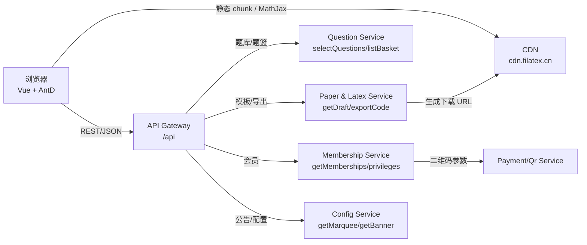

# 数学题库网站克隆

## 1. 项目定位与体验
- Filatex（奇思妙想 LaTeX）是一套聚焦 K12 数学题库、LaTeX 试卷生成与知识点管理的 SaaS，支持选题、组卷、导出全链路。
- 同一 SPA 通过 Vue Router 切换 `/`、`/questions`、`/resources`、`/create-paper`、`/export-source`、`/pricing`、`/docs/index` 等路由；UI 主打 Ant Design Vue 卡片/抽屉/表单，配合 GSAP 动效、Remix Icon、SVG 插图营造“编辑器工作台 + 模板市场”体验。
- 核心价值：智能题库检索 + 题篮 + 模板渲染，一键导出 LaTeX/PDF；批量导入/OCR/知识点识别；私有空间与会员增值。

## 2. 架构与技术栈
- **前端**：`Vue 3 + Vite + Pinia + Vue Router`；UI 组件以 Ant Design Vue 为主，辅以 Tailwind 类、Remix Icon、GSAP、MathJax (`tex-chtml`)、`vue-draggable-plus`、`qr-code-styling`。
- **发布**：静态资源托管 `https://cdn.filatex.cn/file/filatex/*`；MathJax 与 Remix Icon 走 CDN。
- **后端接口**：Axios 实例默认 `/api`，登录后附 `Authorization` + `withCredentials`。模块：`questions-*`(题库/题篮)、`paper-*`(模板/草稿/导出)、`payment-*`(订单/支付)、`api2-*`(OCR/AI)、`latex-*`(模板/导出)。

## 3. 主要模块与路由
| 模块 | 入口 | 特色 |
| --- | --- | --- |
| 题库 | `/questions` | 题目检索、知识点树、题篮、收藏/标签、二维码分享 |
| 资源 | `/resources` | 素材文件过滤（PDF/Word/PPT/Zip 等）、类型图标、下载 |
| 快速组卷 | `/create-paper` | 三栏工作台：工具箱/题目排序/模板编辑，图片预览，草稿提示 |
| 高级导出 | `/export-source` | Block Builder、模板片段、拖拽排序、模板代码下载 |
| 空间申请 | `/apply-space-id` | SpaceId 申请与正则校验 |
| 定价订阅 | `/pricing` | 套餐卡片、权益矩阵、扫码支付、订单轮询 |
| 登录注册 | `/login` | Banner 轮播、验证码/密码登录、倒计时 |
| 首页/文档 | `/`、`/docs/index` | Hero、案例、模板下载、文档中心与 FAQ |

## 4. 功能拆解（概要）
- **题库检索**：学段/学科/知识点树/难度/省份/年份/标签多维筛选；`selectQuestions` + `getPagination` 组合查询；题篮 REST 套件保障组卷数据源。
- **组卷/导出**：快速模式三栏（片段按钮 + 拖拽题目 + 模板编辑）；高级模式 Block Builder（Question/Text/TexCode/List 等），支持草稿与模板版本切换，导出 LaTeX 代码或 PDF。
- **OCR/AI**：监听剪贴板与上传流程，OCR 结果回填题干/答案/解析；AI 接口分层 timeout（3s/5s/60s）。
- **支付/会员**：定价页加载套餐与权益，生成二维码并轮询订单；支付成功刷新权益。

## 5. 接口与建模要点（概念）
- 题篮表 `question_baskets(user_id, question_id, metadata_jsonb, created_at)`，UNIQUE(user_id, question_id)；`metadata` 存题型/难度/知识点。
- 草稿表 `drafts(user_id, template_id, payload_jsonb, updated_at)`，存 Block 顺序与模板文本。
- 模板表 `latex_templates` 区分官方/自定义；`membership_privileges` 映射套餐→权益；`orders` 记录支付二维码与状态。

## 6. 公开页面（源码 + MCP 双验）
- `/questions`、`/resources`、`/create-paper`、`/export-source`、`/pricing`、`/login`、`/apply-space-id`、`/docs/index` 均可匿名访问 UI。源码逆向与 MCP 真实抓包的 DOM/网络/控制台日志已对齐。

## 7. 核心实现亮点（源码视角）
- **题目编辑/公式渲染**：`TexHighlighter + MathJaxRenderer` 实时预览 `$..$`，粘贴监听 + OCR 上传自动回填；MathJax 全局配置 `chtml.displayAlign='center'`。
- **快速组卷**：三栏工作台，`vue-draggable-plus` 题目列表 + 图片预加载；模板编辑区直接插入片段，`/paper/exportFastPaper` 导出。
- **高级导出**：Block Builder + `DynamicForm` 渲染参数；题篮缩略图缓存；`/latex/exportCode`/`/paper/exportPaper` 输出；`beforeunload` 防未保存离开。

## 8. MCP 实测对照（2025-11-16）
### 8.1 题库页 `/questions`
- 结构：顶部导航 + 多维筛选 + 题篮，与逆向一致；批量请求 `cdn.filatex.cn/latex/fantastic_idea_latex_*.svg` 预览素材。
- 网络（未登录）：静态 chunk + `MathJax@3.2.2`；`GET /api/questions/listSubjects`、`/listGrade/{id}`、`/listKnowledgePoints/2`（多次）、`/listQuestionType/2`、`/listDifficult`、`/listProvince`、`/listYears`、`/listTags`; 题篮 `GET /countBasket` → `POST /listQuestionsBasket`; 列表 `POST /selectQuestions` + `/getPagination`; 公告 `GET /api/config/getMarquee`; 401：`GET /api/knowledgePoints/list`、`GET /api/user/getInfo`。
- 控制台：仅 401 相关。

### 8.2 组卷页 `/create-paper`
- 结构：工具箱/组件，草稿提示，导出/版本控件，底部“登录已过期”对话框。
- 网络：加载 `CreatePaperV2`、`DynamicForm`、`vue-draggable-plus`、`BlockPicker`、`paper-01LgfF5Y.js`；`GET /api/config/getMarquee` → `POST /api/paper/getDraft`(401) → `GET /api/user/getInfo`(401)。
- 控制台：401。

### 8.3 导出页 `/export-source`
- 结构：快捷插入、题目列表（拖拽提示）、模板编辑、下载模板代码、保存/提交。
- 网络：`GET /api/config/getMarquee`、`GET /api/latex/getTemplateTags`、`GET /api/latex/getUserTemplate`(401)、`POST /api/questions/listQuestionsBasket`、`GET /api/user/getInfo`(401)。
- 控制台：401。

### 8.4 定价页 `/pricing`
- 结构：普通/PRO 套餐卡（原价/折扣/节省/日均价），学段单选。
- 网络：chunk `Pricing-CGZ7RRQG.js`、`payment-CvT1ugYF.js`、`qr-code-styling`；`POST /api/getMemberships`、`POST /api/getMembershipPrivileges`、`GET /api/config/getMarquee`、`GET /api/user/getInfo`(401)。
- 控制台：401。

## 9. 核心 API 请求/响应示例
> 真实字段可能有细微差异，格式基于 MCP 抓包和源码推断。

### 9.1 题库检索
**POST `/api/questions/selectQuestions`**
```json
{
  "subjectId": 2,
  "gradeId": null,
  "knowledgePointIds": [20101, 2010203],
  "difficultyIds": [],
  "tagIds": [],
  "provinceIds": ["SICHUAN"],
  "yearIds": [2023, 2024],
  "basketOnly": false,
  "orderBy": "latest",
  "page": 1,
  "pageSize": 20
}
```
**Response**
```json
{
  "code": 0,
  "data": {
    "list": [
      {
        "id": 918273,
        "questionType": "fill_blank",
        "difficulty": "MEDIUM",
        "questionContent": "\\frac{1}{2}x + 3 = 5",
        "answerContent": "x = 4",
        "analysisContent": "...",
        "knowledgePoints": ["函数->一次函数"],
        "tags": ["期中", "模拟"],
        "assetUrls": ["https://cdn.filatex.cn/latex/fantastic_idea_latex_abc.svg"]
      }
    ],
    "pagination": { "page": 1, "pageSize": 20, "total": 12573, "totalPage": 629 }
  }
}
```

### 9.2 题篮
**POST `/api/questions/listQuestionsBasket`**
```json
{ "page": 1, "pageSize": 100 }
```
**Response**
```json
{
  "code": 0,
  "data": {
    "list": [
      { "questionId": 918273, "order": 1, "snapshot": { "title": "二次函数求解", "difficulty": "MEDIUM" } }
    ],
    "count": 12
  }
}
```
**GET `/api/questions/countBasket`**
```json
{ "code": 0, "data": 12 }
```

### 9.3 草稿与导出
**POST `/api/paper/getDraft`**
```json
{ "draftId": "draft_2025_01", "page": 1, "pageSize": 1 }
```
**Response**
```json
{
  "code": 0,
  "data": {
    "id": "draft_2025_01",
    "template": "\\section*{#{paperTitle}} ...",
    "blocks": [
      { "type": "Question", "questionId": 918273 },
      { "type": "Text", "content": "\\textbf{答题区}:" }
    ],
    "updatedAt": "2025-11-15T06:10:12Z"
  }
}
```

**POST `/api/latex/exportCode`**
```json
{
  "templateId": "fast_default",
  "blocks": [
    { "type": "Question", "questionId": 918273 },
    { "type": "Question", "questionId": 918274 }
  ],
  "options": { "paperTitle": "高一函数专练", "removeDraftWhenExported": true }
}
```
**Response**
```json
{
  "code": 0,
  "data": {
    "fileName": "paper_20251116.tex",
    "downloadUrl": "https://cdn.filatex.cn/file/tmp/paper_20251116.tex",
    "expiresAt": "2025-11-16T14:00:00Z"
  }
}
```

### 9.4 会员订阅
**POST `/api/getMemberships`**
```json
{ "stage": "senior", "planType": "standard" }
```
**Response**
```json
{
  "code": 0,
  "data": [
    { "id": "plan_month", "name": "小量尝鲜", "months": 1, "price": 29, "originPrice": 39 },
    { "id": "plan_quarter", "name": "畅学三月", "months": 3, "price": 69, "originPrice": 117 }
  ]
}
```

**POST `/api/getMembershipPrivileges`**
```json
{ "planId": "plan_year", "stage": "senior" }
```
**Response**
```json
{
  "code": 0,
  "data": {
    "privileges": [
      { "key": "paper_export", "label": "试卷导出", "limit": "不限" },
      { "key": "ocr_quota", "label": "OCR 额度", "limit": "200 次/月" },
      { "key": "private_space", "label": "私有题库空间", "limit": "200GB" }
    ]
  }
}
```

## 10. 数据流图

说明：首屏从 CDN 获取前端 bundle/MathJax/素材，业务数据走 `/api` 由 Gateway 分发到题库、模板、会员、配置服务；导出产物回写 CDN；支付二维码由 Membership/Payment 生成并交给前端 `qr-code-styling` 渲染。

## 11. 为日新平台的落地建议
1. 统一技术栈：`Vue 3 + Vite + Pinia + Ant Design Vue`，预置 MathJax/GSAP/Tailwind/Remix Icon。
2. 模块化路由：按第 3 节拆分子应用，便于团队并行。
3. 数据建模：题篮/草稿用 JSONB 存模板与 Block 配置，UNIQUE 防重复，索引按难度/知识点/年份等建。
4. 性能与检索：PostgreSQL `to_tsvector` + 前端虚拟列表；CDN 缓存静态与导出物。
5. 编辑器体验：三栏/Block Builder、一键插片段、OCR 上传、图片预览、拖拽排序；MathJax 统一 CHTML 渲染。
6. 支付闭环：定价页即下单，`qr-code-styling` 生成二维码，轮询 `queryOrder`，支付成功刷新权益。
7. 实施路线：① 先打通题库 + 题篮 + 组卷闭环；② 加入 OCR/知识点识别；③ 完成订单/支付；④ 上线空间申请/多租户；⑤ 补齐首页/文档；⑥ 持续用 MCP 做自动化抓包回归。
