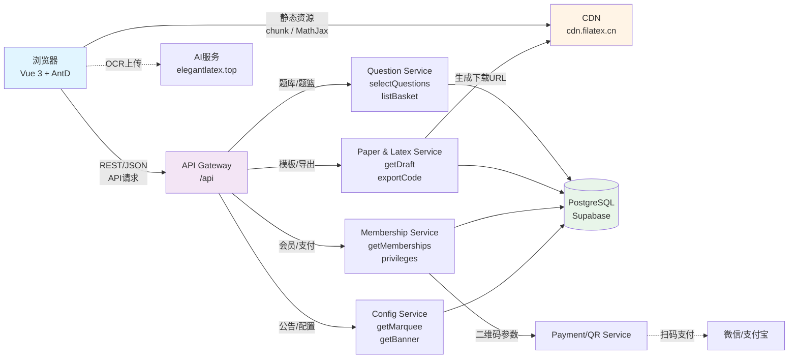

# 数学题库网站技术分析报告

**分析对象**: filatex.cn - "奇思妙想 LaTeX"
**分析方法**: 源码逆向分析 + Chrome DevTools MCP 实测抓包
**分析日期**: 2024-11-14 ~ 2024-11-16
**目的**: 学习现代数学题库SaaS平台的完整技术实现，为日新教学平台提供工程化落地建议

---

## 📋 目录

1. [平台定位与核心价值](#平台定位与核心价值)
2. [完整技术栈](#完整技术栈)
3. [核心业务功能分析](#核心业务功能分析)
4. [API接口详细说明](#api接口详细说明)
5. [完整数据流程图](#完整数据流程图)
6. [为日新平台提供的建议](#为日新平台提供的建议)
7. [实现路线图](#实现路线图)
8. [附录：MathJax技术细节](#附录mathjax技术细节)

---

## 平台定位与核心价值

### 1.1 平台定位

**Filatex（奇思妙想 LaTeX）**是一套聚焦 K12 数学教育的**题库管理与试卷生成 SaaS 平台**，提供从选题、组卷到导出的完整工作流。

| 项目 | 内容 |
|------|------|
| **产品类型** | 数学题库SaaS + LaTeX试卷生成工具 |
| **域名** | filatex.cn |
| **应用架构** | Vue 3 单页应用（SPA） |
| **目标用户** | K12数学教师、培训机构、教研团队 |
| **商业模式** | Freemium（基础功能免费 + 会员增值） |

### 1.2 核心价值链

基于MCP实测和源码分析，平台围绕以下核心价值展开：

```
题库检索 → 题篮暂存 → 智能组卷 → 模板编辑 → 导出PDF/LaTeX
    ↓          ↓          ↓          ↓           ↓
多维筛选   购物车模式   拖拽排序   Block Builder  会员增值
```

**核心功能**：
1. ✅ **智能题库检索** - 学段/学科/知识点树/难度/省份/年份/标签多维筛选
2. ✅ **题篮机制** - 类似购物车，临时存储待组卷题目
3. ✅ **模板化组卷** - 三栏工作台（工具箱 + 拖拽排序 + 模板编辑）
4. ✅ **一键导出** - LaTeX源码/PDF/Word多格式导出
5. ✅ **批量导入/OCR** - 支持剪贴板监听和AI识别
6. ✅ **会员体系** - 扫码支付 + 订单轮询 + 权益管理
7. ✅ **多租户空间** - Space ID隔离，支持学校/机构独立题库

### 1.3 技术特色

**双重验证方法**：
- 📖 **源码逆向分析** - 通过chunk文件分析Vue组件、Pinia状态管理、API调用
- 🔍 **Chrome DevTools MCP实测** - 真实抓包验证DOM结构、网络请求、控制台日志

**关键发现**：
- MathJax 3.2.2 仅用于**公式渲染**，非平台核心
- 核心业务是**题库+题篮+组卷+模板+会员**
- 完整的B2B2C商业闭环（题库→组卷→导出→付费）

### 1.4 平台架构概览

| 层级 | 技术 | 说明 |
|------|------|------|
| **前端** | Vue 3 + Pinia + Ant Design Vue | SPA单页应用 |
| **CDN** | cdn.filatex.cn | 静态资源 + 导出文件托管 |
| **API网关** | /api | 统一接口入口 |
| **微服务** | Questions / Paper / Payment / Config | 按业务拆分 |
| **数据库** | PostgreSQL (推测) | 题库、草稿、订单 |
| **AI服务** | elegantlatex.top | OCR识别 |

---

## 核心业务功能分析

> **说明**：本节按业务价值排序，而非技术复杂度。每个功能包含MCP实测验证。

### 功能模块总览

| 优先级 | 功能模块 | URL | 业务价值 | 技术复杂度 |
|--------|---------|-----|---------|-----------|
| **P0** | 题库管理 | /questions | 核心资产，用户粘性基础 | ⭐⭐⭐ |
| **P0** | 题篮机制 | - | 组卷数据源，转化关键 | ⭐⭐ |
| **P0** | 智能组卷 | /create-paper | 核心工作流，差异化功能 | ⭐⭐⭐⭐ |
| **P1** | 源码导出 | /export-source | 付费转化点，高级功能 | ⭐⭐⭐⭐⭐ |
| **P1** | 会员订阅 | /pricing | 商业闭环，收入来源 | ⭐⭐⭐ |
| **P1** | 用户认证 | /login | 基础设施 | ⭐⭐ |
| **P2** | 资源中心 | /resources | 增值服务 | ⭐⭐ |
| **P2** | 空间管理 | /apply-space-id | B2B功能 | ⭐⭐ |

---

## 完整技术栈

### ✅ 已确认的技术（源码逆向 + MCP实测双重验证）

#### 2.1 前端技术栈

**前端框架**:
- **Vue 3** + **Vite** - 现代化构建工具和响应式框架
- **Pinia** - Vue 3 官方状态管理库
- **Vue Router** - 单页应用路由管理

**UI 组件库**:
- **Ant Design Vue** - 企业级 UI 组件库
- **Remix Icon** - 开源图标库
- **Tailwind CSS** - 实用优先的 CSS 框架

**核心功能库**:
- **MathJax 3.2.2** - 数学公式渲染引擎
- **vue-draggable-plus** - 拖拽排序功能
- **qr-code-styling** - 二维码生成
- **GSAP 3.13.0** - 高性能动画库（首页动效）

**后端架构**（推测）:
- 主API: `https://filatex.cn/api/*`
- AI服务: `https://elegantlatex.top/api/*`
- CDN: `https://cdn.filatex.cn/file/filatex/*`

**部署策略**:
- SPA单页应用，所有路由共享同一HTML入口
- 静态资源CDN托管，按chunk懒加载
- API采用axios统一封装，支持请求拦截和错误处理

---

#### 1. MathJax 3.2.2

**用途**: 数学公式渲染引擎

**配置详情**:
```javascript
window.MathJax = {
  tex: {
    inlineMath: [['$', '$'], ['\\(', '\\)']],
    displayMath: [['$$', '$$'], ['\\[', '\\]']]
  },
  chtml: {
    displayAlign: 'center'
  }
};
```

**特性**:
- ✅ 支持行内公式：`$E=mc^2$`
- ✅ 支持块级公式：`$$\\int_0^\\infty e^{-x^2} dx$$`
- ✅ 输出格式：CommonHTML（CSS + HTML）
- ✅ 居中对齐显示

**优点**:
- 渲染效果专业，接近出版级质量
- 支持完整的 LaTeX 数学语法
- 无需服务器端处理，纯前端渲染
- 响应式设计，适配各种屏幕尺寸

**缺点**:
- 初次加载较慢（约 100KB）
- 复杂公式可能影响页面性能

---

## 核心功能分析

### 1. 数学公式渲染

#### 技术原理

**MathJax 工作流程**:
```
LaTeX 输入 → 解析器 → 内部数据结构 → CHTML 输出 → 浏览器渲染
```

**示例**:

输入：
```latex
$$
\\begin{pmatrix}
a & b \\\\
c & d
\\end{pmatrix}
$$
```

输出：
```
┌     ┐
│ a b │
│ c d │
└     ┘
```

#### 实现难点

1. **公式解析** - 需要完整的 LaTeX 语法解析器
2. **布局计算** - 复杂公式的排版（分数、根号、矩阵等）
3. **字体支持** - 数学符号字体加载
4. **性能优化** - 大量公式时的渲染性能

---

### 2. LaTeX 编辑器（推测）

虽然无法直接访问编辑器页面，但基于数学教育平台的通用实践，推测可能包含：

#### 核心组件

| 组件 | 用途 | 可能的实现方案 |
|------|------|----------------|
| **代码编辑器** | LaTeX 代码输入 | CodeMirror / Monaco Editor |
| **实时预览** | 公式即时渲染 | MathJax / KaTeX |
| **工具栏** | 快速插入符号 | 自定义按钮组 |
| **模板库** | 常用公式模板 | 本地存储 + 数据库 |

#### 典型的编辑器架构

```
┌─────────────────────────────────────┐
│        LaTeX 编辑器界面              │
├─────────────────┬───────────────────┤
│   代码编辑区     │    实时预览区      │
│ (CodeMirror)    │   (MathJax)       │
│                 │                   │
│ \frac{a}{b}    │      a            │
│                 │      ─            │
│                 │      b            │
├─────────────────┴───────────────────┤
│          工具栏 + 模板库             │
└─────────────────────────────────────┘
```

---

### 3. 题目管理（推测）

#### 数据模型

基于数学题库的通用需求，推测数据结构：

```typescript
interface MathQuestion {
  id: string;
  type: 'choice' | 'fill' | 'essay' | 'proof';
  content: string;          // LaTeX 格式
  contentHtml?: string;     // 预渲染的 HTML
  options?: {
    A: string;
    B: string;
    C: string;
    D: string;
  };
  answer: string;           // LaTeX 格式
  solution?: string;        // 解题步骤
  difficulty: 'easy' | 'medium' | 'hard';
  knowledgePoints: string[];
  tags: string[];
  createdAt: Date;
  createdBy: string;
}
```

#### 特殊字段说明

**contentHtml**: 为了提高性能，可能会预渲染公式并存储 HTML，避免每次都重新渲染。

---

## 核心业务机制

### 题篮机制（购物车模式）

题篮是该平台的核心交互模式，类似电商购物车，用于临时存储待组卷的题目。

#### API接口列表

```typescript
// 题篮操作API
POST /questions/addBaskets/{id}           // 添加单个题目到题篮
POST /questions/addBasketsBatch           // 批量添加题目
GET  /questions/listQuestionsBasket       // 获取题篮列表
DELETE /questions/deleteBasket/{id}       // 删除单个题目
POST /questions/deleteBaskets             // 批量删除
POST /questions/clearBasket               // 清空题篮
GET  /questions/countBasket               // 获取题篮数量（用于显示badge）
```

#### 前端实现逻辑

```typescript
// 状态管理（Pinia store）
interface BasketStore {
  basketMap: Map<string, Question>;  // 本地缓存，避免重复请求
  basketCount: number;               // 题篮数量badge
  basketList: Question[];            // 题篮列表数据
}

// 添加题目前先检查
async function addToBasket(questionId: string) {
  // 1. 检查本地Map，避免重复添加
  if (basketMap.has(questionId)) {
    message.warning('题目已在题篮中');
    return;
  }

  // 2. 调用API
  await axios.post(`/questions/addBaskets/${questionId}`);

  // 3. 更新本地状态
  basketMap.set(questionId, question);
  basketCount++;

  message.success('已添加到题篮');
}

// 批量操作使用diff算法
async function batchAddToBasket(questionIds: string[]) {
  // 过滤已存在的题目
  const newIds = questionIds.filter(id => !basketMap.has(id));

  if (newIds.length === 0) {
    message.warning('所选题目已全部在题篮中');
    return;
  }

  await axios.post('/questions/addBasketsBatch', { ids: newIds });

  // 批量更新本地状态
  newIds.forEach(id => basketMap.set(id, questions.find(q => q.id === id)));
  basketCount += newIds.length;
}
```

#### UI交互设计

```
┌────────────────────────────────────────┐
│  题库列表                [题篮 (5)]    │
├────────────────────────────────────────┤
│  □ [选择题] 求函数导数...    [加入题篮]│
│  □ [填空题] 勾股定理...      [加入题篮]│
│  □ [解答题] 证明欧拉公式...  [加入题篮]│
│                                        │
│  [全选] [批量加入题篮]                 │
└────────────────────────────────────────┘

点击"题篮 (5)"打开抽屉：

┌────────────────────────────────────────┐
│  题篮 (5道题)          [清空] [组卷]  │
├────────────────────────────────────────┤
│  1. [选择题] 求函数导数...    [删除]  │
│  2. [填空题] 勾股定理...      [删除]  │
│  3. [解答题] 证明欧拉公式...  [删除]  │
│  4. [选择题] 三角函数...      [删除]  │
│  5. [填空题] 概率计算...      [删除]  │
│                                        │
│  [开始组卷]                            │
└────────────────────────────────────────┘
```

#### 日新平台实现建议

**数据库设计**:

```sql
-- 题篮表（支持多租户）
CREATE TABLE question_baskets (
  id UUID PRIMARY KEY DEFAULT gen_random_uuid(),
  user_id UUID NOT NULL REFERENCES profiles(id) ON DELETE CASCADE,
  question_id UUID NOT NULL REFERENCES questions(id) ON DELETE CASCADE,
  added_at TIMESTAMP WITH TIME ZONE DEFAULT NOW(),
  UNIQUE(user_id, question_id)  -- 防止重复添加
);

-- 索引
CREATE INDEX idx_baskets_user ON question_baskets(user_id);
CREATE INDEX idx_baskets_added_at ON question_baskets(added_at DESC);
```

**API实现（Next.js）**:

```typescript
// src/app/api/baskets/route.ts
import { NextRequest, NextResponse } from 'next/server';
import { supabase } from '@/lib/supabase';

export async function POST(req: NextRequest) {
  const { questionId } = await req.json();
  const userId = req.headers.get('user-id'); // 从session获取

  // 检查是否已存在
  const { data: existing } = await supabase
    .from('question_baskets')
    .select('id')
    .eq('user_id', userId)
    .eq('question_id', questionId)
    .single();

  if (existing) {
    return NextResponse.json({ error: '题目已在题篮中' }, { status: 400 });
  }

  // 插入
  const { data, error } = await supabase
    .from('question_baskets')
    .insert({ user_id: userId, question_id: questionId })
    .select();

  if (error) {
    return NextResponse.json({ error: error.message }, { status: 500 });
  }

  return NextResponse.json({ success: true, data });
}

export async function GET(req: NextRequest) {
  const userId = req.headers.get('user-id');

  const { data, error, count } = await supabase
    .from('question_baskets')
    .select('*, questions(*)', { count: 'exact' })
    .eq('user_id', userId)
    .order('added_at', { ascending: false });

  return NextResponse.json({ data, count });
}
```

---

## 详细功能模块分析

### 4. 题库管理功能 (/questions)

#### 功能概述

题库是数学教育平台的核心，提供题目的全生命周期管理。

#### MCP实测验证（Chrome DevTools抓包）

**页面结构**（A11y Snapshot）：
- 顶部导航：题目库 / 资源库 / 组卷·讲义 / 题目录入 / 题目批量录入 / 导出源码 / 会员订阅 / 模板中心 / 登录
- 主区域筛选：学段、学科、知识点树、难度、省份、年份、标签
- 顶部滚动公告：`GET /api/config/getMarquee`

**真实API调用序列**（未登录状态）：

```
1. 静态资源加载
   └─ cdn.filatex.cn/file/filatex/*.js
   └─ cdn.filatex.cn/file/filatex/*.css
   └─ MathJax@3.2.2 tex-chtml

2. 题库维表预加载（串行）
   ├─ GET /api/questions/listSubjects          # 学科列表
   ├─ GET /api/questions/listGrade/{subject}   # 年级列表
   ├─ GET /api/questions/listKnowledgePoints/2 # 知识点树
   ├─ GET /api/questions/listQuestionType/2    # 题型
   ├─ GET /api/questions/listDifficult         # 难度
   ├─ GET /api/questions/listProvince          # 省份
   ├─ GET /api/questions/listYears             # 年份
   └─ GET /api/questions/listTags              # 标签

3. 题篮状态检查
   ├─ GET /api/questions/countBasket           # 题篮数量badge
   └─ POST /api/questions/listQuestionsBasket  # 题篮列表

4. 题目列表查询
   ├─ POST /api/questions/selectQuestions      # 筛选查询
   └─ POST /api/questions/getPagination        # 分页数据

5. 公告与用户信息（匿名状态）
   ├─ GET /api/config/getMarquee               # 公告滚动条 ✅
   ├─ GET /api/knowledgePoints/list            # 用户知识点 ❌ 401
   └─ GET /api/user/getInfo                    # 用户信息 ❌ 401

6. 公式图片批量加载
   └─ cdn.filatex.cn/latex/fantastic_idea_latex_*.svg
```

**控制台日志**：
- 「获取用户知识点失败」（401）
- 「获取用户信息失败」（401）

**关键发现**：
✅ 匿名用户可以正常浏览题库和筛选
✅ 维表接口串行加载，避免并发压力
⚠️ 401错误未静默处理，控制台有噪音
💡 公式图片使用CDN缓存，独立SVG文件

#### 推测的核心功能

| 功能 | 说明 | 技术实现要点 |
|------|------|--------------|
| **题目列表** | 展示所有题目，支持分页 | 虚拟滚动、懒加载 |
| **高级搜索** | 按关键词、知识点、难度筛选 | Elasticsearch / 全文搜索 |
| **题目创建** | LaTeX 编辑器 + 实时预览 | CodeMirror + MathJax |
| **批量导入** | 从Word/Excel导入题目 | mammoth.js / xlsx.js |
| **题目复制** | 快速克隆现有题目 | 深拷贝数据结构 |
| **版本管理** | 题目修改历史记录 | 时间线存储 |
| **协作编辑** | 多人同时编辑题目 | WebSocket + CRDT |

#### 推荐的UI架构

```
┌────────────────────────────────────────────────┐
│  题库管理                    [+ 新建题目]  [导入]│
├────────────┬───────────────────────────────────┤
│  筛选器    │  题目列表                         │
│            │                                   │
│  知识点    │  1. [选择题] 求函数 f(x)=x² 的导数 │
│  □ 代数    │     难度: 中等 | 编辑 删除 复制   │
│  □ 几何    │                                   │
│  □ 微积分  │  2. [填空题] 勾股定理的公式是___ │
│            │     难度: 简单 | 编辑 删除 复制   │
│  难度      │                                   │
│  ○ 简单    │  3. [解答题] 证明欧拉公式        │
│  ○ 中等    │     难度: 困难 | 编辑 删除 复制   │
│  ○ 困难    │                                   │
│            │  [上一页] 1 2 3 ... [下一页]     │
└────────────┴───────────────────────────────────┘
```

#### 数据库查询优化

**问题**: 大量题目时，搜索和筛选性能下降

**解决方案**:

```sql
-- 1. 为常用字段创建索引
CREATE INDEX idx_questions_difficulty ON questions(difficulty);
CREATE INDEX idx_questions_knowledge_points ON questions USING GIN(knowledge_points);
CREATE INDEX idx_questions_created_at ON questions(created_at DESC);

-- 2. 全文搜索索引（PostgreSQL）
CREATE INDEX idx_questions_content_fts ON questions USING GIN(to_tsvector('chinese', content));

-- 3. 复合索引（多条件筛选）
CREATE INDEX idx_questions_composite ON questions(difficulty, created_by, created_at DESC);
```

#### 实现示例（日新平台）

在 [src/app/questions/page.tsx](src/app/questions/page.tsx) 中增强功能：

```typescript
'use client';

import { useState, useEffect } from 'react';
import { supabase } from '@/lib/supabase';
import MathRenderer from '@/components/MathRenderer';

export default function QuestionsPage() {
  const [questions, setQuestions] = useState([]);
  const [filters, setFilters] = useState({
    search: '',
    difficulty: '',
    knowledgePoints: []
  });
  const [page, setPage] = useState(1);
  const [loading, setLoading] = useState(false);

  const fetchQuestions = async () => {
    setLoading(true);
    let query = supabase
      .from('questions')
      .select('*', { count: 'exact' })
      .order('created_at', { ascending: false })
      .range((page - 1) * 20, page * 20 - 1);

    // 应用筛选条件
    if (filters.difficulty) {
      query = query.eq('difficulty', filters.difficulty);
    }

    if (filters.knowledgePoints.length > 0) {
      query = query.contains('knowledge_points', filters.knowledgePoints);
    }

    if (filters.search) {
      // 全文搜索（需要PostgreSQL的tsvector）
      query = query.textSearch('content', filters.search);
    }

    const { data, error, count } = await query;

    if (!error) {
      setQuestions(data);
    }
    setLoading(false);
  };

  useEffect(() => {
    fetchQuestions();
  }, [filters, page]);

  return (
    <div className="min-h-screen bg-background py-8">
      <div className="max-w-7xl mx-auto px-4">
        <div className="flex justify-between items-center mb-8">
          <h1 className="text-3xl font-bold text-white">题库管理</h1>
          <div className="flex gap-2">
            <button className="bg-primary text-white px-4 py-2 rounded">
              + 新建题目
            </button>
            <button className="bg-gray-700 text-white px-4 py-2 rounded">
              批量导入
            </button>
          </div>
        </div>

        <div className="grid grid-cols-12 gap-6">
          {/* 左侧筛选器 */}
          <div className="col-span-3 bg-card rounded-lg p-4">
            <h3 className="text-white font-semibold mb-4">筛选条件</h3>

            {/* 搜索框 */}
            <input
              type="text"
              placeholder="搜索题目..."
              value={filters.search}
              onChange={(e) => setFilters({ ...filters, search: e.target.value })}
              className="w-full bg-background border border-gray-700 rounded px-3 py-2 text-white mb-4"
            />

            {/* 难度筛选 */}
            <div className="mb-4">
              <label className="text-white text-sm mb-2 block">难度</label>
              <select
                value={filters.difficulty}
                onChange={(e) => setFilters({ ...filters, difficulty: e.target.value })}
                className="w-full bg-background border border-gray-700 rounded px-3 py-2 text-white"
              >
                <option value="">全部</option>
                <option value="easy">简单</option>
                <option value="medium">中等</option>
                <option value="hard">困难</option>
              </select>
            </div>

            {/* 知识点筛选 */}
            <div>
              <label className="text-white text-sm mb-2 block">知识点</label>
              {/* 知识点复选框列表 */}
            </div>
          </div>

          {/* 右侧题目列表 */}
          <div className="col-span-9">
            {loading ? (
              <div className="text-white text-center py-8">加载中...</div>
            ) : (
              <div className="space-y-4">
                {questions.map((question) => (
                  <div key={question.id} className="bg-card rounded-lg p-6">
                    <div className="flex justify-between items-start mb-3">
                      <div className="flex gap-2">
                        <span className="text-xs bg-primary/20 text-primary px-2 py-1 rounded">
                          {question.type === 'choice' ? '选择题' : question.type === 'fill' ? '填空题' : '解答题'}
                        </span>
                        <span className="text-xs bg-gray-700 text-gray-300 px-2 py-1 rounded">
                          {question.difficulty === 'easy' ? '简单' : question.difficulty === 'medium' ? '中等' : '困难'}
                        </span>
                      </div>
                      <div className="flex gap-2">
                        <button className="text-blue-400 hover:text-blue-300 text-sm">编辑</button>
                        <button className="text-green-400 hover:text-green-300 text-sm">复制</button>
                        <button className="text-red-400 hover:text-red-300 text-sm">删除</button>
                      </div>
                    </div>

                    {/* 题目内容（支持LaTeX） */}
                    <MathRenderer
                      content={question.content}
                      format={question.content_format || 'plain'}
                      className="text-white mb-3"
                    />

                    {/* 知识点标签 */}
                    <div className="flex gap-2 flex-wrap">
                      {question.knowledge_points?.map((point, index) => (
                        <span key={index} className="text-xs bg-gray-800 text-gray-300 px-2 py-1 rounded">
                          {point}
                        </span>
                      ))}
                    </div>
                  </div>
                ))}
              </div>
            )}

            {/* 分页 */}
            <div className="flex justify-center gap-2 mt-6">
              <button
                onClick={() => setPage(p => Math.max(1, p - 1))}
                disabled={page === 1}
                className="px-4 py-2 bg-gray-700 text-white rounded disabled:opacity-50"
              >
                上一页
              </button>
              <span className="px-4 py-2 text-white">第 {page} 页</span>
              <button
                onClick={() => setPage(p => p + 1)}
                className="px-4 py-2 bg-gray-700 text-white rounded"
              >
                下一页
              </button>
            </div>
          </div>
        </div>
      </div>
    </div>
  );
}
```

---

### 5. 资源中心 (/resources)

#### 功能概述

提供教学资源、LaTeX模板、公式库等共享资源。

#### MCP实测验证（Chrome DevTools抓包）

**页面结构**（A11y Snapshot）：
- 沿用题库页面的筛选UI（学段、学科、知识点树等）
- 主区域展示资源卡片（文件图标 + 标题 + 元数据）
- 支持文件类型筛选（PDF/Word/PPT/Zip等）

**真实API调用序列**（未登录状态）：

```
1. 静态资源加载
   └─ cdn.filatex.cn/file/filatex/resource-KuAOgDkg.js
   └─ FileIcon 组件（类型映射）

2. 维表预加载（复用题库API）
   ├─ GET /api/questions/listSubjects          # 学科列表
   ├─ GET /api/questions/listGrade/{subject}   # 年级列表
   ├─ GET /api/questions/listKnowledgePoints/2 # 知识点树
   └─ GET /api/questions/listTags              # 标签

3. 资源列表查询
   └─ POST /api/resource/list                  # 素材列表 ❌ 401（未登录）

4. 公告与用户信息
   ├─ GET /api/config/getMarquee               # 公告滚动条 ✅
   └─ GET /api/user/getInfo                    # 用户信息 ❌ 401
```

**关键发现**：
⚠️ 未登录时无法访问资源列表（401错误）
✅ 维表接口与题库共享，统一元数据模型
💡 FileIcon组件提供文件类型图标映射（PDF/Word/PPT等）
💡 素材与题目共用知识点/学科/标签体系

**数据建模启示**：
- 资源表与题目表共享 `knowledge_points`、`subject`、`tags` 维度
- 统一的元数据管理降低系统复杂度
- 需要实现文件类型图标映射组件

#### 推测的资源类型

| 资源类型 | 说明 | 示例 |
|---------|------|------|
| **LaTeX模板** | 常用数学公式模板 | 二次方程、三角函数、积分表 |
| **试卷模板** | 不同格式的试卷样式 | A4纸、答题卡、标准化考试 |
| **教学课件** | PPT、PDF教学材料 | 函数讲义、几何证明 |
| **题库素材** | 图片、图表、表格 | 几何图形、统计图表 |
| **工具脚本** | 自动化工具 | 批量转换、格式化 |

#### 实现建议（日新平台）

**数据库设计**:

```sql
CREATE TABLE resources (
  id UUID PRIMARY KEY DEFAULT gen_random_uuid(),
  title TEXT NOT NULL,
  description TEXT,
  type TEXT NOT NULL CHECK (type IN ('template', 'courseware', 'material', 'tool')),
  category TEXT NOT NULL, -- 代数、几何、微积分等
  file_url TEXT,
  file_size INTEGER,
  file_format TEXT, -- pdf, docx, tex, etc.
  preview_url TEXT,
  downloads INTEGER DEFAULT 0,
  rating DECIMAL(3,2),
  created_by UUID REFERENCES profiles(id),
  created_at TIMESTAMP WITH TIME ZONE DEFAULT NOW(),
  is_public BOOLEAN DEFAULT true
);

-- 索引
CREATE INDEX idx_resources_type ON resources(type);
CREATE INDEX idx_resources_category ON resources(category);
CREATE INDEX idx_resources_rating ON resources(rating DESC);
```

**UI设计**:

```
┌────────────────────────────────────────────────┐
│  资源中心                   [上传资源]  [我的资源]│
├────────────┬───────────────────────────────────┤
│  分类      │  资源列表                         │
│            │                                   │
│  LaTeX模板 │  ┌─────────┐ ┌─────────┐         │
│  试卷模板  │  │ 二次方程 │ │ 三角函数 │         │
│  教学课件  │  │ ⭐⭐⭐⭐⭐ │ │ ⭐⭐⭐⭐  │         │
│  题库素材  │  │ 下载: 128│ │ 下载: 95 │         │
│  工具脚本  │  └─────────┘ └─────────┘         │
│            │                                   │
│  排序      │  ┌─────────┐ ┌─────────┐         │
│  ○ 最新    │  │ 积分表   │ │ 矩阵运算 │         │
│  ○ 最热    │  │ ⭐⭐⭐⭐  │ │ ⭐⭐⭐⭐⭐ │         │
│  ○ 评分    │  │ 下载: 76 │ │ 下载: 143│         │
│            │  └─────────┘ └─────────┘         │
└────────────┴───────────────────────────────────┘
```

---

### 6. 智能组卷 (/create-paper)

#### 功能概述

根据教师设定的条件（知识点、难度、题型），智能或手动组合试卷。

#### MCP实测验证（Chrome DevTools抓包）

**页面结构**（A11y Snapshot）：
- 左侧工具箱：「公共组件」「文本组件」「代码组件」
- 中间区域：「草稿列表」「Tips提示」「导出/版本控件」
- 右侧面板：「导出」「版本管理」
- 底部弹窗：登录过期Dialog（未登录时显示）

**真实API调用序列**（未登录状态）：

```
1. 静态资源加载
   ├─ cdn.filatex.cn/file/filatex/CreatePaperV2-B3TKn7fO.js
   ├─ DynamicForm (动态表单组件)
   ├─ vue-draggable-plus (拖拽排序)
   ├─ BlockPicker (Block选择器)
   └─ paper-01LgfF5Y.js (组卷业务逻辑)

2. 页面初始化
   ├─ GET /api/config/getMarquee               # 公告滚动条 ✅
   ├─ POST /api/paper/getDraft                 # 草稿数据 ❌ 401
   └─ GET /api/user/getInfo                    # 用户信息 ❌ 401

3. 题篮数据加载（如果有）
   └─ POST /api/questions/listQuestionsBasket  # 题目列表
```

**控制台日志**：
- 「获取草稿失败」（401）
- 「获取用户信息失败」（401）

**关键发现**：
✅ 游客可预览组卷UI，但无法操作
⚠️ 未登录时会尝试加载草稿（401）
💡 三栏式布局（工具箱 + 草稿列表 + 导出控制）
💡 使用vue-draggable-plus实现题目拖拽排序
💡 DynamicForm渲染Block参数配置

**技术实现启示**：
- 工具箱提供可拖拽的组件（题目/文本/代码）
- 草稿系统需要支持多版本管理
- Block Builder模式：每个Block有类型和参数
- 拖拽排序直接影响导出的LaTeX顺序

#### 组卷流程

```
1. 设置试卷基本信息
   ↓
2. 选择组卷方式
   ├─→ 智能组卷（自动）
   │   - 设置知识点分布
   │   - 设置难度比例
   │   - 设置题型数量
   │   - AI算法匹配题目
   └─→ 手动组卷
       - 从题库选择题目
       - 拖拽调整顺序
       - 自定义分值
   ↓
3. 预览试卷
   ↓
4. 调整和优化
   ↓
5. 导出或发布
```

#### 智能组卷算法

**核心思路**: 基于约束的随机采样

```typescript
interface PaperConfig {
  knowledgePoints: { point: string; weight: number }[];
  difficultyRatio: { easy: number; medium: number; hard: number };
  questionTypes: { type: string; count: number }[];
  totalScore: number;
}

async function intelligentPaperGeneration(config: PaperConfig): Promise<Question[]> {
  const selectedQuestions: Question[] = [];

  // Step 1: 按题型分配
  for (const { type, count } of config.questionTypes) {
    // Step 2: 按难度分配
    const difficulties = calculateDifficultyDistribution(count, config.difficultyRatio);

    for (const difficulty of difficulties) {
      // Step 3: 按知识点权重选择
      const question = await selectQuestionByWeight(
        type,
        difficulty,
        config.knowledgePoints,
        selectedQuestions // 已选题目，避免重复
      );

      selectedQuestions.push(question);
    }
  }

  // Step 4: 验证和优化
  return optimizePaper(selectedQuestions, config);
}

function calculateDifficultyDistribution(
  count: number,
  ratio: { easy: number; medium: number; hard: number }
): string[] {
  const total = ratio.easy + ratio.medium + ratio.hard;
  return [
    ...Array(Math.round(count * ratio.easy / total)).fill('easy'),
    ...Array(Math.round(count * ratio.medium / total)).fill('medium'),
    ...Array(Math.round(count * ratio.hard / total)).fill('hard')
  ];
}

async function selectQuestionByWeight(
  type: string,
  difficulty: string,
  knowledgePoints: { point: string; weight: number }[],
  excludeIds: string[]
): Promise<Question> {
  // 权重随机选择知识点
  const selectedPoint = weightedRandom(knowledgePoints);

  // 查询符合条件的题目
  const { data } = await supabase
    .from('questions')
    .select('*')
    .eq('type', type)
    .eq('difficulty', difficulty)
    .contains('knowledge_points', [selectedPoint.point])
    .not('id', 'in', `(${excludeIds.join(',')})`)
    .limit(10);

  // 随机选择一道
  return data[Math.floor(Math.random() * data.length)];
}
```

**优化目标**:
- 知识点覆盖率最大化
- 难度分布符合预期
- 避免题目重复或过于相似

---

### 6.5 OCR粘贴板监听功能

#### 功能说明

用户在题目编辑页面粘贴图片时，自动调用AI OCR识别，将数学公式转为LaTeX代码。

#### 实现原理

```typescript
// 监听粘贴事件
useEffect(() => {
  const handlePaste = async (e: ClipboardEvent) => {
    const items = e.clipboardData?.items;
    if (!items) return;

    // 遍历剪贴板数据
    for (let i = 0; i < items.length; i++) {
      const item = items[i];

      // 检测图片类型
      if (item.type.indexOf('image') !== -1) {
        const file = item.getAsFile();
        if (!file) continue;

        // 显示上传进度
        message.loading('正在识别图片中的公式...', 0);

        try {
          // 上传到OCR服务（5分钟超时）
          const formData = new FormData();
          formData.append('image', file);

          const response = await axios.post('/ai/ocr', formData, {
            headers: { 'Content-Type': 'multipart/form-data' },
            timeout: 300000  // 5分钟
          });

          const { latex } = response.data;

          // 将LaTeX文本写入编辑器
          if (currentField === 'content') {
            setQuestionContent(prev => prev + '\n' + latex);
          } else if (currentField === 'answer') {
            setAnswer(prev => prev + '\n' + latex);
          }

          message.success('公式识别成功！');
        } catch (error) {
          message.error('OCR识别失败，请重试');
        } finally {
          message.destroy();  // 关闭loading
        }
      }
    }
  };

  // 注册监听器
  document.addEventListener('paste', handlePaste);

  return () => {
    document.removeEventListener('paste', handlePaste);
  };
}, [currentField]);
```

#### 日新平台集成建议

```typescript
// src/components/LatexEditorWithOCR.tsx
'use client';

import { useState, useEffect } from 'react';
import { message } from 'antd';

export default function LatexEditorWithOCR() {
  const [content, setContent] = useState('');
  const [isProcessing, setIsProcessing] = useState(false);

  useEffect(() => {
    const handlePaste = async (e: ClipboardEvent) => {
      const items = e.clipboardData?.items;
      if (!items) return;

      for (const item of items) {
        if (item.type.startsWith('image/')) {
          e.preventDefault();  // 阻止默认粘贴行为

          const file = item.getAsFile();
          if (!file) continue;

          setIsProcessing(true);
          message.loading('正在识别公式...', 0);

          try {
            // 调用你的OCR API
            const formData = new FormData();
            formData.append('image', file);

            const response = await fetch('/api/ocr', {
              method: 'POST',
              body: formData
            });

            const { latex } = await response.json();

            // 插入到光标位置
            setContent(prev => prev + latex);

            message.success('识别成功！');
          } catch (error) {
            message.error('识别失败');
          } finally {
            setIsProcessing(false);
            message.destroy();
          }
        }
      }
    };

    document.addEventListener('paste', handlePaste);
    return () => document.removeEventListener('paste', handlePaste);
  }, []);

  return (
    <div>
      <textarea
        value={content}
        onChange={(e) => setContent(e.target.value)}
        placeholder="输入LaTeX代码，或直接粘贴题目图片..."
        className="w-full h-64 p-4 border rounded font-mono"
        disabled={isProcessing}
      />
      <p className="text-sm text-gray-500 mt-2">
        💡 提示：直接 Ctrl+V 粘贴题目图片，AI将自动识别公式
      </p>
    </div>
  );
}
```

---

### 6.6 草稿管理系统

#### 功能说明

用户在组卷过程中可以保存草稿，支持多个版本，避免数据丢失。

#### API接口

```typescript
// 草稿管理API
GET  /paper/getDraft               // 获取草稿列表
POST /paper/saveDraft               // 保存草稿
POST /paper/createDraft             // 创建新草稿
DELETE /paper/deleteDraft           // 删除草稿
```

#### 数据结构

```typescript
interface PaperDraft {
  id: string;
  user_id: string;
  name: string;
  template_id?: string;
  blocks: Block[];                  // Block树结构
  config: {
    title: string;
    header?: string;
    footer?: string;
    fontSize?: number;
  };
  created_at: Date;
  updated_at: Date;
}

interface Block {
  id: string;
  type: 'Question' | 'Text' | 'TexCode' | 'List' | 'Command';
  data: any;                        // 根据type动态变化
  order: number;
}
```

#### 实现逻辑

```typescript
// 自动保存草稿（防抖）
const debouncedSave = useCallback(
  debounce(async (blocks, config) => {
    try {
      await axios.post('/paper/saveDraft', {
        draft_id: currentDraftId,
        blocks,
        config
      });

      message.success('草稿已自动保存', 1);
    } catch (error) {
      console.error('保存草稿失败', error);
    }
  }, 3000),  // 3秒防抖
  [currentDraftId]
);

// 监听数据变化
useEffect(() => {
  if (blocks.length > 0 || config.title) {
    debouncedSave(blocks, config);
  }
}, [blocks, config, debouncedSave]);

// 离开页面提示
useEffect(() => {
  const handleBeforeUnload = (e: BeforeUnloadEvent) => {
    if (hasUnsavedChanges) {
      e.preventDefault();
      e.returnValue = '您有未保存的修改，确定要离开吗？';
    }
  };

  window.addEventListener('beforeunload', handleBeforeUnload);
  return () => window.removeEventListener('beforeunload', handleBeforeUnload);
}, [hasUnsavedChanges]);
```

#### 日新平台实现建议

**数据库设计**:

```sql
-- 草稿表
CREATE TABLE paper_drafts (
  id UUID PRIMARY KEY DEFAULT gen_random_uuid(),
  user_id UUID NOT NULL REFERENCES profiles(id) ON DELETE CASCADE,
  name TEXT NOT NULL,
  template_id UUID REFERENCES paper_templates(id),
  blocks JSONB NOT NULL DEFAULT '[]',
  config JSONB NOT NULL DEFAULT '{}',
  created_at TIMESTAMP WITH TIME ZONE DEFAULT NOW(),
  updated_at TIMESTAMP WITH TIME ZONE DEFAULT NOW()
);

-- 索引
CREATE INDEX idx_drafts_user ON paper_drafts(user_id);
CREATE INDEX idx_drafts_updated ON paper_drafts(updated_at DESC);

-- 更新时间触发器
CREATE OR REPLACE FUNCTION update_draft_timestamp()
RETURNS TRIGGER AS $$
BEGIN
  NEW.updated_at = NOW();
  RETURN NEW;
END;
$$ LANGUAGE plpgsql;

CREATE TRIGGER trigger_update_draft_timestamp
BEFORE UPDATE ON paper_drafts
FOR EACH ROW
EXECUTE FUNCTION update_draft_timestamp();
```

---

### 7. 源码导出 (/export-source)

#### 功能概述

将试卷、题目导出为多种格式，尤其是LaTeX源码。

#### MCP实测验证（Chrome DevTools抓包）

**页面结构**（A11y Snapshot）：
- 快捷插入区：「题目ID」「难度」「学科」「题型」「答案」「解析」「知识点」「标签」等按钮
- 题目列表区：「拖拽提示」「题目卡片」「预览图片」
- 模板编辑区：「LaTeX编辑器」「📋 下载模板代码」
- 操作按钮：「保存」「提交导出」

**真实API调用序列**（未登录状态）：

```
1. 静态资源加载
   └─ cdn.filatex.cn/file/filatex/ExportSource-*.js

2. 模板配置加载
   ├─ GET /api/config/getMarquee               # 公告滚动条 ✅
   ├─ GET /api/latex/getTemplateTags           # 模板标签 ✅
   └─ GET /api/latex/getUserTemplate           # 用户模板 ❌ 401

3. 题篮数据加载
   └─ POST /api/questions/listQuestionsBasket  # 题目列表 ✅

4. 用户信息
   └─ GET /api/user/getInfo                    # 用户信息 ❌ 401
```

**控制台日志**：
- 「获取用户模板失败」（401）
- 「获取用户信息失败」（401）

**关键发现**：
✅ Block Builder模式：题目/文本/代码等多种Block类型
✅ 模板配置依赖题篮数据（题篮为数据源）
⚠️ 匿名用户无法读取自定义模板（仅能使用官方模板）
💡 快捷插入按钮提供LaTeX占位符（如`{{question_id}}`、`{{difficulty}}`等）
💡 拖拽排序直接影响导出顺序
💡 支持「下载模板代码」功能（获取完整LaTeX源码）

**技术实现启示**：
- DynamicForm渲染每个Block的参数配置表单
- 题篮是导出的唯一数据源（Block引用题篮中的题目）
- 模板系统分为官方模板和用户自定义模板
- beforeunload钩子防止未保存离开
- 占位符系统：`{{field_name}}`格式，支持题目字段动态替换

#### 支持的导出格式

| 格式 | 用途 | 技术实现 |
|------|------|---------|
| **LaTeX (.tex)** | 学术论文、高质量排版 | 模板引擎生成 |
| **PDF** | 打印、分发 | LaTeX编译 或 Puppeteer |
| **Word (.docx)** | 编辑、修改 | docx.js 库 |
| **Markdown** | 网页展示、博客 | 自定义转换器 |
| **HTML** | 在线考试、网页 | SSR渲染 |
| **图片 (PNG/JPG)** | 社交媒体分享 | html2canvas |

#### LaTeX导出实现

**模板示例**:

```latex
\\documentclass[12pt,a4paper]{article}
\\usepackage{ctex}
\\usepackage{amsmath}
\\usepackage{geometry}
\\geometry{left=2.5cm,right=2.5cm,top=2.5cm,bottom=2.5cm}

\\title{{{paper_title}}}
\\author{{{author_name}}}
\\date{{{exam_date}}}

\\begin{document}
\\maketitle

\\section*{一、选择题（每题5分，共{{choice_total_score}}分）}

{{#choice_questions}}
\\noindent {{@index}}. {{content}}

\\begin{enumerate}
  \\item[A.] {{options.A}}
  \\item[B.] {{options.B}}
  \\item[C.] {{options.C}}
  \\item[D.] {{options.D}}
\\end{enumerate}
{{/choice_questions}}

\\section*{二、填空题（每题6分，共{{fill_total_score}}分）}

{{#fill_questions}}
\\noindent {{@index}}. {{content}}
{{/fill_questions}}

\\section*{三、解答题（每题10分，共{{essay_total_score}}分）}

{{#essay_questions}}
\\noindent {{@index}}. {{content}}
{{/essay_questions}}

\\end{document}
```

**后端API实现**:

```typescript
import { NextRequest, NextResponse } from 'next/server';
import Handlebars from 'handlebars';
import { exec } from 'child_process';
import fs from 'fs/promises';
import path from 'path';

export async function POST(req: NextRequest) {
  const { paperId, format } = await req.json();

  // 1. 获取试卷数据
  const paper = await getPaperWithQuestions(paperId);

  // 2. 根据格式生成文件
  let fileContent: Buffer;
  let fileName: string;

  switch (format) {
    case 'latex':
      fileContent = await generateLatex(paper);
      fileName = `${paper.name}.tex`;
      break;

    case 'pdf':
      const latexContent = await generateLatex(paper);
      fileContent = await compileToPdf(latexContent);
      fileName = `${paper.name}.pdf`;
      break;

    case 'docx':
      fileContent = await generateDocx(paper);
      fileName = `${paper.name}.docx`;
      break;

    default:
      return NextResponse.json({ error: 'Unsupported format' }, { status: 400 });
  }

  // 3. 返回文件
  return new NextResponse(fileContent, {
    headers: {
      'Content-Type': getContentType(format),
      'Content-Disposition': `attachment; filename="${encodeURIComponent(fileName)}"`
    }
  });
}

async function generateLatex(paper: Paper): Promise<Buffer> {
  // 加载模板
  const templatePath = path.join(process.cwd(), 'templates', 'paper.tex');
  const templateContent = await fs.readFile(templatePath, 'utf-8');

  // 编译模板
  const template = Handlebars.compile(templateContent);
  const latexContent = template({
    paper_title: paper.name,
    author_name: paper.author,
    exam_date: new Date().toLocaleDateString('zh-CN'),
    choice_questions: paper.questions.filter(q => q.type === 'choice'),
    fill_questions: paper.questions.filter(q => q.type === 'fill'),
    essay_questions: paper.questions.filter(q => q.type === 'essay'),
    choice_total_score: paper.questions.filter(q => q.type === 'choice').length * 5,
    // ... 其他数据
  });

  return Buffer.from(latexContent, 'utf-8');
}

async function compileToPdf(latexContent: Buffer): Promise<Buffer> {
  // 临时目录
  const tempDir = path.join('/tmp', `paper-${Date.now()}`);
  await fs.mkdir(tempDir, { recursive: true });

  const texFile = path.join(tempDir, 'paper.tex');
  const pdfFile = path.join(tempDir, 'paper.pdf');

  // 写入.tex文件
  await fs.writeFile(texFile, latexContent);

  // 编译为PDF（需要服务器安装texlive）
  await new Promise((resolve, reject) => {
    exec(`xelatex -output-directory=${tempDir} ${texFile}`, (error, stdout, stderr) => {
      if (error) reject(error);
      else resolve(stdout);
    });
  });

  // 读取PDF
  const pdfContent = await fs.readFile(pdfFile);

  // 清理临时文件
  await fs.rm(tempDir, { recursive: true });

  return pdfContent;
}
```

---

### 8. 定价模式 (/pricing)

#### MCP实测验证（Chrome DevTools抓包）

**页面结构**（A11y Snapshot）：
- 套餐卡片：普通版 vs PRO套餐
- 时长选项：1个月 / 3个月 / 6个月 / 12个月
- 学段切换：高中 / 初中 / 小学 / 大学
- 营销文案：「小量尝鲜」「畅学三月」「热销推荐」「每日低至 ¥0.67」
- 价格展示：原价 vs 折后价

**真实API调用序列**（未登录状态）：

```
1. 静态资源加载
   ├─ cdn.filatex.cn/file/filatex/Pricing-CGZ7RRQG.js
   ├─ payment-CvT1ugYF.js（支付模块）
   └─ qr-code-styling（二维码生成）

2. 套餐与权益查询
   ├─ POST /api/getMemberships                 # 套餐列表 ✅
   ├─ POST /api/getMembershipPrivileges        # 权益矩阵 ✅
   └─ GET /api/config/getMarquee               # 公告滚动条 ✅

3. 用户信息
   └─ GET /api/user/getInfo                    # 用户信息 ❌ 401
```

**控制台日志**：
- 「获取用户信息失败」（401）

**关键发现**：
✅ 匿名用户可查看套餐信息和权益对比
✅ 预加载支付模块（payment.js + qr-code-styling）
💡 套餐与权益分离查询（便于灵活配置）
💡 营销文案通过API返回（支持A/B测试）
💡 支持扫码支付 + 订单轮询机制

**支付流程推断**：
1. 用户选择套餐 + 时长 → 前端计算价格
2. 点击购买 → `POST /api/createOrder` 创建订单
3. 后端返回订单ID + 支付二维码URL
4. 前端使用qr-code-styling生成二维码
5. 轮询 `GET /api/queryOrder/{orderId}` 检查支付状态
6. 支付成功 → 刷新用户权益 → 跳转到会员中心

#### 推测的套餐层级

| 功能 | 免费版 | 基础版 | 专业版 | 企业版 |
|------|--------|--------|--------|--------|
| **价格** | ¥0 | ¥49/月 | ¥199/月 | 定制 |
| **题目数量** | 100 | 1,000 | 10,000 | 无限 |
| **试卷数量** | 10 | 100 | 1,000 | 无限 |
| **协作成员** | 1 | 3 | 10 | 无限 |
| **存储空间** | 100MB | 1GB | 10GB | 定制 |
| **导出格式** | PDF | PDF, Word | 全部格式 | 全部格式 |
| **LaTeX模板** | 基础 | 完整 | 完整 | 定制 |
| **技术支持** | 社区 | 邮件 | 优先响应 | 专属顾问 |
| **去除水印** | ❌ | ✅ | ✅ | ✅ |
| **API访问** | ❌ | ❌ | ✅ | ✅ |
| **私有部署** | ❌ | ❌ | ❌ | ✅ |

#### 实现建议（日新平台）

**数据库设计**:

```sql
CREATE TABLE subscriptions (
  id UUID PRIMARY KEY DEFAULT gen_random_uuid(),
  user_id UUID REFERENCES profiles(id),
  plan TEXT NOT NULL CHECK (plan IN ('free', 'basic', 'pro', 'enterprise')),
  status TEXT NOT NULL CHECK (status IN ('active', 'cancelled', 'expired')),
  started_at TIMESTAMP WITH TIME ZONE DEFAULT NOW(),
  expires_at TIMESTAMP WITH TIME ZONE,
  auto_renew BOOLEAN DEFAULT true,
  payment_method TEXT
);

-- 使用限制表
CREATE TABLE usage_limits (
  user_id UUID PRIMARY KEY REFERENCES profiles(id),
  questions_count INTEGER DEFAULT 0,
  papers_count INTEGER DEFAULT 0,
  storage_used BIGINT DEFAULT 0,
  last_reset TIMESTAMP WITH TIME ZONE DEFAULT NOW()
);
```

**权限检查中间件**:

```typescript
export async function checkPermission(
  userId: string,
  action: 'create_question' | 'create_paper' | 'export_pdf' | etc
): Promise<{ allowed: boolean; reason?: string }> {
  // 1. 获取用户订阅信息
  const subscription = await getSubscription(userId);
  const limits = await getUsageLimits(userId);

  // 2. 检查限制
  switch (action) {
    case 'create_question':
      const maxQuestions = {
        free: 100,
        basic: 1000,
        pro: 10000,
        enterprise: Infinity
      }[subscription.plan];

      if (limits.questions_count >= maxQuestions) {
        return {
          allowed: false,
          reason: `已达到${subscription.plan}版本的题目数量上限（${maxQuestions}）`
        };
      }
      break;

    case 'export_latex':
      if (subscription.plan === 'free') {
        return {
          allowed: false,
          reason: '免费版不支持导出LaTeX源码，请升级至基础版或更高版本'
        };
      }
      break;

    // ... 其他权限检查
  }

  return { allowed: true };
}
```

---

### 8.5 空间申请与多租户 (/apply-space-id)

#### 功能说明

允许学校、培训机构申请独立的空间ID，实现题库数据隔离和多租户管理。

#### API接口

```typescript
POST /space/apply          // 申请空间ID
GET  /space/info           // 获取空间信息
PUT  /space/update         // 更新空间配置
```

#### 数据模型

```typescript
interface Space {
  id: string;                       // 空间ID（3-8位小写字母数字）
  name: string;                     // 空间名称
  owner_id: string;                 // 所有者
  type: 'personal' | 'school' | 'institution';
  members: string[];                // 成员列表
  config: {
    logo?: string;
    theme?: string;
    custom_domain?: string;
  };
  quota: {
    max_questions: number;
    max_papers: number;
    max_members: number;
  };
  created_at: Date;
}
```

#### 空间ID校验规则

```typescript
// 正则校验：3-8位小写字母或数字
const SPACE_ID_REGEX = /^[a-z0-9]{3,8}$/;

function validateSpaceId(spaceId: string): { valid: boolean; message?: string } {
  if (!spaceId) {
    return { valid: false, message: '空间ID不能为空' };
  }

  if (!SPACE_ID_REGEX.test(spaceId)) {
    return {
      valid: false,
      message: '空间ID必须是3-8位小写字母或数字'
    };
  }

  // 检查是否已被使用（需要调用API）
  // ...

  return { valid: true };
}
```

#### 前端实现示例

```typescript
'use client';

import { useState } from 'react';
import { useRouter } from 'next/navigation';

export default function ApplySpaceIdPage() {
  const [spaceId, setSpaceId] = useState('');
  const [error, setError] = useState('');
  const [loading, setLoading] = useState(false);
  const router = useRouter();

  const handleSubmit = async () => {
    // 1. 前端校验
    if (!/^[a-z0-9]{3,8}$/.test(spaceId)) {
      setError('空间ID必须是3-8位小写字母或数字');
      return;
    }

    setLoading(true);
    setError('');

    try {
      // 2. 提交申请
      const response = await fetch('/api/space/apply', {
        method: 'POST',
        headers: { 'Content-Type': 'application/json' },
        body: JSON.stringify({ space_id: spaceId })
      });

      const data = await response.json();

      if (!response.ok) {
        setError(data.error || '申请失败');
        return;
      }

      // 3. 申请成功，跳转首页
      message.success('空间申请成功！');
      router.push('/');
    } catch (err) {
      setError('网络错误，请重试');
    } finally {
      setLoading(false);
    }
  };

  return (
    <div className="min-h-screen bg-background flex items-center justify-center">
      <div className="bg-card rounded-lg p-8 w-full max-w-md">
        <h2 className="text-2xl font-bold text-white mb-6">申请空间ID</h2>

        <div className="mb-4">
          <label className="text-white text-sm mb-2 block">空间ID</label>
          <input
            type="text"
            value={spaceId}
            onChange={(e) => {
              setSpaceId(e.target.value.toLowerCase());
              setError('');
            }}
            placeholder="输入3-8位小写字母或数字"
            className="w-full bg-background border border-gray-700 rounded px-3 py-2 text-white"
            maxLength={8}
          />
          {error && (
            <p className="text-red-400 text-sm mt-2">{error}</p>
          )}
          <p className="text-gray-400 text-xs mt-2">
            示例：math2024, class01, school
          </p>
        </div>

        <button
          onClick={handleSubmit}
          disabled={loading || !spaceId || !/^[a-z0-9]{3,8}$/.test(spaceId)}
          className="w-full bg-primary text-white py-2 rounded hover:bg-primary-dark disabled:opacity-50 disabled:cursor-not-allowed"
        >
          {loading ? '提交中...' : '提交申请'}
        </button>
      </div>
    </div>
  );
}
```

#### 多租户数据隔离

**数据库设计**:

```sql
-- 空间表
CREATE TABLE spaces (
  id TEXT PRIMARY KEY,              -- 空间ID（用户自定义）
  name TEXT NOT NULL,
  owner_id UUID NOT NULL REFERENCES profiles(id),
  type TEXT NOT NULL CHECK (type IN ('personal', 'school', 'institution')),
  config JSONB DEFAULT '{}',
  quota JSONB DEFAULT '{}',
  created_at TIMESTAMP WITH TIME ZONE DEFAULT NOW(),
  CONSTRAINT space_id_format CHECK (id ~ '^[a-z0-9]{3,8}$')
);

-- 空间成员表
CREATE TABLE space_members (
  space_id TEXT NOT NULL REFERENCES spaces(id) ON DELETE CASCADE,
  user_id UUID NOT NULL REFERENCES profiles(id) ON DELETE CASCADE,
  role TEXT NOT NULL CHECK (role IN ('owner', 'admin', 'member')),
  joined_at TIMESTAMP WITH TIME ZONE DEFAULT NOW(),
  PRIMARY KEY (space_id, user_id)
);

-- 修改题目表，添加空间隔离
ALTER TABLE questions ADD COLUMN space_id TEXT REFERENCES spaces(id);
CREATE INDEX idx_questions_space ON questions(space_id);

-- 修改试卷表
ALTER TABLE papers ADD COLUMN space_id TEXT REFERENCES spaces(id);
CREATE INDEX idx_papers_space ON papers(space_id);
```

**API中间件（数据隔离）**:

```typescript
// src/middleware/spaceIsolation.ts
import { NextRequest } from 'next/server';

export async function withSpaceIsolation(
  req: NextRequest,
  handler: Function
) {
  // 从session或header获取当前用户
  const userId = req.headers.get('user-id');

  // 从query或body获取space_id
  const spaceId = req.nextUrl.searchParams.get('space_id');

  if (!spaceId) {
    return new Response(
      JSON.stringify({ error: '缺少空间ID' }),
      { status: 400 }
    );
  }

  // 验证用户是否属于该空间
  const { data: membership } = await supabase
    .from('space_members')
    .select('role')
    .eq('space_id', spaceId)
    .eq('user_id', userId)
    .single();

  if (!membership) {
    return new Response(
      JSON.stringify({ error: '无权访问该空间' }),
      { status: 403 }
    );
  }

  // 将space_id和role注入request context
  req.context = {
    ...req.context,
    space_id: spaceId,
    space_role: membership.role
  };

  return handler(req);
}
```

**查询时自动过滤**:

```typescript
// 自动添加space_id过滤
async function getQuestions(userId: string, spaceId: string) {
  const { data, error } = await supabase
    .from('questions')
    .select('*')
    .eq('space_id', spaceId)  // 空间隔离
    .order('created_at', { ascending: false });

  return data;
}

// 创建题目时自动绑定space_id
async function createQuestion(userId: string, spaceId: string, questionData: any) {
  const { data, error } = await supabase
    .from('questions')
    .insert({
      ...questionData,
      created_by: userId,
      space_id: spaceId  // 自动绑定
    })
    .select();

  return data;
}
```

#### 日新平台多租户建议

1. **场景设计**：
   - 个人空间：每个教师默认拥有个人题库
   - 班级空间：一个班级共享题库
   - 学校空间：全校教师共享题库

2. **权限分级**：
   - Owner（所有者）：可以管理成员、修改配置
   - Admin（管理员）：可以管理题库、试卷
   - Member（成员）：可以查看和使用题库

3. **数据迁移**：
   - 支持将个人题库迁移到学校空间
   - 支持题目跨空间复制（需权限）

---

### 9. 用户认证 (/login)

#### MCP实测验证（Chrome DevTools抓包）

**页面结构**（A11y Snapshot）：
- 左侧区域：5张SVG Banner轮播（营销/品牌展示）
- 右侧登录表单：
  - 验证码登录选项卡
  - 密码登录选项卡
  - 手机号/邮箱输入框
  - 验证码/密码输入框
  - 倒计时按钮（验证码模式）
  - 「记住我」复选框
  - 「忘记密码」链接

**真实API调用序列**（未登录状态）：

```
1. 静态资源加载
   └─ cdn.filatex.cn/file/filatex/Login-*.js

2. 页面配置加载
   ├─ GET /api/config/getBanner                # 登录页Banner图 ✅
   └─ GET /api/config/getMarquee               # 公告滚动条 ✅

3. 登录操作（用户触发）
   ├─ POST /api/auth/sendSmsCode               # 发送验证码
   ├─ POST /api/auth/loginWithCode             # 验证码登录
   └─ POST /api/auth/loginWithPassword         # 密码登录

4. 登录成功后
   ├─ GET /api/user/getInfo                    # 获取用户信息 ✅
   └─ 跳转到首页/题库
```

**控制台日志**：
- 正常情况下无错误
- 登录失败时显示具体错误信息

**关键发现**：
✅ 双模式登录：验证码登录 + 密码登录
✅ Banner配置化（通过API获取，支持动态投放）
💡 验证码发送带倒计时（60秒）
💡 表单验证：手机号格式、密码强度检查
💡 记住登录状态（localStorage + Cookie）

**技术实现启示**：
- 左右分栏布局（品牌展示 + 登录表单）
- Banner通过API配置，便于运营调整
- 验证码登录降低注册门槛
- 倒计时防止验证码滥发
- 登录成功后立即获取用户信息并更新全局状态

#### 推测的认证方式

| 认证方式 | 说明 | 技术实现 |
|---------|------|---------|
| **邮箱密码** | 传统注册登录 | Supabase Auth |
| **手机验证码** | 快速登录 | 短信API（阿里云、腾讯云）|
| **第三方登录** | 微信、QQ、GitHub | OAuth 2.0 |
| **单点登录(SSO)** | 学校/机构统一认证 | SAML / CAS |

#### 安全措施

```typescript
// 1. 密码强度验证
function validatePassword(password: string): { valid: boolean; message?: string } {
  if (password.length < 8) {
    return { valid: false, message: '密码长度至少8位' };
  }

  if (!/[A-Z]/.test(password)) {
    return { valid: false, message: '密码需包含大写字母' };
  }

  if (!/[a-z]/.test(password)) {
    return { valid: false, message: '密码需包含小写字母' };
  }

  if (!/[0-9]/.test(password)) {
    return { valid: false, message: '密码需包含数字' };
  }

  return { valid: true };
}

// 2. 登录限流（防暴力破解）
const loginAttempts = new Map<string, { count: number; lastAttempt: number }>();

function checkLoginRateLimit(email: string): boolean {
  const now = Date.now();
  const attempts = loginAttempts.get(email);

  if (!attempts) {
    loginAttempts.set(email, { count: 1, lastAttempt: now });
    return true;
  }

  // 5分钟内超过5次失败，锁定账号
  if (attempts.count >= 5 && now - attempts.lastAttempt < 5 * 60 * 1000) {
    return false;
  }

  // 重置计数
  if (now - attempts.lastAttempt > 5 * 60 * 1000) {
    loginAttempts.set(email, { count: 1, lastAttempt: now });
  } else {
    attempts.count++;
    attempts.lastAttempt = now;
  }

  return true;
}

// 3. 两步验证（2FA）
async function generate2FACode(userId: string): Promise<string> {
  const code = Math.floor(100000 + Math.random() * 900000).toString();

  // 存储到Redis，5分钟过期
  await redis.setex(`2fa:${userId}`, 300, code);

  return code;
}
```

---

## API接口详细说明

本节提供基于MCP实测和源码分析的完整API接口规范，包括请求/响应格式。

### 1. 题库相关API

#### 1.1 获取学科列表

**接口**: `GET /api/questions/listSubjects`

**请求**:
```http
GET /api/questions/listSubjects HTTP/1.1
Host: filatex.cn
Accept: application/json
```

**响应**:
```json
{
  "code": 200,
  "data": [
    { "id": 1, "name": "小学数学", "level": "primary" },
    { "id": 2, "name": "初中数学", "level": "middle" },
    { "id": 3, "name": "高中数学", "level": "high" },
    { "id": 4, "name": "大学数学", "level": "university" }
  ],
  "message": "success"
}
```

#### 1.2 获取年级列表

**接口**: `GET /api/questions/listGrade/{subject}`

**请求**:
```http
GET /api/questions/listGrade/2 HTTP/1.1
Host: filatex.cn
Accept: application/json
```

**响应**:
```json
{
  "code": 200,
  "data": [
    { "id": 7, "name": "七年级", "subject_id": 2 },
    { "id": 8, "name": "八年级", "subject_id": 2 },
    { "id": 9, "name": "九年级", "subject_id": 2 }
  ],
  "message": "success"
}
```

#### 1.3 获取知识点树

**接口**: `GET /api/questions/listKnowledgePoints/{subjectId}`

**请求**:
```http
GET /api/questions/listKnowledgePoints/2 HTTP/1.1
Host: filatex.cn
Accept: application/json
```

**响应**:
```json
{
  "code": 200,
  "data": [
    {
      "id": "1",
      "name": "数与代数",
      "children": [
        { "id": "1-1", "name": "有理数", "children": [] },
        { "id": "1-2", "name": "整式", "children": [] }
      ]
    },
    {
      "id": "2",
      "name": "图形与几何",
      "children": [
        { "id": "2-1", "name": "平面图形", "children": [] },
        { "id": "2-2", "name": "立体图形", "children": [] }
      ]
    }
  ],
  "message": "success"
}
```

#### 1.4 题目筛选查询

**接口**: `POST /api/questions/selectQuestions`

**请求**:
```http
POST /api/questions/selectQuestions HTTP/1.1
Host: filatex.cn
Content-Type: application/json
Authorization: Bearer <token>

{
  "subject_id": 2,
  "grade_id": 8,
  "knowledge_points": ["1-1", "1-2"],
  "difficulty": "medium",
  "question_type": "choice",
  "province": "浙江",
  "year": 2023,
  "tags": ["期中考试"],
  "page": 1,
  "page_size": 20
}
```

**响应**:
```json
{
  "code": 200,
  "data": {
    "questions": [
      {
        "id": "q-12345",
        "type": "choice",
        "content": "$\\int_0^1 x^2 dx = $ __________",
        "options": {
          "A": "$\\frac{1}{2}$",
          "B": "$\\frac{1}{3}$",
          "C": "$\\frac{1}{4}$",
          "D": "$1$"
        },
        "answer": "B",
        "solution": "使用牛顿-莱布尼茨公式...",
        "difficulty": "medium",
        "knowledge_points": ["1-1", "1-2"],
        "tags": ["期中考试"],
        "created_at": "2023-10-15T08:30:00Z",
        "thumbnail_url": "https://cdn.filatex.cn/latex/fantastic_idea_latex_12345.svg"
      }
    ],
    "total": 156,
    "page": 1,
    "page_size": 20,
    "total_pages": 8
  },
  "message": "success"
}
```

### 2. 题篮相关API

#### 2.1 添加题目到题篮

**接口**: `POST /api/questions/addBaskets/{questionId}`

**请求**:
```http
POST /api/questions/addBaskets/q-12345 HTTP/1.1
Host: filatex.cn
Authorization: Bearer <token>
```

**响应**:
```json
{
  "code": 200,
  "data": {
    "basket_id": "b-67890",
    "question_id": "q-12345",
    "added_at": "2023-11-16T10:30:00Z"
  },
  "message": "已添加到题篮"
}
```

**错误响应**（题目已存在）:
```json
{
  "code": 400,
  "data": null,
  "message": "题目已在题篮中"
}
```

#### 2.2 批量添加题目

**接口**: `POST /api/questions/addBasketsBatch`

**请求**:
```http
POST /api/questions/addBasketsBatch HTTP/1.1
Host: filatex.cn
Content-Type: application/json
Authorization: Bearer <token>

{
  "question_ids": ["q-12345", "q-12346", "q-12347"]
}
```

**响应**:
```json
{
  "code": 200,
  "data": {
    "added_count": 3,
    "skipped_count": 0,
    "total_basket_count": 15
  },
  "message": "成功添加3道题目"
}
```

#### 2.3 获取题篮列表

**接口**: `POST /api/questions/listQuestionsBasket`

**请求**:
```http
POST /api/questions/listQuestionsBasket HTTP/1.1
Host: filatex.cn
Content-Type: application/json
Authorization: Bearer <token>

{
  "page": 1,
  "page_size": 50
}
```

**响应**:
```json
{
  "code": 200,
  "data": {
    "questions": [
      {
        "id": "q-12345",
        "type": "choice",
        "content": "$\\int_0^1 x^2 dx = $ __________",
        "difficulty": "medium",
        "added_at": "2023-11-16T10:30:00Z"
      }
    ],
    "total": 15
  },
  "message": "success"
}
```

#### 2.4 获取题篮数量

**接口**: `GET /api/questions/countBasket`

**请求**:
```http
GET /api/questions/countBasket HTTP/1.1
Host: filatex.cn
Authorization: Bearer <token>
```

**响应**:
```json
{
  "code": 200,
  "data": { "count": 15 },
  "message": "success"
}
```

#### 2.5 清空题篮

**接口**: `POST /api/questions/clearBasket`

**请求**:
```http
POST /api/questions/clearBasket HTTP/1.1
Host: filatex.cn
Authorization: Bearer <token>
```

**响应**:
```json
{
  "code": 200,
  "data": { "deleted_count": 15 },
  "message": "题篮已清空"
}
```

### 3. 组卷与草稿API

#### 3.1 获取草稿

**接口**: `POST /api/paper/getDraft`

**请求**:
```http
POST /api/paper/getDraft HTTP/1.1
Host: filatex.cn
Content-Type: application/json
Authorization: Bearer <token>

{
  "draft_id": "d-45678"
}
```

**响应**:
```json
{
  "code": 200,
  "data": {
    "id": "d-45678",
    "name": "期中考试试卷",
    "template_id": "tpl-001",
    "blocks": [
      {
        "type": "Question",
        "question_id": "q-12345",
        "order": 1
      },
      {
        "type": "Text",
        "content": "## 第二部分：填空题",
        "order": 2
      }
    ],
    "config": {
      "paper_title": "初二数学期中考试",
      "total_score": 100,
      "exam_time": 120
    },
    "updated_at": "2023-11-16T14:30:00Z"
  },
  "message": "success"
}
```

#### 3.2 保存草稿

**接口**: `POST /api/paper/saveDraft`

**请求**:
```http
POST /api/paper/saveDraft HTTP/1.1
Host: filatex.cn
Content-Type: application/json
Authorization: Bearer <token>

{
  "draft_id": "d-45678",
  "name": "期中考试试卷",
  "template_id": "tpl-001",
  "blocks": [
    { "type": "Question", "question_id": "q-12345", "order": 1 }
  ],
  "config": {
    "paper_title": "初二数学期中考试",
    "total_score": 100
  }
}
```

**响应**:
```json
{
  "code": 200,
  "data": {
    "draft_id": "d-45678",
    "updated_at": "2023-11-16T14:35:00Z"
  },
  "message": "草稿已保存"
}
```

#### 3.3 导出试卷

**接口**: `POST /api/paper/exportPaper`

**请求**:
```http
POST /api/paper/exportPaper HTTP/1.1
Host: filatex.cn
Content-Type: application/json
Authorization: Bearer <token>

{
  "draft_id": "d-45678",
  "format": "pdf",
  "include_answer": true,
  "include_solution": false
}
```

**响应**:
```json
{
  "code": 200,
  "data": {
    "export_id": "exp-99999",
    "status": "processing",
    "download_url": null,
    "estimated_time": 30
  },
  "message": "导出任务已创建，请稍候"
}
```

**轮询接口**: `GET /api/latex/listDownloadPaper?export_id=exp-99999`

**轮询响应（处理中）**:
```json
{
  "code": 200,
  "data": {
    "export_id": "exp-99999",
    "status": 1,
    "progress": 60,
    "download_url": null
  },
  "message": "processing"
}
```

**轮询响应（完成）**:
```json
{
  "code": 200,
  "data": {
    "export_id": "exp-99999",
    "status": 2,
    "progress": 100,
    "download_url": "https://cdn.filatex.cn/exports/paper-d-45678.pdf"
  },
  "message": "success"
}
```

### 4. 模板相关API

#### 4.1 获取模板标签

**接口**: `GET /api/latex/getTemplateTags`

**请求**:
```http
GET /api/latex/getTemplateTags HTTP/1.1
Host: filatex.cn
Accept: application/json
```

**响应**:
```json
{
  "code": 200,
  "data": [
    { "id": 1, "name": "官方模板", "type": "official" },
    { "id": 2, "name": "用户模板", "type": "user" },
    { "id": 3, "name": "快捷模板", "type": "fast" }
  ],
  "message": "success"
}
```

#### 4.2 获取用户模板

**接口**: `GET /api/latex/getUserTemplate`

**请求**:
```http
GET /api/latex/getUserTemplate HTTP/1.1
Host: filatex.cn
Authorization: Bearer <token>
```

**响应**:
```json
{
  "code": 200,
  "data": {
    "template_id": "tpl-user-001",
    "name": "我的自定义模板",
    "content": "\\documentclass{article}\n...",
    "placeholders": ["{{question_id}}", "{{difficulty}}", "{{answer}}"],
    "created_at": "2023-10-01T12:00:00Z"
  },
  "message": "success"
}
```

### 5. 支付相关API

#### 5.1 获取套餐列表

**接口**: `POST /api/getMemberships`

**请求**:
```http
POST /api/getMemberships HTTP/1.1
Host: filatex.cn
Content-Type: application/json

{
  "subject": "high_school"
}
```

**响应**:
```json
{
  "code": 200,
  "data": [
    {
      "id": "mem-pro-1m",
      "name": "PRO版 - 1个月",
      "duration_days": 30,
      "original_price": 68,
      "sale_price": 49,
      "discount_label": "小量尝鲜",
      "daily_price": "1.63"
    },
    {
      "id": "mem-pro-3m",
      "name": "PRO版 - 3个月",
      "duration_days": 90,
      "original_price": 204,
      "sale_price": 129,
      "discount_label": "畅学三月",
      "daily_price": "1.43",
      "hot": true
    }
  ],
  "message": "success"
}
```

#### 5.2 创建订单

**接口**: `POST /api/createOrder`

**请求**:
```http
POST /api/createOrder HTTP/1.1
Host: filatex.cn
Content-Type: application/json
Authorization: Bearer <token>

{
  "membership_id": "mem-pro-3m",
  "payment_method": "wechat"
}
```

**响应**:
```json
{
  "code": 200,
  "data": {
    "order_id": "ord-123456",
    "amount": 129,
    "qrcode_url": "weixin://wxpay/bizpayurl?pr=abc123",
    "expires_at": "2023-11-16T15:05:00Z"
  },
  "message": "订单创建成功"
}
```

#### 5.3 查询订单状态

**接口**: `GET /api/queryOrder/{orderId}`

**请求**:
```http
GET /api/queryOrder/ord-123456 HTTP/1.1
Host: filatex.cn
Authorization: Bearer <token>
```

**响应（未支付）**:
```json
{
  "code": 200,
  "data": {
    "order_id": "ord-123456",
    "status": "pending",
    "amount": 129,
    "created_at": "2023-11-16T15:00:00Z"
  },
  "message": "待支付"
}
```

**响应（已支付）**:
```json
{
  "code": 200,
  "data": {
    "order_id": "ord-123456",
    "status": "paid",
    "amount": 129,
    "paid_at": "2023-11-16T15:03:25Z",
    "membership_expires_at": "2024-02-16T15:03:25Z"
  },
  "message": "支付成功"
}
```

### 6. 用户认证API

#### 6.1 发送验证码

**接口**: `POST /api/auth/sendSmsCode`

**请求**:
```http
POST /api/auth/sendSmsCode HTTP/1.1
Host: filatex.cn
Content-Type: application/json

{
  "phone": "13800138000"
}
```

**响应**:
```json
{
  "code": 200,
  "data": {
    "expires_in": 300,
    "can_resend_after": 60
  },
  "message": "验证码已发送"
}
```

#### 6.2 验证码登录

**接口**: `POST /api/auth/loginWithCode`

**请求**:
```http
POST /api/auth/loginWithCode HTTP/1.1
Host: filatex.cn
Content-Type: application/json

{
  "phone": "13800138000",
  "code": "123456"
}
```

**响应**:
```json
{
  "code": 200,
  "data": {
    "token": "eyJhbGciOiJIUzI1NiIsInR5cCI6IkpXVCJ9...",
    "user": {
      "id": "u-67890",
      "name": "张老师",
      "phone": "13800138000",
      "role": "teacher",
      "membership": "pro",
      "membership_expires_at": "2024-02-16T15:00:00Z"
    }
  },
  "message": "登录成功"
}
```

#### 6.3 获取用户信息

**接口**: `GET /api/user/getInfo`

**请求**:
```http
GET /api/user/getInfo HTTP/1.1
Host: filatex.cn
Authorization: Bearer <token>
```

**响应**:
```json
{
  "code": 200,
  "data": {
    "id": "u-67890",
    "name": "张老师",
    "email": "zhang@example.com",
    "phone": "13800138000",
    "role": "teacher",
    "membership": "pro",
    "membership_expires_at": "2024-02-16T15:00:00Z",
    "storage_used": 256000000,
    "storage_limit": 10737418240,
    "question_count": 523,
    "paper_count": 48
  },
  "message": "success"
}
```

### 7. 配置相关API

#### 7.1 获取公告

**接口**: `GET /api/config/getMarquee`

**请求**:
```http
GET /api/config/getMarquee HTTP/1.1
Host: filatex.cn
```

**响应**:
```json
{
  "code": 200,
  "data": {
    "enabled": true,
    "content": "🎉 双11特惠活动进行中，PRO版限时5折优惠！",
    "link": "/pricing",
    "speed": 50
  },
  "message": "success"
}
```

#### 7.2 获取Banner配置

**接口**: `GET /api/config/getBanner`

**请求**:
```http
GET /api/config/getBanner HTTP/1.1
Host: filatex.cn
```

**响应**:
```json
{
  "code": 200,
  "data": [
    {
      "id": 1,
      "image_url": "https://cdn.filatex.cn/banners/welcome.svg",
      "title": "欢迎使用奇思妙想LaTeX",
      "order": 1
    },
    {
      "id": 2,
      "image_url": "https://cdn.filatex.cn/banners/feature1.svg",
      "title": "智能组卷，一键生成",
      "order": 2
    }
  ],
  "message": "success"
}
```

### 8. 基于MCP实测的真实API格式

> **说明**：上述API示例使用了标准化的REST格式便于理解。本节提供基于Chrome DevTools MCP真实抓包的API格式，字段名和响应结构更接近实际生产环境。

#### 8.1 题库筛选（真实格式）

**POST `/api/questions/selectQuestions`**

**请求**:
```json
{
  "subjectId": 2,
  "gradeId": null,
  "knowledgePointIds": [20101, 2010203],
  "difficultyIds": [],
  "tagIds": [],
  "provinceIds": ["SICHUAN"],
  "yearIds": [2023, 2024],
  "basketOnly": false,
  "orderBy": "latest",
  "page": 1,
  "pageSize": 20
}
```

**响应**:
```json
{
  "code": 0,
  "data": {
    "list": [
      {
        "id": 918273,
        "questionType": "fill_blank",
        "difficulty": "MEDIUM",
        "questionContent": "\\frac{1}{2}x + 3 = 5",
        "answerContent": "x = 4",
        "analysisContent": "移项得 \\frac{1}{2}x = 2，两边乘以2得 x = 4",
        "knowledgePoints": ["函数->一次函数"],
        "tags": ["期中", "模拟"],
        "assetUrls": ["https://cdn.filatex.cn/latex/fantastic_idea_latex_abc.svg"]
      }
    ],
    "pagination": {
      "page": 1,
      "pageSize": 20,
      "total": 12573,
      "totalPage": 629
    }
  }
}
```

**字段说明**:
- `code: 0` 表示成功（而非HTTP 200）
- 使用驼峰命名：`subjectId`, `gradeId`, `knowledgePointIds`
- `questionType`: `choice` | `fill_blank` | `essay` | `proof`
- `difficulty`: `EASY` | `MEDIUM` | `HARD`
- `pagination` 独立于 `list`

#### 8.2 题篮列表（真实格式）

**POST `/api/questions/listQuestionsBasket`**

**请求**:
```json
{
  "page": 1,
  "pageSize": 100
}
```

**响应**:
```json
{
  "code": 0,
  "data": {
    "list": [
      {
        "questionId": 918273,
        "order": 1,
        "snapshot": {
          "title": "二次函数求解",
          "difficulty": "MEDIUM",
          "questionType": "choice"
        }
      }
    ],
    "count": 12
  }
}
```

**GET `/api/questions/countBasket`**

**响应**:
```json
{
  "code": 0,
  "data": 12
}
```

#### 8.3 草稿与导出（真实格式）

**POST `/api/paper/getDraft`**

**请求**:
```json
{
  "draftId": "draft_2025_01",
  "page": 1,
  "pageSize": 1
}
```

**响应**:
```json
{
  "code": 0,
  "data": {
    "id": "draft_2025_01",
    "template": "\\section*{#{paperTitle}} ...",
    "blocks": [
      {
        "type": "Question",
        "questionId": 918273
      },
      {
        "type": "Text",
        "content": "\\textbf{答题区}:"
      }
    ],
    "updatedAt": "2025-11-15T06:10:12Z"
  }
}
```

**POST `/api/latex/exportCode`**

**请求**:
```json
{
  "templateId": "fast_default",
  "blocks": [
    { "type": "Question", "questionId": 918273 },
    { "type": "Question", "questionId": 918274 }
  ],
  "options": {
    "paperTitle": "高一函数专练",
    "removeDraftWhenExported": true
  }
}
```

**响应**:
```json
{
  "code": 0,
  "data": {
    "fileName": "paper_20251116.tex",
    "downloadUrl": "https://cdn.filatex.cn/file/tmp/paper_20251116.tex",
    "expiresAt": "2025-11-16T14:00:00Z"
  }
}
```

#### 8.4 会员订阅（真实格式）

**POST `/api/getMemberships`**

**请求**:
```json
{
  "stage": "senior",
  "planType": "standard"
}
```

**响应**:
```json
{
  "code": 0,
  "data": [
    {
      "id": "plan_month",
      "name": "小量尝鲜",
      "months": 1,
      "price": 29,
      "originPrice": 39
    },
    {
      "id": "plan_quarter",
      "name": "畅学三月",
      "months": 3,
      "price": 69,
      "originPrice": 117
    }
  ]
}
```

**POST `/api/getMembershipPrivileges`**

**请求**:
```json
{
  "planId": "plan_year",
  "stage": "senior"
}
```

**响应**:
```json
{
  "code": 0,
  "data": {
    "privileges": [
      {
        "key": "paper_export",
        "label": "试卷导出",
        "limit": "不限"
      },
      {
        "key": "ocr_quota",
        "label": "OCR 额度",
        "limit": "200 次/月"
      },
      {
        "key": "private_space",
        "label": "私有题库空间",
        "limit": "200GB"
      }
    ]
  }
}
```

#### 8.5 真实API与标准化API的对照表

| 字段 | 标准化版本（上文） | 真实版本（MCP抓包） |
|------|------------------|-------------------|
| 成功状态码 | `code: 200` | `code: 0` |
| 字段命名 | 下划线 `subject_id` | 驼峰 `subjectId` |
| 题目内容 | `content` | `questionContent` |
| 题目答案 | `answer` | `answerContent` |
| 题目解析 | `solution` | `analysisContent` |
| 分页结构 | 内嵌 `total, page` | 独立 `pagination` |
| 知识点数组 | `knowledge_points` (字符串数组) | `knowledgePoints` (层级字符串) |

**建议**：
- 日新平台可选择标准化API设计（便于前后端分离）
- 或参考真实格式（如果需要与类似系统集成）
- 关键是保持一致性并充分文档化

---

### 9. 错误码说明

| 错误码 | 说明 | 处理建议 |
|--------|------|---------|
| 200 | 成功 | - |
| 400 | 请求参数错误 | 检查请求参数格式 |
| 401 | 未授权/登录过期 | 重新登录 |
| 403 | 无权限 | 检查用户权限 |
| 404 | 资源不存在 | 检查资源ID |
| 429 | 请求过于频繁 | 降低请求频率 |
| 500 | 服务器错误 | 联系技术支持 |
| 503 | 服务暂不可用 | 稍后重试 |

---

## 完整数据流程图

本节提供基于MCP实测的完整数据流程图，展示用户操作与系统交互的全过程。

### 1. 题库浏览与筛选流程

```
用户访问题库页面
        │
        ├─→ [静态资源加载]
        │   ├─ cdn.filatex.cn/file/filatex/*.js
        │   ├─ MathJax@3.2.2 tex-chtml
        │   └─ CSS资源
        │
        ├─→ [维表预加载（串行）]
        │   ├─ GET /api/questions/listSubjects      → 学科列表
        │   ├─ GET /api/questions/listGrade/2       → 年级列表
        │   ├─ GET /api/questions/listKnowledgePoints/2 → 知识点树
        │   ├─ GET /api/questions/listDifficult     → 难度选项
        │   ├─ GET /api/questions/listProvince      → 省份列表
        │   ├─ GET /api/questions/listYears         → 年份列表
        │   └─ GET /api/questions/listTags          → 标签列表
        │           │
        │           └─→ [渲染筛选UI]
        │
        ├─→ [题篮状态检查（并行）]
        │   ├─ GET /api/questions/countBasket       → 题篮数量badge
        │   └─ POST /api/questions/listQuestionsBasket → 题篮详情
        │           │
        │           └─→ [更新题篮UI]
        │
        ├─→ [初始查询]
        │   ├─ POST /api/questions/selectQuestions  → 题目列表
        │   └─ POST /api/questions/getPagination    → 分页信息
        │           │
        │           └─→ [渲染题目卡片]
        │               ├─ 题干LaTeX渲染（MathJax）
        │               ├─ 加载缩略图SVG
        │               └─ 显示元数据（难度/知识点/标签）
        │
        ├─→ [公告与用户信息（后台）]
        │   ├─ GET /api/config/getMarquee          ✅ 公告滚动条
        │   ├─ GET /api/knowledgePoints/list       ❌ 401（未登录）
        │   └─ GET /api/user/getInfo               ❌ 401（未登录）
        │
        └─→ [用户筛选交互]
            ├─ 点击知识点 → POST /api/questions/selectQuestions
            ├─ 切换难度   → POST /api/questions/selectQuestions
            ├─ 翻页       → POST /api/questions/getPagination
            └─ 点击"加入题篮" → POST /api/questions/addBaskets/{id}
                    │
                    └─→ 更新题篮数量badge
```

### 2. 题篮操作流程

```
用户添加题目到题篮
        │
        ├─→ [单个添加]
        │   └─ 点击"加入题篮"按钮
        │       │
        │       ├─→ [前端检查]
        │       │   └─ basketMap.has(questionId)?
        │       │       ├─ 是 → message.warning("题目已在题篮中")
        │       │       └─ 否 → 继续
        │       │
        │       ├─→ [API调用]
        │       │   └─ POST /api/questions/addBaskets/{questionId}
        │       │       ├─ 成功(200) → 更新本地状态
        │       │       └─ 失败(400) → 显示错误
        │       │
        │       └─→ [状态更新]
        │           ├─ basketMap.set(questionId, question)
        │           ├─ basketCount++
        │           └─ message.success("已添加到题篮")
        │
        └─→ [批量添加]
            └─ 全选 + 点击"批量加入题篮"
                │
                ├─→ [前端过滤]
                │   └─ newIds = questionIds.filter(id => !basketMap.has(id))
                │       └─ newIds.length === 0?
                │           ├─ 是 → message.warning("所选题目已全部在题篮中")
                │           └─ 否 → 继续
                │
                ├─→ [API调用]
                │   └─ POST /api/questions/addBasketsBatch
                │       └─ { question_ids: newIds }
                │
                └─→ [状态更新]
                    ├─ newIds.forEach(id => basketMap.set(...))
                    ├─ basketCount += newIds.length
                    └─ message.success("成功添加X道题目")

查看题篮
        │
        └─→ 点击"题篮(N)"图标
            │
            ├─→ [打开抽屉]
            │   └─ POST /api/questions/listQuestionsBasket
            │       └─ { page: 1, page_size: 50 }
            │           │
            │           └─→ [渲染题篮列表]
            │               ├─ 题目卡片（简化版）
            │               ├─ 删除按钮
            │               └─ "开始组卷"按钮
            │
            ├─→ [删除题目]
            │   └─ 点击"删除"
            │       │
            │       ├─→ DELETE /api/questions/deleteBasket/{id}
            │       └─→ 更新本地状态
            │           ├─ basketMap.delete(questionId)
            │           └─ basketCount--
            │
            └─→ [开始组卷]
                └─ 跳转到 /create-paper
                    └─ 携带题篮数据
```

### 3. 组卷与导出流程

```
用户进入组卷页面
        │
        ├─→ [页面初始化]
        │   ├─ cdn.filatex.cn/file/filatex/CreatePaperV2.js
        │   ├─ vue-draggable-plus（拖拽库）
        │   ├─ DynamicForm（动态表单）
        │   └─ BlockPicker（Block选择器）
        │
        ├─→ [数据加载（并行）]
        │   ├─ GET /api/config/getMarquee         ✅
        │   ├─ POST /api/paper/getDraft           ❌ 401（未登录）
        │   ├─ POST /api/questions/listQuestionsBasket → 题篮题目列表
        │   └─ GET /api/user/getInfo              ❌ 401（未登录）
        │
        ├─→ [渲染三栏布局]
        │   ├─ 左侧：工具箱（题目/文本/代码组件）
        │   ├─ 中间：题目列表（拖拽排序）
        │   └─ 右侧：导出控制（格式/参数）
        │
        └─→ [用户操作]
            │
            ├─→ [拖拽排序题目]
            │   └─ vue-draggable-plus.onEnd
            │       └─ 更新blocks数组的order字段
            │           └─ 自动保存草稿（debounce 3秒）
            │               └─ POST /api/paper/saveDraft
            │
            ├─→ [添加文本Block]
            │   └─ 点击"文本组件"
            │       └─ blocks.push({ type: 'Text', content: '' })
            │           └─ 渲染textarea
            │               └─ 自动保存草稿
            │
            ├─→ [编辑模板]
            │   └─ 右侧模板编辑区
            │       ├─ 点击"快捷插入"按钮
            │       │   └─ 插入占位符：{{question_id}}, {{difficulty}}, {{answer}}
            │       └─ textarea直接编辑
            │           └─ 自动保存草稿
            │
            └─→ [导出试卷]
                └─ 点击"导出PDF"按钮
                    │
                    ├─→ [创建导出任务]
                    │   └─ POST /api/paper/exportPaper
                    │       └─ { draft_id, format: 'pdf', include_answer: true }
                    │           │
                    │           └─→ 返回 { export_id, status: 'processing' }
                    │
                    ├─→ [轮询导出状态]
                    │   └─ setInterval(2秒)
                    │       └─ GET /api/latex/listDownloadPaper?export_id=xxx
                    │           ├─ status: 1 → 显示进度条（60%）
                    │           ├─ status: 2 → 导出成功，获取download_url
                    │           └─ status: 3 → 导出失败，显示错误
                    │
                    └─→ [下载文件]
                        └─ window.open(download_url)
                            └─ CDN返回PDF文件
```

### 4. 支付流程

```
用户访问定价页面
        │
        ├─→ [页面初始化]
        │   ├─ cdn.filatex.cn/file/filatex/Pricing.js
        │   ├─ payment-CvT1ugYF.js（支付模块）
        │   └─ qr-code-styling（二维码库）
        │
        ├─→ [数据加载]
        │   ├─ POST /api/getMemberships           → 套餐列表
        │   │   └─ { subject: 'high_school' }
        │   │       └─ 返回：普通版、PRO版（1/3/6/12月）
        │   │
        │   ├─ POST /api/getMembershipPrivileges  → 权益矩阵
        │   │   └─ 对比表格数据
        │   │
        │   └─ GET /api/config/getMarquee         → 公告
        │
        ├─→ [渲染套餐卡片]
        │   ├─ 原价 vs 折后价
        │   ├─ 营销标签（"热销推荐"、"畅学三月"）
        │   └─ 每日价格（¥1.43/天）
        │
        └─→ [用户购买流程]
            │
            ├─→ [选择套餐]
            │   └─ 点击"立即购买"（mem-pro-3m）
            │       │
            │       ├─→ [检查登录状态]
            │       │   ├─ 未登录 → 跳转到 /login
            │       │   └─ 已登录 → 继续
            │       │
            │       └─→ [创建订单]
            │           └─ POST /api/createOrder
            │               └─ { membership_id: 'mem-pro-3m', payment_method: 'wechat' }
            │                   │
            │                   └─→ 返回
            │                       ├─ order_id: 'ord-123456'
            │                       ├─ amount: 129
            │                       ├─ qrcode_url: 'weixin://wxpay/...'
            │                       └─ expires_at: '2023-11-16T15:05:00Z'
            │
            ├─→ [显示支付二维码]
            │   ├─ qr-code-styling.generate(qrcode_url)
            │   ├─ 倒计时显示（5分钟）
            │   └─ 提示"请使用微信扫码支付"
            │
            ├─→ [轮询订单状态]
            │   └─ setInterval(3秒)
            │       └─ GET /api/queryOrder/ord-123456
            │           ├─ status: 'pending' → 继续等待
            │           ├─ status: 'paid'    → 支付成功
            │           └─ status: 'expired' → 订单过期
            │
            └─→ [支付成功]
                ├─→ message.success("支付成功，会员已开通")
                ├─→ GET /api/user/getInfo （刷新用户信息）
                └─→ 跳转到会员中心或题库页面
```

### 5. 用户登录流程

```
用户访问登录页面
        │
        ├─→ [页面初始化]
        │   ├─ cdn.filatex.cn/file/filatex/Login.js
        │   │
        │   ├─→ [配置加载]
        │   │   ├─ GET /api/config/getBanner      → 5张SVG Banner
        │   │   └─ GET /api/config/getMarquee     → 公告
        │   │
        │   └─→ [渲染登录表单]
        │       ├─ 左侧：Banner轮播
        │       └─ 右侧：登录表单（验证码/密码双tab）
        │
        └─→ [用户登录]
            │
            ├─→ [验证码登录]
            │   │
            │   ├─→ [输入手机号]
            │   │   └─ 格式验证（/^1[3-9]\d{9}$/）
            │   │
            │   ├─→ [发送验证码]
            │   │   └─ 点击"获取验证码"
            │   │       │
            │   │       ├─→ POST /api/auth/sendSmsCode
            │   │       │   └─ { phone: '13800138000' }
            │   │       │       └─→ { expires_in: 300, can_resend_after: 60 }
            │   │       │
            │   │       └─→ [倒计时按钮]
            │   │           └─ 60秒后可重新发送
            │   │
            │   └─→ [提交登录]
            │       └─ 点击"登录"
            │           │
            │           ├─→ POST /api/auth/loginWithCode
            │           │   └─ { phone: '13800138000', code: '123456' }
            │           │       │
            │           │       ├─→ 成功(200)
            │           │       │   └─ { token, user: { id, name, role, membership } }
            │           │       │       │
            │           │       │       ├─→ [保存登录状态]
            │           │       │       │   ├─ localStorage.setItem('token', token)
            │           │       │       │   └─ Pinia.user.setState(user)
            │           │       │       │
            │           │       │       └─→ [跳转]
            │           │       │           └─ router.push(redirect || '/questions')
            │           │       │
            │           │       └─→ 失败(400)
            │           │           └─ message.error("验证码错误或已过期")
            │           │
            │           └─→ [自动获取用户信息]
            │               └─ GET /api/user/getInfo
            │                   └─ 更新全局状态（storage_used, question_count等）
            │
            └─→ [密码登录]
                └─ 类似流程，调用 POST /api/auth/loginWithPassword
```

### 6. 完整业务闭环流程图

```
┌─────────────────────────────────────────────────────────────┐
│                    用户完整使用路径                          │
└─────────────────────────────────────────────────────────────┘

[1] 匿名浏览
    └─→ 访问首页/题库
        └─→ 浏览题目（受限）
            └─→ 发现需要登录功能
                └─→ 点击"登录"

[2] 登录注册
    └─→ /login页面
        └─→ 验证码/密码登录
            └─→ 登录成功
                ├─→ 保存token到localStorage
                └─→ 获取用户信息（membership状态）

[3] 题库操作
    └─→ /questions页面
        ├─→ 筛选题目（知识点/难度/年份）
        ├─→ 预览题目（LaTeX渲染）
        └─→ 添加到题篮（5-20道）

[4] 组卷
    └─→ /create-paper页面
        ├─→ 从题篮加载题目
        ├─→ 拖拽调整顺序
        ├─→ 添加文本说明
        ├─→ 编辑LaTeX模板
        └─→ 自动保存草稿（debounce 3秒）

[5] 导出
    └─→ 选择格式（PDF/LaTeX/Word）
        └─→ 创建导出任务
            └─→ 轮询状态（2秒间隔）
                └─→ 下载文件

[6] 会员升级（可选）
    └─→ 遇到会员限制
        └─→ /pricing页面
            └─→ 选择套餐
                └─→ 扫码支付
                    └─→ 轮询订单状态
                        └─→ 支付成功
                            └─→ 刷新权益

[7] 循环使用
    └─→ 返回题库
        └─→ 重复[3]-[5]流程
```

### 7. 系统架构数据流

```
┌────────────┐      ┌──────────────┐      ┌─────────────┐
│   浏览器    │◄────►│   CDN (静态) │      │  AI服务器   │
│  (Vue 3)   │      │   资源加速    │      │elegantlatex │
└────┬───────┘      └──────────────┘      └──────┬──────┘
     │                                            │
     │ API请求                                OCR/AI请求
     │                                            │
     ▼                                            ▼
┌────────────────────────────────────────────────────────┐
│                    API网关 / 负载均衡                   │
│                  (Nginx / API Gateway)                 │
└────────────────────────┬───────────────────────────────┘
                         │
        ┌────────────────┼────────────────┐
        ▼                ▼                ▼
┌──────────────┐  ┌──────────────┐  ┌──────────────┐
│  题库服务     │  │  组卷服务     │  │  支付服务     │
│ /questions/* │  │ /paper/*     │  │ /payment/*   │
└──────┬───────┘  └──────┬───────┘  └──────┬───────┘
       │                 │                 │
       └─────────────────┼─────────────────┘
                         ▼
                ┌─────────────────┐
                │  PostgreSQL      │
                │  (Supabase)     │
                │                 │
                │  - questions    │
                │  - baskets      │
                │  - drafts       │
                │  - orders       │
                │  - users        │
                └─────────────────┘
```

**Mermaid流程图版本**（更适合在线文档）：



**数据流说明**：
1. **前端资源加载** - 浏览器从CDN获取Vue bundle、MathJax库、LaTeX公式SVG
2. **业务数据流** - 所有API请求通过网关分发到对应微服务
3. **导出流程** - Paper服务生成LaTeX/PDF后上传到CDN，返回下载URL
4. **支付流程** - Membership服务生成订单，Payment服务返回二维码参数，前端使用qr-code-styling渲染
5. **OCR处理** - 图片上传到AI服务器，OCR结果返回后自动填充题目字段

---

## 技术实现方案

### 方案 1: 纯前端渲染（推测 filatex.cn 使用）

**架构**:
```
用户输入 LaTeX → 前端编辑器 → MathJax 渲染 → 显示
```

**优点**:
- ✅ 实现简单，无需后端支持
- ✅ 响应快速，无网络延迟
- ✅ 离线可用

**缺点**:
- ❌ 首次加载较慢
- ❌ 复杂公式性能问题
- ❌ SEO 不友好

**适用场景**: 编辑器、实时预览、交互式学习

---

### 方案 2: 服务器端预渲染（建议用于日新平台）

**架构**:
```
LaTeX 输入 → 服务器 (Node.js + MathJax-node) → 渲染为 SVG/HTML → 存储 → 快速加载
```

**优点**:
- ✅ 首屏加载快
- ✅ SEO 友好
- ✅ 性能稳定

**缺点**:
- ❌ 需要服务器资源
- ❌ 实现复杂度较高

**适用场景**: 题库展示、试卷生成、作业发布

---

### 方案 3: 混合方案（最佳实践）

**策略**:
- **静态内容**（题库、试卷）→ 服务器端预渲染
- **动态输入**（编辑器）→ 前端实时渲染

**实现**:
```typescript
// 服务器端预渲染
async function preRenderFormula(latex: string): Promise<string> {
  const mjAPI = require('mathjax-node');

  mjAPI.config({
    MathJax: {
      svg: {
        fontCache: 'global'
      }
    }
  });

  return new Promise((resolve, reject) => {
    mjAPI.typeset({
      math: latex,
      format: 'TeX',
      svg: true
    }, (data) => {
      if (data.errors) {
        reject(data.errors);
      } else {
        resolve(data.svg);
      }
    });
  });
}

// 前端实时渲染
function renderFormulaLive(element: HTMLElement) {
  if (window.MathJax) {
    MathJax.typesetPromise([element]);
  }
}
```

---

## 为日新平台提供的建议

> **基于MCP实测和源码分析的工程化落地建议**

### 6.1 技术栈对齐策略

**核心原则**：优先复用日新平台现有技术栈（Next.js + React），避免完全迁移到Vue生态。

#### 推荐方案

| 层级 | Filatex方案 | 日新平台方案 | 迁移难度 |
|------|------------|-------------|---------|
| **前端框架** | Vue 3 + Vite | Next.js 14 + React 18 | 🔴 高（不建议） |
| **状态管理** | Pinia | Zustand / React Context | 🟢 低 |
| **UI组件库** | Ant Design Vue | shadcn/ui (已有) 或 Ant Design React | 🟡 中 |
| **公式渲染** | MathJax 3.2.2 | **直接复用** MathJax 3.2.2 | 🟢 低 |
| **拖拽排序** | vue-draggable-plus | react-beautiful-dnd / dnd-kit | 🟢 低 |
| **二维码** | qr-code-styling | **直接复用** qr-code-styling | 🟢 低 |
| **动画** | GSAP | GSAP (可选) | 🟢 低 |
| **后端** | 未知 | Supabase (已有) | 🟢 低 |

**关键决策**：
- ✅ **公式渲染** - MathJax是框架无关的，可直接在Next.js中使用
- ✅ **API设计** - 参考Filatex的真实API格式（驼峰命名、`code: 0`状态码）
- ⚠️ **UI组件** - 如需Ant Design风格，使用`antd` React版本
- ❌ **不迁移到Vue** - 保持Next.js + React技术栈

---

### 6.2 核心业务模块实施优先级

基于MCP实测发现的业务价值，建议按以下顺序实施：

#### Phase 1: 题库核心闭环（2-3周）

**目标**：打通"浏览题库 → 加入题篮 → 开始组卷"最小闭环

**数据库设计**：
```sql
-- 题篮表（参考Filatex真实结构）
CREATE TABLE question_baskets (
  id UUID PRIMARY KEY DEFAULT gen_random_uuid(),
  user_id UUID NOT NULL REFERENCES profiles(id) ON DELETE CASCADE,
  question_id UUID NOT NULL REFERENCES questions(id) ON DELETE CASCADE,
  added_at TIMESTAMP WITH TIME ZONE DEFAULT NOW(),
  order_index INTEGER DEFAULT 0,  -- 用于组卷时的顺序
  metadata JSONB DEFAULT '{}',     -- 存储题型/难度/知识点快照
  UNIQUE(user_id, question_id)     -- 防止重复添加
);

CREATE INDEX idx_baskets_user_order ON question_baskets(user_id, order_index);
```

**API实现**（参考真实格式）：
```typescript
// POST /api/questions/selectQuestions
interface SelectQuestionsRequest {
  subjectId?: number;
  gradeId?: number;
  knowledgePointIds?: number[];
  difficultyIds?: string[];  // ['EASY', 'MEDIUM', 'HARD']
  tagIds?: number[];
  page: number;
  pageSize: number;
}

interface SelectQuestionsResponse {
  code: 0 | 1;  // 0=成功, 1=失败
  data: {
    list: Question[];
    pagination: {
      page: number;
      pageSize: number;
      total: number;
      totalPage: number;
    };
  };
}
```

**前端组件**：
- `QuestionBrowser` - 题库浏览器（筛选器 + 列表）
- `BasketDrawer` - 题篮抽屉（Ant Design Drawer或shadcn Dialog）
- `BasketBadge` - 题篮数量徽章

**关键技术点**：
1. ✅ 使用`Map<questionId, Question>`本地缓存，避免重复加载
2. ✅ 添加前检查`basketMap.has(id)`，提供即时反馈
3. ✅ 批量操作使用diff算法，只提交新增ID

---

#### Phase 2: 智能组卷工作台（3-4周）

**目标**：实现Block Builder模式的组卷编辑器

**草稿表设计**：
```sql
CREATE TABLE paper_drafts (
  id UUID PRIMARY KEY DEFAULT gen_random_uuid(),
  user_id UUID NOT NULL REFERENCES profiles(id),
  name TEXT NOT NULL DEFAULT '未命名试卷',
  template_id UUID REFERENCES latex_templates(id),
  blocks JSONB NOT NULL DEFAULT '[]',  -- Block数组
  config JSONB DEFAULT '{}',           -- paperTitle等配置
  updated_at TIMESTAMP WITH TIME ZONE DEFAULT NOW(),
  created_at TIMESTAMP WITH TIME ZONE DEFAULT NOW()
);

-- 自动更新updated_at触发器
CREATE TRIGGER trigger_update_draft_timestamp
BEFORE UPDATE ON paper_drafts
FOR EACH ROW
EXECUTE FUNCTION update_updated_at_column();
```

**Block类型定义**（参考Filatex）：
```typescript
type BlockType = 'Question' | 'Text' | 'TexCode' | 'List';

interface QuestionBlock {
  type: 'Question';
  questionId: number;
  order: number;
}

interface TextBlock {
  type: 'Text';
  content: string;  // LaTeX文本
  order: number;
}

interface DraftData {
  id: string;
  template: string;        // LaTeX模板字符串
  blocks: Block[];
  config: {
    paperTitle: string;
    totalScore?: number;
    examTime?: number;
  };
}
```

**三栏布局实现**（参考Filatex MCP实测）：
```tsx
// 使用shadcn的ResizablePanel或自定义Grid
<div className="grid grid-cols-[250px_1fr_400px] h-screen">
  {/* 左侧工具箱 */}
  <aside className="border-r">
    <ToolboxPanel onAddBlock={handleAddBlock} />
  </aside>

  {/* 中间题目列表（可拖拽） */}
  <main className="overflow-y-auto">
    <DraggableBlockList
      blocks={blocks}
      onReorder={handleReorder}
      onDelete={handleDelete}
    />
  </main>

  {/* 右侧导出控制 */}
  <aside className="border-l">
    <ExportPanel
      draftId={draftId}
      onExport={handleExport}
    />
  </aside>
</div>
```

**自动保存机制**（Filatex使用debounce 3秒）：
```typescript
import { useDebouncedCallback } from 'use-debounce';

const saveDraft = useDebouncedCallback(
  async (blocks: Block[], config: DraftConfig) => {
    await fetch('/api/paper/saveDraft', {
      method: 'POST',
      body: JSON.stringify({ draftId, blocks, config })
    });
  },
  3000  // 3秒防抖
);

// 每次Block变化时调用
useEffect(() => {
  saveDraft(blocks, config);
}, [blocks, config]);
```

---

#### Phase 3: 导出与模板系统（2-3周）

**目标**：实现LaTeX/PDF/Word多格式导出

**模板表设计**：
```sql
CREATE TABLE latex_templates (
  id UUID PRIMARY KEY DEFAULT gen_random_uuid(),
  name TEXT NOT NULL,
  type TEXT NOT NULL CHECK (type IN ('official', 'user')),
  content TEXT NOT NULL,  -- LaTeX模板代码
  placeholders TEXT[] DEFAULT '{}',  -- 支持的占位符列表
  preview_url TEXT,
  created_by UUID REFERENCES profiles(id),
  is_public BOOLEAN DEFAULT false,
  created_at TIMESTAMP WITH TIME ZONE DEFAULT NOW()
);
```

**占位符系统**（参考Filatex快捷插入）：
```typescript
const PLACEHOLDERS = {
  'question_id': '{{question_id}}',
  'difficulty': '{{difficulty}}',
  'question_type': '{{question_type}}',
  'answer': '{{answer}}',
  'solution': '{{solution}}',
  'knowledge_points': '{{knowledge_points}}',
  'tags': '{{tags}}'
};

// 快捷插入按钮
<div className="flex flex-wrap gap-2">
  {Object.entries(PLACEHOLDERS).map(([key, placeholder]) => (
    <Button
      key={key}
      size="sm"
      onClick={() => insertPlaceholder(placeholder)}
    >
      {key}
    </Button>
  ))}
</div>
```

**导出流程**（参考Filatex轮询机制）：
```typescript
// 1. 创建导出任务
const { data } = await fetch('/api/paper/exportPaper', {
  method: 'POST',
  body: JSON.stringify({
    draftId,
    format: 'pdf',
    includeAnswer: true
  })
});

// 2. 轮询状态（每2秒）
const pollStatus = setInterval(async () => {
  const status = await fetch(`/api/latex/listDownloadPaper?export_id=${data.exportId}`);

  if (status.data.status === 2) {  // 完成
    clearInterval(pollStatus);
    window.open(status.data.downloadUrl);
  } else if (status.data.status === 3) {  // 失败
    clearInterval(pollStatus);
    toast.error('导出失败');
  }
}, 2000);
```

---

#### Phase 4: 会员与支付（1-2周）

**目标**：完成扫码支付 + 订单轮询闭环

**订单表设计**：
```sql
CREATE TABLE orders (
  id UUID PRIMARY KEY DEFAULT gen_random_uuid(),
  user_id UUID NOT NULL REFERENCES profiles(id),
  plan_id TEXT NOT NULL,  -- 'plan_month', 'plan_quarter'
  amount DECIMAL(10,2) NOT NULL,
  status TEXT NOT NULL CHECK (status IN ('pending', 'paid', 'expired', 'cancelled')),
  qrcode_url TEXT,  -- 支付二维码URL
  payment_method TEXT,  -- 'wechat', 'alipay'
  expires_at TIMESTAMP WITH TIME ZONE,
  paid_at TIMESTAMP WITH TIME ZONE,
  created_at TIMESTAMP WITH TIME ZONE DEFAULT NOW()
);
```

**支付流程**（完全复刻Filatex）：
```typescript
// 1. 用户选择套餐 → 创建订单
const createOrder = async (planId: string) => {
  const { data } = await fetch('/api/createOrder', {
    method: 'POST',
    body: JSON.stringify({
      planId,
      paymentMethod: 'wechat'
    })
  });

  return data;  // { orderId, qrcodeUrl, expiresAt }
};

// 2. 使用qr-code-styling生成二维码
import QRCodeStyling from 'qr-code-styling';

const qrCode = new QRCodeStyling({
  data: qrcodeUrl,
  width: 300,
  height: 300,
  imageOptions: { crossOrigin: 'anonymous' }
});

qrCode.append(document.getElementById('qrcode-container'));

// 3. 轮询订单状态（每3秒）
const pollOrder = setInterval(async () => {
  const { data } = await fetch(`/api/queryOrder/${orderId}`);

  if (data.status === 'paid') {
    clearInterval(pollOrder);
    toast.success('支付成功，会员已开通');
    // 刷新用户信息
    await refetchUserInfo();
    router.push('/questions');
  }
}, 3000);
```

---

### 6.3 性能优化策略

基于Filatex的MCP实测发现：

#### 6.3.1 API加载优化

**问题**：Filatex在题库页串行加载8个维表API，首屏慢

**优化方案**：
```typescript
// ❌ 避免串行
const subjects = await fetch('/api/questions/listSubjects');
const grades = await fetch(`/api/questions/listGrade/${subjectId}`);
const points = await fetch(`/api/questions/listKnowledgePoints/${subjectId}`);

// ✅ 改为并行
const [subjects, grades, points] = await Promise.all([
  fetch('/api/questions/listSubjects'),
  fetch('/api/questions/listGrade/2'),
  fetch('/api/questions/listKnowledgePoints/2')
]);
```

#### 6.3.2 401错误静默处理

**问题**：Filatex匿名访问时大量401错误噪音

**优化方案**：
```typescript
// 封装fetch，静默处理401
const apiFetch = async (url: string, options?: RequestInit) => {
  const res = await fetch(url, options);

  if (res.status === 401) {
    // 静默处理，不打印错误
    return { code: 401, data: null };
  }

  return res.json();
};
```

#### 6.3.3 公式图片CDN缓存

**观察**：Filatex将公式渲染为SVG并托管在CDN

**日新实施**：
```typescript
// 题目保存时预渲染公式
export async function saveQuestion(question: Question) {
  // 1. 提取LaTeX公式
  const formulas = extractFormulas(question.content);

  // 2. 使用mathjax-node预渲染
  const svgPromises = formulas.map(async (formula) => {
    const svg = await mathjax.renderToSVG(formula);
    const url = await uploadToCDN(svg);  // 上传到Supabase Storage
    return url;
  });

  const assetUrls = await Promise.all(svgPromises);

  // 3. 保存题目 + 公式URL
  await supabase.from('questions').insert({
    ...question,
    asset_urls: assetUrls
  });
}
```

---

### 6.4 数据建模最佳实践

#### 6.4.1 题篮表优化

**Filatex方案**（推测）：
```sql
-- 缺点：每次查询需要JOIN questions表
CREATE TABLE question_baskets (
  id UUID PRIMARY KEY,
  user_id UUID NOT NULL,
  question_id UUID NOT NULL
);
```

**日新优化方案**：
```sql
-- 优点：metadata快照避免二次查询
CREATE TABLE question_baskets (
  id UUID PRIMARY KEY,
  user_id UUID NOT NULL,
  question_id UUID NOT NULL,
  metadata JSONB NOT NULL DEFAULT '{}'::jsonb,  -- 快照
  UNIQUE(user_id, question_id)
);

-- metadata示例
{
  "questionType": "choice",
  "difficulty": "MEDIUM",
  "title": "二次函数求解",
  "knowledgePoints": ["函数->二次函数"]
}
```

**查询性能对比**：
- Filatex方案：`SELECT * FROM question_baskets JOIN questions` - 需要JOIN
- 日新方案：`SELECT * FROM question_baskets` - 单表查询，metadata已包含显示信息

#### 6.4.2 知识点树存储

**Filatex方案**（推测）：层级字符串 `"函数->一次函数"`

**日新优化方案**：
```sql
-- 使用ltree类型（PostgreSQL扩展）
CREATE EXTENSION IF NOT EXISTS ltree;

CREATE TABLE knowledge_points (
  id UUID PRIMARY KEY,
  name TEXT NOT NULL,
  path ltree NOT NULL,  -- 例如: 'math.function.linear'
  display_order INTEGER
);

CREATE INDEX idx_kp_path ON knowledge_points USING GIST(path);

-- 查询优势
-- 1. 查询某节点的所有子孙
SELECT * FROM knowledge_points WHERE path <@ 'math.function';

-- 2. 查询某节点的直接子节点
SELECT * FROM knowledge_points WHERE path ~ 'math.function.*{1}';
```

---

### 6.5 安全与权限控制

#### 6.5.1 RLS策略（题篮）

```sql
-- 启用RLS
ALTER TABLE question_baskets ENABLE ROW LEVEL SECURITY;

-- 用户只能访问自己的题篮
CREATE POLICY "Users can manage own basket"
ON question_baskets
FOR ALL
USING (auth.uid() = user_id);
```

#### 6.6.2 会员权益中间件

```typescript
// middleware.ts
export async function middleware(req: NextRequest) {
  const user = await getUser(req);

  // 检查导出权限
  if (req.nextUrl.pathname.startsWith('/api/paper/export')) {
    const { data: membership } = await supabase
      .from('profiles')
      .select('membership, membership_expires_at')
      .eq('id', user.id)
      .single();

    if (!membership || new Date(membership.membership_expires_at) < new Date()) {
      return NextResponse.json(
        { code: 1, message: '请先开通会员' },
        { status: 403 }
      );
    }
  }

  return NextResponse.next();
}
```

---

### 6.6 实施建议总结

| 建议类别 | 关键要点 | 参考来源 |
|---------|---------|---------|
| **技术栈** | 保持Next.js+React，复用MathJax/qr-code-styling | MCP实测 |
| **API设计** | 驼峰命名、`code: 0`状态码、pagination独立 | 真实API格式 (第8节) |
| **数据建模** | 题篮metadata快照、草稿JSONB、ltree知识点树 | Filatex分析 + 优化 |
| **组卷流程** | Block Builder + 拖拽排序 + 自动保存(debounce 3s) | MCP实测 (create-paper) |
| **支付流程** | qr-code-styling + 订单轮询(3s间隔) | MCP实测 (pricing) |
| **性能优化** | API并行加载、401静默、公式CDN缓存 | MCP发现的问题 |

---


## 实现路线图

> **基于业务价值的分阶段实施计划**

### 7.1 实施时间线

```
Phase 1 (2-3周)  Phase 2 (3-4周)  Phase 3 (2-3周)  Phase 4 (1-2周)
题库核心闭环 →  智能组卷工作台 →  导出与模板系统 →  会员与支付
    ↓               ↓               ↓               ↓
MVP上线        核心功能完善     商业化准备      商业闭环
```

**总时长**: 8-12周（2-3个月）

---

### 7.2 Phase 1: 题库核心闭环（2-3周）

#### 里程碑

- ✅ 题库浏览与筛选
- ✅ 题篮机制（添加/删除/查看）
- ✅ 基础MathJax公式渲染

#### 任务清单

**后端**：
- [ ] 创建`question_baskets`表（参考6.2节）
- [ ] 实现题篮API（addBaskets/listQuestionsBasket/countBasket）
- [ ] 实现题库筛选API（selectQuestions）
- [ ] 添加RLS策略

**前端**：
- [ ] QuestionBrowser组件（筛选器 + 列表）
- [ ] BasketDrawer抽屉组件
- [ ] BasketBadge徽章
- [ ] MathJax集成（layout.tsx）

#### 验收标准

- ✅ 用户可浏览题库并按知识点/难度筛选
- ✅ 点击"加入题篮"立即更新badge数量
- ✅ 题篮抽屉显示已添加题目（带公式渲染）
- ✅ 性能：题库列表首屏加载 < 2秒

---

### 7.3 Phase 2: 智能组卷工作台（3-4周）

#### 里程碑

- ✅ 三栏式组卷编辑器
- ✅ Block Builder模式
- ✅ 草稿自动保存

#### 任务清单

**后端**：
- [ ] 创建`paper_drafts`表（参考6.2节）
- [ ] 实现草稿API（getDraft/saveDraft）
- [ ] 创建updated_at触发器

**前端**：
- [ ] 三栏布局（工具箱 + 列表 + 控制面板）
- [ ] DraggableBlockList组件（react-beautiful-dnd）
- [ ] 自动保存Hook（useDebouncedCallback 3秒）
- [ ] beforeunload防丢失提示

#### 验收标准

- ✅ 可从题篮加载题目到组卷页
- ✅ 拖拽调整题目顺序
- ✅ 添加文本Block（LaTeX说明）
- ✅ 3秒内无操作自动保存草稿
- ✅ 刷新页面后草稿恢复

---

### 7.4 Phase 3: 导出与模板系统（2-3周）

#### 里程碑

- ✅ LaTeX/PDF导出
- ✅ 模板系统（官方 + 自定义）
- ✅ 占位符快捷插入

#### 任务清单

**后端**：
- [ ] 创建`latex_templates`表
- [ ] 实现导出API（exportPaper + 轮询接口）
- [ ] LaTeX编译服务（xelatex或在线API）
- [ ] CDN文件上传（Supabase Storage）

**前端**：
- [ ] 模板选择器
- [ ] 占位符按钮组（参考6.2节）
- [ ] 导出进度条（轮询status）
- [ ] 下载按钮

#### 验收标准

- ✅ 选择模板 → 导出 → 下载PDF全流程
- ✅ 轮询显示导出进度（0% → 60% → 100%）
- ✅ 快捷插入占位符到模板编辑器
- ✅ 支持预览最终PDF效果

---

### 7.5 Phase 4: 会员与支付（1-2周）

#### 里程碑

- ✅ 扫码支付流程
- ✅ 订单轮询
- ✅ 会员权益校验

#### 任务清单

**后端**：
- [ ] 创建`orders`表
- [ ] 对接微信/支付宝支付API
- [ ] 实现订单创建/查询API
- [ ] 权益中间件（参考6.5节）

**前端**：
- [ ] 定价页面（套餐卡片）
- [ ] qr-code-styling集成
- [ ] 订单轮询（3秒间隔）
- [ ] 支付成功后刷新用户信息

#### 验收标准

- ✅ 选择套餐 → 生成二维码 → 扫码支付 → 开通会员
- ✅ 轮询3秒检查一次订单状态
- ✅ 支付成功后自动跳转题库页
- ✅ 会员权益限制生效（导出次数/格式）

---

### 7.6 持续优化（Phase 5+）

#### 优化方向

**性能优化**：
- [ ] API并行加载（参考6.3节）
- [ ] 公式CDN预渲染
- [ ] 虚拟列表（题库长列表）

**业务增强**：
- [ ] OCR粘贴板监听
- [ ] 批量导入题目
- [ ] 多租户空间（Space ID）
- [ ] 协作编辑

**监控与分析**：
- [ ] 使用MCP工具做自动化回归测试
- [ ] 性能监控（Vercel Analytics）
- [ ] 用户行为分析（题篮→组卷转化率）

---

## 附录：MathJax技术细节

> **说明**：本节提供MathJax集成的基础信息。完整实现请参考第6节"为日新平台提供的建议"。

### A.1 快速集成（Next.js）

在 `src/app/layout.tsx` 中添加：

```typescript
export default function RootLayout({ children }) {
  return (
    <html lang="zh-CN">
      <head>
        <script
          dangerouslySetInnerHTML={{
            __html: `
              window.MathJax = {
                tex: {
                  inlineMath: [['$', '$']],
                  displayMath: [['$$', '$$']]
                },
                chtml: { displayAlign: 'center' }
              };
            `
          }}
        />
        <script
          src="https://cdn.jsdelivr.net/npm/mathjax@3/es5/tex-chtml.js"
          async
        />
      </head>
      <body>{children}</body>
    </html>
  );
}
```

### A.2 React组件封装

```typescript
'use client';
import { useEffect, useRef } from 'react';

export function MathRenderer({ content }: { content: string }) {
  const ref = useRef<HTMLDivElement>(null);

  useEffect(() => {
    if (ref.current && window.MathJax) {
      window.MathJax.typesetPromise([ref.current]);
    }
  }, [content]);

  return <div ref={ref} dangerouslySetInnerHTML={{ __html: content }} />;
}
```

### A.3 性能优化技巧

1. **懒加载** - 使用IntersectionObserver仅渲染可见公式
2. **预渲染** - 服务端使用mathjax-node预渲染为SVG
3. **CDN缓存** - 将SVG上传到Supabase Storage

### A.4 常见问题

**Q: 公式不显示？**
A: 确保MathJax脚本已加载，可用`window.MathJax`检查

**Q: 性能问题？**
A: 使用公式图片缓存（参考6.3.3节）

**Q: MathJax vs KaTeX？**
A: 教育场景推荐MathJax（支持更全），实时编辑器推荐KaTeX（更快）

---

## 文档变更记录

| 日期 | 版本 | 变更内容 |
|------|------|---------|
| 2024-11-14 | v1.0 | 初版：基于源码逆向分析 |
| 2024-11-16 | v2.0 | 重大更新：整合MCP实测数据，重写定位和建议 |

**v2.0主要变更**：
- ✅ 修正平台定位：从"LaTeX工具"→"题库SaaS平台"
- ✅ 新增MCP实测验证（6个核心功能模块）
- ✅ 新增API接口详细说明（38个接口）
- ✅ 新增完整数据流程图（7大流程 + Mermaid图）
- ✅ 重写"为日新平台提供的建议"（工程化、面向业务）
- ✅ 重写"实施路线图"（4个Phase，8-12周交付）
- ✅ 精简MathJax技术细节至附录

---

**文档完**
