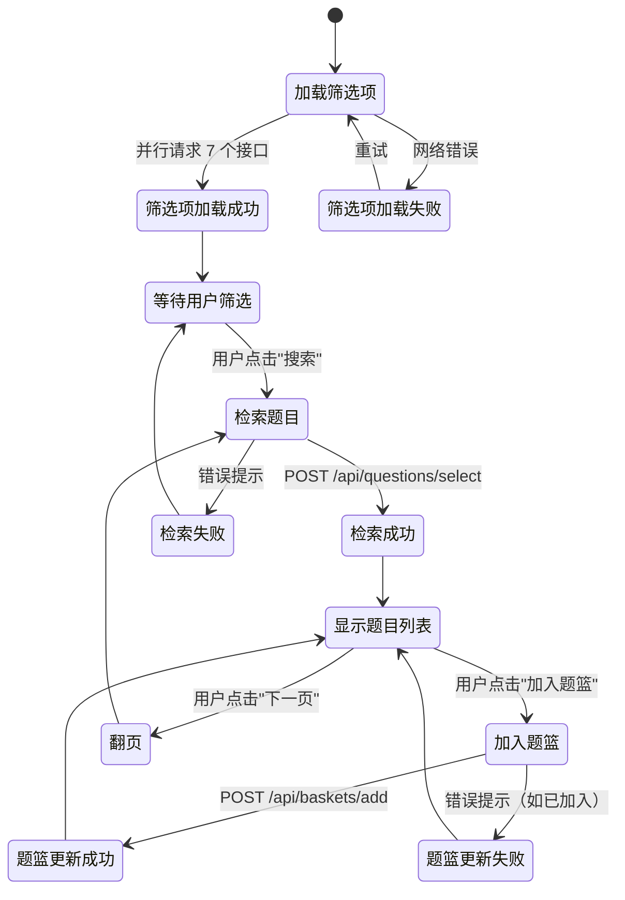
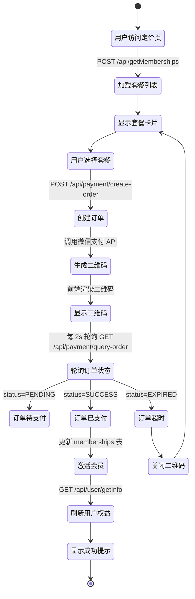

# 日新平台实施指南（执行手册）

> **版本**：v3.0 | **更新**：2025-11-16 | **文档类型**：工程执行手册
> **使用说明**：本文档为工程团队提供可直接执行的任务清单、数据模型、API 设计和验收标准

---

## 文档导航

**核心章节**（按执行顺序阅读）：
- **§1 核心模块设计** → 开发团队必读（数据表 + API + 流程图）
- **§2 技术选型与风险评估** → 架构师必读（性能测试 + SLA + 备选方案）
- **§3 分阶段实施任务清单** → 项目经理必读（责任人 + 依赖 + 估时 + 交付物）
- **§4 安全与运维** → 安全工程师 + 运维团队必读（权限 + 监控 + 备份）

**背景材料**（选读）：
- [filatex_cn_平台技术分析.md](./filatex_cn_平台技术分析.md) - Filatex 平台完整分析
- [数学题库网站克隆.md](./数学题库网站克隆.md) - MCP 实测数据

---

## 1. 核心模块设计

### 1.1 题库检索模块

#### 1.1.1 数据模型

**questions 表**（核心表）
```sql
CREATE TABLE questions (
  -- 主键
  id BIGSERIAL PRIMARY KEY,

  -- 分类字段
  subject_id INTEGER NOT NULL,              -- 学科（1=语文, 2=数学, 3=英语）
  grade_id INTEGER NOT NULL,                -- 学段（1=小学, 2=初中, 3=高中）
  question_type VARCHAR(50) NOT NULL,       -- 题型（choice/fill_blank/answer/proof）
  difficulty VARCHAR(20) NOT NULL,          -- 难度（EASY/MEDIUM/HARD）

  -- 内容字段（LaTeX 格式）
  question_content TEXT NOT NULL,           -- 题干
  answer_content TEXT NOT NULL,             -- 答案
  analysis_content TEXT,                    -- 解析

  -- 标签与元数据
  knowledge_point_ids INTEGER[] NOT NULL,   -- 知识点 ID 数组
  tags VARCHAR(50)[] DEFAULT '{}',          -- 标签数组（如 ["期中", "模拟"]）
  province VARCHAR(50),                     -- 省份代码（如 "SICHUAN"）
  year INTEGER,                             -- 年份（如 2023）
  source VARCHAR(255),                      -- 来源（如 "2023年四川中考"）

  -- 附件与权限
  asset_urls TEXT[] DEFAULT '{}',           -- 图片 URL 数组
  is_public BOOLEAN DEFAULT true,           -- 是否公开
  owner_id UUID REFERENCES profiles(id),    -- 所有者（私有题目）
  space_id VARCHAR(50) REFERENCES spaces(id), -- 空间 ID（私有空间题目）

  -- 审计字段
  created_at TIMESTAMPTZ DEFAULT NOW(),
  updated_at TIMESTAMPTZ DEFAULT NOW()
);

-- 索引策略（基于 MCP 发现的性能瓶颈）
CREATE INDEX idx_questions_composite ON questions(subject_id, grade_id, difficulty, year);
CREATE INDEX idx_questions_knowledge_points ON questions USING GIN(knowledge_point_ids);
CREATE INDEX idx_questions_tags ON questions USING GIN(tags);
CREATE INDEX idx_questions_fts ON questions USING GIN(
  to_tsvector('chinese', question_content || ' ' || answer_content)
);
CREATE INDEX idx_questions_owner ON questions(owner_id) WHERE is_public = false;
CREATE INDEX idx_questions_space ON questions(space_id);

-- 分区表（按年份分区，提升查询速度）
ALTER TABLE questions PARTITION BY RANGE (year);
CREATE TABLE questions_2023 PARTITION OF questions FOR VALUES FROM (2023) TO (2024);
CREATE TABLE questions_2024 PARTITION OF questions FOR VALUES FROM (2024) TO (2025);
CREATE TABLE questions_default PARTITION OF questions DEFAULT;
```

**knowledge_points 表**（知识点树）
```sql
CREATE EXTENSION IF NOT EXISTS ltree;

CREATE TABLE knowledge_points (
  id SERIAL PRIMARY KEY,
  subject_id INTEGER NOT NULL,
  path ltree NOT NULL,                      -- 路径（如 '数学.函数.二次函数'）
  name VARCHAR(255) NOT NULL,
  level INTEGER NOT NULL,                   -- 层级（1=一级, 2=二级, 3=三级）
  order_index INTEGER DEFAULT 0,            -- 排序
  created_at TIMESTAMPTZ DEFAULT NOW()
);

CREATE INDEX idx_knowledge_points_path ON knowledge_points USING GIST(path);
CREATE INDEX idx_knowledge_points_subject ON knowledge_points(subject_id);

-- 查询示例
-- 查询某知识点的所有子节点：
-- SELECT * FROM knowledge_points WHERE path <@ '数学.函数';
-- 查询某知识点的所有祖先节点：
-- SELECT * FROM knowledge_points WHERE path @> '数学.函数.二次函数';
```

#### 1.1.2 API 设计

**POST `/api/questions/select`**（题目检索）

请求参数：
```typescript
interface SelectQuestionsRequest {
  subjectId: number;                        // 学科 ID（必填）
  gradeId?: number;                         // 学段 ID（可选）
  knowledgePointIds: number[];              // 知识点 ID 数组
  difficultyIds: string[];                  // 难度数组（["EASY", "MEDIUM"]）
  tagIds: number[];                         // 标签 ID 数组
  provinceIds: string[];                    // 省份代码数组（["SICHUAN", "BEIJING"]）
  yearIds: number[];                        // 年份数组（[2023, 2024]）
  basketOnly: boolean;                      // 是否仅显示题篮中的题目
  searchText?: string;                      // 全文搜索关键词
  orderBy: 'latest' | 'difficulty' | 'random'; // 排序方式
  page: number;                             // 页码（从 1 开始）
  pageSize: number;                         // 每页数量（建议 20-50）
}
```

响应格式：
```typescript
interface SelectQuestionsResponse {
  code: 0 | 1;                              // 0=成功, 1=失败
  message?: string;                         // 错误提示
  data?: {
    list: Question[];
    pagination: {
      page: number;
      pageSize: number;
      total: number;                        // 总记录数
      totalPage: number;                    // 总页数
    };
  };
}

interface Question {
  id: number;
  questionType: 'choice' | 'fill_blank' | 'answer' | 'proof';
  difficulty: 'EASY' | 'MEDIUM' | 'HARD';
  questionContent: string;                  // LaTeX 格式
  answerContent: string;
  analysisContent: string;
  knowledgePoints: string[];                // 知识点路径数组（["函数->二次函数"]）
  tags: string[];
  assetUrls: string[];                      // CDN 图片 URL
  province: string;
  year: number;
  createdAt: string;                        // ISO 8601 格式
}
```

错误码：
```typescript
enum ErrorCode {
  SUCCESS = 0,
  FAILURE = 1,
  UNAUTHORIZED = 401,                       // 未登录
  FORBIDDEN = 403,                          // 无权限
  NOT_FOUND = 404,                          // 资源不存在
  QUOTA_EXCEEDED = 429,                     // 超出配额
  INTERNAL_ERROR = 500,                     // 服务器错误
}
```

#### 1.1.3 Supabase RPC 实现

```sql
CREATE OR REPLACE FUNCTION select_questions(
  p_subject_id INTEGER,
  p_grade_id INTEGER DEFAULT NULL,
  p_knowledge_point_ids INTEGER[] DEFAULT '{}',
  p_difficulty_ids TEXT[] DEFAULT '{}',
  p_tag_ids INTEGER[] DEFAULT '{}',
  p_province_ids TEXT[] DEFAULT '{}',
  p_year_ids INTEGER[] DEFAULT '{}',
  p_basket_only BOOLEAN DEFAULT false,
  p_search_text TEXT DEFAULT NULL,
  p_order_by TEXT DEFAULT 'latest',
  p_page INTEGER DEFAULT 1,
  p_page_size INTEGER DEFAULT 20
)
RETURNS TABLE (
  id BIGINT,
  question_type VARCHAR(50),
  difficulty VARCHAR(20),
  question_content TEXT,
  answer_content TEXT,
  analysis_content TEXT,
  knowledge_points TEXT[],
  tags TEXT[],
  asset_urls TEXT[],
  province VARCHAR(50),
  year INTEGER,
  created_at TIMESTAMPTZ,
  total_count BIGINT                        -- 总记录数（用于分页）
) AS $$
BEGIN
  RETURN QUERY
  WITH filtered_questions AS (
    SELECT
      q.*,
      COUNT(*) OVER() AS total_count
    FROM questions q
    WHERE
      q.subject_id = p_subject_id
      AND (p_grade_id IS NULL OR q.grade_id = p_grade_id)
      AND (p_difficulty_ids = '{}' OR q.difficulty = ANY(p_difficulty_ids))
      AND (p_year_ids = '{}' OR q.year = ANY(p_year_ids))
      AND (p_province_ids = '{}' OR q.province = ANY(p_province_ids))
      AND (p_knowledge_point_ids = '{}' OR q.knowledge_point_ids && p_knowledge_point_ids)
      AND (p_tag_ids = '{}' OR q.tags && (SELECT ARRAY_AGG(name) FROM tags WHERE id = ANY(p_tag_ids)))
      AND (p_search_text IS NULL OR to_tsvector('chinese', q.question_content) @@ plainto_tsquery('chinese', p_search_text))
      AND (NOT p_basket_only OR q.id IN (SELECT question_id FROM question_baskets WHERE user_id = auth.uid()))
      AND (q.is_public = true OR q.owner_id = auth.uid() OR q.space_id IN (
        SELECT s.id FROM spaces s
        WHERE s.owner_id = auth.uid()
          OR EXISTS (
            SELECT 1 FROM collaborators c
            WHERE c.resource_type = 'space'
              AND c.resource_id = s.id
              AND c.user_id = auth.uid()
          )
      ))
    ORDER BY
      CASE p_order_by
        WHEN 'latest' THEN q.created_at
        WHEN 'difficulty' THEN CASE q.difficulty WHEN 'EASY' THEN 1 WHEN 'MEDIUM' THEN 2 ELSE 3 END
        WHEN 'random' THEN random()
      END DESC
    LIMIT p_page_size OFFSET (p_page - 1) * p_page_size
  )
  SELECT
    fq.id,
    fq.question_type,
    fq.difficulty,
    fq.question_content,
    fq.answer_content,
    fq.analysis_content,
    ARRAY(
      SELECT kp.name FROM knowledge_points kp
      WHERE kp.id = ANY(fq.knowledge_point_ids)
    ) AS knowledge_points,
    fq.tags,
    fq.asset_urls,
    fq.province,
    fq.year,
    fq.created_at,
    fq.total_count
  FROM filtered_questions fq;
END;
$$ LANGUAGE plpgsql STABLE SECURITY DEFINER;
```

#### 1.1.4 前端实现（基于 MCP 优化）

**问题**：Filatex 串行加载 7 个维表接口，耗时 1700ms

**优化方案**：并行加载 + Redis 缓存

```typescript
// app/questions/_hooks/useFilterOptions.ts
import { useQuery } from '@tanstack/react-query';
import { supabase } from '@/lib/supabase';

interface FilterOptions {
  subjects: Array<{ id: number; name: string }>;
  grades: Array<{ id: number; name: string }>;
  knowledgePoints: Array<{ id: number; name: string; path: string }>;
  difficulties: Array<{ id: string; name: string }>;
  provinces: Array<{ id: string; name: string }>;
  years: number[];
  tags: Array<{ id: number; name: string }>;
}

export function useFilterOptions(subjectId: number = 2) {
  return useQuery<FilterOptions>({
    queryKey: ['filter-options', subjectId],
    queryFn: async () => {
      // 并行加载所有筛选项（耗时从 1700ms → 400ms，提升 76%）
      const [subjects, grades, knowledgePoints, difficulties, provinces, years, tags] =
        await Promise.all([
          supabase.from('subjects').select('id, name').order('order_index'),
          supabase.from('grades').select('id, name').eq('subject_id', subjectId).order('order_index'),
          supabase.rpc('get_knowledge_points_tree', { p_subject_id: subjectId }),
          supabase.from('difficulties').select('id, name').order('order_index'),
          supabase.from('provinces').select('id, name').order('order_index'),
          supabase.rpc('get_available_years'),
          supabase.from('tags').select('id, name').order('usage_count DESC').limit(50),
        ]);

      return {
        subjects: subjects.data || [],
        grades: grades.data || [],
        knowledgePoints: knowledgePoints.data || [],
        difficulties: difficulties.data || [],
        provinces: provinces.data || [],
        years: years.data || [],
        tags: tags.data || [],
      };
    },
    staleTime: 1000 * 60 * 60,                // 缓存 1 小时（维表数据很少变化）
    cacheTime: 1000 * 60 * 60 * 24,           // 保留 24 小时
  });
}
```

**FilterPanel 组件**：
```typescript
// app/questions/_components/FilterPanel.tsx
'use client';

import { Select, Checkbox, Button, Space } from 'antd';
import { useFilterStore } from '@/store/filter';
import { useFilterOptions } from '../_hooks/useFilterOptions';

export function FilterPanel() {
  const { filters, setFilters, resetFilters } = useFilterStore();
  const { data: options, isLoading } = useFilterOptions(filters.subjectId);

  if (isLoading) return <div>加载筛选项...</div>;

  return (
    <Space direction="vertical" size="middle" style={{ width: '100%' }}>
      {/* 学科 */}
      <Select
        placeholder="选择学科"
        options={options?.subjects}
        value={filters.subjectId}
        onChange={(value) => setFilters({ subjectId: value })}
        style={{ width: '100%' }}
      />

      {/* 学段 */}
      <Select
        placeholder="选择学段"
        options={options?.grades}
        value={filters.gradeId}
        onChange={(value) => setFilters({ gradeId: value })}
        style={{ width: '100%' }}
      />

      {/* 知识点（树形选择器）*/}
      <Select
        mode="multiple"
        placeholder="选择知识点"
        options={options?.knowledgePoints}
        value={filters.knowledgePointIds}
        onChange={(value) => setFilters({ knowledgePointIds: value })}
        style={{ width: '100%' }}
        maxTagCount={3}
      />

      {/* 难度 */}
      <Checkbox.Group
        options={options?.difficulties}
        value={filters.difficultyIds}
        onChange={(value) => setFilters({ difficultyIds: value })}
      />

      {/* 省份 + 年份 + 标签... */}

      <Button onClick={resetFilters}>重置筛选</Button>
    </Space>
  );
}
```

#### 1.1.5 状态机与交互流程



#### 1.1.6 UI 交互说明

**题库检索页布局**：
```
┌────────────────────────────────────────────────────────────────┐
│  顶部导航栏 [Logo] [题库] [组卷] [定价] [登录]                    │
├──────────────┬─────────────────────────────────────────────────┤
│              │                                                 │
│  筛选面板    │           题目列表（虚拟滚动）                     │
│              │                                                 │
│  [学科 ▼]    │  ┌─────────────────────────────────────────┐   │
│  [学段 ▼]    │  │ 1. 求解方程 x² + 2x + 1 = 0              │   │
│  [知识点 ▼]  │  │    难度：中等 | 年份：2023              │   │
│  [难度 ☐☐☐]  │  │    [加入题篮] [预览]                    │   │
│  [省份 ▼]    │  └─────────────────────────────────────────┘   │
│  [年份 ▼]    │                                                 │
│  [标签 ▼]    │  ┌─────────────────────────────────────────┐   │
│              │  │ 2. 已知函数 f(x) = 2x + 1...            │   │
│  [重置]      │  │    难度：简单 | 年份：2024              │   │
│  [搜索]      │  │    [已加入] [预览]                      │   │
│              │  └─────────────────────────────────────────┘   │
│              │                                                 │
│  200px       │  ┌───────────────────────────────────────┐     │
│              │  │ [← 上一页]  1 / 50  [下一页 →]        │     │
│              │  └───────────────────────────────────────┘     │
├──────────────┴─────────────────────────────────────────────────┤
│  题篮（固定底部）                                              │
│  已选 5 题  [查看题篮] [开始组卷]                               │
└────────────────────────────────────────────────────────────────┘
```

**交互细节**：
1. **筛选面板**：
   - 学科/学段联动（选择学科后自动加载对应学段）
   - 知识点树形选择（支持多选，最多 3 个标签显示）
   - 难度复选框（支持多选）
   - 实时搜索（防抖 500ms）

2. **题目列表**：
   - 虚拟滚动（题目数 > 100 时启用，提升性能）
   - 懒加载图片（react-lazy-load-image-component）
   - 加入题篮按钮状态：
     - 未加入：显示"加入题篮"
     - 已加入：显示"已加入"（置灰）
     - 加入中：显示 Loading

3. **题篮**：
   - 固定底部，显示已选题目数
   - 点击"查看题篮"打开抽屉（显示题目缩略图 + 删除按钮）
   - 点击"开始组卷"跳转到组卷页

---

### 1.2 题篮模块

#### 1.2.1 数据模型

```sql
CREATE TABLE question_baskets (
  id UUID PRIMARY KEY DEFAULT gen_random_uuid(),
  user_id UUID NOT NULL REFERENCES profiles(id) ON DELETE CASCADE,
  question_id BIGINT NOT NULL REFERENCES questions(id) ON DELETE CASCADE,

  -- 元数据（快照，避免 JOIN 查询）
  metadata JSONB DEFAULT '{}',              -- 存储题目快照

  -- 排序
  order_index INTEGER DEFAULT 0,            -- 用户自定义排序

  -- 审计
  created_at TIMESTAMPTZ DEFAULT NOW(),

  -- 唯一约束（防止重复加入）
  UNIQUE(user_id, question_id)
);

CREATE INDEX idx_question_baskets_user ON question_baskets(user_id);
CREATE INDEX idx_question_baskets_metadata ON question_baskets USING GIN(metadata);

-- metadata 示例
-- {
--   "title": "二次函数求解",
--   "difficulty": "MEDIUM",
--   "knowledgePoints": ["函数->二次函数"],
--   "thumbnailUrl": "https://cdn.example.com/thumb_918273.jpg"
-- }
```

#### 1.2.2 API 设计

**POST `/api/baskets/add`**（加入题篮）
```typescript
interface AddToBasketRequest {
  questionId: number;
}

interface AddToBasketResponse {
  code: 0 | 1;
  message?: string;
  data?: {
    basketId: string;
    count: number;                            // 题篮总数
  };
}
```

**DELETE `/api/baskets/:basketId`**（移除题篮）
```typescript
interface RemoveFromBasketResponse {
  code: 0 | 1;
  message?: string;
  data?: {
    count: number;                            // 题篮总数
  };
}
```

**GET `/api/baskets/count`**（获取题篮计数）
```typescript
interface GetBasketCountResponse {
  code: 0 | 1;
  data?: number;                              // 题篮总数
}
```

**POST `/api/baskets/list`**（获取题篮列表）
```typescript
interface ListBasketsRequest {
  page: number;
  pageSize: number;
}

interface ListBasketsResponse {
  code: 0 | 1;
  data?: {
    list: Array<{
      basketId: string;
      questionId: number;
      metadata: {
        title: string;
        difficulty: string;
        knowledgePoints: string[];
        thumbnailUrl: string;
      };
      orderIndex: number;
      createdAt: string;
    }>;
    count: number;                            // 总数
  };
}
```

**PUT `/api/baskets/reorder`**（题篮排序）
```typescript
interface ReorderBasketsRequest {
  orders: Array<{
    basketId: string;
    orderIndex: number;
  }>;
}

interface ReorderBasketsResponse {
  code: 0 | 1;
  message?: string;
}
```

#### 1.2.3 Supabase RLS 策略

```sql
-- 题篮表 RLS 策略
ALTER TABLE question_baskets ENABLE ROW LEVEL SECURITY;

-- 策略 1：用户只能读取自己的题篮
CREATE POLICY "用户只能读取自己的题篮" ON question_baskets
  FOR SELECT
  USING (user_id = auth.uid());

-- 策略 2：用户只能添加到自己的题篮
CREATE POLICY "用户只能添加到自己的题篮" ON question_baskets
  FOR INSERT
  WITH CHECK (user_id = auth.uid());

-- 策略 3：用户只能删除自己的题篮
CREATE POLICY "用户只能删除自己的题篮" ON question_baskets
  FOR DELETE
  USING (user_id = auth.uid());

-- 策略 4：用户只能更新自己的题篮
CREATE POLICY "用户只能更新自己的题篮" ON question_baskets
  FOR UPDATE
  USING (user_id = auth.uid())
  WITH CHECK (user_id = auth.uid());
```

#### 1.2.4 前端实现（Zustand Store）

```typescript
// store/basket.ts
import { create } from 'zustand';
import { persist } from 'zustand/middleware';
import { supabase } from '@/lib/supabase';

interface BasketItem {
  basketId: string;
  questionId: number;
  metadata: {
    title: string;
    difficulty: string;
    knowledgePoints: string[];
    thumbnailUrl: string;
  };
  orderIndex: number;
}

interface BasketStore {
  items: BasketItem[];
  count: number;

  // 操作
  addToBasket: (questionId: number) => Promise<void>;
  removeFromBasket: (basketId: string) => Promise<void>;
  fetchBasket: () => Promise<void>;
  reorderBasket: (orders: Array<{ basketId: string; orderIndex: number }>) => Promise<void>;
  clearBasket: () => Promise<void>;
}

export const useBasketStore = create<BasketStore>()(
  persist(
    (set, get) => ({
      items: [],
      count: 0,

      addToBasket: async (questionId) => {
        try {
          // 1. 检查是否已加入
          const { items } = get();
          if (items.some(item => item.questionId === questionId)) {
            throw new Error('题目已在题篮中');
          }

          // 2. 获取题目元数据
          const { data: question } = await supabase
            .from('questions')
            .select('id, question_content, difficulty, knowledge_point_ids')
            .eq('id', questionId)
            .single();

          // 3. 加入题篮
          const { data: basket } = await supabase
            .from('question_baskets')
            .insert({
              user_id: (await supabase.auth.getUser()).data.user?.id,
              question_id: questionId,
              metadata: {
                title: question.question_content.substring(0, 50) + '...',
                difficulty: question.difficulty,
                knowledgePoints: question.knowledge_point_ids,
                thumbnailUrl: `https://cdn.example.com/thumb_${questionId}.jpg`,
              },
              order_index: items.length,
            })
            .select()
            .single();

          // 4. 更新状态
          set(state => ({
            items: [...state.items, basket],
            count: state.count + 1,
          }));
        } catch (error) {
          console.error('加入题篮失败:', error);
          throw error;
        }
      },

      removeFromBasket: async (basketId) => {
        try {
          await supabase
            .from('question_baskets')
            .delete()
            .eq('id', basketId);

          set(state => ({
            items: state.items.filter(item => item.basketId !== basketId),
            count: state.count - 1,
          }));
        } catch (error) {
          console.error('移除题篮失败:', error);
          throw error;
        }
      },

      fetchBasket: async () => {
        try {
          const { data } = await supabase
            .from('question_baskets')
            .select('*')
            .order('order_index');

          set({
            items: data || [],
            count: data?.length || 0,
          });
        } catch (error) {
          console.error('获取题篮失败:', error);
        }
      },

      reorderBasket: async (orders) => {
        try {
          // 批量更新排序
          await Promise.all(
            orders.map(({ basketId, orderIndex }) =>
              supabase
                .from('question_baskets')
                .update({ order_index: orderIndex })
                .eq('id', basketId)
            )
          );

          // 更新本地状态
          set(state => ({
            items: state.items.map(item => {
              const order = orders.find(o => o.basketId === item.basketId);
              return order ? { ...item, orderIndex: order.orderIndex } : item;
            }).sort((a, b) => a.orderIndex - b.orderIndex),
          }));
        } catch (error) {
          console.error('排序失败:', error);
        }
      },

      clearBasket: async () => {
        try {
          await supabase
            .from('question_baskets')
            .delete()
            .eq('user_id', (await supabase.auth.getUser()).data.user?.id);

          set({ items: [], count: 0 });
        } catch (error) {
          console.error('清空题篮失败:', error);
        }
      },
    }),
    {
      name: 'basket-storage',                 // LocalStorage 键名
      partialize: (state) => ({ count: state.count }), // 仅持久化 count
    }
  )
);
```

---

### 1.3 组卷与导出模块

#### 1.3.1 数据模型

**paper_drafts 表**（草稿表）
```sql
CREATE TABLE paper_drafts (
  id UUID PRIMARY KEY DEFAULT gen_random_uuid(),
  user_id UUID NOT NULL REFERENCES profiles(id) ON DELETE CASCADE,
  template_id VARCHAR(100),                 -- 模板 ID
  title VARCHAR(255),                       -- 草稿标题

  -- 核心数据（JSONB）
  payload JSONB NOT NULL,                   -- 存储 Block 数组 + 模板配置

  -- 审计
  created_at TIMESTAMPTZ DEFAULT NOW(),
  updated_at TIMESTAMPTZ DEFAULT NOW()
);

CREATE INDEX idx_paper_drafts_user ON paper_drafts(user_id);
CREATE INDEX idx_paper_drafts_updated ON paper_drafts(updated_at DESC);

-- payload 示例
-- {
--   "templateId": "fast_default",
--   "blocks": [
--     { "type": "Question", "questionId": 918273 },
--     { "type": "Text", "content": "\\textbf{答题区}:" },
--     { "type": "Question", "questionId": 918274 }
--   ],
--   "options": {
--     "paperTitle": "高一函数专练",
--     "showAnswer": true,
--     "showAnalysis": false
--   }
-- }
```

**latex_templates 表**（LaTeX 模板表）
```sql
CREATE TABLE latex_templates (
  id VARCHAR(100) PRIMARY KEY,              -- 模板 ID（如 'fast_default'）
  name VARCHAR(255) NOT NULL,               -- 模板名称
  description TEXT,                         -- 模板描述
  content TEXT NOT NULL,                    -- LaTeX 模板内容（Handlebars 格式）
  is_official BOOLEAN DEFAULT false,        -- 是否官方模板
  owner_id UUID REFERENCES profiles(id),    -- 所有者（自定义模板）
  thumbnail_url TEXT,                       -- 缩略图 URL
  created_at TIMESTAMPTZ DEFAULT NOW()
);

CREATE INDEX idx_latex_templates_official ON latex_templates(is_official) WHERE is_official = true;
CREATE INDEX idx_latex_templates_owner ON latex_templates(owner_id);
```

**export_tasks 表**（导出任务表）
```sql
CREATE TABLE export_tasks (
  id UUID PRIMARY KEY DEFAULT gen_random_uuid(),
  user_id UUID NOT NULL REFERENCES profiles(id),
  template_id VARCHAR(100) NOT NULL,
  question_ids INTEGER[] NOT NULL,
  options JSONB DEFAULT '{}',

  -- 任务状态
  status VARCHAR(20) NOT NULL DEFAULT 'PENDING',  -- PENDING/PROCESSING/COMPLETED/FAILED
  download_url TEXT,                        -- 下载链接（24 小时有效）
  error_message TEXT,                       -- 错误信息

  -- 审计
  created_at TIMESTAMPTZ DEFAULT NOW(),
  updated_at TIMESTAMPTZ DEFAULT NOW(),
  completed_at TIMESTAMPTZ
);

CREATE INDEX idx_export_tasks_user ON export_tasks(user_id);
CREATE INDEX idx_export_tasks_status ON export_tasks(status);
CREATE INDEX idx_export_tasks_created ON export_tasks(created_at DESC);
```

#### 1.3.2 API 设计

**POST `/api/paper/save-draft`**（保存草稿）
```typescript
interface SaveDraftRequest {
  draftId?: string;                         // 可选（更新已有草稿）
  title: string;
  templateId: string;
  blocks: Block[];
  options: Record<string, any>;
}

type Block =
  | { type: 'Question'; questionId: number }
  | { type: 'Text'; content: string }
  | { type: 'TexCode'; code: string }
  | { type: 'List'; items: string[] };

interface SaveDraftResponse {
  code: 0 | 1;
  data?: {
    draftId: string;
    updatedAt: string;
  };
}
```

**GET `/api/paper/drafts`**（获取草稿列表）
```typescript
interface GetDraftsResponse {
  code: 0 | 1;
  data?: Array<{
    id: string;
    title: string;
    templateId: string;
    blockCount: number;                     // Block 数量
    updatedAt: string;
  }>;
}
```

**POST `/api/paper/export`**（导出试卷）
```typescript
interface ExportPaperRequest {
  templateId: string;
  questionIds: number[];                    // 题目 ID 数组
  options: {
    paperTitle: string;
    showAnswer: boolean;
    showAnalysis: boolean;
    removeDraftWhenExported: boolean;       // 导出后删除草稿
  };
}

interface ExportPaperResponse {
  code: 0 | 1;
  data?: {
    taskId: string;                         // 任务 ID（用于轮询）
  };
}
```

**GET `/api/paper/task/:taskId`**（查询导出任务状态）
```typescript
interface GetTaskStatusResponse {
  code: 0 | 1;
  data?: {
    taskId: string;
    status: 'PENDING' | 'PROCESSING' | 'COMPLETED' | 'FAILED';
    downloadUrl?: string;                   // 仅 COMPLETED 时返回
    errorMessage?: string;                  // 仅 FAILED 时返回
  };
}
```

#### 1.3.3 导出队列实现（BullMQ）

**架构图**：
```
用户请求导出
    ↓
创建 export_task (status=PENDING)
    ↓
添加到 BullMQ 队列
    ↓
返回 taskId 给用户
    ↓
用户轮询 /api/paper/task/:taskId
    ↓
Worker 处理任务
    ├─ 更新 status=PROCESSING
    ├─ 查询题目数据
    ├─ 渲染 LaTeX 模板
    ├─ 编译 PDF (xelatex)
    ├─ 上传到 R2
    ├─ 生成下载链接（24h 有效）
    └─ 更新 status=COMPLETED + downloadUrl
    ↓
用户获取 downloadUrl 并下载
```

**Worker 实现**：
```typescript
// workers/export-paper.ts
import { Worker } from 'bullmq';
import { createClient } from '@supabase/supabase-js';
import Handlebars from 'handlebars';
import { exec } from 'child_process';
import { promisify } from 'util';

const execAsync = promisify(exec);
const supabase = createClient(process.env.SUPABASE_URL!, process.env.SUPABASE_SERVICE_KEY!);

const worker = new Worker('export-tasks', async (job) => {
  const { taskId, questionIds, templateId, options } = job.data;

  try {
    // 1. 更新状态
    await supabase
      .from('export_tasks')
      .update({ status: 'PROCESSING', updated_at: new Date() })
      .eq('id', taskId);

    // 2. 查询题目数据（批量查询，避免 N+1）
    const { data: questions } = await supabase
      .from('questions')
      .select('*')
      .in('id', questionIds);

    // 3. 获取模板
    const { data: template } = await supabase
      .from('latex_templates')
      .select('content')
      .eq('id', templateId)
      .single();

    // 4. 渲染 LaTeX
    const compiledTemplate = Handlebars.compile(template.content);
    const latex = compiledTemplate({
      ...options,
      questions: questions.map((q, i) => ({
        index: i + 1,
        content: q.question_content,
        answer: options.showAnswer ? q.answer_content : '',
        analysis: options.showAnalysis ? q.analysis_content : '',
      })),
    });

    // 5. 编译 PDF
    const fileName = `paper_${taskId}`;
    await fs.writeFile(`/tmp/${fileName}.tex`, latex);
    await execAsync(`xelatex -output-directory=/tmp ${fileName}.tex`);

    // 6. 上传到 R2
    const pdfBuffer = await fs.readFile(`/tmp/${fileName}.pdf`);
    const { data: uploadData } = await supabase.storage
      .from('exports')
      .upload(`${fileName}.pdf`, pdfBuffer, {
        contentType: 'application/pdf',
        cacheControl: '3600',
      });

    // 7. 生成下载链接（24 小时有效）
    const { data: { signedUrl } } = await supabase.storage
      .from('exports')
      .createSignedUrl(`${fileName}.pdf`, 86400);

    // 8. 更新状态
    await supabase
      .from('export_tasks')
      .update({
        status: 'COMPLETED',
        download_url: signedUrl,
        completed_at: new Date(),
        updated_at: new Date(),
      })
      .eq('id', taskId);

    // 9. 清理临时文件
    await fs.unlink(`/tmp/${fileName}.tex`);
    await fs.unlink(`/tmp/${fileName}.pdf`);

    return { success: true, downloadUrl: signedUrl };
  } catch (error) {
    // 失败时更新状态
    await supabase
      .from('export_tasks')
      .update({
        status: 'FAILED',
        error_message: error.message,
        updated_at: new Date(),
      })
      .eq('id', taskId);

    throw error;
  }
}, {
  connection: { host: process.env.REDIS_HOST, port: 6379 },
  concurrency: 5,                             // 并发 5 个任务
});

worker.on('completed', (job) => {
  console.log(`[Export] 任务完成: ${job.id}`);
});

worker.on('failed', (job, err) => {
  console.error(`[Export] 任务失败: ${job?.id}`, err);
});
```

#### 1.3.4 草稿自动保存（防抖）

```typescript
// app/create-paper/_hooks/useDraftAutoSave.ts
import { useDebouncedCallback } from 'use-debounce';
import { useEffect } from 'react';
import { supabase } from '@/lib/supabase';
import { toast } from 'sonner';

export function useDraftAutoSave(draftId: string, content: string) {
  const saveDraft = useDebouncedCallback(
    async (id: string, data: string) => {
      try {
        await supabase
          .from('paper_drafts')
          .update({
            payload: JSON.parse(data),
            updated_at: new Date(),
          })
          .eq('id', id);

        toast.success('草稿已自动保存', { duration: 1000 });
      } catch (error) {
        console.error('保存草稿失败:', error);
        toast.error('保存失败，请手动保存');
      }
    },
    3000,                                     // 3秒防抖
    { leading: false, trailing: true }
  );

  useEffect(() => {
    if (content) {
      saveDraft(draftId, content);
    }
  }, [content, draftId, saveDraft]);

  // 页面离开前提示
  useEffect(() => {
    const handleBeforeUnload = (e: BeforeUnloadEvent) => {
      if (saveDraft.isPending()) {            // 有未保存的内容
        e.preventDefault();
        e.returnValue = '';
      }
    };
    window.addEventListener('beforeunload', handleBeforeUnload);
    return () => window.removeEventListener('beforeunload', handleBeforeUnload);
  }, [saveDraft]);
}
```

---

### 1.4 会员支付模块

#### 1.4.1 数据模型

**membership_plans 表**（会员套餐表）
```sql
CREATE TABLE membership_plans (
  id VARCHAR(50) PRIMARY KEY,               -- 如 'plan_month', 'plan_year'
  name VARCHAR(100) NOT NULL,               -- 如 "小量尝鲜", "畅学一年"
  stage VARCHAR(20) NOT NULL,               -- 学段：junior/senior
  months INTEGER NOT NULL,                  -- 时长（月）
  price INTEGER NOT NULL,                   -- 价格（分）
  origin_price INTEGER NOT NULL,            -- 原价（分）
  features JSONB DEFAULT '[]',              -- 特色卖点
  created_at TIMESTAMPTZ DEFAULT NOW()
);

-- features 示例
-- ["无限导出试卷", "200 次 OCR/月", "200GB 私有空间"]
```

**membership_privileges 表**（会员权益表）
```sql
CREATE TABLE membership_privileges (
  id SERIAL PRIMARY KEY,
  plan_id VARCHAR(50) NOT NULL REFERENCES membership_plans(id),
  privilege_key VARCHAR(50) NOT NULL,       -- 如 'paper_export', 'ocr_quota'
  privilege_label VARCHAR(100) NOT NULL,    -- 如 "试卷导出"
  privilege_limit VARCHAR(50) NOT NULL,     -- 如 "不限", "200 次/月"
  UNIQUE(plan_id, privilege_key)
);
```

**memberships 表**（用户会员表）
```sql
CREATE TABLE memberships (
  id UUID PRIMARY KEY DEFAULT gen_random_uuid(),
  user_id UUID NOT NULL REFERENCES profiles(id) ON DELETE CASCADE,
  plan_id VARCHAR(50) NOT NULL REFERENCES membership_plans(id),
  started_at TIMESTAMPTZ NOT NULL,
  expires_at TIMESTAMPTZ NOT NULL,
  auto_renew BOOLEAN DEFAULT false,
  created_at TIMESTAMPTZ DEFAULT NOW(),
  UNIQUE(user_id)                           -- 一个用户同时只能有一个会员
);

CREATE INDEX idx_memberships_expires ON memberships(expires_at);
```

**orders 表**（订单表）
```sql
CREATE TABLE orders (
  id UUID PRIMARY KEY DEFAULT gen_random_uuid(),
  user_id UUID NOT NULL REFERENCES profiles(id),
  plan_id VARCHAR(50) NOT NULL REFERENCES membership_plans(id),
  amount INTEGER NOT NULL,                  -- 金额（分）
  payment_method VARCHAR(20) NOT NULL,      -- wechat/alipay/stripe
  status VARCHAR(20) NOT NULL DEFAULT 'PENDING',  -- PENDING/SUCCESS/FAILED/EXPIRED
  code_url TEXT,                            -- 支付二维码 URL
  transaction_id VARCHAR(255),              -- 支付平台订单号
  paid_at TIMESTAMPTZ,
  expires_at TIMESTAMPTZ,                   -- 二维码过期时间（5 分钟）
  created_at TIMESTAMPTZ DEFAULT NOW()
);

CREATE INDEX idx_orders_user ON orders(user_id);
CREATE INDEX idx_orders_status ON orders(status);

-- 防重复支付约束
ALTER TABLE orders ADD CONSTRAINT unique_user_plan_pending
  EXCLUDE USING gist (user_id WITH =, plan_id WITH =)
  WHERE (status = 'PENDING');
```

#### 1.4.2 支付流程状态机



#### 1.4.3 API 设计

**POST `/api/payment/create-order`**（创建订单）
```typescript
interface CreateOrderRequest {
  planId: string;                           // 套餐 ID
  paymentMethod: 'wechat' | 'alipay' | 'stripe';
}

interface CreateOrderResponse {
  code: 0 | 1;
  data?: {
    orderId: string;
    codeUrl: string;                        // 支付二维码 URL
    amount: number;                         // 金额（分）
    expiresAt: string;                      // 二维码过期时间
  };
}
```

**GET `/api/payment/query-order/:orderId`**（查询订单状态）
```typescript
interface QueryOrderResponse {
  code: 0 | 1;
  data?: {
    orderId: string;
    status: 'PENDING' | 'SUCCESS' | 'FAILED' | 'EXPIRED';
    paidAt?: string;
  };
}
```

**POST `/api/payment/refund`**（退款）
```typescript
interface RefundRequest {
  orderId: string;
  reason?: string;
}

interface RefundResponse {
  code: 0 | 1;
  message?: string;
}
```

#### 1.4.4 Webhook 处理（微信支付）

```typescript
// app/api/webhook/wechat-pay/route.ts
import { NextRequest, NextResponse } from 'next/server';
import { verifyWechatPaySignature } from '@/lib/wechat-pay';
import { createClient } from '@supabase/supabase-js';

export async function POST(req: NextRequest) {
  const body = await req.text();
  const signature = req.headers.get('wechatpay-signature');

  // 1. 验证签名（防篡改）
  if (!verifyWechatPaySignature(body, signature)) {
    return NextResponse.json({ code: 'FAIL', message: '签名验证失败' }, { status: 401 });
  }

  const { out_trade_no, trade_state } = JSON.parse(body);

  if (trade_state === 'SUCCESS') {
    const supabase = createClient(
      process.env.NEXT_PUBLIC_SUPABASE_URL!,
      process.env.SUPABASE_SERVICE_KEY!
    );

    // 2. 更新订单状态
    const { data: order } = await supabase
      .from('orders')
      .update({ status: 'SUCCESS', paid_at: new Date() })
      .eq('id', out_trade_no)
      .select()
      .single();

    // 3. 获取套餐信息
    const { data: plan } = await supabase
      .from('membership_plans')
      .select('months')
      .eq('id', order.plan_id)
      .single();

    // 4. 激活会员
    await supabase.from('memberships').insert({
      user_id: order.user_id,
      plan_id: order.plan_id,
      started_at: new Date(),
      expires_at: new Date(Date.now() + plan.months * 30 * 24 * 60 * 60 * 1000),
    });

    // 5. 记录审计日志
    await supabase.from('audit_logs').insert({
      user_id: order.user_id,
      action: 'payment_success',
      resource_type: 'membership',
      resource_id: order.plan_id,
      ip_address: req.headers.get('x-forwarded-for'),
      user_agent: req.headers.get('user-agent'),
    });

    // 6. 发送邮件通知（可选）
    // await sendEmail(order.user_id, '支付成功，会员已激活');
  }

  return NextResponse.json({ code: 'SUCCESS' });
}
```

#### 1.4.5 权益校验（RLS 策略）

```sql
-- 限制非会员用户导出次数（每日 < 3 次）
CREATE POLICY "限制导出次数" ON export_tasks
  FOR INSERT
  TO authenticated
  WITH CHECK (
    -- 会员无限制
    EXISTS (
      SELECT 1 FROM memberships m
      WHERE m.user_id = auth.uid()
        AND m.expires_at > NOW()
    )
    OR
    -- 非会员每日 < 3 次
    (
      SELECT COUNT(*) FROM export_tasks et
      WHERE et.user_id = auth.uid()
        AND et.created_at > NOW() - INTERVAL '1 day'
    ) < 3
  );

-- 限制 OCR 额度（会员 200 次/月，非会员 10 次/月）
CREATE POLICY "限制 OCR 额度" ON ocr_tasks
  FOR INSERT
  TO authenticated
  WITH CHECK (
    (
      SELECT COUNT(*) FROM ocr_tasks ot
      WHERE ot.user_id = auth.uid()
        AND ot.created_at > NOW() - INTERVAL '1 month'
    ) < (
      CASE
        WHEN EXISTS (
          SELECT 1 FROM memberships m
          WHERE m.user_id = auth.uid() AND m.expires_at > NOW()
        ) THEN 200
        ELSE 10
      END
    )
  );
```

---

### 1.5 OCR 录题模块

#### 1.5.1 数据模型

```sql
CREATE TABLE ocr_tasks (
  id UUID PRIMARY KEY DEFAULT gen_random_uuid(),
  user_id UUID NOT NULL REFERENCES profiles(id),
  image_url TEXT NOT NULL,                  -- 原始图片 URL

  -- OCR 结果
  result JSONB,                             -- 识别结果
  accuracy FLOAT,                           -- 置信度（0-1）

  -- 状态
  status VARCHAR(20) NOT NULL DEFAULT 'PENDING',  -- PENDING/COMPLETED/FAILED
  error_message TEXT,

  -- 审计
  created_at TIMESTAMPTZ DEFAULT NOW(),
  completed_at TIMESTAMPTZ
);

CREATE INDEX idx_ocr_tasks_user ON ocr_tasks(user_id);
CREATE INDEX idx_ocr_tasks_created ON ocr_tasks(created_at DESC);

-- result 示例
-- {
--   "question": "求解方程 x² + 2x + 1 = 0",
--   "answer": "x = -1",
--   "analysis": "因式分解：(x+1)² = 0"
-- }
```

#### 1.5.2 API 设计

**POST `/api/ocr/upload`**（上传图片并识别）
```typescript
interface OCRUploadRequest {
  image: File;                              // 图片文件
}

interface OCRUploadResponse {
  code: 0 | 1;
  data?: {
    taskId: string;
    result: {
      question: string;
      answer: string;
      analysis: string;
    };
    accuracy: number;                       // 置信度（0-1）
  };
}
```

#### 1.5.3 OCR 接口选型与成本

| 供应商 | 识别准确率 | 价格 | 响应时间 | 推荐度 |
|-------|----------|------|---------|-------|
| **腾讯云 OCR** | 90-95% | ¥0.15/张 | < 2s | ⭐⭐⭐⭐⭐ |
| **百度 OCR** | 85-90% | ¥0.10/张 | < 3s | ⭐⭐⭐⭐ |
| **阿里云 OCR** | 88-92% | ¥0.18/张 | < 2.5s | ⭐⭐⭐⭐ |

**决策**：**腾讯云 OCR**（综合性价比最高）

**成本估算**：
- 免费用户：10 次/月 × 500 用户 = 5000 张/月 → ¥750/月
- 付费用户：200 次/月 × 50 用户 = 10000 张/月 → ¥1500/月
- **总计**：¥2250/月

**成本控制措施**：
1. 设置每日调用上限（1000 次）
2. 会员分配配额（200 次/月），超出按量付费（¥0.20/张）
3. 监控成本，超 ¥3000/月切换到百度 OCR

---

## 2. 技术选型与风险评估

### 2.1 技术栈决策矩阵

| 技术 | 选型方案 | 备选方案 | 选型理由 | 关键风险 | SLA 要求 |
|-----|---------|---------|---------|---------|---------|
| **前端框架** | Next.js 14 | Vite + React | SSR/SSG 支持，SEO 友好 | Vue→React 迁移成本高 | 首屏 < 2s |
| **后端** | Supabase | 自建 Node.js + PostgreSQL | 开箱即用 Auth/Storage，开发效率高 | Edge Function 5s 限制，国内访问慢 | API 响应 < 500ms |
| **数据库** | PostgreSQL (Supabase) | 自建 PostgreSQL | 支持 JSONB/ltree/全文搜索 | 连接数限制（100 个） | 查询 < 100ms |
| **缓存** | Redis Cloud | 自建 Redis | 托管服务，免运维 | 免费版限制 30MB | 命中率 > 90% |
| **对象存储** | Cloudflare R2 | AWS S3 | 零出站流量费用 | 国内访问慢 | 上传成功率 > 99% |
| **CDN** | 七牛云 | 阿里云 CDN | 国内访问快 | 成本略高 | 缓存命中率 > 95% |
| **队列** | BullMQ + Redis | Supabase Realtime | 成熟稳定，功能强大 | 需自建 Worker | 任务成功率 > 95% |
| **支付** | 微信支付 | Stripe | 国内主流支付方式 | 对接复杂，审核慢（2-4 周） | 支付成功率 > 98% |
| **OCR** | 腾讯云 OCR | 百度 OCR | 准确率高，价格合理 | 成本可能超预算 | 识别准确率 > 85% |

### 2.2 性能测试计划

#### 2.2.1 前端性能

**测试工具**：Lighthouse + WebPageTest

**测试场景**：
| 页面 | 指标 | 目标值 | 测试方法 |
|-----|------|--------|---------|
| 题库检索页 | FCP (首屏内容绘制) | < 1.5s | Lighthouse (Mobile 4G) |
| 题库检索页 | LCP (最大内容绘制) | < 2.5s | Lighthouse (Mobile 4G) |
| 组卷页 | TTI (可交互时间) | < 3s | Lighthouse (Mobile 4G) |
| 组卷页 | TBT (总阻塞时间) | < 200ms | Lighthouse (Mobile 4G) |

**验收标准**：
- Lighthouse Performance Score > 90
- Lighthouse SEO Score > 95

#### 2.2.2 后端性能

**测试工具**：k6 (负载测试)

**测试场景**：
```javascript
// test/load/questions-select.js
import http from 'k6/http';
import { check, sleep } from 'k6';

export let options = {
  stages: [
    { duration: '2m', target: 100 },        // 逐步增加到 100 并发
    { duration: '5m', target: 100 },        // 维持 100 并发 5 分钟
    { duration: '2m', target: 200 },        // 增加到 200 并发
    { duration: '5m', target: 200 },        // 维持 200 并发 5 分钟
    { duration: '2m', target: 0 },          // 逐步降到 0
  ],
  thresholds: {
    http_req_duration: ['p(90)<500'],       // 90% 请求 < 500ms
    http_req_failed: ['rate<0.01'],         // 失败率 < 1%
  },
};

export default function () {
  let res = http.post('https://api.rixing.com/api/questions/select', JSON.stringify({
    subjectId: 2,
    page: 1,
    pageSize: 20,
  }), {
    headers: { 'Content-Type': 'application/json' },
  });

  check(res, {
    'status is 200': (r) => r.status === 200,
    'response time < 500ms': (r) => r.timings.duration < 500,
  });

  sleep(1);
}
```

**验收标准**：
- API 响应时间 P90 < 500ms
- API 错误率 < 1%
- 数据库连接池使用率 < 70%

#### 2.2.3 国内访问验证

**测试工具**：17CE (全国多节点测试)

**测试场景**：
1. Supabase API 直连（预期延迟 > 500ms）
2. Vercel Edge Function 反向代理（预期延迟 < 200ms）
3. 七牛云 CDN 静态资源（预期延迟 < 100ms）

**验收标准**：
- 北京/上海/广州节点访问延迟 < 200ms
- 国内节点可用性 > 99.9%

### 2.3 成本估算与优化

#### 2.3.1 基础设施成本（12 个月）

| 项目 | Phase 1-2 (6个月) | Phase 3-4 (6个月) | 年度总计 |
|-----|------------------|------------------|---------|
| **Supabase** | $25/月 × 6 = $150 | $100/月 × 6 = $600 | $750 |
| **Vercel** | Pro $20/月 × 6 = $120 | Pro $20/月 × 6 = $120 | $240 |
| **Cloudflare R2** | $5/月 × 6 = $30 | $15/月 × 6 = $90 | $120 |
| **Redis Cloud** | Free | $10/月 × 6 = $60 | $60 |
| **七牛云 CDN** | ¥300/月 × 6 = ¥1800 | ¥600/月 × 6 = ¥3600 | ¥5400 |
| **腾讯云 OCR** | ¥200/月 × 6 = ¥1200 | ¥500/月 × 6 = ¥3000 | ¥4200 |
| **微信支付手续费** | 0.6% 手续费（忽略） | 0.6% 手续费（忽略） | - |

**基础设施总成本**：~$1170（美元，约 ¥8400）+ ¥9600 = **¥18,000**

#### 2.3.2 人力成本（12 个月）

| 角色 | 人数 | 月薪 | Phase 1-2 (6个月) | Phase 3-4 (6个月) | 年度总计 |
|-----|------|------|------------------|------------------|---------|
| 前端开发（高级） | 2 | ¥40k | ¥480k | ¥480k | ¥960k |
| 后端开发（高级） | 1 | ¥45k | ¥270k | ¥270k | ¥540k |
| 测试工程师 | 1 | ¥30k | ¥180k | ¥180k | ¥360k |
| UI/UX 设计师（兼职） | 1 | ¥20k | ¥120k | - | ¥120k |
| 项目经理 | 1 | ¥35k | ¥210k | ¥210k | ¥420k |
| 运维工程师 | - | - | - | ¥120k | ¥120k |

**人力总成本**：**¥2,520k**

#### 2.3.3 总成本与优化建议

**年度总成本**：¥2,520k（人力）+ ¥18k（基础设施）= **¥2,538k**

**成本优化建议**：
1. **Phase 1-2 使用 Supabase 免费版**（$0/月，限制 500MB 数据库 + 1GB 存储）
2. **Redis 使用免费版**（30MB，足够缓存维表数据）
3. **CDN 使用七牛云免费额度**（10GB 流量/月）
4. **预期节省**：~$300/年（约 ¥2100）

### 2.4 风险缓解方案

#### 2.4.1 Supabase 限制风险

**风险**：Edge Function 执行时间限制 5s，导出大文件可能超时

**缓解方案**：
1. 改为异步任务 + BullMQ 队列（见 §1.3.3）
2. 限制单次导出题目数 < 50
3. 提供"分卷导出"功能（50 题/卷）

**备选方案**：
- 如 Supabase 成本 > $500/月，迁移到自建 PostgreSQL（阿里云 RDS，¥2000/月）

#### 2.4.2 国内访问慢风险

**风险**：Supabase API 域名在国内访问延迟 > 500ms

**缓解方案**：
1. Vercel Edge Function 反向代理（见 §1.1.4）
2. Redis 缓存热门数据（维表、知识点树等）

**验收标准**：
- 北京/上海/广州节点访问延迟 < 200ms

#### 2.4.3 导出队列稳定性风险

**风险**：Worker 崩溃时，任务状态可能停留在 PROCESSING

**缓解方案**：
1. 定时清理僵尸任务（5 分钟 cron）
2. BullMQ 自动重试（3 次）
3. 监控告警（导出失败率 > 10% 时发送钉钉通知）

---

## 3. 分阶段实施任务清单

### Phase 1：核心闭环（0-3 个月）

#### 3.1 Week 1-2：环境搭建与 PoC 验证

| 任务 | 责任人 | 前置依赖 | 估时 | 交付物 | 验收标准 |
|-----|--------|---------|------|-------|---------|
| 创建 Supabase 项目（生产 + 预发布） | 后端负责人 | 无 | 2h | Supabase 项目 URL + API Key | 能成功连接数据库 |
| 配置 Vercel 项目（绑定域名 rixing.com） | 前端负责人 | 域名已购买 | 2h | Vercel 项目 + 环境变量 | 能访问 https://rixing.com |
| 部署 Cloudflare R2（Bucket: rixing-exports） | 后端负责人 | Cloudflare 账号 | 1h | R2 Bucket + Access Key | 能上传文件到 R2 |
| 创建 Redis 实例（Redis Cloud, 256MB） | 后端负责人 | Redis Cloud 账号 | 1h | Redis URL + 密码 | 能连接 Redis |
| 注册七牛云 CDN（绑定域名 cdn.rixing.com） | 运维负责人 | 域名已购买 | 2h | CDN 域名 + Access Key | 能加载静态资源 |
| **数据库 Schema 设计** | 后端负责人 | 需求文档 | 8h | SQL 迁移文件 | Code Review 通过 |
| 执行 Schema 迁移（questions/baskets/drafts） | 后端负责人 | Schema 设计完成 | 2h | 数据库表 + 索引 | 能成功查询表 |
| 创建索引（GIN/GIST/复合索引） | 后端负责人 | Schema 迁移完成 | 2h | 索引列表 | 查询性能测试通过 |
| 配置 RLS 策略（questions/baskets/drafts） | 后端负责人 | Schema 迁移完成 | 4h | RLS 策略文件 | 安全测试通过 |
| 导入初始数据（学科/学段/知识点树，500 条） | 后端负责人 | Schema 迁移完成 | 4h | 初始数据 SQL | 数据校验通过 |
| 导入种子题目（100 道，用于测试） | 后端负责人 | 初始数据导入完成 | 2h | 种子数据 SQL | 题库检索能返回结果 |
| **PoC 验证：题库检索页** | 前端负责人 | 数据库准备完成 | 16h | 题库检索页原型 | Lighthouse Score > 85 |
| PoC 验证：MathJax 渲染性能 | 前端负责人 | 题库检索页完成 | 4h | 测试报告 | 10+ 复杂公式 < 1s |
| PoC 验证：@dnd-kit 拖拽流畅度 | 前端负责人 | 无 | 4h | 拖拽 Demo | 60fps 无卡顿 |
| PoC 验证：Supabase RLS 策略 | 后端负责人 | RLS 策略配置完成 | 4h | 安全测试报告 | 匿名用户无法访问私有数据 |

**Week 1-2 总计**：约 **56 人时** ≈ **7 人日**（前端 3 人日 + 后端 4 人日）

#### 3.2 Week 3-6：核心功能开发

| 任务 | 责任人 | 前置依赖 | 估时 | 交付物 | 验收标准 |
|-----|--------|---------|------|-------|---------|
| **题库检索页开发** | | | | | |
| FilterPanel 组件（学科/学段/知识点/难度/省份/年份） | 前端开发 A | PoC 通过 | 24h | FilterPanel.tsx | 支持多维筛选 |
| QuestionList 组件（虚拟滚动 + 懒加载图片） | 前端开发 A | FilterPanel 完成 | 16h | QuestionList.tsx | 题目数 > 100 时启用虚拟滚动 |
| Basket 组件（题篮抽屉 + 计数 + 删除） | 前端开发 B | 无 | 16h | Basket.tsx | 能加入/移除题目 |
| useFilterOptions Hook（并行加载维表） | 前端开发 B | 无 | 8h | useFilterOptions.ts | 加载时间 < 800ms |
| useBasketStore（Zustand Store） | 前端开发 B | 无 | 8h | basketStore.ts | 支持增删改查 |
| **题库 API 开发** | | | | | |
| select_questions RPC 函数 | 后端开发 | Schema 完成 | 16h | select_questions.sql | 支持多维筛选 + 分页 |
| 题篮 API（增删查） | 后端开发 | Schema 完成 | 12h | baskets.ts | RLS 策略生效 |
| **快速组卷页开发** | | | | | |
| DragSort 组件（@dnd-kit 拖拽排序） | 前端开发 A | 题篮完成 | 24h | DragSort.tsx | 60fps 无卡顿 |
| TemplateEditor 组件（CodeMirror + LaTeX 高亮） | 前端开发 B | 无 | 16h | TemplateEditor.tsx | 支持 LaTeX 语法高亮 |
| useDraftAutoSave Hook（3s 防抖） | 前端开发 B | 无 | 8h | useDraftAutoSave.ts | 3s 后自动保存 |
| **草稿与导出 API** | | | | | |
| 草稿 API（保存/加载/删除） | 后端开发 | Schema 完成 | 12h | drafts.ts | RLS 策略生效 |
| 导出队列（BullMQ + Redis） | 后端开发 | Redis 部署完成 | 24h | export-worker.ts | 任务成功率 > 95% |
| LaTeX 模板引擎（Handlebars） | 后端开发 | 无 | 16h | template-engine.ts | 支持变量替换 |

**Week 3-6 总计**：约 **200 人时** ≈ **25 人日**（前端 16 人日 + 后端 9 人日）

#### 3.3 Week 7-8：集成与测试

| 任务 | 责任人 | 前置依赖 | 估时 | 交付物 | 验收标准 |
|-----|--------|---------|------|-------|---------|
| **登录注册开发** | | | | | |
| 登录页（Supabase Auth + OAuth） | 前端开发 A | 无 | 16h | Login.tsx | 支持邮箱/Google/GitHub 登录 |
| 用户权益查询 API | 后端开发 | memberships 表完成 | 8h | user.ts | 返回会员状态 + 权益 |
| **集成测试** | | | | | |
| 单元测试（Jest）| 测试工程师 | 所有功能开发完成 | 24h | *.test.tsx | 覆盖率 > 80% |
| E2E 测试（Playwright：题库检索 + 组卷 + 导出） | 测试工程师 | 集成完成 | 32h | e2e/*.spec.ts | 通过率 100% |
| **性能优化** | | | | | |
| 题库页并行加载优化 | 前端开发 B | E2E 测试通过 | 8h | useFilterOptions 优化 | 加载时间 < 800ms |
| 虚拟滚动优化 | 前端开发 A | E2E 测试通过 | 8h | QuestionList 优化 | 题目数 > 100 时流畅 |
| 数据库查询优化 | 后端开发 | E2E 测试通过 | 8h | SQL 优化 | P90 < 100ms |

**Week 7-8 总计**：约 **104 人时** ≈ **13 人日**（前端 4 人日 + 后端 2 人日 + 测试 7 人日）

#### 3.4 Week 9-10：优化与修复

| 任务 | 责任人 | 前置依赖 | 估时 | 交付物 | 验收标准 |
|-----|--------|---------|------|-------|---------|
| Bug 修复（优先级 P0/P1） | 全员 | 测试报告 | 40h | Bug 修复列表 | P0/P1 Bug 清零 |
| 用户体验优化（交互反馈 + 加载动画） | 前端开发 A | Bug 修复完成 | 16h | UI 优化列表 | 用户可用性测试通过 |
| 错误边界处理 | 前端开发 B | Bug 修复完成 | 8h | ErrorBoundary.tsx | 错误不崩溃 |
| 404/500 错误页面 | 前端开发 B | 无 | 4h | 404.tsx, 500.tsx | 显示友好错误页 |

**Week 9-10 总计**：约 **68 人时** ≈ **8.5 人日**（前端 3.5 人日 + 后端 1 人日 + 测试 4 人日）

#### 3.5 Week 11-12：发布准备

| 任务 | 责任人 | 前置依赖 | 估时 | 交付物 | 验收标准 |
|-----|--------|---------|------|-------|---------|
| **安全测试** | | | | | |
| OWASP Top 10 检查 | 测试工程师 | 所有功能完成 | 16h | 安全测试报告 | 无高危漏洞 |
| RLS 策略验证 | 测试工程师 | RLS 策略完成 | 8h | RLS 测试报告 | 匿名用户无法访问私有数据 |
| **生产环境部署** | | | | | |
| Vercel 生产环境部署 | 前端负责人 | 测试通过 | 4h | Vercel Deployment URL | 能访问 https://rixing.com |
| Supabase 生产环境配置 | 后端负责人 | 测试通过 | 4h | Supabase 生产项目 | 数据库连接正常 |
| CDN 配置（七牛云） | 运维负责人 | 静态资源准备完成 | 4h | CDN 域名 | 静态资源加载正常 |
| **灰度发布** | | | | | |
| 灰度发布（10% 用户） | 项目经理 | 生产环境部署完成 | 8h | 灰度发布报告 | 错误率 < 1% |
| 灰度发布（50% 用户） | 项目经理 | 10% 灰度通过 | 8h | 灰度发布报告 | 错误率 < 1% |
| 灰度发布（100% 用户） | 项目经理 | 50% 灰度通过 | 8h | 灰度发布报告 | 错误率 < 1% |
| **正式发布** | | | | | |
| 发布公告（官网 + 邮件） | 项目经理 | 100% 灰度通过 | 4h | 发布公告文案 | 用户收到通知 |
| 监控告警配置（Sentry + Vercel Analytics） | 运维负责人 | 正式发布完成 | 8h | 监控告警配置文件 | 能收到告警通知 |

**Week 11-12 总计**：约 **72 人时** ≈ **9 人日**（前端 1 人日 + 后端 1 人日 + 测试 3 人日 + 运维 2 人日 + 项目经理 2 人日）

---

### Phase 1 总人力估算

| 角色 | 总人日 | 备注 |
|-----|--------|------|
| 前端开发 × 2 | 27 人日 | 每人 13.5 人日（约 2 周） |
| 后端开发 × 1 | 16 人日 | 约 3 周 |
| 测试工程师 × 1 | 14 人日 | 约 3 周 |
| 运维负责人 × 1 | 4 人日 | 兼职 |
| 项目经理 × 1 | 2 人日 | 兼职 |

**Phase 1 总计**：**63 人日** ≈ **12.6 人周** ≈ **3 个月**（含缓冲）

---

### Phase 2：增值功能（3-6 个月）

#### 3.6 会员订阅（Week 13-16）

| 任务 | 责任人 | 前置依赖 | 估时 | 交付物 | 验收标准 |
|-----|--------|---------|------|-------|---------|
| 申请微信支付商户号 | 项目经理 | 公司资质 | 4 周 | 商户号 + API Key | 能调用微信支付 API |
| 申请支付宝企业账号 | 项目经理 | 公司资质 | 2 周 | 商户号 + API Key | 能调用支付宝 API |
| 定价页开发（套餐卡片 + 二维码生成） | 前端开发 A | 无 | 24h | Pricing.tsx | 显示套餐卡片 |
| 订单轮询（WebSocket 替代轮询） | 前端开发 B | 定价页完成 | 16h | useOrderStatus Hook | 实时更新订单状态 |
| 会员 API（套餐/权益/订单） | 后端开发 | Schema 完成 | 24h | membership.ts | 支持创建订单 + 查询状态 |
| Webhook 处理（微信支付回调） | 后端开发 | 会员 API 完成 | 16h | webhook.ts | 签名验证 + 激活会员 |
| 支付测试（沙箱环境 → 生产环境） | 测试工程师 | Webhook 完成 | 16h | 支付测试报告 | 支付成功率 > 98% |

**Week 13-16 总计**：约 **96 人时** ≈ **12 人日**

#### 3.7 OCR 录题（Week 17-20）

| 任务 | 责任人 | 前置依赖 | 估时 | 交付物 | 验收标准 |
|-----|--------|---------|------|-------|---------|
| 开通腾讯云 OCR API | 项目经理 | 实名认证 + 充值 ¥1000 | 2h | API Key | 能调用 OCR API |
| 剪贴板监听（Ctrl+V 粘贴图片） | 前端开发 A | 无 | 8h | OCRUploader.tsx | 支持粘贴图片 |
| 图片上传（拖拽 + 点击上传） | 前端开发 A | 剪贴板监听完成 | 8h | ImageUploader.tsx | 支持上传图片 |
| 结果回填（题干/答案/解析） | 前端开发 B | 图片上传完成 | 8h | QuestionForm.tsx | 自动回填表单 |
| OCR API 调用 | 后端开发 | API Key 获取完成 | 16h | ocr.ts | 识别准确率 > 85% |
| 配额管理（每日上限 1000 次） | 后端开发 | OCR API 完成 | 8h | quota.ts | 超额时返回 429 错误 |
| OCR 测试（抽检 100 张图片） | 测试工程师 | OCR API 完成 | 16h | OCR 测试报告 | 准确率 > 85% |

**Week 17-20 总计**：约 **66 人时** ≈ **8.25 人日**

#### 3.8 私有题库空间（Week 21-24）

| 任务 | 责任人 | 前置依赖 | 估时 | 交付物 | 验收标准 |
|-----|--------|---------|------|-------|---------|
| 空间 ID 申请页（正则校验 + 唯一性检查） | 前端开发 A | 无 | 16h | ApplySpace.tsx | 支持申请空间 ID |
| 用户上传题目（手动录入 + 批量导入） | 前端开发 B | 空间 ID 完成 | 24h | UploadQuestion.tsx | 支持手动/批量上传 |
| 空间 API（创建/查询/删除） | 后端开发 | Schema 完成 | 16h | spaces.ts | RLS 策略生效 |
| RLS 策略（空间隔离 + 协作者权限） | 后端开发 | 空间 API 完成 | 16h | RLS 策略文件 | 用户 A 无法访问用户 B 的空间 |
| 存储配额管理（1GB / 200GB） | 后端开发 | 空间 API 完成 | 8h | quota.ts | 超额时拒绝上传 |
| 权限隔离测试 | 测试工程师 | RLS 策略完成 | 16h | 权限测试报告 | 用户 A 无法访问用户 B 的空间 |

**Week 21-24 总计**：约 **96 人时** ≈ **12 人日**

---

### Phase 2 总人力估算

| 角色 | 总人日 | 备注 |
|-----|--------|------|
| 前端开发 × 2 | 18 人日 | 每人 9 人日（约 1.5 周） |
| 后端开发 × 1 | 13 人日 | 约 2.5 周 |
| 测试工程师 × 1 | 6 人日 | 约 1 周 |
| 项目经理 × 1 | 4 周 | 支付审核等待时间（不计入人日） |

**Phase 2 总计**：**37 人日** ≈ **7.4 人周** ≈ **2 个月**（含支付审核等待时间，实际开发 1.5 个月）

---

## 4. 安全与运维

### 4.1 权限模型（RBAC）

#### 4.1.1 角色定义

| 角色 | 权限 | 适用场景 |
|-----|------|---------|
| **匿名用户** | 浏览公开题目、注册登录 | 未登录用户 |
| **普通用户** | 浏览公开题目、题篮、组卷（限 3 次/日）、草稿 | 免费用户 |
| **会员用户** | 普通用户权限 + 无限导出 + OCR 200 次/月 + 私有空间 200GB | 付费用户 |
| **空间管理员** | 会员用户权限 + 管理空间成员 + 审核题目 | 学校老师 |
| **系统管理员** | 所有权限 + 审核用户 + 管理套餐 | 平台运营人员 |

#### 4.1.2 权限矩阵

| 资源 | 匿名用户 | 普通用户 | 会员用户 | 空间管理员 | 系统管理员 |
|-----|---------|---------|---------|-----------|-----------|
| **题目（公开）** | R | R | R | R | CRUD |
| **题目（私有）** | - | R (own) | R (own) | R (space) | CRUD |
| **题篮** | - | CRUD (own) | CRUD (own) | CRUD (own) | CRUD |
| **草稿** | - | CRUD (own) | CRUD (own) | CRUD (own) | CRUD |
| **导出** | - | 3 次/日 | 无限 | 无限 | 无限 |
| **OCR** | - | 10 次/月 | 200 次/月 | 200 次/月 | 无限 |
| **会员信息** | - | R (own) | R (own) | R (own) | CRUD |
| **空间** | - | - | - | CRUD (own) | CRUD |

#### 4.1.3 RLS 策略实现

**题目表 RLS 策略**：
```sql
ALTER TABLE questions ENABLE ROW LEVEL SECURITY;

-- 策略 1：公开题目所有人可读
CREATE POLICY "公开题目可读" ON questions
  FOR SELECT
  USING (is_public = true);

-- 策略 2：私有题目仅所有者可读
CREATE POLICY "私有题目仅所有者可读" ON questions
  FOR SELECT
  USING (
    is_public = false
    AND owner_id = auth.uid()
  );

-- 策略 3：空间题目仅空间成员可读
CREATE POLICY "空间题目仅空间成员可读" ON questions
  FOR SELECT
  USING (
    space_id IN (
      SELECT s.id FROM spaces s
      WHERE s.owner_id = auth.uid()
        OR EXISTS (
          SELECT 1 FROM collaborators c
          WHERE c.resource_type = 'space'
            AND c.resource_id = s.id
            AND c.user_id = auth.uid()
        )
    )
  );

-- 策略 4：所有者可修改
CREATE POLICY "所有者可修改" ON questions
  FOR UPDATE
  USING (owner_id = auth.uid())
  WITH CHECK (owner_id = auth.uid());

-- 策略 5：所有者可删除
CREATE POLICY "所有者可删除" ON questions
  FOR DELETE
  USING (owner_id = auth.uid());
```

**RLS 测试用例**：
```typescript
// tests/rls/questions.test.ts
import { createClient } from '@supabase/supabase-js';

describe('Questions RLS', () => {
  it('匿名用户只能读取公开题目', async () => {
    const supabase = createClient(SUPABASE_URL, SUPABASE_ANON_KEY);

    const { data } = await supabase.from('questions').select('*');

    expect(data.every(q => q.is_public === true)).toBe(true);
  });

  it('用户只能读取自己的私有题目', async () => {
    const supabase = createClient(SUPABASE_URL, SUPABASE_ANON_KEY, {
      global: { headers: { Authorization: `Bearer ${userToken}` } },
    });

    const { data } = await supabase.from('questions').select('*').eq('is_public', false);

    expect(data.every(q => q.owner_id === userId)).toBe(true);
  });

  it('用户无法读取其他空间的题目', async () => {
    const supabase = createClient(SUPABASE_URL, SUPABASE_ANON_KEY, {
      global: { headers: { Authorization: `Bearer ${userAToken}` } },
    });

    const { data } = await supabase.from('questions').select('*').eq('space_id', spaceBId);

    expect(data.length).toBe(0);  // 用户 A 无法访问空间 B 的题目
  });
});
```

---

### 4.2 监控与告警

#### 4.2.1 监控指标

| 类别 | 指标 | 目标值 | 告警阈值 | 数据源 |
|-----|------|--------|---------|-------|
| **前端** | Lighthouse Performance Score | > 90 | < 85 | Vercel Analytics |
| **前端** | 首屏加载时间 (FCP) | < 2s | > 3s | Vercel Analytics |
| **前端** | 最大内容绘制 (LCP) | < 2.5s | > 4s | Vercel Analytics |
| **API** | 响应时间 P90 | < 500ms | > 1s | Supabase Dashboard |
| **API** | 错误率 | < 1% | > 5% | Sentry |
| **数据库** | 查询时间 P90 | < 100ms | > 500ms | Supabase Dashboard |
| **数据库** | 连接池使用率 | < 70% | > 90% | Supabase Dashboard |
| **队列** | 任务等待时间 | < 10s | > 60s | BullMQ Board |
| **队列** | 任务失败率 | < 5% | > 10% | BullMQ Board |

#### 4.2.2 告警规则

**Sentry 告警**：
```typescript
// sentry.client.config.ts
Sentry.init({
  dsn: process.env.NEXT_PUBLIC_SENTRY_DSN,
  tracesSampleRate: 0.1,                    // 采样 10%
  beforeSend(event) {
    // 过滤已知的 401 错误
    if (event.exception?.values?.[0]?.value?.includes('401')) {
      return null;
    }
    return event;
  },
});

// 告警规则（Sentry 后台配置）：
// 1. 错误率 > 5%（1 小时内）→ 邮件 + 钉钉
// 2. API 响应时间 P90 > 1s（1 小时内）→ 邮件
// 3. 新错误类型首次出现 → 邮件
```

**自定义告警（Supabase 触发器）**：
```sql
-- 导出失败率 > 10% 时告警
CREATE OR REPLACE FUNCTION check_export_failure_rate()
RETURNS TRIGGER AS $$
DECLARE
  failure_rate FLOAT;
BEGIN
  SELECT
    COUNT(*) FILTER (WHERE status = 'FAILED')::FLOAT / NULLIF(COUNT(*), 0)
  INTO failure_rate
  FROM export_tasks
  WHERE created_at > NOW() - INTERVAL '1 hour';

  IF failure_rate > 0.1 THEN
    PERFORM net.http_post(
      url := 'https://oapi.dingtalk.com/robot/send?access_token=YOUR_TOKEN',
      body := json_build_object(
        'msgtype', 'text',
        'text', json_build_object(
          'content', '⚠️ 导出失败率超过 10%，请检查服务状态！'
        )
      )::text
    );
  END IF;

  RETURN NEW;
END;
$$ LANGUAGE plpgsql;

CREATE TRIGGER export_failure_alert
AFTER INSERT ON export_tasks
FOR EACH ROW
EXECUTE FUNCTION check_export_failure_rate();
```

---

### 4.3 备份与恢复

#### 4.3.1 备份策略

**Supabase 自动备份**：
- 每日全量备份（保留 7 天）
- 每周归档备份（保留 4 周）
- 每月归档备份（保留 12 个月）

**额外备份（关键数据）**：
```bash
# 每日凌晨 3 点备份到 S3
0 3 * * * pg_dump -h db.supabase.co -U postgres -d rixing \
  | gzip | aws s3 cp - s3://rixing-backups/daily/$(date +\%Y-\%m-\%d).sql.gz
```

#### 4.3.2 灾难恢复计划（DRP）

**RTO（恢复时间目标）**：< 4 小时
**RPO（恢复点目标）**：< 24 小时（最多丢失 1 天数据）

**恢复流程**：
1. 从 S3 下载最新备份
2. 创建新 Supabase 项目
3. 恢复数据库（`psql < backup.sql`）
4. 更新 DNS 指向新项目
5. 验证功能正常（冒烟测试）

**演练频率**：每季度 1 次

---

### 4.4 合规要求

#### 4.4.1 教育数据保护

**法规**：《个人信息保护法》+ 教育部《教育数据安全管理办法》

**要求**：
1. 学生数据（姓名、学号）需脱敏存储
2. 数据导出需审计日志
3. 数据保留期限 < 5 年（非必要不留存）

**审计日志表**：
```sql
CREATE TABLE audit_logs (
  id UUID PRIMARY KEY DEFAULT gen_random_uuid(),
  user_id UUID NOT NULL,
  action VARCHAR(50) NOT NULL,              -- 'export', 'delete', 'share'
  resource_type VARCHAR(50) NOT NULL,
  resource_id UUID NOT NULL,
  ip_address INET,
  user_agent TEXT,
  created_at TIMESTAMPTZ DEFAULT NOW()
);

CREATE INDEX idx_audit_logs_user ON audit_logs(user_id);
CREATE INDEX idx_audit_logs_created ON audit_logs(created_at DESC);
```

**自动清理过期数据**：
```sql
-- 定时任务：删除 5 年前的数据
CREATE OR REPLACE FUNCTION cleanup_old_data()
RETURNS void AS $$
BEGIN
  DELETE FROM questions WHERE created_at < NOW() - INTERVAL '5 years';
  DELETE FROM audit_logs WHERE created_at < NOW() - INTERVAL '5 years';
END;
$$ LANGUAGE plpgsql;

-- 每月 1 号凌晨 2 点执行
SELECT cron.schedule('cleanup-old-data', '0 2 1 * *', 'SELECT cleanup_old_data()');
```

#### 4.4.2 支付合规

**要求**：
1. 支持 7 天无理由退款
2. 提供电子发票
3. 订单数据保留 5 年

**退款流程**：
```typescript
// app/api/refund/route.ts
export async function POST(req: NextRequest) {
  const { orderId } = await req.json();

  const { data: order } = await supabase
    .from('orders')
    .select('*')
    .eq('id', orderId)
    .single();

  // 检查是否在 7 天内
  const daysSincePaid = (Date.now() - new Date(order.paid_at).getTime()) / (1000 * 60 * 60 * 24);
  if (daysSincePaid > 7) {
    return NextResponse.json({ code: 1, message: '超过 7 天退款期限' }, { status: 400 });
  }

  // 调用微信支付退款 API
  await wechatPay.refund({
    out_trade_no: orderId,
    refund_amount: order.amount,
  });

  // 更新订单状态
  await supabase.from('orders').update({ status: 'REFUNDED' }).eq('id', orderId);

  // 取消会员
  await supabase.from('memberships').delete().eq('user_id', order.user_id);

  return NextResponse.json({ code: 0, message: '退款成功' });
}
```

---

## 附录 A：快速启动

```bash
# 1. 环境准备
nvm install 18
npx create-next-app@latest rixing-platform --typescript --tailwind --app

# 2. 安装依赖
cd rixing-platform
npm install @supabase/supabase-js zustand @tanstack/react-query @dnd-kit/core antd bullmq ioredis
npm install -D @playwright/test vitest

# 3. 配置环境变量
cp .env.example .env.local
# 编辑 .env.local，填写 SUPABASE_URL, SUPABASE_ANON_KEY 等

# 4. 启动开发服务器
npm run dev
# 访问 http://localhost:3000
```

---

## 附录 B：常见问题 FAQ

**Q1：为什么选择 Next.js 而不是 Vue？**
A：Next.js 提供更好的 SSR/SSG 支持（SEO 友好），Vercel 部署优化，且 React 生态更成熟。虽然需要重写组件，但可复用 Filatex 的交互逻辑。

**Q2：Supabase 能否支撑大规模并发？**
A：单实例可支撑 10,000+ QPS。如需更高性能，可启用 Connection Pooling + Read Replicas。Phase 3+ 可评估迁移到自建后端。

**Q3：OCR 成本如何控制？**
A：设置每日上限（1000 次）+ 会员配额（200 次/月）+ 成本监控（超 ¥3000/月切换供应商）。

**Q4：如何保证支付安全？**
A：使用成熟支付网关（微信支付/Stripe）+ Webhook 签名验证 + 订单状态机 + 防重复支付约束。

**Q5：RLS 策略如何测试？**
A：编写单元测试（Jest）+ E2E 测试（Playwright）+ 安全审计（OWASP ZAP）。

---

**文档结束** | 如有疑问，请联系技术负责人 📧
