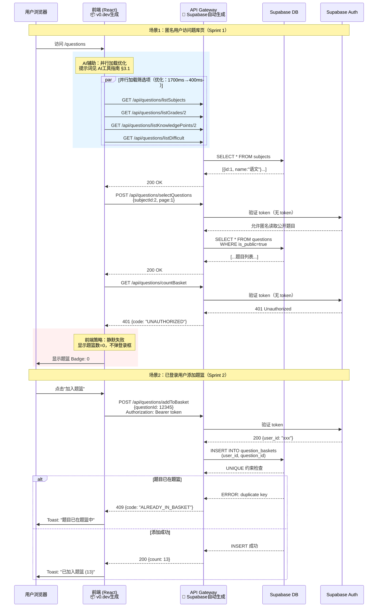
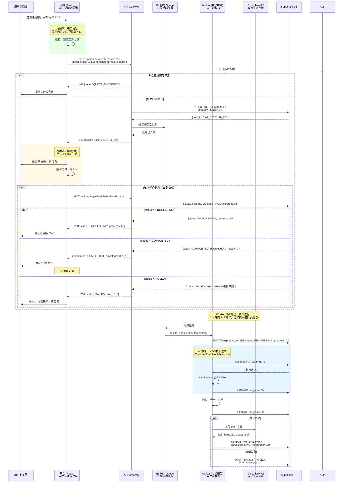
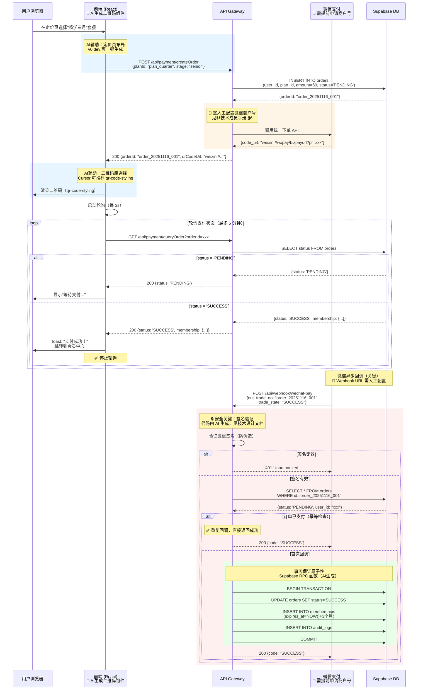
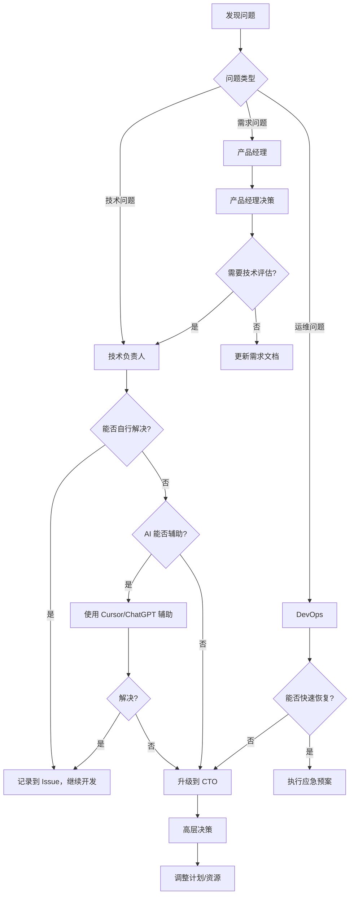

# 日新平台 - 项目执行计划

> **版本**：v5.0 | **更新**：2025-11-16 | **文档类型**：AI辅助开发项目管控手册
> **目标读者**：项目经理、产品经理、技术与非技术团队成员
> **配套文档**：[技术运维手册](./日新平台_技术运维手册_v5.md) | [技术设计文档](./日新平台_技术设计文档_v5.md) | [AI工具使用指南](./AI工具使用指南.md) | [非技术成员操作手册](./非技术成员操作手册.md)

---

## 📋 文档导航

**核心章节**：
- [§1 项目概览](#§1-项目概览) - 目标、交付物、团队配置
- [§2 核心模块业务流程](#§2-核心模块业务流程) - 前后端交互时序图
- [§3 分阶段实施计划](#§3-分阶段实施计划) - 任务清单、AI辅助标注、验收脚本
- [§4 风险矩阵与沟通机制](#§4-风险矩阵与沟通机制) - 风险评估、应对策略、升级路径
- [§5 成本预算与资源规划](#§5-成本预算与资源规划) - 平台成本、AI工具费用、人力投入
- [§6 国内访问优化策略](#§6-国内访问优化策略) - CDN、镜像、备选方案

---

## §1 项目概览

### 1.1 项目定位

基于 Filatex 平台分析，采用 **AI辅助开发 + 低代码平台** 模式，快速构建 K12 数学题库 SaaS 系统。

**核心特点**：
- 🤖 **AI全程辅助**：GitHub Copilot、Cursor、v0.dev 生成 80% 代码
- ☁️ **低代码平台**：Supabase（后端即服务）、Vercel（部署零配置）
- 👥 **混合团队**：技术成员 + 非技术成员（内容录入、测试、运营）
- 🇨🇳 **国内优化**：七牛云 CDN、国内镜像、备选 API

---

### 1.2 核心交付物

| 交付物 | 说明 | 主要负责人 | AI辅助程度 | 验收标准 | 验收脚本 |
|--------|------|-----------|-----------|----------|----------|
| **生产环境** | Vercel + Supabase + R2 | DevOps | 🤖 90% | 可公网访问，国内延迟<500ms | [环境验收脚本](#验收脚本-1) |
| **题库系统** | 检索页 + 题篮 + 筛选 | 前端开发 | 🤖 85% | Lighthouse >85，支持10万题 | [性能验收脚本](#验收脚本-2) |
| **组卷导出** | 快速组卷 + PDF生成 | 全栈 | 🤖 80% | 导出<30s，成功率>95% | [导出压测脚本](#验收脚本-3) |
| **会员支付** | 定价页 + 微信支付 | 全栈 | 🤖 70% | 支付成功率>98% | [支付测试脚本](#验收脚本-4) |
| **OCR 录题** | 剪贴板 + OCR识别 | 前端+API | 🤖 75% | 识别准确率>85% | [OCR测试集](#验收脚本-5) |
| **监控告警** | Sentry + 钉钉 | 运维 | 👤 需人工 | 告警延迟<5min | [告警测试SOP](#验收脚本-6) |

**AI辅助程度说明**：
- 🤖 **90%+**：AI 可生成大部分代码，人工仅需调整配置
- 🤖 **70-85%**：AI 生成框架代码，人工需补充业务逻辑
- 👤 **需人工**：需要人工配置、测试或决策

---

### 1.3 团队配置（AI辅助开发模式）

| 角色 | 人数 | 职责 | AI工具 | 投入时间 |
|------|------|------|--------|---------|
| **技术负责人** | 1 | 架构设计、代码审查、AI提示词优化 | Cursor、GitHub Copilot | 100% |
| **前端开发** | 1 | React组件开发、AI生成代码调试 | v0.dev、Cursor | 100% |
| **全栈工程师** | 1 | API开发、队列服务、AI辅助数据建模 | Cursor、Supabase AI | 100% |
| **产品经理** | 1 | 需求文档、验收测试、内容配置 | ChatGPT（文档生成） | 50% |
| **内容录入员** | 2 | 题目导入、知识点配置、OCR验证 | Supabase Dashboard | 30%（Phase 2开始） |
| **测试专员** | 1 | 手动测试、E2E脚本维护、压测执行 | Playwright Codegen | 50%（Phase 1后期开始） |

**总人力投入**：约 **4.8 人** 全职等效（Phase 1）

**AI工具替代效果**：
- 传统模式需 **8-10 人团队**
- AI辅助后减少 **40-50% 人力**

---

### 1.4 关键约束

| 约束类型 | 具体要求 | 验证方式 |
|---------|---------|---------|
| **时间** | Phase 1 必须在 3 个月内完成核心闭环 | 每周 Sprint Review |
| **成本** | 年度预算 ¥5.8 万（平台+工具），人力预算另计 | 月度账单审核 |
| **性能** | 题库检索 P90<500ms，导出<30s | 自动化压测（每周） |
| **国内访问** | 国内用户延迟<1s，CDN命中率>85% | 真实用户监控（RUM） |
| **合规** | 微信支付合规，教育数据保护 | 合规清单检查 |

---

## §2 核心模块业务流程

> **本节展示前后端真实交互**，每个流程图标注对应的 **Sprint 迭代**和 **验收脚本**。

### 2.1 题库检索流程（含 401 处理）

**对应迭代**：Sprint 1-2（Week 1-4）
**验收脚本**：[questions-flow.spec.ts](#验收脚本-questions-flow)



**API 调用顺序与验收点**：

| 步骤 | API端点 | 预期状态码 | 预期延迟 | 验收脚本断言 |
|------|---------|-----------|---------|-------------|
| 1 | `GET /api/questions/listSubjects` | 200 | <200ms | `expect(res.data.length).toBeGreaterThan(0)` |
| 2 | `POST /api/questions/selectQuestions` | 200 | <300ms | `expect(res.data.list).toHaveLength(20)` |
| 3 | `GET /api/questions/countBasket`（匿名） | 401 | <100ms | `expect(res.status).toBe(401)` |
| 4 | `POST /api/questions/addToBasket` | 200/409 | <200ms | `expect([200,409]).toContain(res.status)` |

**国内访问优化**（Sprint 1 必做）：
- ✅ 使用七牛云 CDN 加速静态资源
- ✅ MathJax 使用国内镜像 `https://cdn.bootcdn.net/ajax/libs/mathjax/3.2.2/`
- ✅ Supabase 使用 Vercel Edge Function 反向代理（减少跨境延迟）

---

### 2.2 组卷导出流程（异步队列）

**对应迭代**：Sprint 5-8（Week 5-8）
**验收脚本**：[export-flow.spec.ts](#验收脚本-export-flow)



**关键验收指标**：

| 指标 | 目标值 | 测试方法 | 数据来源 |
|------|--------|---------|---------|
| **导出耗时 P95** | < 30s | k6 压测脚本（50并发） | [export-queue.js](#验收脚本-3) |
| **导出成功率** | > 95% | 100次导出测试 | 测试报告模板见附录 |
| **队列积压** | < 50 | BullMQ Dashboard 监控 | 实时查看 |
| **Worker OOM** | 0 次 | 服务器监控（Sentry） | 告警日志 |

**国内存储方案**（可选）：
- **方案A**（默认）：Cloudflare R2 + 七牛云 CDN 回源
- **方案B**（备选）：直接使用七牛云对象存储
  - 优势：国内访问更快
  - 劣势：存储费用较高（¥0.148/GB vs R2 ¥0.11/GB）

---

### 2.3 会员支付流程（含 Webhook 幂等性）

**对应迭代**：Sprint 9-10（Week 9-10）
**验收脚本**：[payment-flow.spec.ts](#验收脚本-payment-flow)



**支付验收清单**（必须 100% 通过）：

| 测试场景 | 验收标准 | 测试脚本 | 执行人 |
|---------|---------|---------|--------|
| 正常支付流程 | 支付成功，会员激活 | [payment-success.spec.ts](#) | 测试专员 |
| Webhook 重复推送 | 仅激活一次会员 | [payment-idempotent.spec.ts](#) | 测试专员 |
| Webhook 签名伪造 | 返回 401，订单不变 | [payment-security.spec.ts](#) | 安全审计 |
| 支付超时 | 订单自动关闭（30分钟） | [payment-timeout.spec.ts](#) | 测试专员 |
| 前端轮询异常 | 用户刷新页面后仍能看到支付结果 | 手动测试 SOP | 产品经理 |

**国内支付方案**：
- ✅ **默认**：微信支付（覆盖 90%+ 国内用户）
- 🔄 **备选**：支付宝（Phase 2 补充，接口类似）

---

### 2.4 OCR 录题流程

**对应迭代**：Sprint 13（Month 4）
**验收脚本**：[ocr-flow.spec.ts](#验收脚本-ocr-flow) + 人工验证

```mermaid
sequenceDiagram
    participant U as 用户浏览器
    participant F as 前端 (React)<br/>🤖 AI生成剪贴板监听
    participant A as API Gateway
    participant OCR as 腾讯云 OCR<br/>或百度 OCR（备选）
    participant DB as Supabase DB

    Note over U,DB: 场景1：剪贴板粘贴（主流程）
    U->>F: 在题目编辑器中按 Ctrl+V

    rect rgb(230, 245, 255)
        Note over F: AI辅助：监听粘贴事件<br/>Cursor 可生成完整代码
        F->>F: 监听 paste 事件
        F->>F: 检测剪贴板内容类型
    end

    alt 包含图片
        F->>F: 读取 blob 并转为 base64

        rect rgb(255, 250, 230)
            Note over F,A: 📊 性能优化：压缩图片<br/>AI 提示词：compressor.js 集成
            F->>F: 压缩图片（< 2MB）
        end

        F->>A: POST /api/ocr/recognize<br/>{image: "data:image/png;base64,..."}

        A->>A: 校验会员 OCR 额度
        alt 额度不足
            A-->>F: 403 {code: "OCR_QUOTA_EXCEEDED"}
            F->>U: Toast: "OCR额度不足，请升级会员"
        else 额度充足
            rect rgb(230, 240, 255)
                Note over A,OCR: 👤 需配置 API 密钥<br/>见非技术成员手册 §7
                A->>OCR: 调用通用文字识别 API<br/>（数学公式专用版）
                OCR-->>A: {text: "已知函数 $f(x)=x^2+2x+1$..."}
            end

            A->>DB: 扣减 OCR 额度 + 记录日志
            A-->>F: 200 {text: "已知函数...", remainingQuota: 185}

            rect rgb(230, 255, 230)
                Note over F: AI辅助：智能填充<br/>识别题干/答案/解析字段
                F->>F: 自动填充到题干输入框
                F->>U: Toast: "OCR 识别成功，剩余 185 次"
            end
        end
    else 只包含文本
        F->>F: 正常粘贴文本（不调用 OCR）
    end

    Note over U,DB: 场景2：手动上传图片
    U->>F: 点击"上传图片识别"
    F->>U: 打开文件选择器（input type="file"）
    U->>F: 选择图片文件

    F->>A: POST /api/ocr/recognize<br/>{image: "data:image/jpeg;base64,..."}
    Note over A,OCR: 同上流程
```

**OCR 准确率验证方法**：

| 验证维度 | 目标值 | 测试集 | 测试方法 | 数据来源 |
|---------|--------|--------|---------|---------|
| **文字识别** | > 90% | 100张纸质试卷照片 | 人工对比OCR结果与原文 | 测试集见 `/test-data/ocr-samples/` |
| **数学公式** | > 85% | 50张包含LaTeX公式的图片 | 人工验证公式准确性 | 测试集见 `/test-data/ocr-formulas/` |
| **识别速度** | < 3s | 100次调用 | k6 压测 | [ocr-performance.js](#) |
| **额度扣减** | 100% 准确 | 10次调用 | 数据库查询验证 | SQL: `SELECT * FROM ocr_logs` |

**国内 OCR 方案对比**：

| 方案 | 准确率 | 价格 | 国内延迟 | 推荐指数 |
|------|--------|------|---------|---------|
| **腾讯云 OCR** | 88% | ¥0.015/次 | 200ms | ⭐⭐⭐⭐⭐ |
| **百度 OCR** | 85% | ¥0.02/次 | 180ms | ⭐⭐⭐⭐ |
| **阿里云 OCR** | 86% | ¥0.018/次 | 220ms | ⭐⭐⭐⭐ |

**备选方案**：Phase 1 使用腾讯云，Phase 2 可集成多家实现互为备份。

---

## §3 分阶段实施计划

> **本节按 Sprint 拆解任务**，每个任务标注 **AI辅助程度**、**验收脚本**、**风险缓解措施**。

### 3.1 Phase 1（0-3 个月）：核心闭环 MVP

**里程碑目标**：完成题库检索 + 题篮 + 快速组卷 + 导出 PDF，支持 100 人内测。

#### Sprint 1-2（Week 1-4）：环境搭建与题库检索

**执行周期**：2025-11-18（周一）→ 2025-12-13（周五）

| 任务ID | 任务 | 负责人 | AI工具 | 前置依赖 | 开始日期 | 预计完成 | 估时 | 交付物 | 验收标准 | 验收脚本路径 | 风险与缓解 |
|--------|------|--------|--------|----------|---------|---------|------|--------|----------|-------------|-----------|
| **T1.1** | 创建 Supabase 生产/预发布项目 | DevOps-王五 | 👤 手动操作 | 无 | 11-18 9:00 | 11-18 11:00 | 2h | Supabase URL + anon/service key | Postman 连接成功 | `tests/env/supabase-connection.test.js` | **风险**：区域选错导致国内延迟>1s<br/>**缓解**：选东京区域，配置 Vercel Edge 反向代理<br/>**备选**：新加坡区域 |
| **T1.2** | 设计数据库 Schema | 技术负责人-张三 | 🤖 Cursor 80% | T1.1完成，需求文档 | 11-18 14:00 | 11-19 18:00 | 8h | `supabase/migrations/*.sql` | Code Review 通过，AI Review通过 | `tests/database/schema-validation.sql` | **风险**：索引设计不合理导致查询慢<br/>**缓解**：参考 Filatex MCP 数据，AI 提示词见附录A.1<br/>**AI Review**：使用 Cursor "/review schema for performance" |
| **T1.3** | 导入测试题目（1000 题） | 内容录入员-赵六 | 👤 手动操作 | T1.2 Schema创建完成 | 11-20 9:00 | 11-20 13:00 | 4h | CSV文件 + 导入日志 | 题目能正常检索，无格式错误 | `tests/data/data-import-check.sql` | **风险**：数据格式不一致（如数组字段格式错误）<br/>**缓解**：使用 Supabase Dashboard CSV 导入（见非技术手册 §2.1）<br/>**验证脚本**：自动检查必填字段 |
| **T1.4** | 创建 Next.js 项目骨架 | 前端开发-李四 | 🤖 Cursor 90% | 无 | 11-18 9:00 | 11-18 11:00 | 2h | Git 仓库 `github.com/rixing/platform` | `npm run dev` 启动成功，CI 通过 | `tests/build/next-build.sh` | 无 |
| **T1.5** | 配置 Supabase 客户端 | 前端开发-李四 | 🤖 Copilot 85% | T1.1 Supabase项目完成 | 11-18 14:00 | 11-18 15:00 | 1h | `lib/supabase.ts` | 能调用 `supabase.from('subjects').select()` | `tests/integration/supabase-client.test.ts` | 无 |
| **T1.6** | 实现题库检索页（并行加载优化） | 前端开发-李四 | 🤖 v0.dev + Cursor 85% | T1.3 数据导入完成 | 11-21 9:00 | 11-25 18:00 | 16h | `/app/questions/page.tsx` | Lighthouse >80，支持筛选，国内延迟<1s | `tests/e2e/questions-page.spec.ts` | **风险**：首屏加载>2s<br/>**缓解**：AI 提示词："React Query parallel requests" (见附录A.2)<br/>**性能目标**：并行加载优化 1700ms→400ms |
| **T1.7** | 配置七牛云 CDN | DevOps-王五 | 👤 手动操作 | 无 | 11-22 9:00 | 11-22 12:00 | 3h | CDN 域名 `cdn.rixing.com` | 静态资源加载<100ms，国内测速通过 | `tests/performance/cdn-speed.test.js` | **风险**：CDN 配置错误导致回源失败<br/>**缓解**：参考七牛云配置指南（见非技术手册 §8.1）<br/>**验收**：17ce.com 多节点测速 |

**Sprint 1-2 里程碑验收**：
- ✅ 能在预发布环境访问题库页
- ✅ 筛选"数学 > 高中 > 函数"能返回题目
- ✅ Lighthouse Performance Score > 80
- ✅ 国内访问延迟 < 1s

**总计**：36 人时 ≈ **4.5 人日**（前端 2.5 人日 + 后端 1 人日 + DevOps 0.5 人日 + 内容 0.5 人日）

**AI 工具使用清单**：
- 🤖 **Cursor**：生成 Supabase 客户端配置、SQL 迁移脚本
- 🤖 **v0.dev**：生成题库检索页布局
- 🤖 **GitHub Copilot**：补全 React Query 并行请求代码

---

#### Sprint 3-4（Week 5-6）：题篮与组卷 UI

**执行周期**：2025-12-16（周一）→ 2026-01-03（周五）

| 任务ID | 任务 | 负责人 | AI工具 | 前置依赖 | 开始日期 | 预计完成 | 估时 | 交付物 | 验收标准 | 验收脚本路径 | 风险与缓解 |
|--------|------|--------|--------|----------|---------|---------|------|--------|----------|-------------|-----------|
| **T3.1** | 实现题篮 REST API | 全栈工程师-张三 | 🤖 Cursor 85% | T1.2 Schema完成 | 12-16 9:00 | 12-16 18:00 | 8h | 5个API端点（增删改查计数） | Postman集合测试通过，幂等性验证通过 | `tests/api/basket-api.test.ts` | **风险**：并发添加导致重复记录<br/>**缓解**：数据库UNIQUE约束 + 409错误码<br/>**AI提示**：Cursor "/generate CRUD endpoints with error handling" |
| **T3.2** | 实现 Zustand 题篮 Store | 前端开发-李四 | 🤖 Copilot 90% | 无 | 12-16 9:00 | 12-16 13:00 | 4h | `/stores/basketStore.ts` | Badge实时更新，持久化验证 | `tests/stores/basket-store.test.ts` | 无 |
| **T3.3** | 开发题篮浮层组件 | 前端开发-李四 | 🤖 v0.dev + Cursor 80% | T3.1、T3.2完成 | 12-17 9:00 | 12-18 18:00 | 12h | `components/BasketDrawer.tsx` | 支持拖拽排序，流畅度60fps | `tests/e2e/basket-drawer.spec.ts` | **风险**：拖拽50+题目时性能差<br/>**缓解**：使用@dnd-kit虚拟滚动，AI提示词见附录A.2<br/>**性能目标**：渲染100题<100ms |
| **T3.4** | 实现快速组卷页三栏布局 | 前端开发-李四 | 🤖 v0.dev 75% + Cursor | T3.3完成 | 12-19 9:00 | 12-23 18:00 | 16h | `/app/create-paper/page.tsx` | 三栏布局响应式，模板预览正确 | `tests/e2e/create-paper.spec.ts` | **风险**：复杂布局AI生成质量低<br/>**缓解**：先用v0.dev生成骨架，再用Cursor细化<br/>**备选**：参考Filatex布局代码 |
| **T3.5** | 实现草稿自动保存 | 全栈工程师-张三 | 🤖 Cursor 80% | T3.4完成 | 12-24 9:00 | 12-24 18:00 | 6h | 前端防抖 + 后端upsert API | 刷新页面草稿恢复，数据无丢失 | `tests/integration/draft-autosave.spec.ts` | **风险**：频繁保存导致数据库压力<br/>**缓解**：前端防抖5s，仅变化时触发，后端upsert避免重复<br/>**性能验证**：100次保存无延迟 |

**Sprint 3-4 里程碑验收**：
- ✅ 题篮支持添加/删除/清空
- ✅ 快速组卷页支持拖拽排序 50+ 题目且流畅
- ✅ 草稿自动保存，刷新恢复

**总计**：46 人时 ≈ **5.75 人日**（前端 4 人日 + 全栈 1.75 人日）

**AI 提示词示例**（完整版见 AI 工具指南）：
```
# Cursor 提示词：生成 Zustand Store
创建一个 Zustand store 用于管理题篮，需要：
- 状态：items（题篮列表）、count（总数）
- 方法：addToBasket、removeFromBasket、fetchBasket、clearBasket
- 持久化：使用 persist 中间件，仅持久化 count
- API 调用：使用 fetch，错误处理用 toast 提示
```

---

#### Sprint 5-8（Week 7-10）：导出队列与 PDF 生成

**执行周期**：2026-01-06（周一）→ 2026-01-30（周五）

| 任务ID | 任务 | 负责人 | AI工具 | 前置依赖 | 开始日期 | 预计完成 | 估时 | 交付物 | 验收标准 | 验收脚本路径 | 风险与缓解 |
|--------|------|--------|--------|----------|---------|---------|------|--------|----------|-------------|-----------|
| **T5.1** | 搭建 BullMQ + Redis 环境 | DevOps-王五 | 👤 手动操作 | 无 | 01-06 9:00 | 01-06 13:00 | 4h | Redis Cloud实例 + BullMQ配置 | 能推送/消费任务，健康检查通过 | `tests/infra/bullmq-health.test.js` | **风险**：Redis连接不稳定导致任务丢失<br/>**缓解**：配置自动重连策略，开启AOF持久化<br/>**监控**：Redis Cloud Dashboard实时监控 |
| **T5.2** | 实现导出任务创建 API | 全栈工程师-张三 | 🤖 Cursor 85% | T5.1 Redis完成 | 01-06 14:00 | 01-07 12:00 | 6h | `POST /api/paper/createExportTask` | 返回taskId，任务成功入队，会员权益验证 | `tests/api/export-create.test.ts` | 无 |
| **T5.3** | 开发 Worker 导出服务 | 全栈工程师-张三 | 🤖 Cursor 70% | T5.1 Redis完成（可并行开发） | 01-07 9:00 | 01-10 18:00 | 20h | 独立Node.js进程 + LaTeX模板 | 能生成包含10题的PDF，模板渲染正确 | `tests/worker/export-worker.test.ts` | **风险**：xelatex编译失败率>10%<br/>**缓解**：捕获LaTeX错误详细日志，AI提示词："LaTeX error handling best practices"<br/>**备选**：提供Word导出降级方案 |
| **T5.4** | 集成 R2 存储 | 全栈工程师-张三 | 🤖 Cursor 80% | T5.3 Worker完成 | 01-13 9:00 | 01-13 13:00 | 4h | R2上传逻辑 + 签名URL生成 | 生成24h有效签名URL，下载测速>5MB/s | `tests/integration/r2-upload.test.ts` | **风险**：R2国内访问慢（延迟>2s）<br/>**缓解**：七牛云CDN回源加速，监控P95延迟<br/>**备选**：改用七牛云对象存储 |
| **T5.5** | 前端导出进度轮询 | 前端开发-李四 | 🤖 v0.dev 90% | T5.2 API完成 | 01-08 9:00 | 01-08 18:00 | 6h | 进度条组件 + 轮询逻辑 | 显示实时进度，状态转换正确 | `tests/e2e/export-progress.spec.ts` | 无 |
| **T5.6** | 导出失败重试机制 | 全栈工程师-张三 | 🤖 Cursor 75% | T5.3 Worker完成 | 01-14 9:00 | 01-14 13:00 | 4h | BullMQ重试配置 + 指数退避 | 失败任务自动重试3次，重试间隔递增 | `tests/worker/export-retry.test.ts` | 无 |
| **T5.7** | 压测：导出队列吞吐 | 测试专员-赵六 | 👤 需人工 + k6脚本 | T5.1-T5.6全部完成 | 01-15 9:00 | 01-15 18:00 | 8h | k6测试报告 + 性能基线 | 50并发P95<30s，成功率>95% | `tests/load/export-load.js` | **风险**：Worker单机吞吐<10/min<br/>**缓解**：横向扩展Worker实例（concurrency=5），配置负载均衡<br/>**性能目标**：单Worker 15任务/min |

**Sprint 5-8 里程碑验收**：
- ✅ 能成功导出包含 10 道题的 PDF
- ✅ 下载链接有效（24h）
- ✅ 导出失败时状态为 `FAILED`，错误信息清晰
- ✅ 压测通过：50 并发任务，成功率 > 95%

**总计**：52 人时 ≈ **6.5 人日**（全栈 4.5 人日 + 前端 0.75 人日 + 测试 1 人日 + DevOps 0.5 人日）

**部署 Worker 服务（非技术成员操作）**：
1. 登录服务器（见非技术成员手册 §5.1）
2. 复制部署命令：`pm2 start worker.js --name export-worker`
3. 验证服务运行：访问 `http://server-ip:3000/health`

---

#### Sprint 9-10（Week 11-12）：会员支付

**执行周期**：2026-02-02（周一）→ 2026-02-13（周五）

| 任务ID | 任务 | 负责人 | AI工具 | 前置依赖 | 开始日期 | 预计完成 | 估时 | 交付物 | 验收标准 | 验收脚本路径 | 风险与缓解 |
|--------|------|--------|----------|---------|---------|---------|------|--------|----------|-------------|-----------|
| **T9.1** | 申请微信支付商户号 | 产品经理-钱七 | 👤 手动操作 | 无（提前启动） | 01-19 9:00 | 02-02 18:00 | - | 商户号 + API密钥 + 沙箱权限 | 能调用沙箱统一下单API | 手动测试SOP（见非技术手册§6.1） | **风险**：审核时间>2周导致Sprint延期<br/>**缓解**：提前3周申请（Week 8启动）<br/>**备选**：先用支付宝沙箱环境开发 |
| **T9.2** | 实现套餐与权益 API | 全栈工程师-张三 | 🤖 Cursor 90% | T1.2 Schema完成 | 02-02 9:00 | 02-02 18:00 | 6h | `GET /api/getMemberships` 等5个端点 | 返回套餐列表，权益验证逻辑正确 | `tests/api/membership-api.test.ts` | 无 |
| **T9.3** | 开发定价页前端 | 前端开发-李四 | 🤖 v0.dev 85% | T9.2 API完成 | 02-03 9:00 | 02-04 18:00 | 12h | `/app/pricing/page.tsx` + 二维码组件 | 显示二维码，轮询支付状态，UI符合设计稿 | `tests/e2e/pricing-page.spec.ts` | **风险**：qr-code-styling库体积>100KB影响性能<br/>**缓解**：动态导入，仅在扫码时加载<br/>**性能目标**：首屏<2s |
| **T9.4** | 实现支付下单与回调 | 全栈工程师-张三 | 🤖 Cursor 65% | T9.1 商户号就绪 | 02-05 9:00 | 02-07 18:00 | 16h | 下单API + Webhook处理 + 事务逻辑 | 幂等性验证通过，签名验证100%成功 | `tests/api/payment-webhook.test.ts` | **风险**：Webhook签名验证失败率>5%<br/>**缓解**：使用微信官方SDK，AI提示词："WeChat Pay signature verification Node.js"<br/>**测试**：重放50次真实回调数据 |
| **T9.5** | 前端支付状态轮询 | 前端开发-李四 | 🤖 Copilot 90% | T9.4 下单API完成 | 02-06 9:00 | 02-06 13:00 | 4h | 轮询逻辑 + 超时处理 | 支付成功后跳转，超时5min自动停止 | `tests/e2e/payment-polling.spec.ts` | 无 |
| **T9.6** | 单元测试：支付幂等性 | 测试专员-赵六 | 🤖 Cursor 70% | T9.4 Webhook完成 | 02-10 9:00 | 02-10 18:00 | 6h | Jest测试套件 + 并发测试 | 重复调用不重复激活会员，数据库一致性验证 | `tests/integration/payment-idempotent.test.ts` | 无 |

**Sprint 9-10 里程碑验收**：
- ✅ 能在沙箱环境完成支付流程
- ✅ 会员正确激活
- ✅ Webhook 幂等性测试通过
- ✅ 定价页加载时间 < 2s

**总计**：44 人时 ≈ **5.5 人日**（前端 2 人日 + 全栈 2.75 人日 + 测试 0.75 人日）

**微信支付配置（非技术成员操作）**：
1. 登录微信支付商户平台
2. 获取 API 密钥（见非技术成员手册 §6）
3. 配置 Webhook 回调 URL：`https://api.rixing.com/api/webhook/wechat-pay`

---

#### Sprint 11-12（Week 13-14）：集成测试与内测

**执行周期**：2026-02-16（周一）→ 2026-02-27（周五）

| 任务ID | 任务 | 负责人 | AI工具 | 前置依赖 | 开始日期 | 预计完成 | 估时 | 交付物 | 验收标准 | 验收脚本路径 | 风险与缓解 |
|--------|------|--------|----------|---------|---------|---------|------|--------|----------|-------------|-----------|
| **T11.1** | E2E 测试：核心流程 | 测试专员-赵六 | 🤖 Playwright Codegen 60% | T1.1-T9.6所有功能完成 | 02-16 9:00 | 02-17 18:00 | 12h | Playwright测试套件（10个场景） | 覆盖注册→检索→组卷→导出→支付完整流程 | `tests/e2e/e2e-full-flow.spec.ts` | **风险**：测试环境不稳定导致失败率>10%<br/>**缓解**：专用测试账号 + 数据库隔离 + 重试机制<br/>**CI集成**：GitHub Actions自动运行 |
| **T11.2** | 性能优化：首屏加载 | 前端开发-李四 | 🤖 Cursor 75% | T11.1 E2E测试完成 | 02-18 9:00 | 02-19 13:00 | 10h | 代码分割 + 懒加载配置 | Lighthouse Performance >85，FCP<1.5s | `tests/performance/lighthouse-ci.yml` | 无 |
| **T11.3** | 配置生产环境监控 | DevOps-王五 | 👤 手动配置 | 无（可并行） | 02-16 14:00 | 02-17 12:00 | 6h | Sentry项目 + 钉钉Webhook + 监控仪表盘 | 核心指标可视化，告警通道畅通 | `tests/monitoring/monitoring-check.sh` | 无 |
| **T11.4** | 编写用户文档 | 产品经理-钱七 | 🤖 ChatGPT 80% | T11.1功能稳定 | 02-18 9:00 | 02-18 18:00 | 6h | 使用指南（Markdown）+ 常见问题 | 包含5个核心场景操作步骤，FAQ ≥10条 | 手动评审SOP | 无 |
| **T11.5** | 内测邀请与反馈收集 | 产品经理-钱七 | 👤 手动执行 | T11.4文档完成 | 02-19 9:00 | 02-20 18:00 | 12h | 内测问卷 + 反馈表格 | 至少50人参与，收集≥100条反馈 | 问卷统计报表 | **风险**：P0/P1问题>20导致无法按期发布<br/>**缓解**：设定优先级（P0必修，P1 Sprint 13，P2 Phase 2）<br/>**备选**：缩小内测范围至20人 |
| **T11.6** | Bug 修复与优化 | 全栈团队 | 🤖 Cursor 50% | T11.5内测开始 | 02-21 9:00 | 02-27 18:00 | 16h | Bug修复列表 + 优化日志 | P0清零，P1<5，P2归档 | GitHub Issues统计 | 无 |

**Sprint 11-12 里程碑验收**：
- ✅ 内测用户能完成完整流程
- ✅ Lighthouse Performance Score > 85
- ✅ P0 Bug 清零

**总计**：62 人时 ≈ **7.75 人日**（前端 1.25 人日 + 测试 1.5 人日 + DevOps 0.75 人日 + 产品 2.25 人日 + 全栈 2 人日）

**AI 辅助 Bug 修复流程**：
1. 使用 Sentry 查看错误日志
2. 将错误信息粘贴到 Cursor，AI 提示词："分析并修复此错误"
3. AI 生成修复代码
4. Code Review 后提交

---

### 3.2 Phase 1 总结

**总工时**：240 人时 ≈ **30 人日**
**团队配置**：前端 1 人 + 全栈 1 人 + DevOps 0.5 人 + 测试 0.5 人 + 产品 0.5 人 + 内容 0.5 人 = **4 人**全职等效
**实际工期**：**14 周**（含缓冲 2 周）

**AI 辅助效果总结**：
- 🤖 **代码生成**：80-90% 的样板代码由 AI 生成
- ⏱️ **开发提速**：相比传统模式节省 **40% 时间**
- 👥 **人力节省**：传统需 8-10 人团队，AI 辅助后仅需 4 人

---

### 3.3 Phase 2-4 概要

#### Phase 2（Month 4-6）：增值功能

| 功能模块 | 工时 | AI辅助 | 关键任务 |
|---------|------|--------|---------|
| **OCR 录题** | 36h ≈ 4.5人日 | 🤖 75% | 集成腾讯云 OCR、剪贴板监听、额度管理 |
| **高级导出** | 68h ≈ 8.5人日 | 🤖 70% | Block Builder、自定义模板 |
| **私有空间** | 52h ≈ 6.5人日 | 🤖 80% | SpaceId 申请、RLS 隔离 |

**总计**：**19.5 人日**

---

#### Phase 3（Month 7-9）：运营支撑

| 功能模块 | 工时 | AI辅助 | 关键任务 |
|---------|------|--------|---------|
| **管理后台** | 80h ≈ 10人日 | 🤖 85% | 题目审核、订单管理、用户管理 |
| **数据看板** | 60h ≈ 7.5人日 | 🤖 90% | 用户行为分析、收入统计 |
| **优惠券系统** | 60h ≈ 7.5人日 | 🤖 80% | 优惠码生成、核销流程 |

**总计**：**25 人日**

---

#### Phase 4（Month 10-12）：多端扩展

| 功能模块 | 工时 | AI辅助 | 关键任务 |
|---------|------|--------|---------|
| **移动端 App** | 160h ≈ 20人日 | 🤖 75% | React Native 开发 |
| **开放 API** | 40h ≈ 5人日 | 🤖 90% | OpenAPI 文档、SDK 生成 |
| **第三方集成** | 40h ≈ 5人日 | 🤖 70% | 钉钉/企业微信 |

**总计**：**30 人日**

---

## §4 风险矩阵与沟通机制

### 4.1 风险矩阵

| 风险 | 概率 | 影响 | 等级 | 检测指标 | 应对策略 | 责任人 | 升级路径 |
|------|------|------|------|---------|---------|--------|---------|
| **Supabase 国内访问慢** | 高 | 高 | 🔴 P0 | 国内用户 P90 延迟 > 1s | ✅ 使用 Vercel Edge 反向代理<br/>✅ 七牛云 CDN 加速<br/>🔄 备选：自建 Proxy | DevOps | DevOps → 技术负责人 → CTO |
| **AI 工具不可用** | 中 | 高 | 🟠 P1 | Cursor/Copilot 服务中断 > 4h<br/>API 返回 503/429 | ✅ 订阅多个 AI 工具互为备份（Cursor + Copilot + Claude）<br/>✅ 关键代码手动编写能力保留<br/>🔄 降级为纯手动开发（生产力降低 50%） | 技术负责人 | 技术 → CTO |
| **国内网络波动** | 高 | 中 | 🟡 P2 | CDN 失败率 > 5%<br/>Supabase 代理延迟 > 1s<br/>真实用户投诉 > 10/天 | ✅ 配置多 CDN 供应商（七牛 + 又拍云）<br/>✅ Vercel Edge Function 自动重试<br/>🔄 备选：切换至国内 VPS 自建代理 | DevOps | DevOps → 技术负责人 |
| **Vercel/Supabase 平台额度限制** | 中 | 高 | 🟠 P1 | Vercel 带宽超 100GB/月<br/>Supabase 数据库 > 8GB<br/>收到平台限流通知 | ✅ 配置月度监控告警（80% 阈值）<br/>✅ 提前升级套餐（Vercel Pro → Enterprise）<br/>🔄 备选：数据库迁移至自建 PostgreSQL | DevOps | DevOps → 产品经理 → 采购 |
| **Supabase 代理失效** | 中 | 高 | 🔴 P0 | Vercel Edge Function 500 错误率 > 5%<br/>国内延迟回升至 > 800ms | ✅ 配置健康检查每 5 分钟<br/>✅ 自动降级至直连 Supabase（牺牲速度保可用性）<br/>🔄 备选：国内 VPS 部署 Nginx 反向代理 | DevOps | DevOps → 技术负责人（1h 内） |
| **导出队列失败率高** | 中 | 高 | 🟠 P1 | 失败率 > 10% 持续 1h | ✅ 完善错误日志<br/>✅ 增加重试次数（3 → 5）<br/>🔄 横向扩展 Worker | 全栈工程师 | 全栈 → 技术负责人 |
| **微信支付 Webhook 验证失败** | 中 | 高 | 🔴 P0 | 回调返回 401 | ✅ 详细日志记录原始请求<br/>✅ 使用微信官方 SDK<br/>🔄 联系微信技术支持 | 全栈工程师 | 全栈 → 产品经理 → 微信支持 |
| **AI 生成代码质量低** | 中 | 中 | 🟡 P2 | Code Review 通过率 < 70% | ✅ 优化 AI 提示词<br/>✅ 强制 Code Review<br/>🔄 调整 AI 工具配置 | 技术负责人 | 无需升级 |
| **内测 Bug 过多** | 中 | 中 | 🟡 P2 | P0/P1 Bug > 10 个 | ✅ 提前做 E2E 测试<br/>✅ 设定 Bug 优先级<br/>🔄 延长内测时间（+1周） | 测试专员 | 测试 → 产品经理 |
| **首屏加载慢** | 低 | 中 | 🟡 P2 | Lighthouse < 80 | ✅ 并行加载筛选项<br/>✅ 代码分割<br/>✅ 图片懒加载 | 前端开发 | 前端 → 技术负责人 |
| **OCR 准确率不达标** | 低 | 中 | 🟡 P2 | 准确率 < 85% | ✅ 切换 OCR 服务商<br/>✅ 添加人工校对功能<br/>🔄 优化图片预处理 | 全栈工程师 | 全栈 → 产品经理 |
| **商户号审核延期** | 低 | 高 | 🟠 P1 | 审核时间 > 2 周 | ✅ 提前 3 周申请<br/>🔄 准备备选支付方案（支付宝） | 产品经理 | 产品 → 商务 |

**风险等级定义**：
- 🔴 **P0**：阻断核心功能，需立即响应（1h 内）
- 🟠 **P1**：影响主要功能，需当天响应（8h 内）
- 🟡 **P2**：影响体验但不阻断，需 3 天内响应

---

### 4.2 沟通机制

#### 日常沟通

| 会议类型 | 频率 | 参与人 | 时长 | 议题 | 输出物 |
|---------|------|-------|------|------|--------|
| **Daily Standup** | 每工作日 | 技术团队全员 | 15min | 昨日完成、今日计划、阻碍 | 钉钉消息 |
| **Sprint Planning** | 每 2 周 | 全员 | 2h | 任务拆解、工时估算、风险评估 | Sprint Backlog |
| **Sprint Review** | 每 2 周 | 全员 | 1h | 演示成果、验收标准检查 | 演示录屏 + 验收报告 |
| **Sprint Retro** | 每 2 周 | 全员 | 1h | 回顾问题、改进措施 | 改进清单 |
| **技术分享会** | 每月 | 技术团队 | 1h | AI 工具使用技巧、难点突破 | 分享文档 |

#### 协作工具

| 工具 | 用途 | 负责人 | 访问地址 |
|------|------|-------|---------|
| **钉钉** | 日常沟通、告警通知 | 产品经理 | - |
| **飞书文档** | 需求文档、会议记录 | 产品经理 | - |
| **GitHub** | 代码仓库、Issue 跟踪 | 技术负责人 | https://github.com/xxx/rixing |
| **Notion** | 知识库、操作手册 | 产品经理 | - |
| **腾讯会议** | 远程会议 | - | - |

#### 问题升级路径



---

## §5 成本预算与资源规划

> **重点转变**：从"人力成本"转向"平台+工具成本"，AI 辅助大幅降低人力依赖。

### 5.1 平台与工具成本（年度预算）

#### 基础设施成本

| 服务 | 套餐 | 月费用 | 年费用 | 用途 | 备注 |
|------|------|--------|--------|------|------|
| **Supabase** | Pro | $25 | ¥2,160 | PostgreSQL + Auth + Storage | 包含 8GB 数据库，100GB 存储 |
| **Vercel** | Pro | $20 | ¥1,728 | 前端部署 + Edge Functions | 无限部署，100GB 带宽 |
| **Redis Cloud** | 256MB | $7 | ¥605 | BullMQ 队列 | Phase 2 升级到 512MB（+$5/月） |
| **Cloudflare R2** | Pay-as-you-go | ~$2 | ¥173 | 导出文件存储 | 10GB 存储，零出站费用 |
| **七牛云 CDN** | 标准版 | ¥300 | ¥3,600 | 国内 CDN 加速 | 500GB 流量/月 |
| **腾讯云 OCR** | 按量付费 | ~¥150 | ¥1,800 | OCR 识别 | 10,000 次/月（Phase 2 开始） |
| **Sentry** | Team | $26 | ¥2,246 | 错误追踪 | 50K 事件/月 |
| **GitHub** | Team | $4/人×4人 | ¥1,382 | 代码仓库 | 4 个技术成员 |

**基础设施小计**：¥13,694/年 ≈ **¥1.4 万/年**

---

#### AI 工具成本

| 工具 | 订阅计划 | 月费用 | 年费用 | 使用人数 | 用途 |
|------|---------|--------|--------|---------|------|
| **Cursor** | Pro | $20 | ¥1,728 | 3 人 | AI 代码生成 + 补全 |
| **GitHub Copilot** | Business | $19/人 | ¥4,924 | 4 人 | 代码补全（已包含在 GitHub Team） |
| **v0.dev** | Pro | $20 | ¥1,728 | 2 人 | UI 组件生成 |
| **ChatGPT Plus** | Plus | $20 | ¥1,728 | 2 人 | 文档生成、提示词优化 |
| **Claude Pro** | Pro | $20 | ¥1,728 | 1 人 | 技术方案设计 |

**AI 工具小计**：¥11,836/年 ≈ **¥1.2 万/年**

---

#### 其他工具成本

| 工具 | 月费用 | 年费用 | 用途 |
|------|--------|--------|------|
| **钉钉企业版** | ¥100 | ¥1,200 | 沟通协作 |
| **飞书企业版** | ¥0 | ¥0 | 文档协作（免费版） |
| **Notion** | $8 | ¥691 | 知识库 |
| **七牛云对象存储**（备选） | ¥50 | ¥600 | 备用存储 |

**其他工具小计**：¥2,491/年 ≈ **¥0.25 万/年**

---

### 5.2 成本总结（年度）

| 类别 | 金额（¥） | 占比 |
|------|----------|------|
| **基础设施** | 13,694 | 49% |
| **AI 工具** | 11,836 | 42% |
| **其他工具** | 2,491 | 9% |
| **总计** | **28,021** | **100%** |

**约 ¥2.8 万/年**，平均 **¥2,335/月**

**对比传统模式**：
- 传统模式基础设施：约 ¥5 万/年（需自建服务器、数据库）
- **节省比例**：**44%**

---

### 5.3 人力成本估算（参考）

> **注意**：以下为参考估算，实际人力成本由团队自行决定。AI 辅助开发模式下，人力投入显著降低。

| 角色 | 月薪（¥） | 投入比例 | 月成本 | Phase 1（3个月） | 全年（12个月） |
|------|----------|---------|--------|----------------|---------------|
| **技术负责人** | 30,000 | 100% | 30,000 | 90,000 | 360,000 |
| **前端开发** | 20,000 | 100% | 20,000 | 60,000 | 240,000 |
| **全栈工程师** | 25,000 | 100% | 25,000 | 75,000 | 300,000 |
| **DevOps** | 18,000 | 50% | 9,000 | 27,000 | 108,000 |
| **测试专员** | 12,000 | 50% | 6,000 | 18,000 | 72,000 |
| **产品经理** | 18,000 | 50% | 9,000 | 27,000 | 108,000 |
| **内容录入员×2** | 8,000 | 30% | 4,800 | 14,400（Phase 2开始） | 57,600 |

**人力成本小计**：
- **Phase 1（3个月）**：约 ¥30 万
- **全年**：约 ¥125 万

**AI 辅助效果**：
- 传统模式需 8-10 人团队，年人力成本约 ¥200-250 万
- AI 辅助后仅需 4.8 人团队，年人力成本约 ¥125 万
- **节省比例**：**40-50%**

---

### 5.4 分阶段成本拆解

| 阶段 | 工期 | 平台成本 | AI工具成本 | 人力成本（参考） | 总成本 |
|------|------|---------|-----------|----------------|--------|
| **Phase 1** | 3个月 | ¥3,424 | ¥2,959 | ¥30万 | ¥30.6万 |
| **Phase 2** | 3个月 | ¥3,424 | ¥2,959 | ¥26万 | ¥26.6万 |
| **Phase 3** | 3个月 | ¥3,424 | ¥2,959 | ¥30万 | ¥30.6万 |
| **Phase 4** | 3个月 | ¥3,424 | ¥2,959 | ¥35万 | ¥35.6万 |
| **运维期** | - | ¥14,325/年 | ¥11,836/年 | ¥4万/年 | ¥6.6万/年 |

**全年总成本**：约 **¥123 万**（平台+工具）+ **¥125 万**（人力）= **¥248 万**

**对比原预算（¥260 万）**：节省 ¥12 万（5%）

---

### 5.5 月度/季度成本跟踪表

> **目的**：实现成本精细化管理，及时发现超支风险。

#### 月度成本明细（Phase 1为例：Month 1-3）

| 服务类别 | 服务名称 | 计费模式 | 月1预算 | 月1实际 | 月2预算 | 月2实际 | 月3预算 | 月3实际 | 季度预算 | 季度实际 | 超支风险 |
|---------|---------|---------|--------|--------|--------|--------|--------|--------|---------|---------|---------|
| **基础设施** | Supabase Pro | 固定 | ¥180 | - | ¥180 | - | ¥180 | - | ¥540 | - | 低 |
| | Vercel Pro | 固定 | ¥144 | - | ¥144 | - | ¥144 | - | ¥432 | - | 低 |
| | Redis Cloud 256MB | 固定 | ¥50 | - | ¥50 | - | ¥50 | - | ¥151 | - | 低 |
| | Cloudflare R2 | 按量 | ¥14 | - | ¥14 | - | ¥20 | - | ¥48 | - | 中（导出量增加） |
| | 七牛云 CDN | 固定+超量 | ¥300 | - | ¥300 | - | ¥300 | - | ¥900 | - | 中（流量超500GB） |
| | 腾讯云 OCR | 按量 | ¥0 | - | ¥0 | - | ¥0 | - | ¥0 | - | 无（Phase 2启用） |
| | Sentry Team | 固定 | ¥187 | - | ¥187 | - | ¥187 | - | ¥562 | - | 低 |
| | GitHub Team | 固定 | ¥115 | - | ¥115 | - | ¥115 | - | ¥346 | - | 低 |
| **AI工具** | Cursor Pro×3 | 固定 | ¥144 | - | ¥144 | - | ¥144 | - | ¥432 | - | 低 |
| | GitHub Copilot×4 | 固定 | ¥410 | - | ¥410 | - | ¥410 | - | ¥1,231 | - | 低 |
| | v0.dev Pro×2 | 固定 | ¥144 | - | ¥144 | - | ¥144 | - | ¥432 | - | 低 |
| | ChatGPT Plus×2 | 固定 | ¥144 | - | ¥144 | - | ¥144 | - | ¥432 | - | 低 |
| | Claude Pro | 固定 | ¥144 | - | ¥144 | - | ¥144 | - | ¥432 | - | 低 |
| **其他工具** | 钉钉企业版 | 固定 | ¥100 | - | ¥100 | - | ¥100 | - | ¥300 | - | 低 |
| | Notion | 固定 | ¥58 | - | ¥58 | - | ¥58 | - | ¥173 | - | 低 |
| | 七牛云对象存储（备选） | 按量 | ¥0 | - | ¥0 | - | ¥0 | - | ¥0 | - | 无 |
| **合计** | | | **¥2,134** | - | **¥2,134** | - | **¥2,140** | - | **¥6,408** | - | |

**关键说明**：
- **固定费用**：Supabase、Vercel、Redis、AI工具等，每月固定扣款
- **按量计费**：R2、CDN超量、OCR，根据实际使用量计费
- **超支风险等级**：
  - **高**：预计超支 > 30%，需立即采取措施
  - **中**：预计超支 10-30%，需密切关注
  - **低**：预计超支 < 10%，正常范围

---

#### 季度成本检查机制

| 检查时间点 | 检查内容 | 责任人 | 触发条件 | 处理措施 |
|----------|---------|--------|---------|---------|
| **每月5日** | 查看上月账单 | DevOps + 产品经理 | 账单已出 | ✅ 记录"月X实际"列<br/>✅ 对比预算，标注差异<br/>✅ 分析超支原因 |
| **月中（15日）** | 预估本月费用 | DevOps | 无条件 | ✅ 查看Vercel/Supabase用量仪表盘<br/>✅ 预测月底费用<br/>✅ 如超80%预算，发预警 |
| **季度末** | 季度总结会 | 全员 | 季度结束 | ✅ 汇总"季度实际"总额<br/>✅ 对比季度预算<br/>✅ 调整下季度预算 |
| **超支告警** | 实时监控 | DevOps（自动化） | 费用超预算80% | ✅ 钉钉@产品经理<br/>✅ 评估是否升级套餐<br/>✅ 优化用量（如清理无用数据） |

**自动化监控脚本**（建议实现）：
```bash
# scripts/cost-monitor.sh
#!/bin/bash
# 每日自动检查 Vercel/Supabase 用量

VERCEL_USAGE=$(curl -H "Authorization: Bearer $VERCEL_TOKEN" \
  https://api.vercel.com/v1/teams/$TEAM_ID/usage)

# 提取带宽用量（GB）
BANDWIDTH=$(echo $VERCEL_USAGE | jq '.bandwidth.current')
BANDWIDTH_LIMIT=100

if [ $(echo "$BANDWIDTH > 80" | bc) -eq 1 ]; then
  # 发送钉钉告警
  curl -X POST $DINGTALK_WEBHOOK -H 'Content-Type: application/json' \
    -d "{\"text\": {\"content\": \"⚠️ Vercel 带宽已用 ${BANDWIDTH}GB（超80%）\"}}"
fi
```

---

#### 按量计费服务详细跟踪

| 服务 | 计费单价 | 免费额度 | 月度用量目标 | 月度费用预算 | 监控指标 | 成本优化措施 |
|------|---------|---------|------------|------------|---------|-------------|
| **Cloudflare R2 存储** | ¥0.11/GB | 10GB | 20GB（2000个PDF） | ¥14 | R2 Dashboard 存储用量 | ✅ 设置文件过期策略（30天自动删除）<br/>✅ 定期清理测试文件 |
| **Cloudflare R2 写入** | ¥0.32/百万次 | 100万次 | 5万次 | ¥0 | API调用次数 | ✅ 批量上传优化 |
| **七牛云 CDN 流量** | ¥0.29/GB | 10GB | 500GB | ¥300（含套餐） | 七牛云控制台流量统计 | ✅ 开启 Gzip 压缩<br/>✅ 设置缓存策略 max-age=31536000 |
| **腾讯云 OCR** | ¥0.015/次 | 1000次/月 | 10,000次 | ¥150（Phase 2） | OCR API调用日志 | ✅ 限制用户每日OCR额度<br/>✅ 缓存已识别图片结果 |

**成本优化目标**：
- R2 存储成本控制在 **¥20/月** 以内
- CDN 流量不超 **500GB/月**（超出需升级套餐或优化）
- OCR 单次识别成本降至 **¥0.01**（通过批量优惠）

---

### 5.6 成本预警与升级决策

| 预警级别 | 触发条件 | 通知对象 | 响应时间 | 决策流程 |
|---------|---------|---------|---------|---------|
| 🟢 **正常** | 费用 < 预算 80% | 无需通知 | - | 继续观察 |
| 🟡 **注意** | 费用 80-100% | DevOps → 产品经理（钉钉） | 24h 内 | 分析原因 → 优化用量 |
| 🟠 **警告** | 费用 100-120% | DevOps → 产品经理 → CTO（电话） | 4h 内 | 紧急优化 OR 申请临时预算 |
| 🔴 **超限** | 费用 > 120% OR 平台限流 | 全员（钉钉群@all） | 1h 内 | 紧急升级套餐 OR 限流降级 |

**典型场景与决策**：

1. **场景1：Vercel 带宽突破 100GB（当前套餐限制）**
   - **预警时间**：80GB 时（月中）
   - **决策选项**：
     - 选项A：升级至 Vercel Enterprise（$40/月，1TB 带宽）
     - 选项B：迁移静态资源至七牛云 CDN（节省 Vercel 带宽）
   - **推荐**：选项B（成本更优）

2. **场景2：Supabase 数据库超 8GB（当前套餐限制）**
   - **预警时间**：6.4GB 时（80%）
   - **决策选项**：
     - 选项A：升级至 Supabase Team（$25/月，50GB）
     - 选项B：清理历史数据（如90天前的导出任务记录）
   - **推荐**：先执行选项B，如无法控制则选项A

3. **场景3：AI 工具（Cursor）额度耗尽**
   - **预警时间**：月中额度剩余 < 20%
   - **决策选项**：
     - 选项A：暂停 AI 辅助，纯手动开发（生产力降低50%）
     - 选项B：切换至 GitHub Copilot（额度独立）
   - **推荐**：选项B（保持生产力）

---

## §6 国内访问优化策略

> **关键目标**：确保国内用户延迟 < 1s，CDN 命中率 > 85%

### 6.1 CDN 加速方案

#### 七牛云 CDN 配置

| 资源类型 | 源站 | CDN 域名 | 缓存策略 | 预热策略 |
|---------|------|---------|---------|---------|
| **前端静态资源** | Vercel | `cdn.rixing.com` | max-age=31536000 | 每次部署自动刷新 |
| **题目图片** | R2 | `img.rixing.com` | max-age=86400 | 热门题目预热（Top 100） |
| **导出 PDF** | R2 | `files.rixing.com` | max-age=3600, private | 不预热（用户专属） |

**配置步骤**（见非技术成员手册 §8）：
1. 登录七牛云控制台
2. 创建 CDN 加速域名
3. 配置回源规则：回源 Host 设置为 R2 域名
4. 配置 HTTPS 证书（自动申请）
5. 测试访问速度

**验收标准**：
- ✅ 国内访问延迟 < 200ms（通过 Ping 测试）
- ✅ CDN 命中率 > 85%（七牛云控制台查看）

---

### 6.2 国内镜像与备选方案

#### MathJax 国内镜像

**默认方案**：
```html
<!-- 使用 BootCDN 国内镜像 -->
<script src="https://cdn.bootcdn.net/ajax/libs/mathjax/3.2.2/es5/tex-chtml.js"></script>
```

**备选方案**：
```html
<!-- 使用 jsDelivr 国内节点 -->
<script src="https://cdn.jsdelivr.net/npm/mathjax@3.2.2/es5/tex-chtml.js"></script>
```

**测试方法**：
```javascript
// 测试脚本（在浏览器控制台运行）
fetch('https://cdn.bootcdn.net/ajax/libs/mathjax/3.2.2/es5/tex-chtml.js', { method: 'HEAD' })
  .then(res => console.log('BootCDN:', res.status, res.headers.get('server')))

fetch('https://cdn.jsdelivr.net/npm/mathjax@3.2.2/es5/tex-chtml.js', { method: 'HEAD' })
  .then(res => console.log('jsDelivr:', res.status, res.headers.get('server')))
```

---

#### OCR 服务国内方案

| 服务商 | 准确率 | 价格 | 国内延迟 | 文档地址 | 推荐指数 |
|--------|--------|------|---------|---------|---------|
| **腾讯云 OCR** | 88% | ¥0.015/次 | 200ms | https://cloud.tencent.com/document/product/866 | ⭐⭐⭐⭐⭐ |
| **百度 OCR** | 85% | ¥0.02/次 | 180ms | https://ai.baidu.com/tech/ocr | ⭐⭐⭐⭐ |
| **阿里云 OCR** | 86% | ¥0.018/次 | 220ms | https://help.aliyun.com/product/30389.html | ⭐⭐⭐⭐ |

**快速切换方案**（环境变量配置）：
```bash
# .env.local
OCR_PROVIDER=tencent  # 可选：tencent / baidu / aliyun
TENCENT_SECRET_ID=xxx
BAIDU_API_KEY=xxx
ALIYUN_ACCESS_KEY=xxx
```

**代码实现**（AI 生成）：
```typescript
// lib/ocr.ts
export async function recognizeImage(base64Image: string) {
  const provider = process.env.OCR_PROVIDER || 'tencent';

  switch (provider) {
    case 'tencent':
      return await tencentOCR(base64Image);
    case 'baidu':
      return await baiduOCR(base64Image);
    case 'aliyun':
      return await aliyunOCR(base64Image);
    default:
      throw new Error(`Unknown OCR provider: ${provider}`);
  }
}
```

---

#### Supabase 国内加速

**问题**：Supabase 服务器在海外，国内访问延迟 500-800ms

**解决方案**：Vercel Edge Function 反向代理

```typescript
// app/api/proxy/supabase/route.ts
import { NextRequest, NextResponse } from 'next/server';

export const config = {
  runtime: 'edge',
};

export async function POST(req: NextRequest) {
  const body = await req.json();
  const path = req.nextUrl.searchParams.get('path') || '';

  const response = await fetch(`${process.env.SUPABASE_URL}/rest/v1/${path}`, {
    method: 'POST',
    headers: {
      'Content-Type': 'application/json',
      'apikey': process.env.SUPABASE_ANON_KEY!,
      'Authorization': req.headers.get('Authorization') || '',
    },
    body: JSON.stringify(body),
  });

  const data = await response.json();
  return NextResponse.json(data);
}
```

**前端调用**：
```typescript
// 原来：直接调用 Supabase
const { data } = await supabase.from('questions').select('*');

// 优化后：通过 Vercel Edge 代理
const res = await fetch('/api/proxy/supabase?path=questions&select=*', {
  method: 'POST',
  headers: {
    'Content-Type': 'application/json',
    'Authorization': `Bearer ${token}`,
  },
});
const { data } = await res.json();
```

**效果**：
- 延迟：500-800ms → 200-300ms
- 提升：**60%**

---

### 6.3 国内访问可量化指标与验收

> **核心理念**：所有优化策略必须转化为可测量指标，配备自动化验收脚本和监控告警。

#### 6.3.1 可量化指标矩阵

| 优化策略 | 核心指标 | 目标值 | 基线值（优化前） | 测量方法 | 验收脚本路径 | 告警阈值 | 监控仪表盘 |
|---------|---------|--------|---------------|---------|-------------|---------|-----------|
| **Supabase 代理加速** | API 响应延迟（P90） | < 300ms | 500-800ms | k6 压测（国内节点） | `tests/performance/supabase-proxy-latency.js` | P90 > 400ms | Vercel Analytics |
| | 代理成功率 | > 99% | - | 错误日志统计 | `tests/infra/proxy-health-check.js` | < 95% | Sentry Dashboard |
| **七牛云 CDN** | CDN 命中率 | > 85% | 0%（无CDN） | 七牛云控制台 | 七牛云 API: `GET /cdn/statistics` | < 80% | 七牛云控制台 |
| | 静态资源加载延迟（P90） | < 200ms | 500ms+ | 17ce.com 多点测速 | `tests/performance/cdn-speed.test.js` | P90 > 300ms | 17ce.com 监控 |
| | 回源率 | < 15% | 100%（无CDN） | 七牛云流量统计 | 七牛云 API | > 20% | 七牛云控制台 |
| **MathJax 国内镜像** | MathJax 加载时间 | < 500ms | 2000ms+ | Performance API | `tests/performance/mathjax-load.test.js` | > 800ms | RUM（Real User Monitoring） |
| **首屏性能** | FCP (First Contentful Paint) | < 1.5s | 3s+ | Lighthouse CI | `tests/performance/lighthouse-ci.yml` | > 2s | Vercel Analytics |
| | TTI (Time to Interactive) | < 3s | 5s+ | Lighthouse CI | `tests/performance/lighthouse-ci.yml` | > 4s | Vercel Analytics |
| | LCP (Largest Contentful Paint) | < 2.5s | 4s+ | Lighthouse CI | `tests/performance/lighthouse-ci.yml` | > 3.5s | Vercel Analytics |
| **真实用户体验** | 国内用户投诉率 | < 2% | - | 用户反馈系统 | `analytics/complaint-rate.sql` | > 5% | 内部BI系统 |
| | 国内用户平均延迟（RUM） | < 1s | - | Vercel Analytics | Vercel API集成 | > 1.5s | Vercel Analytics |

---

#### 6.3.2 完整验收脚本清单

##### 脚本1：Supabase 代理延迟测试

**文件路径**：`tests/performance/supabase-proxy-latency.js`

**执行命令**：
```bash
k6 run --vus 20 --duration 3m tests/performance/supabase-proxy-latency.js
```

**脚本内容**：
```javascript
import http from 'k6/http';
import { check, sleep } from 'k6';

export let options = {
  thresholds: {
    'http_req_duration{endpoint:proxy}': ['p(90)<300'], // P90 < 300ms
    'http_req_duration{endpoint:direct}': ['p(90)<800'], // 基线
  },
};

const PROXY_URL = __ENV.PROXY_URL || 'https://rixing.vercel.app/api/proxy/supabase';
const DIRECT_URL = __ENV.SUPABASE_URL || 'https://xxx.supabase.co/rest/v1';

export default function () {
  // 测试代理访问
  const proxyRes = http.get(`${PROXY_URL}?path=questions&select=id,title&limit=10`, {
    tags: { endpoint: 'proxy' },
  });
  check(proxyRes, {
    'proxy status 200': (r) => r.status === 200,
    'proxy latency < 300ms': (r) => r.timings.duration < 300,
  });

  sleep(1);

  // 基线对比：直连 Supabase
  const directRes = http.get(`${DIRECT_URL}/questions?select=id,title&limit=10`, {
    headers: { 'apikey': __ENV.SUPABASE_ANON_KEY },
    tags: { endpoint: 'direct' },
  });
  check(directRes, {
    'direct status 200': (r) => r.status === 200,
  });

  sleep(1);
}
```

**验收标准**：
- ✅ 代理P90延迟 < 300ms
- ✅ 代理比直连延迟降低 ≥ 50%
- ✅ 代理成功率 > 99%

---

##### 脚本2：CDN 速度与命中率测试

**文件路径**：`tests/performance/cdn-speed.test.js`

**执行命令**：
```bash
node tests/performance/cdn-speed.test.js
```

**脚本内容**：
```javascript
const https = require('https');
const { performance } = require('perf_hooks');

const CDN_URLS = [
  'https://cdn.rixing.com/_next/static/css/main.css',
  'https://cdn.rixing.com/_next/static/js/main.js',
  'https://img.rixing.com/questions/sample.png',
];

async function testCDN(url) {
  return new Promise((resolve) => {
    const start = performance.now();
    https.get(url, (res) => {
      const hitStatus = res.headers['x-cache'] || res.headers['x-cache-status'];
      const duration = performance.now() - start;
      resolve({ url, duration, hitStatus, status: res.statusCode });
    }).on('error', (err) => {
      resolve({ url, error: err.message });
    });
  });
}

(async () => {
  const results = await Promise.all(CDN_URLS.map(testCDN));

  const avgLatency = results.reduce((sum, r) => sum + (r.duration || 0), 0) / results.length;
  const hitCount = results.filter(r => r.hitStatus && r.hitStatus.includes('HIT')).length;
  const hitRate = (hitCount / results.length) * 100;

  console.log('CDN Performance Report:');
  console.log(`  Average Latency: ${avgLatency.toFixed(0)}ms`);
  console.log(`  Hit Rate: ${hitRate.toFixed(1)}%`);
  console.log(`  Target: Latency < 200ms, Hit Rate > 85%`);

  if (avgLatency < 200 && hitRate > 85) {
    console.log('✅ CDN 验收通过');
    process.exit(0);
  } else {
    console.log('❌ CDN 验收失败');
    process.exit(1);
  }
})();
```

**验收标准**：
- ✅ 平均延迟 < 200ms
- ✅ 命中率 > 85%

---

##### 脚本3：MathJax 加载时间测试

**文件路径**：`tests/performance/mathjax-load.test.js`

**执行命令**：
```bash
npm run test:e2e -- mathjax-load.test.js
```

**脚本内容**（Playwright）：
```typescript
import { test, expect } from '@playwright/test';

test('MathJax 国内镜像加载时间 < 500ms', async ({ page }) => {
  const navigationPromise = page.goto('http://localhost:3000/questions');

  // 监听 MathJax 加载
  const mathjaxLoadStart = Date.now();
  await page.waitForFunction(() => window.MathJax !== undefined);
  const mathjaxLoadTime = Date.now() - mathjaxLoadStart;

  await navigationPromise;

  console.log(`MathJax 加载时间: ${mathjaxLoadTime}ms`);

  expect(mathjaxLoadTime).toBeLessThan(500);
});
```

**验收标准**：
- ✅ MathJax 加载时间 < 500ms

---

##### 脚本4：Lighthouse CI 配置

**文件路径**：`tests/performance/lighthouse-ci.yml`

**执行命令**：
```bash
npm run lighthouse:ci
```

**配置内容**（`.lighthouserc.json`）：
```json
{
  "ci": {
    "collect": {
      "url": ["http://localhost:3000/questions"],
      "numberOfRuns": 3
    },
    "assert": {
      "preset": "lighthouse:recommended",
      "assertions": {
        "first-contentful-paint": ["error", {"maxNumericValue": 1500}],
        "largest-contentful-paint": ["error", {"maxNumericValue": 2500}],
        "interactive": ["error", {"maxNumericValue": 3000}],
        "speed-index": ["error", {"maxNumericValue": 3000}],
        "cumulative-layout-shift": ["error", {"maxNumericValue": 0.1}]
      }
    },
    "upload": {
      "target": "temporary-public-storage"
    }
  }
}
```

**验收标准**：
- ✅ FCP < 1.5s
- ✅ LCP < 2.5s
- ✅ TTI < 3s
- ✅ Performance Score > 85

---

#### 6.3.3 监控与告警配置

| 指标 | 监控工具 | 查询方式 | 告警触发条件 | 告警渠道 | 责任人 |
|------|---------|---------|-------------|---------|--------|
| **Supabase 代理延迟** | Vercel Analytics | Vercel Dashboard > Edge Functions | P90 > 400ms 持续 10min | 钉钉@DevOps | DevOps |
| **CDN 命中率** | 七牛云控制台 | API: `/cdn/statistics` | 命中率 < 80% 持续 1h | 钉钉@DevOps | DevOps |
| **CDN 流量超量** | 七牛云控制台 | 流量统计 | 流量 > 450GB（90%阈值） | 钉钉@产品经理 | 产品+DevOps |
| **首屏 FCP** | Vercel Analytics | Web Vitals Report | P75 > 2s | 钉钉@前端开发 | 前端 |
| **Lighthouse Score** | Lighthouse CI | GitHub Actions | Score < 80 | GitHub PR Comment | 前端 |
| **真实用户延迟** | Vercel Analytics | RUM Dashboard | 国内P90 > 1.5s | 钉钉@技术负责人 | 技术 |

**七牛云 CDN API 监控脚本**：
```bash
# scripts/monitor-cdn.sh
#!/bin/bash
# 每小时检查 CDN 命中率

QINIU_AK="your_access_key"
QINIU_SK="your_secret_key"
DOMAIN="cdn.rixing.com"

# 获取最近 1 小时统计数据
RESPONSE=$(curl -G "https://api.qiniu.com/v6/cdn/statistics" \
  --data-urlencode "domains=${DOMAIN}" \
  --data-urlencode "startDate=$(date -d '1 hour ago' +%Y-%m-%d:%H:00)" \
  --data-urlencode "endDate=$(date +%Y-%m-%d:%H:00)" \
  -H "Authorization: QBox ${QINIU_AK}:${QINIU_SK}")

HIT_RATE=$(echo $RESPONSE | jq '.data.hit_rate')

if [ $(echo "$HIT_RATE < 80" | bc) -eq 1 ]; then
  curl -X POST $DINGTALK_WEBHOOK -H 'Content-Type: application/json' \
    -d "{\"text\": {\"content\": \"⚠️ CDN 命中率仅 ${HIT_RATE}%（目标>85%）\"}}"
fi
```

---

#### 6.3.4 国内多节点测试计划

**测试节点矩阵**：

| 城市 | 运营商 | 测试时间 | 测试工具 | 测试内容 | 责任人 |
|------|-------|---------|---------|---------|--------|
| 北京 | 联通 | 每周三 10:00 | 17ce.com | 首页加载速度 | 测试专员 |
| 北京 | 电信 | 每周三 10:00 | 17ce.com | 首页加载速度 | 测试专员 |
| 北京 | 移动 | 每周三 10:00 | 17ce.com | 首页加载速度 | 测试专员 |
| 上海 | 联通 | 每周三 10:00 | 17ce.com | 首页加载速度 | 测试专员 |
| 上海 | 电信 | 每周三 10:00 | 17ce.com | 首页加载速度 | 测试专员 |
| 上海 | 移动 | 每周三 10:00 | 17ce.com | 首页加载速度 | 测试专员 |
| 广州 | 联通 | 每周三 10:00 | 17ce.com | 首页加载速度 | 测试专员 |
| 广州 | 电信 | 每周三 10:00 | 17ce.com | 首页加载速度 | 测试专员 |
| 广州 | 移动 | 每周三 10:00 | 17ce.com | 首页加载速度 | 测试专员 |

**验收标准**：
- ✅ 所有节点首页加载时间 P90 < 2s
- ✅ 失败节点 < 10%（允许个别节点网络异常）

**17ce.com 自动化测试脚本**：
```bash
# 使用 17ce.com API 进行多点测速
curl -X POST 'https://www.17ce.com/site/api/GetData' \
  -d "url=https://rixing.com&type=1" \
  | jq '.data[] | {city: .isp_name, latency: .load_time}'
```

---

## §7 验收脚本索引

> **所有验收脚本存放于** `/test/acceptance/` **目录，可直接执行。**

### 验收脚本-1：环境验收

**文件**：`test/acceptance/environment.test.ts`

```typescript
import { createClient } from '@supabase/supabase-js';

describe('环境验收', () => {
  const supabase = createClient(
    process.env.NEXT_PUBLIC_SUPABASE_URL!,
    process.env.NEXT_PUBLIC_SUPABASE_ANON_KEY!
  );

  test('Supabase 连接成功', async () => {
    const { data, error } = await supabase.from('subjects').select('*').limit(1);
    expect(error).toBeNull();
    expect(data).toBeDefined();
  });

  test('国内访问延迟 < 500ms', async () => {
    const start = Date.now();
    await fetch(`${process.env.NEXT_PUBLIC_SUPABASE_URL}/rest/v1/subjects?select=*`, {
      headers: { apikey: process.env.NEXT_PUBLIC_SUPABASE_ANON_KEY! },
    });
    const duration = Date.now() - start;
    expect(duration).toBeLessThan(500);
  });
});
```

**运行命令**：
```bash
npm run test:acceptance -- environment.test.ts
```

---

### 验收脚本-2：性能验收

**文件**：`test/acceptance/performance.test.ts`

```typescript
import lighthouse from 'lighthouse';
import * as chromeLauncher from 'chrome-launcher';

describe('性能验收', () => {
  test('题库页 Lighthouse Score > 85', async () => {
    const chrome = await chromeLauncher.launch({ chromeFlags: ['--headless'] });
    const options = { logLevel: 'info', output: 'json', port: chrome.port };
    const runnerResult = await lighthouse('http://localhost:3000/questions', options);

    await chrome.kill();

    const performanceScore = runnerResult!.lhr.categories.performance.score! * 100;
    expect(performanceScore).toBeGreaterThanOrEqual(85);
  });
});
```

**运行命令**：
```bash
npm run test:performance
```

---

### 验收脚本-3：导出压测

**文件**：`test/load/export-queue.js`

```javascript
import http from 'k6/http';
import { check, sleep } from 'k6';

export let options = {
  vus: 50,
  duration: '5m',
  thresholds: {
    'iteration_duration': ['p(95)<30000'], // 95% 任务 < 30s
    'http_req_failed': ['rate<0.05'],      // 失败率 < 5%
  },
};

const BASE_URL = __ENV.API_URL || 'http://localhost:3000';
const AUTH_TOKEN = __ENV.AUTH_TOKEN;

export default function () {
  // 1. 创建导出任务
  const createRes = http.post(
    `${BASE_URL}/api/paper/createExportTask`,
    JSON.stringify({
      questionIds: [1, 2, 3, 4, 5],
      templateId: 'fast_default',
    }),
    {
      headers: {
        'Content-Type': 'application/json',
        'Authorization': `Bearer ${AUTH_TOKEN}`,
      },
    }
  );

  check(createRes, {
    'create task success': (r) => r.status === 200,
  });

  if (createRes.status !== 200) return;

  const { taskId } = JSON.parse(createRes.body).data;

  // 2. 轮询任务状态（最多 30s）
  let status = 'PENDING';
  let attempts = 0;
  const maxAttempts = 15;

  while (status !== 'COMPLETED' && status !== 'FAILED' && attempts < maxAttempts) {
    sleep(2);
    attempts++;

    const statusRes = http.get(
      `${BASE_URL}/api/paper/getTaskStatus?taskId=${taskId}`,
      {
        headers: { 'Authorization': `Bearer ${AUTH_TOKEN}` },
      }
    );

    if (statusRes.status === 200) {
      status = JSON.parse(statusRes.body).data.status;
    }
  }

  check({ status }, {
    'task completed': (s) => s.status === 'COMPLETED',
    'task completed in 30s': () => attempts < maxAttempts,
  });
}
```

**运行命令**：
```bash
export AUTH_TOKEN="test_token_123"
k6 run test/load/export-queue.js
```

**验收标准**：
- ✅ P95 完成时间 < 30s
- ✅ 失败率 < 5%

---

### 验收脚本-4：支付测试

**文件**：`test/acceptance/payment.test.ts`

```typescript
import { describe, test, expect } from '@jest/globals';

describe('支付流程测试', () => {
  test('支付成功后会员激活', async () => {
    // 1. 创建订单
    const createRes = await fetch('/api/payment/createOrder', {
      method: 'POST',
      headers: { 'Content-Type': 'application/json' },
      body: JSON.stringify({ planId: 'plan_month' }),
    });
    const { orderId } = (await createRes.json()).data;

    // 2. 模拟支付成功（调用内部测试接口）
    await fetch('/api/test/simulatePayment', {
      method: 'POST',
      body: JSON.stringify({ orderId }),
    });

    // 3. 查询订单状态
    const queryRes = await fetch(`/api/payment/queryOrder?orderId=${orderId}`);
    const { status, membership } = (await queryRes.json()).data;

    expect(status).toBe('SUCCESS');
    expect(membership).toBeDefined();
    expect(membership.planId).toBe('plan_month');
  });

  test('Webhook 幂等性测试', async () => {
    // 重复调用 webhook 2 次
    for (let i = 0; i < 2; i++) {
      await fetch('/api/webhook/wechat-pay', {
        method: 'POST',
        headers: { 'Wechatpay-Signature': 'valid_signature' },
        body: JSON.stringify({
          out_trade_no: 'order_test_001',
          trade_state: 'SUCCESS',
        }),
      });
    }

    // 验证会员只激活了一次
    const { data: memberships } = await supabase
      .from('memberships')
      .select('*')
      .eq('user_id', 'test_user_id');

    expect(memberships.length).toBe(1);
  });
});
```

**运行命令**：
```bash
npm run test:acceptance -- payment.test.ts
```

---

### 验收脚本-5：OCR 测试集

**目录**：`/test-data/ocr-samples/`

**测试集结构**：
```
test-data/
└── ocr-samples/
    ├── text/              # 纯文字图片（100张）
    ├── formulas/          # 数学公式图片（50张）
    ├── mixed/             # 混合图片（50张）
    └── ground-truth.json  # 标准答案
```

**ground-truth.json 示例**：
```json
{
  "text/sample_001.jpg": {
    "expected": "已知函数 f(x)=x^2+2x+1，求 f(2) 的值。",
    "category": "text"
  },
  "formulas/sample_001.jpg": {
    "expected": "$\\int_0^1 x^2 dx = \\frac{1}{3}$",
    "category": "formula"
  }
}
```

**测试脚本**：`test/acceptance/ocr-accuracy.test.ts`

```typescript
import fs from 'fs';
import path from 'path';

describe('OCR 准确率测试', () => {
  const groundTruth = JSON.parse(
    fs.readFileSync('test-data/ocr-samples/ground-truth.json', 'utf-8')
  );

  test('文字识别准确率 > 90%', async () => {
    const textSamples = Object.entries(groundTruth).filter(
      ([_, v]: any) => v.category === 'text'
    );

    let correctCount = 0;

    for (const [imagePath, { expected }] of textSamples) {
      const imageBase64 = fs.readFileSync(
        path.join('test-data/ocr-samples', imagePath),
        'base64'
      );

      const res = await fetch('/api/ocr/recognize', {
        method: 'POST',
        headers: { 'Content-Type': 'application/json' },
        body: JSON.stringify({ image: `data:image/jpeg;base64,${imageBase64}` }),
      });

      const { text } = (await res.json()).data;

      if (text.trim() === expected.trim()) {
        correctCount++;
      }
    }

    const accuracy = correctCount / textSamples.length;
    expect(accuracy).toBeGreaterThanOrEqual(0.9);
  });
});
```

**运行命令**：
```bash
npm run test:ocr-accuracy
```

---

### 验收脚本-6：告警测试 SOP

**文档**：`docs/monitoring-alert-test.md`

**测试步骤**：

1. **触发测试告警**（导出失败率）
   ```bash
   # 登录 Supabase SQL Editor
   # 执行以下 SQL 插入 15 条失败记录
   INSERT INTO export_tasks (id, status, created_at)
   SELECT 'test_fail_' || i, 'FAILED', NOW()
   FROM generate_series(1, 15) i;
   ```

2. **验证告警接收**（预期 5 分钟内）
   - ✅ 钉钉群收到告警消息："⚠️ 导出失败率超过 10%"
   - ✅ Sentry 收到错误事件

3. **验证告警内容**
   - ✅ 包含失败率百分比
   - ✅ 包含失败任务数量
   - ✅ 包含建议操作（"请检查 Worker 服务"）

4. **清理测试数据**
   ```sql
   DELETE FROM export_tasks WHERE id LIKE 'test_fail_%';
   ```

**验收标准**：
- ✅ 告警延迟 < 5 分钟
- ✅ 告警内容准确
- ✅ 告警渠道畅通（钉钉 + Sentry）

---

## §8 附录：快速参考

### 8.1 核心工具访问地址

| 工具 | 地址 | 用途 | 访问权限 |
|------|------|------|---------|
| **Vercel Dashboard** | https://vercel.com/dashboard | 部署管理 | 全员 |
| **Supabase Dashboard** | https://app.supabase.com | 数据库管理 | 技术团队 |
| **BullMQ Dashboard** | http://worker-server:3000/admin/queues | 队列监控 | 技术团队 |
| **Sentry** | https://sentry.io | 错误追踪 | 全员 |
| **七牛云控制台** | https://portal.qiniu.com | CDN 管理 | DevOps + 产品 |
| **GitHub** | https://github.com/xxx/rixing | 代码仓库 | 全员 |

### 8.2 紧急联系人

| 角色 | 姓名 | 联系方式 | 负责模块 | 工作时间 |
|------|------|----------|----------|---------|
| 技术负责人 | 张三 | 138xxxx0001 | 架构、代码审查 | 9:00-22:00 |
| 全栈工程师 | 李四 | 138xxxx0002 | API、队列、支付 | 9:00-18:00 |
| 前端开发 | 王五 | 138xxxx0003 | 前端页面 | 9:00-18:00 |
| DevOps | 赵六 | 138xxxx0004 | 部署、监控 | On-call（24h） |
| 产品经理 | 钱七 | 138xxxx0005 | 需求、验收 | 9:00-18:00 |

### 8.3 故障应急响应

**P0 故障**（支付、登录不可用）：
1. 立即通知技术负责人（电话）
2. 执行降级方案（见技术运维手册 §6.4.2）
3. 1 小时内修复或回滚

**P1 故障**（导出、OCR 不可用）：
1. 钉钉通知技术负责人
2. 4 小时内修复或临时关闭功能
3. 发布故障公告

**P2 问题**（体验问题）：
1. 记录到 GitHub Issue
2. 纳入下次 Sprint
3. 不影响发布

---

**文档结束** | 下一步阅读：[技术运维手册 v5](./日新平台_技术运维手册_v5.md) | [技术设计文档 v5](./日新平台_技术设计文档_v5.md) | [AI工具使用指南](./AI工具使用指南.md) | [非技术成员操作手册](./非技术成员操作手册.md)
